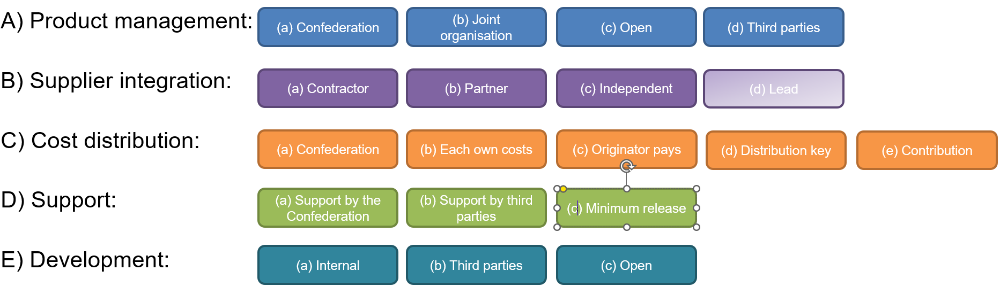
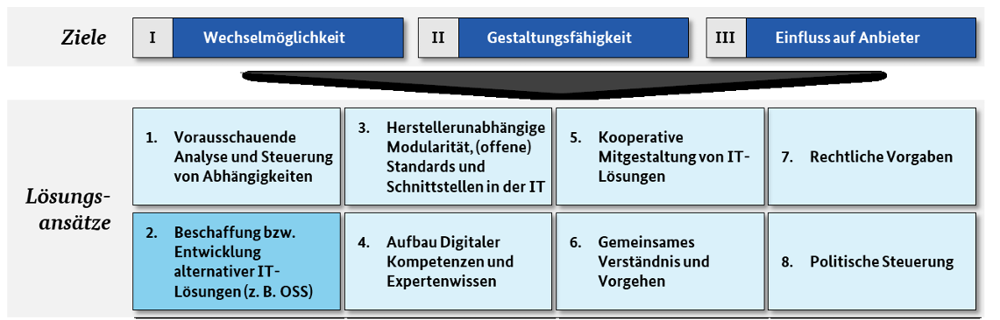

:lang: en
ifeval::["{lang}" == "en"]
= Em002-4 OSS Community Guidelines
:title-logo-line1: Federal Chancellery FCh
:title-logo-line2: Digital Transformation and ICT Steering DTI
endif::[]
ifeval::["{lang}" == "de"]
= Em002-4 Leitfaden OSS-Community
:title-logo-line1: Bundeskanzlei BK
:title-logo-line2: Digitale Transformation und IKT-Lenkung DTI
endif::[]
ifeval::["{lang}" == "fr"]
= Em002-4 Guide des communautés OSS
:title-logo-line1: Chancellerie fédérale ChF
:title-logo-line2: Transformation numérique et gouvernance de l'informatique TNI
endif::[]
ifeval::["{lang}" == "it"]
= Em002-4 Guida alle community OSS
:title-logo-line1: Cancelleria federale CaF
:title-logo-line2: Trasformazione digitale e governance delle TIC TDT
endif::[]
ifeval::["{lang}" == "rm"]
= Em002-4 Guida da communitads OSS
:title-logo-line1: Chanzlia federala ChF
:title-logo-line2: Transfurmaziun digitala e direcziun da las TIC TDT
endif::[]
:govpress-style: report
:govpress-front-block: report
:classification:
:title-logo: logo-ch-black.svg
:title-logo-base: black
:title-logo-line3:
:title-page:
:pdf-theme: basic
:toc:
:sectnums:
:toclevels: 3
:sectnumlevels: 3
:experimental:
:revnumber: 1.0
:revdate: 14.09.2026
:url-repo: https://github.com/swiss/opensource-guidelines/tree/main

ifeval::["{lang}" == "en"]
NOTE: This document is an evolving draft and part of the guidelines and tools designed to support the Federal Administration in publishing open source code. For more information, see the main https://github.com/swiss/opensource-guidelines/tree/main[README].

== Main points at a glance

The most important points of the document are listed below.

* The establishment or maintenance of an OSS community is *not required* under Art. 9 EMOTA.
* A community is relevant if a user group makes sense and *synergies* with other users of the software are to be created.
* A community is not limited to the software itself, but can also include the processes in the environment and the standardisation of data.
* An *initial effort* must always be made to build a community. This usually continues. In many cases, it makes sense for the lead office to also bear the coordination costs.
* Communities should fulfil a *purpose*. There need to be interested parties and participants.
* A community can emerge and then be formalised.
* The goal of the community is to increase the *benefit for everyone*. General principle: 'You get back at least as much as you put in'.
* The community should be *structured as simply as possible*.
* In a first step, the community should be briefly reviewed using the checklist link:em002-4-1-checklist-oss-community.pdf[Em002-4.1]. Only if it makes sense should it be further developed.
* Formalisation takes place via a *community concept*. As much as possible should be taken from existing sources. General principle: 'Don't reinvent the wheel'.
* If collaboration is the aim, this must be taken into account at the very beginning of the project, as potential partners should already be picked up during the requirements analysis. This also needs to be well planned from the outset in terms of legal and procurement law.
* The options for joining an existing collaboration in regard to legal and procurement law must be examined.
* No community needs to be set up for contributions. However, if required by the project, the corresponding *Contributor Licence Agreement (CLA)* must be signed or the developers must be authorised by the project to submit the software under a Developer Certificate of Origin (DCO).

== Introduction

These guidelines are intended for ICT professionals who are responsible for an application and want to offer it as open source or contribute to such an application.

This must be organised either formally or informally.

This document provides important information for organising and building a communityfootnote:[The community of an open source project typically represents a pyramid. +
The foundation of this pyramid is the users of the software, especially the committed ones who actively participate in the community, for example in the form of bug reports and feature requests or through contributions to mailing lists. +
Directly above in the pyramid are contributors. These are parts of the community that propose their own code contributions. They typically do not have write access to the repository. Their contributions are reviewed by maintainers of the project and incorporated into the repository after reaching the project-typical quality. +
At the top of the pyramid are the maintainers or committers of a project. In this role, a developer has a higher responsibility. This is expressed, for example, in the ability to accept contributions. This right is often manifested through write access to the repository. At this level, control over the software, its quality, and range of functions takes place. In more complex projects, this level can be further subdivided. For example, the Linux kernel is known to have subsystem maintainers at multiple levels, and ultimately only a single developer, Linus Torvalds, incorporates the patches into the project repository. Another example is projects of the Eclipse Foundation, which typically have a project lead with additional rights in the context of the Eclipse Foundation development process, such as initiating the release process or formal election of committers or project leads _[BITKOM2023]_.] and also for open development directly as an open source project.

As a second element, to promote standardisation, a directory of existing community concepts is maintained as part of this document. The idea is that new communities can be built with minimum effort based on successful solutions.

This document does not include direct recommendations for organising communities for software libraries (parts of software that fulfil partial functions, e.g. PDF generation). Normally, no separate concept is developed for these; instead, they use the simple template defined in the repository's storage template.

The document link:em002-1.pdf[Em002-01 Practical Guidelines for Open Source Software in the Federal Administration] contains in Section 4 fundamental forms of collaboration, in Section 8 the various support models, and in the Annex information on market behaviour of open source.

== Type, aim and purpose of a community

A community can pursue the following purposes:

* Survey of additional requirements
* Dissemination of knowledge about the application
* Better feedback from users
* Promoting translations, documentation and training
* Spreading standardisation
* Generally improved interaction with users
* Expansion of cooperation to include other parties
* Promotion of further software based on the software

The type of community best suited for an application depends heavily on the professional environment, potential users, and the strategy of the publishing institution. There are many different ways to build communities. Ideally, for a suitable project, it may be possible to join an existing community. Alternatively, a community can be built with one or more equal partners.

It is important that a *governance structure* should be established and the relevant points documented in a *community concept* (see also _[BITKOM2023]_ Section 4.1 and _[IZqCab2023]_).

It should be noted that communities for software can also be combined with those for data, standardisation and business topics. The community can then encompass processes, standardisation, software and data. Existing frameworks such as eOperations, DVS and eCH can also be used where appropriate.

An important aspect of a functioning community is that participants receive more than they invest.

The following constellations exist:

* *Community around a federal OSS*: Governance and community concept must be created. In this context, it is also necessary to regulate how third parties can make contributions.
* *New collaboration to solve a problem*: In addition to governance and the community concept, the entire legal structure of the collaboration must be established.
* *Joining a collaboration*: The Federal Administration must examine whether and how it can do this.
* *Contribution to a third-party project*: The point to be checked is the project's policy for contribution (Contributor Licence Agreement, Developer Certificate of Origin, etc.).

Procurement law issues are dealt with in link:em002-7.pdf[Em002-7 Strategic Aspects of Procurement and Open Source Software].

=== Special case: New collaboration for the development, maintenance and support of open source software

The collective costs of open source software decrease when it is developed and further maintained collaboratively. This can occur without formal cooperation arrangements, or with no more than joint planning.

Where a more formal collaboration is sought, a market assessment should be carried out to ensure that collaboration is the most appropriate form of cooperation. Collaborations are more cost-effective than individual development by each party (see link:em002-4-1-checklist-oss-community.pdf[Em002-4.1]).

It should be noted that, for collaborations, it makes sense to initiate the collaboration at a very early stage in the HERMESfootnote:[https://www.hermes.admin.ch/en/project-management/method-overview.html] project methodology --- specifically during the situation analysis and requirements phases.

Collaboration is generally permitted in Switzerland under Article 4 EMOTA.

In addition to all other considerations, collaborations have both a legal and a procurement law dimension. At present, each case is assessed individually. Over time, standardised templates will become established.

==== Legal dimension

Association memberships are feasible, though these are generally assessed on a case-by-case basis: who is behind the association, and what obligations are being entered into. Delegation of memberships to eOperations or similar organisations would be possible.

As long as no money changes hands and no formal obligations need to be entered into, a Memorandum of Understanding at the level of the federal office or the Federal Chancellery is possible.

A situation requiring the conclusion of an international treaty should be avoided.

There are also two special casesfootnote:[https://www.eda.admin.ch/deza/en/home/partnerschaften/auftraege-beitraege/auftraege/anforderungen/rechtlich.html] in which a collaboration would already be covered:

* Contracts awarded under an international agreement concerning the joint implementation of a project by signatory states.
* Contracts awarded in accordance with the special procedures or conditions of an international organisation.

==== Procurement law dimension

In many cases, collaboration will take place between public sector organisations. In such cases, procurement is unproblematic where the arrangement is 'in-state' (see link:em002-7.pdf[Em002-7 Strategic Aspects of Procurement and Open Source Software]).

Contracts with foreign companies not domiciled in Switzerland are possible, provided procurement law requirements are met.

The procurement of an organisation's own resources takes place within the framework of a standard procurement process, or has already been completed.

=== Special case: Joining an existing collaboration

This requires both a legal basis and compliance with procurement law.

The simplest approach is to participate on a 'each party bears its own costs' basis. This can also cover overhead costs, provided that either internal resources or correctly tendered external resources are used.

Direct participation in foreign collaborations is more difficult. A simple association via a Memorandum of Understanding is the easiest option to achieve.

=== Special case: Contributing code to third-party OSS projects

Where the Federal Administration makes modifications to the code of an existing OSS project, it makes sense to contribute these changes directly upstream to the original project. This means that ongoing maintenance no longer needs to be carried out by the Federal Administration.

Under Article 9 EMOTA, such contributions are in fact encouraged. From a procurement law perspective, this is unproblematic.

It is important that the rights holder makes the contribution. This means that the Federal Administration assumes responsibility for doing so on behalf of its staff and contractors. Specifically, any Contributor Licence Agreement for the project must be signed, or a Developer Certificate of Origin must be included with the pull request.

A *Developer Certificate of Origin*footnote:[https://developercertificate.org/] *(DCO)* for the Federal Administration could read:

[quote, Developer Certificate of Origin, Version 1.1]
____
Copyright (C) 2004, 2006 The Linux Foundation and its contributors.

Everyone is permitted to copy and distribute verbatim copies of this licence document, but changing it is not allowed.

Developer's Certificate of Origin 1.1

By making a contribution to this project, we certify that:

(a) The rights to this contribution are owned by the Swiss Confederation and I am authorised to submit it under the open source licence indicated in the file; or

(b) The contribution is based upon previous work that, to the best of my knowledge, is covered under an appropriate open source licence and I have the right under that licence to submit that work with modifications, whether created in whole or in part by me, under the same open source license (unless I am permitted to submit under a different licence), as indicated in the file; or

(c) The contribution was provided directly to me by some other person who certified (a), (b) or (c) and I have not modified it.

(d) I understand and agree that this project and the contribution are public and that a record of the contribution (including all personal information I submit with it, including my sign-off) is maintained indefinitely and may be redistributed consistent with this project or the open source licence(s) involved.
____

The structure of a Contributor Licence Agreement is described in link:em002-3.pdf[Em002-3 OSS Licensing Guidelines], Section 8.9.

The effective transfer of code takes place in accordance with the guidelines of the respective project.

== Community concept

A community's core is ultimately its structure and governance. These are recorded in a community concept.

The community concept to be created by the project or application manager (or commissioned from third parties) should follow this section structure. Depending on the nature of specific community, not all sub-sections are necessary. Ideally, many sections will refer to already standardised documents or use standard processes of the corresponding repositories. The community concept can also be applied to existing projects led by others, especially if the effective governance is not yet documented in writing.

By formalising the community, all participants are brought together and the onboarding of new participants is simplified.

Structural draft of a community concept:

[arabic]
. Overview table (name, repository, contact address, licence, depth of support, existing/new)
. Objectives
[loweralpha]
.. of the application
.. of the community
. Organisation
[loweralpha]
.. Owner of the code
.. Organisational form / committees
.. Voting rights
.. Project management
.. Procurement issues (if applicable)
.. Other governance aspects
. Roadmap and change process
. Development process
[loweralpha]
.. Open development
.. Committer rights
.. Review process
.. Task distribution and name citations
.. Backups
. Financing of the community
. Marketing
. Handling external contributions
[loweralpha]
.. Handling reported errors
.. Handling enquiries
.. Handling pull requests
.. Handling forks
.. CLA, DCO and assignment of rights/intellectual property
. Operation of the application

In principle, each federal authority is responsible for creating the community concepts. DTI can publish existing patterns/examples and accepts corresponding examples for publication. It also makes sense for community managers to exchange information with each other.

A possible source for parts is also the documentation of the Eclipse Foundation,footnote:[See https://www.eclipse.org/projects/handbook/#starting] although appropriate tailoring should be carried out here in the sense of 'only doing what is necessary'.

== Fundamental decisions when building a community

The principles of the community, or lack thereof, are determined using link:em002-4-1-checklist-oss-community.pdf[Em002-4.1]. The relevant fundamental questions can be found in the morphological box in Figure 1.

Figure 1 Morphological box OSS community

It is advisable to *focus primarily on the near future* when designing the community; for example, if there are not yet any concrete interested parties for the application, it usually makes little sense to define a community with a simple company, its own association and complex processes for developing the roadmap.footnote:[With an association (or foundation), a separate legal entity is created to look after the software and the product. This only pays off from a certain level of importance, complexity and the existence of several (equal) partners. A roadmap is used to show the wider public and potential additional users of the software what is planned.]footnote:[It may also be possible, especially for projects that involve several state actors from the outset, to approach existing foundations and see whether the projects and governance can be managed under their umbrella, analogous to https://finos.org or https://osr.finos.org or https://www.eclipse.org/collaborations/ or https://iot.eclipse.org or https://outreach.eclipse.foundation/open-regulatory-compliance.]

=== Product management

Depending on the type of application, its strategic importance and its status in the life cycle, there are different variants for mapping product management. For organisations within federal authorities, this always concerns the application managers. The definition of the technical and technological roadmap and the release processes are particularly relevant for the community concept.

Possibilities:

[loweralpha]
. *Organisations within the Confederation*: The Confederation wants to retain control; it alone defines the roadmap.
. *Joint organisation*: Together with other users or suppliers.
. *Open organisation*: Loose connections, no active roadmap.
. *Third parties*: Either the product already exists or the work is to be outsourced.

==== Organisations within the Confederation:

If the application is of high strategic importance or the Confederation depends on being able to implement its changes quickly, then it can make sense to retain control.

The federal authority alone decides, through the requirements manager, what is incorporated in the software and when.

For potential other users of the application, this means that they are practically forced to use their own version (fork) of the application.

Otherwise, they have hardly any opportunity to implement adjustments and extensions that may be important to them. This does not argue against publishing as open source: the code management toolsfootnote:[e.g. GitHub] offer extensive support for such scenarios, and adjustments and error corrections can be selectively adopted in both directions.

Sharing the costs is typically difficult with this model.

==== Joint (Confederation has the lead or equal partners)

Decisions regarding the roadmap and priorities should be coordinated and made jointly with the other members of the community. The Confederation participates as a member of the community but is not the lead organisation.

For joint decision-making to work, structures and rules must be determined in advance. This also defines how the costs for implementing the jointly decided adjustments are divided among each other.

With this model, a single version of the application is created, which is then used by all members. As a result, the total costs are significantly lower compared to the other variants. However, the flexibility of individual users is also lower, and they must coordinate their adjustment requests in advance with all others. Decision-making is slower and more time-consuming.

This model is best suited for applications that are to be further developed jointly with clearly defined other organisations (e.g. cantons).

==== Open organisation

In this model, the processes and structures are only loosely defined. The Confederation formally retains control but is open to contributions and adjustments.

No roadmap or only a very rough one is defined; consensus is reached informally and in discussions directly on the publication platform. The community itself tends to be dynamic; members can be very active for a while and then withdraw again.

This model is also suitable for smaller applications that are already in productive use and are 'finished'. This is also usually the best form for technically orientated applications or components that potentially appeal to a broader target group which cannot be precisely defined in advance.

==== Third party

In this model, the processes and structures are defined by a third party and the federal authority is a member of the community but does not have the lead. This may have happened because, for example, the project was defined by another state or canton. Or it may be that the Confederation is not interested in continuing the program itself and transfer this task.

=== Integration of suppliers

There are basically the following possibilities for integrating suppliers:

[loweralpha]
. *Supplier as contractor*: They are generally considered replaceable in the medium term. The supplier should develop the application cost-effectively and to a high quality based on orders from product management (or the community), but has at most advisory influence on the roadmap and prioritisation.
. *Long-term partners with co-determination*: They should be able to actively co-determine the development. This strengthens their role and they are potentially willing to invest in the application themselves. Typically, in this model, the suppliers then distribute the software and actively look for new customers.
. *Independent:* The suppliers define for themselves whether and how they want to work on the project. This can occur, for example, if several suppliers want to generate their own business based on the software. Liberal licences can potentially promote this. It can also occur if the Confederation's strategy differs from that of the supplier. In this scenario, it is likely that the supplier will create a fork.
. *Lead*: If the supplier takes over product management, then they have the lead. The development is then determined by them. On the other hand, this can also mean that the Federal Administration has to take very little responsibility. With a minimum release, it is possible for the supplier to take on this role on their own.

If the supplier takes on a strong role, this brings advantages for the Federal Administration: by actively marketing the application, there is a chance that the community will grow faster and stronger, thus reducing the costs per member more quickly.

If a model with strong supplier co-determination is chosen, care must be taken that this does not result in a deviation from procurement law regulations. It is usually advisable to involve at least two suppliers to avoid creating too strong a dependency on a single supplier. There should also be the possibility for other suppliers to join the community.

=== Cost distribution

The following options are available for splitting the costs of maintenance, further development and new functions:

[loweralpha]
. *Organisations within the Confederation*: Especially when building ecosystems or if the federal authority will retain full control, the federal authority must also bear the costs.
. *Each their own*: Everyone pays for the changes they want themselves. If necessary, it is decided on a case-by-case basis to pay for certain extensions jointly. Recurring costs are billed according to a distribution key or on demand.
. *Originator pays principle*: Those who actually need the services or features pay for them. Standardised hourly rates may be applied.
. *Distribution key*: The costs are divided within the community according to a defined key. This only differs for specific expansions. These should be paid for directly by the users concerned. The cost divider can be, for example, the size of the canton concerned or the number of users. Regarding the distribution key, see also the section 'Cost allocation'.
. *Contribution*: If the federal authority only contributes personnel to an existing project.

Basically, variant b (cost sharing) usually only makes sense if there is also joint product management as in variant b (joint). Only those who can have a say will be willing to bear the follow-up costs of the decisions.

=== Support

Within the cost distribution and effort, it is important to clarify who provides what support. According to Art. 9 EMOTA, a pure minimum release is possible. This variant may not deliver the desired effect and does not in itself build a community in which the federal authority has influence.

[loweralpha]
. *Minimum release*: No support (i.e. release generally occurs without organised support and participation of the federal authority).
. *Support by the Confederation*: The federal authority (or its service provider) provides defined support.
. *Support by third parties*: The federal authority or the community defines a support organisation.

The effect to be achieved, e.g. on the Swiss ecosystem or initial funding of a community, can lead to the Confederation providing support. The level of support must of course be defined. In principle, a fee may also be charged. Due to the mechanisms of the Confederation, service providers or suppliers are then more likely to be able to offer commercial support.

Offices may offer paid support in accordance with EMOTA (possibly also via service providers and third parties). To do this, they must publish the corresponding fees on their website, as the necessary legal basis is in place. The connection to the payment system can be discussed with the FDF.

Examples of support and fees can be found in Annex G.

=== Development

The basic methodology of development can also have an influence on the type of community.

[loweralpha]
. *Internal*: The use of internal repositories means that third parties cannot work directly. The stricter the separation, the more integration effort the Confederation has to make if it wants to incorporate third-party extensions. The release process is also more complex.
. *Third parties*: Either a supplier works on their own or the product already started/led by a third party is developed according to defined rules.
. *Open*: Software development takes place directly in a public repository. The release according to EMOTA is therefore largely guaranteed. The expenses are to be paid during development. In this scenario, collaboration with third parties can also take place earlier (and more easily).

== Detailed content for the community concept

This section provides guidance on writing the community concept based on the fundamental decisions made (as per Section 5).

[cols="1,1,1,4",options="header"]
|===
|Product management |Supplier as |Development |Proposal

|open
|Partner
|Federal government
a|Contents or suggestions, if the basic decisions are: +
Product management c) Open organisation +
Supplier involvement: b) Supplier as partner +
Cost distribution: b) Each their own +
_The text above can be copied into the template and adapted._

|Joint
|-
|Each their own
a|Contents or suggestions, if the basic decisions are: +
Product management b) Joint development +
Supplier involvement: a) or b) (not relevant) +
Cost distribution: c) Originator pays principle or d) Cost sharing

|Joint
|-
|Originator
|
|===

The community concept should be a dynamic document that can be adapted in consultation with the community. The concept should reflect the current situation and propose future development options. If more members join the community later, the organisation and processes can be further elaborated, and more complex mechanisms can be introduced. The following sub-sections directly follow the proposed structure of the community concept (see Section 4).

If product management lies with third parties, they will define the concepts for the community.

=== Key information

The following key information should be drawn up and published for each community so that potential interested parties can register for the software and the community:

* Software name
* Repository
* Owner
* Responsible organisational unit/office
* Contact address
* Licence used
* Support level
* Existing project

This information can all be displayed with publiccode.yml.footnote:[https://yml.publiccode.tools/]

=== Objectives

The objective should contain the actual purpose or 'vision' of the application. This vision should also be included in the *README.md* file in the repository (see link:em002-2-2-checklist-oss-analysis-and-preparation.pdf[Em002-2.2 Analysis and Preparation Checklist]).

At the same time, it should also describe what the community is aiming for:

* Who should join?
* Who are the potential interested parties?
* Should new members be actively sought?
* What are the main goals pursued by publishing as open source?

=== Organisation and governance

In principle, for new developments, the aim is for the Confederation to be the owner of the master rights to the source code.

The type of project management depends on which organisation had the lead (SAFe, HERMES) in the case of the Confederation. The organisational form should always seek minimum overhead (existing rather than new; simple partnership rather than an association).

[cols="1,1,1,4",options="header"]
|===
|Product management |Supplier as |Development |Proposal

|Federal government
|-
|Internal
a|As the Confederation retains direct control, no additional organisational structures are necessary. +
The publishing entity (e.g. a federal office) retains ownership and assumes all coordination tasks. In this case, the 'Organisation' section can be kept very brief.

|Joint
|-
|Internal
a|For this scenario, organisation as a *simple partnership* is usually recommended. +
To enable joint development and coordination of the roadmap and requirements, it is advisable to create two groups, each with one participant per community member:

* Management Board: Defines the strategy and prioritisation.
* Expert group: Develops requirements and specific content at the expert level. Depending on the scope, a separate expert group can also be established for each topic.

The owner of the code is the office that published it.

If the structures become more complex or more than five users or additional members are involved, it may be worth considering whether the community should be better organised as an association. Compare the explanations in the variant directly below.

|Joint
|-
|Third party
a|Organisation as an *association* is recommended. +
Either a separate association is founded specifically for the application, or the application is transferred to an existing association. An association is recommended because otherwise, the distribution of costs becomes complex, and there is likely to be enough work within the coordination tasks to employ a part-time manager for the association.

The rights to the code are then transferred to the association, which takes over community management and ordering from suppliers.

|Joint
|Contractor
|Internal
a|Organisation as an *association* is recommended. Either a separate association is founded specifically for the application, or the application is transferred to an existing association. An association is recommended because otherwise, the distribution of costs becomes complex, and there is likely to be enough work within the coordination tasks to employ a part-time manager for the association.

The rights to the code are then transferred to the association, which takes over community management and ordering from suppliers. +
Here, the suppliers are not members of the association, but only contractors. The manager should not be appointed by a supplier.

|Joint
|Contractor
|Third party
a|Organisation as an *association* is recommended. Either a separate association is founded specifically for the application, or the application is transferred to an existing association. An association is recommended because otherwise, the distribution of costs becomes complex, and there is likely to be enough work within the coordination tasks to employ a part-time manager for the association. +
The rights to the code are then transferred to the association, which takes over community management and ordering from suppliers. +
The suppliers are members of the association; the manager can also be provided by a supplier.

|open
|-
|Internal
a|There is no *need for a detailed description of an organisation*, as it is deliberately designed to be open. However, it is important to establish who receives and processes external enquiries (responsibility). It should also be determined whether and to what extent external persons can be involved:

* No direct integration: External parties can only submit suggestions and contributions (as pull requests).
* Involvement as contributors: External parties who make frequent and good contributions are directly involved.
* Handover to external parties possible: If, after publication, external parties contribute more to further development than the publishing organisation, the application can also be transferred to them.

The publishing organisation retains ownership. This variant corresponds to the organisation of 'classic' open source projects; see for example https://opensource.guide/leadership-and-governance/ for further information.

|open
|Contractor
|Internal
a|There is no *need for a detailed description of an organisation*, as it is deliberately designed to be open. However, it is important to establish who receives and processes external enquiries (responsibility). It should also be determined whether and to what extent external persons can be involved:

* No direct integration: External parties can only submit suggestions and contributions (as pull requests).
* Involvement as contributors: External parties who make frequent and good contributions are directly involved.
* Handover to external parties possible: If, after publication, external parties contribute more to further development than the publishing organisation, the application can also be transferred to them.

The publishing organisation retains ownership. +
This variant corresponds to the organisation of 'classic' open source projects; see for example https://opensource.guide/leadership-and-governance/ for further information. +
The supplier should only take on purely technical coordination tasks (code review, assessment).

|Third party
|Partner
|Internal
a|There is no *need for a detailed description of an organisation*, as it is deliberately designed to be open. However, it is important to establish who receives and processes external enquiries (responsibility). It should also be determined whether and to what extent external persons can be involved:

* No direct integration: External parties can only submit suggestions and contributions (as pull requests).
* Involvement as contributors: External parties who make frequent and good contributions are directly involved.
* Handover to external parties possible: If, after publication, external parties contribute more to further development than the publishing organisation, the application can also be transferred to them.

The publishing organisation retains ownership. This variant corresponds to the organisation of 'classic' open source projects; see for example https://opensource.guide/leadership-and-governance/ for further information.
|===

With regard to governance, _[BITKOM2023]_ Section 4.1, _[IZqCab2023]_ or https://github.com/todogroup/ospo-career-path/blob/main/OSPO-101/module7/README.md#governance-models can also be consulted.

Examples of articles of association can be found in Annex E.

NB: As the release must be guaranteed in accordance with Art. 9 EMOTA, the Federal Administration must ensure that the publication cannot be suddenly withdrawn (see the 'Open Source in Procurement Guidelines -- Software purchasing under Art. 9 EMOTA' _[BBL-WL]_, paragraph V.2).

=== Roadmap and change process

[cols="1,1,1,4",options="header"]
|===
|Product management |Supplier as |Development |Proposal

|Federal government
|Contractor
|-
|The federal authority defines the roadmap and decides which changes will be implemented. The standard processes of the office XY are used for this.

|Federal government
|Partner
|-
|The federal authority defines the roadmap in collaboration with company XY. It decides which changes will be implemented. The standard processes of the office XY are used for this.

|Joint
|-
|Internal
a|The process for developing the roadmap and approving changes must be determined by the members of the company or association. Depending on the member structure (number, size ratio, etc.), other processes may be appropriate. +
However, the processes must include measures for conflict resolution and finding a majority.

|Joint
|-
|Third party
a|The process for developing the roadmap and approving changes must be determined by the members of the company or association. Depending on the member structure (number, size ratio, etc.), other processes may be appropriate.

However, the processes must include measures for conflict resolution and finding a majority.

With the addition that a cost distribution key must also be established. Consideration should also be given as to how to handle cost sharing for adjustments not desired by the relevant members. Especially in associations with members of unequal size, situations may arise where a large member (e.g. the federal authority) bears a significant portion of the costs for an extension without deriving any benefit from it.

|open
|-
|-
a|_Example, not suitable for all situations_ +
There is no need to create a roadmap; the application currently meets the needs.

Changes are decided upon in an open discussion and a consensus is sought. The final decision lies with the owner of the code (Swiss Confederation).
|===

=== Development process

If open development comes into play, it should be defined here. Task distribution and naming of central positions in the community concept are important. Also, how the security of the repository content is ensured.

[cols="1,1,1,4",options="header"]
|===
|Product management |Supplier as |Development |Proposal

|Federal government
|-
|-
a|The committer rights (write access to the code) lie with the persons/entities/suppliers selected by the Confederation. After the contract expires, the respective rights are revoked.

The service providers and suppliers are responsible for conducting the technical code review process for external contributions that have been technically accepted by the Confederation. They are responsible for the technical quality. The suppliers are compensated for this work by the Confederation.

|Joint
|Contractor
|Internal
a|In principle, all entities commissioned by a community member receive write access to the code (committer rights). After the contract expires, the respective rights are revoked.

Where changed code affects core areas of the application, all changes must be reviewed by an entity specially commissioned by the community for this purpose. This entity is responsible for the technical quality of the application. It is also responsible for reviewing changes that have been technically accepted by the community.

|Joint
|Partner
|Third party
a|The committer rights (write access to the code) lie with the members of the community. These persons organise themselves and jointly bear responsibility for the quality of the code.

If a community member commissions an external supplier for an adjustment or extension, the adjustment is reviewed by a member of the community. They are compensated for this by the client.

Changes to the core of the application must be reviewed by a second member of the community.

The suppliers who are community members are also responsible for reviewing external contributions and new technical code that has been technically accepted by the association.

|open
|-
|-
a|Initially, the committer rights lie with the developers or their employers. Committer rights are granted to all developers who actively contribute to the project for several months and demonstrate appropriate social competence.

The individual developers generally retain their committer rights, even if they change their employer or the Confederation chooses a different supplier. Committer rights only expire if they are voluntarily relinquished or if the majority of other committers decide to revoke them.

The Confederation has the right to designate individual developers from the companies it commissions as committers. It does not have the right to revoke someone's committer rights without reason.

Code reviews are carried out by at least one person who acts as a committer. Committers organise themselves.

The Confederation undertakes to compensate the review work as far as it is financially feasible for them.
|===

=== Cost sharing and suppliers

[cols="1,1,1,4",options="header"]
|===
|Product management |Supplier as |Development |Proposal

|Federal government
|Contractor
|Internal
|Suppliers are periodically selected through WTO tenders or a direct award procedure (depending on the scope of the maintenance services).

|Federal government
|Partner
|-
a|*Important:* Check beforehand whether this is permissible under procurement law in the specific case.

We will make additions to the documentation on this point. The Confederation chooses the supplier XXX as a strategic partner and aims for long-term cooperation.

|Joint
|Contractor
|Internal
a|Each member of the community independently commissions one or more software suppliers to implement the adjustments and extensions they require. Cost sharing is agreed on a case-by-case basis for adjustments requested by several members. The member with the largest share of the costs is responsible for selecting and commissioning the supplier. (Regulations for software maintenance)

|Joint
|Contractor
|Third party
|The association centrally selects the software suppliers periodically through WTO tenders or direct award procedures (depending on the scope of maintenance services). The costs are allocated to the members according to a key: (to be defined: by population, user, etc.)

|Joint
|Partner
|Internal
a|Each member of the community independently commissions one or more software suppliers to implement the adjustments and extensions they require. Cost sharing is agreed on a case-by-case basis for adjustments requested by several members. The member with the largest share of the costs is responsible for selecting and commissioning the supplier.

_(Regulations for software maintenance)_ If necessary, supplemented by a contribution from the participating suppliers. Example: _Each software development company that is a member of the community commits to investing at least XY working days per year at its own expense in the further development, technological updating, or marketing of the application._

|Joint
|Partner
|Third party
a|The association centrally selects the software suppliers periodically through WTO tenders or direct award procedures (depending on the scope of maintenance services). The costs are allocated to the members according to a key: (to be defined: by population, user, etc.) If necessary, supplemented by the addition: _Each software development company that is a member of the community commits to investing at least XY working days per year at its own expense in the further development, technological updating, or marketing of the application._

|Third party
|Contractor
|-
a|Suppliers are periodically selected through WTO tenders or a direct award procedure (depending on the scope of the maintenance services). With the addition: _The improvements contributed by potential suppliers and activities in the community are considered as a factor in the evaluation._

Changes requested by external parties are not financed by the Confederation, but must be commissioned and paid for by the parties themselves.

|Third party
|Partner
|-
a|Suppliers are periodically selected through WTO tenders or a direct award procedure (depending on the scope of the maintenance services). With the addition: _The improvements contributed by potential suppliers and activities in the community are considered as a factor in the evaluation. Changes requested by external parties are not financed by the Confederation, but must be commissioned and paid for by the parties themselves._
|===

=== Marketing

[cols="1,1,1,4",options="header"]
|===
|Product management |Supplier as |Development |Proposal

|Federal government
|Contractor
|-
|The Confederation does not actively market the application but publishes it on open-source software platforms. The publication of the application is announced in professional committees. If interested parties come forward, we will consider whether to establish a joint community or continue working with their version of the software.

|Joint
|Partner
|-
a|Additionally: +
Suppliers may market the application and seek further interested parties. The Confederation may be cited as a reference. We consciously accept that divergent versions of the software may emerge as a result.

|Joint
|Contractor
|Internal
|The application is marketed by the members or the association.

|Joint
|Partner
|Internal
|The application is marketed by suppliers.

|Joint
|-
|Third party
|The application is marketed by the association, the simple partnership and its members.

|open
|-
|-
a|The application may be marketed by suppliers, or explicit marketing may be foregone.

Alternative without explicit marketing: The Confederation does not actively market the application but publishes it on open-source software platforms. In professional committees, we indicate that we have published the application and that collaboration is welcome. We demonstrate the software to interested parties and attempt to integrate them into our processes for shaping the roadmap.
|===

=== Handling external contributions

[cols="1,1,1,4",options="header"]
|===
|Product management |Supplier as |Development |Proposal

|Federal government
|Contractor
|-
a|External contributions and enquiries must also be processed even if the Confederation remains the sole decision-maker regarding the software (except in cases of minimum release, where a fork is inevitable). We propose the following approach:

*Handling reported errors* +
We attempt to reproduce errors reported by external individuals, requesting clarification if necessary. If reproduction is successful, the Confederation commissions the correction of errors. If the error cannot be verified or if the effort to fix it is disproportionately high, we apologise to the person reporting the error and ask if they could submit a pull request to address it.

*Handling enquiries* +
We respond to every incoming enquiry. If an enquiry cannot be resolved with reasonable effort and further time investment seems inefficient, we apologise, citing limited resources, and offer to connect the enquiring person with a supplier for further consultation.

*Handling pull requests* +
We review each pull request carefully. To avoid unnecessary effort on the contributor's part, we immediately indicate if something contradicts our roadmap or if it is questionable whether we will accept the contribution. The Confederation decides independently and based on technical criteria which contributions to accept. Error corrections that have passed the review process are always accepted.

*Handling forks* +
We support forks of our application. Those who implement the application should create their own fork. We review the resulting forks at least once a year and adopt good and suitable extensions.

|Joint
|-
|-
a|External refers to contributions from outside the defined community (association members). Deviations from above: +
*Handling forks* +
We aim to prevent (long-lived) forks of the application. Instead, interested parties should join the community directly. Within the community, we try to ensure all members use the main version.

|Open
|-
|-
a|Building a functioning community and an open culture is important to us.

*Handling reported errors* +
We attempt to reproduce and correct reported errors. We require active cooperation from the reporting individuals. If possible, they should create a pull request with an error correction directly.

*Handling enquiries* +
We address each enquiry within a maximum of one week. Enquiries from active contributors are treated with priority and in depth. We try to involve other members in handling enquiries.

*Handling pull requests* +
We aim to receive as many high-quality pull requests as possible. We involve all active contributors in the reviews and technical and professional assessment of pull requests. For controversial contributions, we try to reach a decision through informal voting.

*Handling forks* +
We try to make forks unnecessary through active and open community management. If forks do emerge, we actively review them and attempt to incorporate the extensions and improvements developed there. In such cases, we actively request pull requests.
|===

In general, it should be noted that contributions can range from supporting other users to taking responsibility for entire parts of a project (see _[BITKOM2023]_ Section 4.2).

=== Operation of the application

[cols="1,1,1,4",options="header"]
|===
|Product management |Supplier as |Development |Proposal

|Joint
|-
|-
|Central operation can optionally be offered additionally by the central association, in the sense of Software as a Service (SaaS). It should be examined whether this is desired.

|-
|Partner
|-
|It should be specified whether the supplier should also operate the software.

|-
|Lead
|-
|It should be stated that the supplier is responsible for operation.
|===

Support levels and support contacts should also be specified in this section.

== Important information for community managers

=== It takes time

Building communities is something that should be planned for the long term. Perseverance and consistency are two important qualities needed for a successful community.

=== Further suggestions for community building

Further suggestions for good community management can be found at https://opensource.guide/code-of-conduct/ and https://opensource.guide/best-practices/.

=== Communications

Publishing software and documentation opens a new communication channel for the Federal Administration. If this is not done carefully and professionally, the public image of the Confederation can suffer.

OSS communities in the Federal Administration are faced with conflicting demands regarding communication: on the one hand, the general *guidelines for communication* apply; on the other hand, the community should facilitate *simple formal and informal collaboration* across organisational boundaries, preferably without formal quality controls and releases.

The use of public repositories and potentially public issue tracking and wikis means that individual project staff members' statements are visible to the public unfiltered. This requires project staff to maintain a professional demeanour and adhere to quality standards for publications in such settings.

In OSS projects, this is normally regulated through the *Code of Conduct*. The Federal Administration's own Code of Conductfootnote:[https://www.epa.admin.ch/dam/epa/fr/dokumente/aktuell/medienservice/120_verhaltenskodex_e.pdf.download.pdf/120_verhaltenskodex_e.pdf] is very general, but the core principle is applicable here: "Staff carry out their duties with a sense of responsibility, integrity and loyalty. In their private lives they also take care not to tarnish the reputation, the credibility and the image of the Confederation"

=== Open development

If software development is planned in an open repository from the start, release happens automatically. The relevant checklists according to the instructions link:em002-2.pdf[Em002-2] must be completed at the beginning, and the development processes of the service provider/supplier must allow this. The advantage is that the community can be built from the very beginning. Multiple organisations can also collaborate on the development.

Closed repositories are an intermediate form, but are used for other partners in a collaboration.

=== User management

The project (or the support organisation) determines whether developers and other project staff work on the project under their own name or anonymously. If people are not working anonymously and already have logins on the platforms, it is easiest to use these (whether business or private).

The platform should generally allow the inclusion of third parties, as otherwise no developers from outside the Confederation will be able to collaborate.

When leaving the project, the corresponding rights on the project must be deleted. Product management is responsible for this.

=== Merging communities

Where possible, the number of communities should be kept small. This means:

* If a community already exists where a similar structure is envisaged for similar problems involving the same people, a single community should be used.
* Multiple projects that are related and address the same target audience can be consolidated into one community.
* No fundamentally different community structures should be created unnecessarily where existing ones are already in place.

=== Handling third-party contributions

The contribution of software to other projects is addressed in Section 3.3. The same principles apply in reverse.

The following points are important:

* A suitable Contributor Licence Agreement must be used to ensure that the source code subsequently belongs to the Confederation (see also link:em002-3.pdf[Em002-3 OSS Licensing Guidelines], section on Contributor Licence Agreements). This must be signed by the owner of the contribution.
* Confirmations must be filed.
* Contributions must be reviewed before being integrated into the codebase.
* Submissions should be responded to in a timely manner (issues, requests, pull requests) and handled as constructively as possible.
* All channels and governance arrangements should be listed in the community concept, on the website and in the repository.

=== Security-relevant reports

In addition to standard bug reports, provision must be made -- where the nature of the project requires it -- for security-related vulnerabilities to be reported confidentially, as is the case with a bug bounty programme, for example.

The documents from trustbroker.swiss can serve as an example:

* https://github.com/trustbroker-swiss/trustbroker.swiss/blob/main/Security-and-Vulnerability-Disclosure.md

=== Avoiding forks

While forks are natural in the open source world, reintegrating source code, features and so on from forks is far from straightforward. It may be worth reaching out to the individuals or organisations considering a fork and trying to keep them engaged with the main project. Striking a balance between competing interests is often necessary in such cases.

=== Cost allocation

It makes sense to agree on general distribution keys between the main partners. These can be adjusted every few years or when the situation fundamentally changes. For efficient work on the software, the large partners should tend to take on slightly larger shares than they actually have to (if necessary, also the overall coordination). The organisation should work and not argue about finances. If the collaboration covers several projects (for example, the industry solutions in the field of standard gauge railways), a standardised distribution key should be used for all projects. From the perspective of federal authorities, it is an improvement if the costs do not have to be borne alone.

Possible criteria for distribution keys:

* Estimation of benefit distribution (e.g. between federal authority and a supplier hoping for other customers)
* Number of inhabitants/users (e.g. between offices, communes, cities)
* Financial strength (e.g. cantons)
* Gross national product (e.g. between cantons)
* Who wants more control

To avoid discussions, the distribution key should not simply be attached to the annual budget. A clause along the lines of the originator pays principle may allow faster adjustments for some partners if they are willing to pay extra.

The distribution key should also apply to overheads, maintenance/support, and a minimum of further development. These parts should be solved in the long term if possible.

It should be borne in mind that when third-party funding is involved, those parties will typically want a greater say. Community management needs to be equipped to handle this.

=== Supplementary services according to Art. 9 paras 5 and 6 EMOTA

The federal authorities can (themselves, through service providers or suppliers) provide supplementary services, particularly for integration, maintenance, ensuring information security, and support.

The limitation is that they should serve the authorities' tasks and can be provided with proportionate effort.

It follows that the federal authority cannot be the development company for third parties. It fixes bugs, can handle security-relevant aspects, can provide some support and integration assistance (all activities that help to build a community). New developments and additional features for third parties should primarily focus on the normal work purpose of the authority. Of course, it may be that providing the software is part of the task, in which case developments can be made at any time. It is also stated that software development is not the core task of the federal authority.

This means that if features are substantially developed exclusively for third parties, they are to be integrated in partnership or through the supplier.

To avoid procurement law problems, care should be taken in procuring software and services to ensure that features can be provided to third parties (possibly only governmental third parties) by suppliers.

The setting of fees has already been touched upon in the 'Support' section. EMOTA is already the legal basis for such fees. These must be communicated on the website of the respective federal authority. Examples are listed in Annex G.

Art. 9 para. 6 states that normally the private sector should not be competed with. This means that the fees should not be set too low and should at least cover costs. In case of doubt, it is better to set hourly rates too high rather than too low.

Generally, it is recommended to work with one to three different standard hourly rates.

If a federal department wishes to define exceptions to para. 6, this must not compete with the private sector. Under certain circumstances, it may be easiest to set the fees and increase them if there is opposition from private sector companies that can actually offer the service.

=== Digital sovereignty

As long as the Confederation does not have its own repository, to ensure digital sovereignty, it is recommended to regularly make copies from public repositories.

It should be noted that not only the source code but also other information such as issue tracking, wiki, configurations, etc. is copied.

Furthermore, user management needs to be resolved to ensure control over the published source code. The overarching goal is to ensure development independent of the respective platform and to enable the community to switch.footnote:[See also https://www.bfh.ch/de/aktuell/news/2024/neue-studie-digitale-souveraenitaet/]

== Annex

=== Changes from previous version

* Section 1 'Main points at a glance' added
* Community purpose added to Section 3
* Sections 3.1 to 3.3 on Collaboration added
* New Section 7.7 Handling third-party contributions
* Noted that suppliers should not publish entirely on their own (in accordance with _[BBL-WL]_, V.2)
* Publicode.yml mentioned
* Alignment with new link:em002-7.pdf[Em002-7]
* Further editorial changes and improvements

=== References

See _Em002 Strategic Guidelines for Open Source Software in the Federal Administration_.

=== Abbreviations

See link:em002.pdf[Em002 Strategic Guidelines for Open Source Software in the Federal Administration] and link:em002-6.pdf[Em002-6 FAQ about OSS].

=== Examples of existing community concepts

In the spirit of collecting best practices, the following are community concepts and comparable documents that have already been developed. These are not necessarily just concepts from federal authorities, but also from other organisations.

* GERES Community (http://geres-community.ch)

Classification:

* Product management a) Joint development
* Supplier rather a) Contractor
* Cost distribution: b) Cost sharing

NB: The commune register GERES is not open source, but many aspects of the organisation can also be relevant for open source applications. Documents: Statutes (public) and Rules of Procedure (on request).

* https://www.igovportal.ch[iGov Portal]

#This section currently contains concepts from the Canton of Bern and will be supplemented as soon as federal examples are available.#

=== Examples of collaborations

The following examples illustrate how collaborations have been structured.

=== Collaboration: ZenDiS in Germany

ZenDiSfootnote:[https://www.zendis.de/en[ZenDiS home page: Co-creating Digital Sovereignty]] is an organisation whose aim is to reduce dependency in public administration (primarily in Germany) by promoting open source software.

Figure 2: Goals and approaches to strengthening digital sovereignty (ZenDiS)

ZenDiS works with strategic partners to this end.

Cooperation between the Federal Administration and ZenDiS is therefore unlikely to be unrestricted, and coordination would not be binding. This may change in due course.

In concrete terms, the Federal Administration would need to establish its own organisation for Switzerland and coordinate informally with ZenDiS. This could potentially be done via eOperations, though eOperations only becomes active when a specific requirement is raised and a budget is made available. A justification for such a parallel organisation could be found in the context of eGovernment or EMOTA.

NB: ZenDiS is subject to EU/German procurement law. There are significant differences compared to Switzerland. ZenDiS therefore cannot be replicated on a one-to-one basis in Switzerland, and cooperation with ZenDiS is not straightforward.

=== Collaboration: Open Trip Planner (OTP)

Open Trip Plannerfootnote:[https://www.opentripplanner.org/[OpenTripPlanner]] is an open source travel planning application. It is organised as a project of the Software Freedom Conservancy in New York. Individual developers are employed by transport companies and suppliers. A notable feature is that a public sector actor -- specifically ENTURfootnote:[https://entur.no/] -- has taken on one of the leading roles. ENTUR develops primarily for its own needs but also has a collaborative focus, particularly for the Nordic countries. ENTUR is organised as a company owned by the Norwegian Ministry of Transport and Communications. As the largest actor, ENTUR also absorbs a significant share of the coordination costs. Anyone can submit feature requests; these are discussed in coordination meetings and developed if someone funds them. Funding is provided primarily on a per-feature basis by the interested party or parties. In essence, each party bears its own costs. Support services would also need to be put out to tender separately in Switzerland.

=== New collaboration initiated by the Confederation: Swiss Trust Broker

The Trust Brokerfootnote:[https://github.com/trustbroker-swiss/trustbroker.swiss[GitHub - trustbroker-swiss/trustbroker.swiss: Documentation of the trustbroker.swiss service]] is a piece of Confederation software for eIAM, available as open source. Development is carried out by the Confederation. Several cantons have decided to deploy it either directly as SaaS or with their own instances. As it is available under the AGPL licence, any extensions made will benefit the Confederation in turn. Given its security-critical nature, development for the Federal Administration is carried out exclusively by the Confederation. Other organisations may submit requirements, which will be implemented if the project team considers them appropriate.

=== New collaboration initiated by the cantons: inosca

Through inosca,footnote:[https://inosca.ch/] a number of cantons have established a development community focused on electronic permits, originating with the eBau project.footnote:[https://github.com/inosca/ebau] eBau also includes Caluma,footnote:[https://github.com/projectcaluma] a framework for collaborative editing -- an example of a component extracted from a broader solution and developed into a standalone, widely applicable framework. This can also be used in other projects, even where some parts are subject to exception conditions, thereby allowing the maximum number of other bodies to benefit from the code.

The community meets at least once a month (optionally twice) to exchange views on technical topics and plan the shared roadmap. All participants may raise topics. Where a topic is deemed relevant to the community, interested cantons come forward and organise themselves into a working group. Outcomes are fed back continuously to the community. inosca operates on a fundamental principle: those who design, fund. That is, all cantons participating in a working group share the cost of the new feature. The feature is put out to tender and costs are divided among the community according to a predefined cost-sharing formula. Once a feature is completed and deployed, it immediately becomes freely available to all other cantons.

The community has additionally decided to set aside a modest fixed annual amount to cover the administrative costs of running the community. This budget is allocated each year to the parties taking on an organisational role.

=== SNOWPACK by WSL -- direct contributions from developers

SNOWPACKfootnote:[https://snow-models.gitlab-pages.wsl.ch/snowpack-web/] is an open source project developed by WSL for modelling snowpack formation. It is a highly specialised model, and the community has accordingly been integrated into the existing specialist community. Some issues have already been earmarked as potential contributions. The working model here is that each party bears its own costs and contributes features. Coding style and release process guidelines are also documented in this context.

=== Inspiration for association statutes

The statutes should be kept as simple as possible.

The following statutes can serve as inspiration.

* eCH: https://www.ech.ch/sites/default/files/page/STAT_d_DEF_2014-04-10_ech-Statuten.pdf
* Stop Piracy: https://www.stop-piracy.ch/wp-content/uploads/2022/01/Statuten_d_10_09_2021.pdf

#Further examples of statutes will be added as soon as they are available.#

=== Examples of support and fees

* Fees for statistical services: https://www.fedlex.admin.ch/eli/cc/2003/326/en[https://www.fedlex.admin.ch/eli/cc/2003/326/en]
* FDPIC fees: https://www.edoeb.admin.ch/edoeb/en/home/datenschutz/grundlagen/dsfa.html
* Free services from IPI for courses in the field of intellectual property (not software, but as an example): https://www.ige.ch/en/services/ip-academy/general-information/prices

Examples will be added as soon as they are available.
endif::[]

ifeval::["{lang}" == "de"]
NOTE: Dieses Dokument ist ein laufend weiterentwickelter Entwurf und Teil der Hilfsmittel, welche die Bundesverwaltung bei der Veröffentlichung von Open-Source-Code unterstützen. Weitere Informationen finden Sie im https://github.com/swiss/opensource-guidelines/tree/main[README].

== Das Wichtigste auf einen Blick

Nachfolgend sind die wichtigsten Punkte des Dokuments aufgeführt.

* Der Aufbau oder Betrieb einer OSS-Community ist nach Art. 9 EMBAG *nicht erforderlich*.
* Eine Community ist relevant, wenn eine Anwendergruppe sinnvoll ist und *Synergien* mit anderen Nutzenden der Software geschaffen werden sollen.
* Eine Community beschränkt sich nicht auf die Software selbst, sondern kann auch die Prozesse im Umfeld und die Standardisierung von Daten umfassen.
* Für den Aufbau einer Community ist stets ein *Initialaufwand* zu leisten. Dieser setzt sich in der Regel fort. Vielfach ist es sinnvoll, dass das federführende Amt auch die Koordinationskosten trägt.
* Communities sollen einen *Zweck* erfüllen. Es braucht Interessierte und Beteiligte.
* Eine Community kann entstehen und anschliessend formalisiert werden.
* Ziel der Community ist es, den *Nutzen für alle* zu erhöhen. Grundsatz: «Man erhält mindestens so viel zurück, wie man einbringt».
* Die Community sollte *so einfach wie möglich strukturiert* sein.
* In einem ersten Schritt sollte die Community anhand der Checkliste link:em002-4-1-checklist-oss-community.pdf[Em002-4.1] kurz geprüft werden. Nur wenn sie sinnvoll ist, sollte sie weiterentwickelt werden.
* Die Formalisierung erfolgt über ein *Community-Konzept*. Möglichst viel sollte aus bestehenden Quellen übernommen werden. Grundsatz: «Das Rad nicht neu erfinden».
* Wird eine Zusammenarbeit angestrebt, so ist dies bereits zu Beginn des Projekts zu berücksichtigen, da potenzielle Partner schon bei der Anforderungsanalyse abgeholt werden sollten. Auch rechtlich und beschaffungsrechtlich muss dies von Anfang an gut geplant sein.
* Die Möglichkeiten für den Beitritt zu einer bestehenden Zusammenarbeit sind rechtlich und beschaffungsrechtlich zu prüfen.
* Für Beiträge muss keine Community aufgebaut werden. Verlangt es das Projekt jedoch, so ist das entsprechende *Contributor Licence Agreement (CLA)* zu unterzeichnen oder müssen die Entwickelnden vom Projekt befugt sein, die Software unter einem Developer Certificate of Origin (DCO) einzureichen.

== Einleitung

Dieser Leitfaden richtet sich an IKT-Fachpersonen, die für eine Anwendung verantwortlich sind und diese als Open Source anbieten oder zu einer solchen Anwendung beitragen wollen.

Dies ist entweder formell oder informell zu organisieren.

Dieses Dokument liefert wichtige Informationen für die Organisation und den Aufbau einer Communityfootnote:[Die Community eines Open-Source-Projekts stellt typischerweise eine Pyramide dar. +
Das Fundament dieser Pyramide bilden die Nutzenden der Software, insbesondere die engagierten, die sich aktiv in der Community beteiligen, etwa in Form von Fehlermeldungen und Feature-Wünschen oder durch Beiträge zu Mailinglisten. +
Direkt darüber stehen in der Pyramide die Contributors. Dies sind Teile der Community, die eigene Codebeiträge vorschlagen. Sie haben typischerweise keinen Schreibzugriff auf das Repository. Ihre Beiträge werden von Maintainern des Projekts geprüft und nach Erreichen der projekttypischen Qualität ins Repository übernommen. +
An der Spitze der Pyramide stehen die Maintainer bzw. Committer eines Projekts. In dieser Rolle trägt eine Entwicklerin oder ein Entwickler eine höhere Verantwortung. Dies zeigt sich beispielsweise in der Möglichkeit, Beiträge anzunehmen. Dieses Recht manifestiert sich häufig über den Schreibzugriff auf das Repository. Auf dieser Ebene findet die Kontrolle über die Software, ihre Qualität und ihren Funktionsumfang statt. Bei komplexeren Projekten kann diese Ebene weiter unterteilt sein. So hat beispielsweise der Linux-Kernel bekanntlich Subsystem-Maintainer auf mehreren Ebenen, und schliesslich übernimmt nur eine einzige Entwicklerpersönlichkeit, Linus Torvalds, die Patches ins Projekt-Repository. Ein weiteres Beispiel sind Projekte der Eclipse Foundation, die typischerweise über einen Project Lead mit zusätzlichen Rechten im Rahmen des Entwicklungsprozesses der Eclipse Foundation verfügen, etwa das Auslösen des Release-Prozesses oder die formelle Wahl von Committern oder Project Leads _[BITKOM2023]_.] sowie für die offene Entwicklung direkt als Open-Source-Projekt.

Als zweites Element wird zur Förderung der Standardisierung im Rahmen dieses Dokuments ein Verzeichnis bestehender Community-Konzepte geführt. Die Idee ist, dass neue Communities mit minimalem Aufwand auf der Grundlage erfolgreicher Lösungen aufgebaut werden können.

Dieses Dokument enthält keine direkten Empfehlungen für die Organisation von Communities für Softwarebibliotheken (Teile von Software, die Teilfunktionen erfüllen, z. B. PDF-Erzeugung). Normalerweise wird für diese kein eigenes Konzept erarbeitet; stattdessen verwenden sie die einfache Vorlage, die in der Ablagevorlage des Repositorys festgelegt ist.

Das Dokument link:em002-1.pdf[Em002-01 Praxisleitfaden für Open-Source-Software in der Bundesverwaltung] enthält in Kapitel 4 grundlegende Formen der Zusammenarbeit, in Kapitel 8 die verschiedenen Supportmodelle und im Anhang Informationen zum Marktverhalten von Open Source.

== Art, Ziel und Zweck einer Community

Eine Community kann die folgenden Zwecke verfolgen:

* Erhebung zusätzlicher Anforderungen
* Verbreitung von Wissen über die Anwendung
* Bessere Rückmeldungen von Nutzenden
* Förderung von Übersetzungen, Dokumentation und Schulungen
* Verbreitung der Standardisierung
* Allgemein verbesserte Interaktion mit den Nutzenden
* Ausweitung der Zusammenarbeit auf weitere Beteiligte
* Förderung weiterer Software auf Basis der Software

Welche Art von Community für eine Anwendung am besten geeignet ist, hängt stark vom fachlichen Umfeld, den potenziellen Nutzenden und der Strategie der veröffentlichenden Institution ab. Es gibt viele unterschiedliche Wege, Communities aufzubauen. Idealerweise kann sich ein geeignetes Projekt einer bestehenden Community anschliessen. Alternativ kann eine Community mit einem oder mehreren gleichberechtigten Partnern aufgebaut werden.

Wichtig ist, dass eine *Governance-Struktur* festgelegt und die massgebenden Punkte in einem *Community-Konzept* dokumentiert werden (siehe auch _[BITKOM2023]_ Kapitel 4.1 und _[IZqCab2023]_).

Zu beachten ist, dass Communities für Software auch mit solchen für Daten, Standardisierung und fachliche Themen kombiniert werden können. Die Community kann dann Prozesse, Standardisierung, Software und Daten umfassen. Bestehende Gefässe wie eOperations, DVS und eCH können ebenfalls genutzt werden, wo dies sinnvoll ist.

Ein wichtiger Aspekt einer funktionierenden Community ist, dass die Beteiligten mehr erhalten, als sie investieren.

Es bestehen die folgenden Konstellationen:

* *Community rund um eine OSS des Bundes*: Governance und Community-Konzept sind zu erstellen. In diesem Zusammenhang ist auch zu regeln, wie Dritte Beiträge leisten können.
* *Neue Zusammenarbeit zur Lösung eines Problems*: Neben Governance und Community-Konzept ist die gesamte rechtliche Struktur der Zusammenarbeit aufzubauen.
* *Beitritt zu einer Zusammenarbeit*: Die Bundesverwaltung muss prüfen, ob und wie sie dies tun kann.
* *Beitrag zu einem Drittprojekt*: Zu prüfen ist die Politik des Projekts für Beiträge (Contributor Licence Agreement, Developer Certificate of Origin usw.).

Beschaffungsrechtliche Fragen werden in link:em002-7.pdf[Em002-7 Strategische Aspekte der Beschaffung und Open-Source-Software] behandelt.

=== Sonderfall: Neue Zusammenarbeit für Entwicklung, Wartung und Support von Open-Source-Software

Die Gesamtkosten von Open-Source-Software sinken, wenn sie gemeinsam entwickelt und weiter gepflegt wird. Dies kann ohne förmliche Kooperationsvereinbarungen erfolgen oder mit nicht mehr als einer gemeinsamen Planung.

Wird eine förmlichere Zusammenarbeit angestrebt, so sollte eine Marktabklärung durchgeführt werden, um sicherzustellen, dass die Zusammenarbeit die geeignetste Form der Kooperation ist. Zusammenarbeiten sind kostengünstiger als eine Einzelentwicklung durch jede Partei (siehe link:em002-4-1-checklist-oss-community.pdf[Em002-4.1]).

Zu beachten ist, dass es bei Zusammenarbeiten sinnvoll ist, die Zusammenarbeit sehr früh in der Projektmethodik HERMESfootnote:[https://www.hermes.admin.ch/de/projektmanagement/methodenuebersicht.html] anzustossen – konkret während der Phasen Situationsanalyse und Anforderungen.

Zusammenarbeit ist in der Schweiz nach Artikel 4 EMBAG grundsätzlich zulässig.

Neben allen weiteren Überlegungen haben Zusammenarbeiten sowohl eine rechtliche als auch eine beschaffungsrechtliche Dimension. Derzeit wird jeder Fall einzeln beurteilt. Mit der Zeit werden sich standardisierte Vorlagen etablieren.

==== Rechtliche Dimension

Vereinsmitgliedschaften sind machbar, werden aber in der Regel im Einzelfall beurteilt: Wer steht hinter dem Verein, und welche Verpflichtungen werden eingegangen? Eine Delegation von Mitgliedschaften an eOperations oder ähnliche Organisationen wäre möglich.

Solange kein Geld fliesst und keine förmlichen Verpflichtungen eingegangen werden müssen, ist ein Memorandum of Understanding auf Ebene des Bundesamts oder der Bundeskanzlei möglich.

Eine Situation, die den Abschluss eines völkerrechtlichen Vertrags erfordert, sollte vermieden werden.

Es gibt zudem zwei Sonderfälle,footnote:[https://www.eda.admin.ch/deza/de/home/partnerschaften/auftraege-beitraege/auftraege/anforderungen/rechtlich.html] in denen eine Zusammenarbeit bereits abgedeckt wäre:

* Aufträge, die im Rahmen einer internationalen Vereinbarung über die gemeinsame Durchführung eines Projekts durch Signatarstaaten vergeben werden.
* Aufträge, die nach den besonderen Verfahren oder Bedingungen einer internationalen Organisation vergeben werden.

==== Beschaffungsrechtliche Dimension

In vielen Fällen findet die Zusammenarbeit zwischen Organisationen des öffentlichen Sektors statt. In solchen Fällen ist die Beschaffung unproblematisch, sofern die Konstellation «staatsintern» ist (siehe link:em002-7.pdf[Em002-7 Strategische Aspekte der Beschaffung und Open-Source-Software]).

Verträge mit ausländischen Unternehmen ohne Sitz in der Schweiz sind möglich, sofern die Anforderungen des Beschaffungsrechts erfüllt sind.

Die Beschaffung eigener Ressourcen einer Organisation erfolgt im Rahmen eines üblichen Beschaffungsprozesses oder ist bereits abgeschlossen.

=== Sonderfall: Beitritt zu einer bestehenden Zusammenarbeit

Dies erfordert sowohl eine rechtliche Grundlage als auch die Einhaltung des Beschaffungsrechts.

Am einfachsten ist die Beteiligung nach dem Grundsatz «jede Partei trägt ihre eigenen Kosten». Damit lassen sich auch Gemeinkosten abdecken, sofern entweder interne Ressourcen oder korrekt ausgeschriebene externe Ressourcen eingesetzt werden.

Eine direkte Beteiligung an ausländischen Zusammenarbeiten ist schwieriger. Ein einfacher Zusammenschluss über ein Memorandum of Understanding ist am einfachsten zu erreichen.

=== Sonderfall: Codebeiträge an Drittprojekte

Nimmt die Bundesverwaltung Änderungen am Code eines bestehenden OSS-Projekts vor, so ist es sinnvoll, diese Änderungen direkt upstream in das ursprüngliche Projekt einzubringen. Damit muss die laufende Pflege nicht mehr von der Bundesverwaltung geleistet werden.

Nach Artikel 9 EMBAG sind solche Beiträge sogar erwünscht. Beschaffungsrechtlich ist dies unproblematisch.

Wichtig ist, dass die Rechtsinhaberin den Beitrag leistet. Das heisst, dass die Bundesverwaltung dies stellvertretend für ihre Mitarbeitenden und Auftragnehmer verantwortet. Konkret ist ein allfälliges Contributor Licence Agreement des Projekts zu unterzeichnen oder ist dem Pull Request ein Developer Certificate of Origin beizulegen.

Ein *Developer Certificate of Origin*footnote:[https://developercertificate.org/] *(DCO)* für die Bundesverwaltung könnte lauten:

[quote, Developer Certificate of Origin, Version 1.1]
____
Copyright (C) 2004, 2006 The Linux Foundation and its contributors.

Everyone is permitted to copy and distribute verbatim copies of this licence document, but changing it is not allowed.

Developer's Certificate of Origin 1.1

By making a contribution to this project, we certify that:

(a) The rights to this contribution are owned by the Swiss Confederation and I am authorised to submit it under the open source licence indicated in the file; or

(b) The contribution is based upon previous work that, to the best of my knowledge, is covered under an appropriate open source licence and I have the right under that licence to submit that work with modifications, whether created in whole or in part by me, under the same open source license (unless I am permitted to submit under a different licence), as indicated in the file; or

(c) The contribution was provided directly to me by some other person who certified (a), (b) or (c) and I have not modified it.

(d) I understand and agree that this project and the contribution are public and that a record of the contribution (including all personal information I submit with it, including my sign-off) is maintained indefinitely and may be redistributed consistent with this project or the open source licence(s) involved.
____

Der Aufbau eines Contributor Licence Agreement wird in link:em002-3.pdf[Em002-3 Leitfaden OSS-Lizenzierung], Kapitel 8.9, beschrieben.

Die effektive Übergabe des Codes erfolgt nach den Richtlinien des jeweiligen Projekts.

== Community-Konzept

Der Kern einer Community sind letztlich ihre Struktur und ihre Governance. Diese werden in einem Community-Konzept festgehalten.

Das von der Projekt- oder Applikationsverantwortung zu erstellende (oder bei Dritten in Auftrag gegebene) Community-Konzept sollte dieser Kapitelstruktur folgen. Je nach Art der konkreten Community sind nicht alle Unterkapitel nötig. Idealerweise verweisen viele Kapitel auf bereits standardisierte Dokumente oder nutzen Standardprozesse der entsprechenden Repositories. Das Community-Konzept lässt sich auch auf bestehende, von anderen geführte Projekte anwenden, insbesondere wenn die tatsächliche Governance noch nicht schriftlich dokumentiert ist.

Mit der Formalisierung der Community werden alle Beteiligten zusammengeführt und das Onboarding neuer Beteiligter wird vereinfacht.

Strukturentwurf eines Community-Konzepts:

[arabic]
. Übersichtstabelle (Name, Repository, Kontaktadresse, Lizenz, Tiefe des Supports, bestehend/neu)
. Ziele
[loweralpha]
.. der Anwendung
.. der Community
. Organisation
[loweralpha]
.. Eigentümerin des Codes
.. Organisationsform / Gremien
.. Stimmrechte
.. Projektleitung
.. Beschaffungsfragen (sofern zutreffend)
.. Weitere Governance-Aspekte
. Roadmap und Änderungsprozess
. Entwicklungsprozess
[loweralpha]
.. Offene Entwicklung
.. Committer-Rechte
.. Review-Prozess
.. Aufgabenverteilung und Namensnennungen
.. Backups
. Finanzierung der Community
. Marketing
. Umgang mit externen Beiträgen
[loweralpha]
.. Umgang mit gemeldeten Fehlern
.. Umgang mit Anfragen
.. Umgang mit Pull Requests
.. Umgang mit Forks
.. CLA, DCO und Zuweisung von Rechten/geistigem Eigentum
. Betrieb der Anwendung

Grundsätzlich ist jede Bundesbehörde für die Erstellung der Community-Konzepte verantwortlich. DTI kann bestehende Muster/Beispiele veröffentlichen und nimmt entsprechende Beispiele zur Veröffentlichung entgegen. Sinnvoll ist zudem, dass sich die Community-Managerinnen und -Manager untereinander austauschen.

Eine mögliche Quelle für Teile ist auch die Dokumentation der Eclipse Foundation,footnote:[Siehe https://www.eclipse.org/projects/handbook/#starting] wobei hier im Sinne von «nur das Nötige tun» ein angemessenes Tailoring vorzunehmen ist.

== Grundsatzentscheide beim Aufbau einer Community

Die Grundsätze der Community – oder deren Verzicht – werden anhand von link:em002-4-1-checklist-oss-community.pdf[Em002-4.1] festgelegt. Die massgebenden Grundsatzfragen finden sich im morphologischen Kasten in Abbildung 1.

Abbildung 1 Morphologischer Kasten OSS-Community

Es empfiehlt sich, bei der Gestaltung der Community *primär auf die nahe Zukunft zu fokussieren*; gibt es beispielsweise noch keine konkreten Interessierten für die Anwendung, so ist es meist wenig sinnvoll, eine Community mit einer einfachen Gesellschaft, einem eigenen Verein und komplexen Prozessen für die Entwicklung der Roadmap zu definieren.footnote:[Mit einem Verein (oder einer Stiftung) wird eine eigene juristische Person geschaffen, die sich um die Software und das Produkt kümmert. Dies lohnt sich erst ab einer gewissen Bedeutung, Komplexität und dem Bestehen mehrerer (gleichberechtigter) Partner. Eine Roadmap dient dazu, der breiteren Öffentlichkeit und potenziellen weiteren Nutzenden der Software aufzuzeigen, was geplant ist.]footnote:[Insbesondere bei Projekten, an denen von Anfang an mehrere staatliche Akteure beteiligt sind, kann es auch möglich sein, auf bestehende Stiftungen zuzugehen und zu prüfen, ob die Projekte und die Governance unter deren Dach geführt werden können, analog zu https://finos.org oder https://osr.finos.org oder https://www.eclipse.org/collaborations/ oder https://iot.eclipse.org oder https://outreach.eclipse.foundation/open-regulatory-compliance.]

=== Produktmanagement

Je nach Art der Anwendung, ihrer strategischen Bedeutung und ihrem Stand im Lebenszyklus bestehen verschiedene Varianten zur Abbildung des Produktmanagements. Bei Organisationen innerhalb von Bundesbehörden betrifft dies stets die Applikationsverantwortlichen. Für das Community-Konzept besonders relevant sind die Definition der fachlichen und technologischen Roadmap sowie die Release-Prozesse.

Möglichkeiten:

[loweralpha]
. *Organisationen innerhalb des Bundes*: Der Bund will die Kontrolle behalten; er definiert die Roadmap allein.
. *Gemeinsame Organisation*: Zusammen mit anderen Nutzenden oder Lieferanten.
. *Offene Organisation*: Lose Verbindungen, keine aktive Roadmap.
. *Dritte*: Entweder besteht das Produkt bereits oder die Arbeit soll ausgelagert werden.

==== Organisationen innerhalb des Bundes:

Ist die Anwendung von hoher strategischer Bedeutung oder ist der Bund darauf angewiesen, seine Änderungen rasch umsetzen zu können, so kann es sinnvoll sein, die Kontrolle zu behalten.

Die Bundesbehörde entscheidet über die Anforderungsverantwortung allein, was wann in die Software einfliesst.

Für potenzielle andere Nutzende der Anwendung bedeutet dies, dass sie praktisch gezwungen sind, eine eigene Version (Fork) der Anwendung zu verwenden.

Andernfalls haben sie kaum Möglichkeiten, für sie allenfalls wichtige Anpassungen und Erweiterungen umzusetzen. Dies spricht nicht gegen eine Veröffentlichung als Open Source: Die Werkzeuge zur Codeverwaltungfootnote:[z. B. GitHub] bieten umfangreiche Unterstützung für solche Szenarien, und Anpassungen sowie Fehlerkorrekturen können in beide Richtungen selektiv übernommen werden.

Eine Kostenteilung ist bei diesem Modell typischerweise schwierig.

==== Gemeinsam (Bund hat die Führung oder gleichberechtigte Partner)

Entscheide zu Roadmap und Prioritäten sollten mit den übrigen Mitgliedern der Community abgestimmt und gemeinsam gefällt werden. Der Bund beteiligt sich als Mitglied der Community, ist aber nicht die federführende Organisation.

Damit die gemeinsame Entscheidfindung funktioniert, müssen Strukturen und Regeln vorgängig festgelegt werden. Damit wird auch definiert, wie die Kosten für die Umsetzung der gemeinsam beschlossenen Anpassungen untereinander aufgeteilt werden.

Bei diesem Modell entsteht eine einzige Version der Anwendung, die dann von allen Mitgliedern genutzt wird. Dadurch sind die Gesamtkosten im Vergleich zu den anderen Varianten deutlich tiefer. Die Flexibilität der einzelnen Nutzenden ist jedoch geringer, und sie müssen ihre Anpassungswünsche vorgängig mit allen anderen abstimmen. Die Entscheidfindung ist langsamer und aufwendiger.

Dieses Modell eignet sich am besten für Anwendungen, die gemeinsam mit klar definierten anderen Organisationen (z. B. Kantonen) weiterentwickelt werden sollen.

==== Offene Organisation

Bei diesem Modell sind die Prozesse und Strukturen nur lose definiert. Der Bund behält formell die Kontrolle, ist aber offen für Beiträge und Anpassungen.

Es wird keine oder nur eine sehr grobe Roadmap definiert; der Konsens wird informell und in Diskussionen direkt auf der Veröffentlichungsplattform erreicht. Die Community selbst ist eher dynamisch; Mitglieder können eine Zeit lang sehr aktiv sein und sich dann wieder zurückziehen.

Dieses Modell eignet sich auch für kleinere Anwendungen, die bereits produktiv im Einsatz und «fertig» sind. Es ist zudem meist die beste Form für technisch orientierte Anwendungen oder Komponenten, die potenziell eine breitere, vorgängig nicht genau bestimmbare Zielgruppe ansprechen.

==== Dritte

Bei diesem Modell werden die Prozesse und Strukturen von Dritten definiert und die Bundesbehörde ist Mitglied der Community, hat aber nicht die Führung. Dies kann daher rühren, dass das Projekt beispielsweise von einem anderen Staat oder Kanton definiert wurde. Oder es kann sein, dass der Bund nicht daran interessiert ist, das Programm selbst weiterzuführen, und diese Aufgabe überträgt.

=== Einbindung der Lieferanten

Für die Einbindung von Lieferanten bestehen grundsätzlich die folgenden Möglichkeiten:

[loweralpha]
. *Lieferant als Auftragnehmer*: Er gilt mittelfristig grundsätzlich als ersetzbar. Der Lieferant soll die Anwendung auf Basis von Aufträgen des Produktmanagements (oder der Community) kostengünstig und in hoher Qualität entwickeln, hat aber höchstens beratenden Einfluss auf Roadmap und Priorisierung.
. *Langfristige Partner mit Mitbestimmung*: Sie sollen die Entwicklung aktiv mitbestimmen können. Dies stärkt ihre Rolle und sie sind potenziell bereit, selbst in die Anwendung zu investieren. Typischerweise vertreiben die Lieferanten in diesem Modell die Software und suchen aktiv neue Kundinnen und Kunden.
. *Unabhängig:* Die Lieferanten legen selbst fest, ob und wie sie am Projekt arbeiten wollen. Dies kann etwa vorkommen, wenn mehrere Lieferanten auf Basis der Software eigenes Geschäft generieren wollen. Liberale Lizenzen können dies potenziell fördern. Es kann auch vorkommen, wenn die Strategie des Bundes von jener des Lieferanten abweicht. In diesem Szenario ist wahrscheinlich, dass der Lieferant einen Fork erstellt.
. *Führung*: Übernimmt der Lieferant das Produktmanagement, so hat er die Führung. Die Entwicklung wird dann von ihm bestimmt. Andererseits kann dies auch bedeuten, dass die Bundesverwaltung nur sehr wenig Verantwortung übernehmen muss. Bei einer minimalen Freigabe ist es möglich, dass der Lieferant diese Rolle eigenständig übernimmt.

Übernimmt der Lieferant eine starke Rolle, so bringt dies Vorteile für die Bundesverwaltung: Durch die aktive Vermarktung der Anwendung besteht die Chance, dass die Community schneller und stärker wächst und so die Kosten pro Mitglied rascher sinken.

Wird ein Modell mit starker Mitbestimmung der Lieferanten gewählt, so ist darauf zu achten, dass daraus keine Abweichung von beschaffungsrechtlichen Vorgaben resultiert. In der Regel empfiehlt es sich, mindestens zwei Lieferanten einzubeziehen, um keine zu starke Abhängigkeit von einem einzigen Lieferanten zu schaffen. Zudem sollte die Möglichkeit bestehen, dass weitere Lieferanten der Community beitreten.

=== Kostenverteilung

Für die Aufteilung der Kosten für Wartung, Weiterentwicklung und neue Funktionen stehen die folgenden Optionen zur Verfügung:

[loweralpha]
. *Organisationen innerhalb des Bundes*: Insbesondere beim Aufbau von Ökosystemen oder wenn die Bundesbehörde die volle Kontrolle behalten will, muss die Bundesbehörde auch die Kosten tragen.
. *Jede und jeder für sich*: Alle bezahlen die von ihnen gewünschten Änderungen selbst. Nötigenfalls wird im Einzelfall entschieden, bestimmte Erweiterungen gemeinsam zu bezahlen. Wiederkehrende Kosten werden nach einem Verteilschlüssel oder nach Bedarf verrechnet.
. *Verursacherprinzip*: Wer die Leistungen oder Funktionen tatsächlich benötigt, bezahlt dafür. Es können standardisierte Stundensätze angewendet werden.
. *Verteilschlüssel*: Die Kosten werden innerhalb der Community nach einem definierten Schlüssel aufgeteilt. Davon weichen nur spezifische Erweiterungen ab. Diese sollten direkt von den betroffenen Nutzenden bezahlt werden. Der Kostenteiler kann beispielsweise die Grösse des betroffenen Kantons oder die Zahl der Nutzenden sein. Zum Verteilschlüssel siehe auch das Kapitel «Kostenaufteilung».
. *Beitrag*: Wenn die Bundesbehörde lediglich Personal in ein bestehendes Projekt einbringt.

Grundsätzlich ist Variante b (Kostenteilung) in der Regel nur dann sinnvoll, wenn auch ein gemeinsames Produktmanagement wie in Variante b (gemeinsam) besteht. Nur wer mitreden kann, wird bereit sein, die Folgekosten der Entscheide zu tragen.

=== Support

Im Rahmen von Kostenverteilung und Aufwand ist zu klären, wer welchen Support leistet. Nach Art. 9 EMBAG ist eine reine minimale Freigabe möglich. Diese Variante erzielt unter Umständen nicht die gewünschte Wirkung und baut für sich genommen keine Community auf, in der die Bundesbehörde Einfluss hat.

[loweralpha]
. *Minimale Freigabe*: Kein Support (d. h. die Freigabe erfolgt in der Regel ohne organisierten Support und ohne Beteiligung der Bundesbehörde).
. *Support durch den Bund*: Die Bundesbehörde (oder ihr Leistungserbringer) leistet definierten Support.
. *Support durch Dritte*: Die Bundesbehörde oder die Community definiert eine Supportorganisation.

Die zu erzielende Wirkung, etwa auf das Schweizer Ökosystem oder eine Anschubfinanzierung einer Community, kann dazu führen, dass der Bund Support leistet. Der Umfang des Supports ist selbstverständlich zu definieren. Grundsätzlich kann auch eine Gebühr erhoben werden. Aufgrund der Mechanismen des Bundes dürften Leistungserbringer oder Lieferanten eher in der Lage sein, kommerziellen Support anzubieten.

Ämter dürfen nach EMBAG kostenpflichtigen Support anbieten (allenfalls auch über Leistungserbringer und Dritte). Dazu müssen sie die entsprechenden Gebühren auf ihrer Website veröffentlichen, da die nötige gesetzliche Grundlage besteht. Die Anbindung an das Zahlsystem kann mit dem EFD besprochen werden.

Beispiele für Support und Gebühren finden sich in Anhang G.

=== Entwicklung

Auch die grundsätzliche Methodik der Entwicklung kann Einfluss auf die Art der Community haben.

[loweralpha]
. *Intern*: Die Nutzung interner Repositories bedeutet, dass Dritte nicht direkt mitarbeiten können. Je strikter die Trennung, desto mehr Integrationsaufwand hat der Bund zu leisten, wenn er Erweiterungen Dritter übernehmen will. Auch der Freigabeprozess ist aufwendiger.
. *Dritte*: Entweder arbeitet ein Lieferant eigenständig, oder das bereits von Dritten gestartete bzw. geführte Produkt wird nach definierten Regeln entwickelt.
. *Offen*: Die Softwareentwicklung erfolgt direkt in einem öffentlichen Repository. Die Freigabe nach EMBAG ist damit weitgehend gewährleistet. Die Aufwände fallen während der Entwicklung an. In diesem Szenario kann die Zusammenarbeit mit Dritten auch früher (und einfacher) erfolgen.

== Detaillierte Inhalte für das Community-Konzept

Dieses Kapitel gibt Hinweise zum Verfassen des Community-Konzepts auf Basis der getroffenen Grundsatzentscheide (gemäss Kapitel 5).

[cols="1,1,1,4",options="header"]
|===
|Produktmanagement |Lieferant als |Entwicklung |Vorschlag

|offen
|Partner
|Bund
a|Inhalte oder Vorschläge, wenn die Grundsatzentscheide lauten: +
Produktmanagement c) Offene Organisation +
Einbindung der Lieferanten: b) Lieferant als Partner +
Kostenverteilung: b) Jede und jeder für sich +
_Der obige Text kann in die Vorlage kopiert und angepasst werden._

|Gemeinsam
|-
|Jede und jeder für sich
a|Inhalte oder Vorschläge, wenn die Grundsatzentscheide lauten: +
Produktmanagement b) Gemeinsame Entwicklung +
Einbindung der Lieferanten: a) oder b) (nicht relevant) +
Kostenverteilung: c) Verursacherprinzip oder d) Kostenteilung

|Gemeinsam
|-
|Verursacher
|
|===

Das Community-Konzept sollte ein dynamisches Dokument sein, das in Absprache mit der Community angepasst werden kann. Das Konzept sollte die aktuelle Situation abbilden und künftige Entwicklungsoptionen vorschlagen. Treten später weitere Mitglieder der Community bei, so können Organisation und Prozesse weiter ausgearbeitet und komplexere Mechanismen eingeführt werden. Die folgenden Unterkapitel folgen direkt der vorgeschlagenen Struktur des Community-Konzepts (siehe Kapitel 4).

Liegt das Produktmanagement bei Dritten, so definieren diese die Konzepte für die Community.

=== Eckdaten

Die folgenden Eckdaten sollten für jede Community erarbeitet und veröffentlicht werden, damit sich potenziell Interessierte für die Software und die Community anmelden können:

* Name der Software
* Repository
* Eigentümerin
* Verantwortliche Organisationseinheit/Amt
* Kontaktadresse
* Verwendete Lizenz
* Supportstufe
* Bestehendes Projekt

Diese Angaben lassen sich alle mit publiccode.yml abbilden.footnote:[https://yml.publiccode.tools/]

=== Ziele

Das Ziel sollte den eigentlichen Zweck oder die «Vision» der Anwendung enthalten. Diese Vision sollte auch in der Datei *README.md* im Repository aufgeführt werden (siehe link:em002-2-2-checklist-oss-analysis-and-preparation.pdf[Em002-2.2 Checkliste OSS-Analyse und -Vorbereitung]).

Gleichzeitig sollte auch beschrieben werden, was die Community anstrebt:

* Wer soll beitreten?
* Wer sind die potenziell Interessierten?
* Sollen neue Mitglieder aktiv gesucht werden?
* Welches sind die Hauptziele, die mit der Veröffentlichung als Open Source verfolgt werden?

=== Organisation und Governance

Grundsätzlich wird bei Neuentwicklungen angestrebt, dass der Bund Inhaber der Hauptrechte am Quellcode ist.

Die Art der Projektführung hängt davon ab, welche Organisation beim Bund die Führung hatte (SAFe, HERMES). Bei der Organisationsform ist stets ein minimaler Overhead anzustreben (bestehendes statt neues Gefäss; einfache Gesellschaft statt Verein).

[cols="1,1,1,4",options="header"]
|===
|Produktmanagement |Lieferant als |Entwicklung |Vorschlag

|Bund
|-
|Intern
a|Da der Bund die direkte Kontrolle behält, sind keine zusätzlichen Organisationsstrukturen nötig. +
Die veröffentlichende Stelle (z. B. ein Bundesamt) bleibt Eigentümerin und übernimmt sämtliche Koordinationsaufgaben. In diesem Fall kann das Kapitel «Organisation» sehr kurz gehalten werden.

|Gemeinsam
|-
|Intern
a|Für dieses Szenario wird in der Regel die Organisation als *einfache Gesellschaft* empfohlen. +
Damit die gemeinsame Entwicklung und die Abstimmung von Roadmap und Anforderungen möglich sind, empfiehlt es sich, zwei Gremien mit je einer teilnehmenden Person pro Community-Mitglied zu bilden:

* Steuerungsgremium: definiert Strategie und Priorisierung.
* Fachgruppe: erarbeitet Anforderungen und konkrete Inhalte auf Fachebene. Je nach Umfang kann auch je Thema eine eigene Fachgruppe eingesetzt werden.

Eigentümerin des Codes ist das Amt, das ihn veröffentlicht hat.

Werden die Strukturen komplexer oder sind mehr als fünf Nutzende bzw. zusätzliche Mitglieder beteiligt, so kann es sich lohnen zu prüfen, ob die Community besser als Verein organisiert werden sollte. Vergleiche die Erläuterungen in der Variante direkt darunter.

|Gemeinsam
|-
|Dritte
a|Empfohlen wird die Organisation als *Verein*. +
Entweder wird eigens für die Anwendung ein Verein gegründet, oder die Anwendung wird an einen bestehenden Verein übertragen. Ein Verein wird empfohlen, weil sonst die Kostenverteilung komplex wird und innerhalb der Koordinationsaufgaben voraussichtlich genügend Arbeit anfällt, um eine Geschäftsführung in Teilzeit für den Verein anzustellen.

Die Rechte am Code werden dann an den Verein übertragen, der das Community-Management und die Bestellungen bei Lieferanten übernimmt.

|Gemeinsam
|Auftragnehmer
|Intern
a|Empfohlen wird die Organisation als *Verein*. Entweder wird eigens für die Anwendung ein Verein gegründet, oder die Anwendung wird an einen bestehenden Verein übertragen. Ein Verein wird empfohlen, weil sonst die Kostenverteilung komplex wird und innerhalb der Koordinationsaufgaben voraussichtlich genügend Arbeit anfällt, um eine Geschäftsführung in Teilzeit für den Verein anzustellen.

Die Rechte am Code werden dann an den Verein übertragen, der das Community-Management und die Bestellungen bei Lieferanten übernimmt. +
Hier sind die Lieferanten nicht Mitglieder des Vereins, sondern lediglich Auftragnehmer. Die Geschäftsführung sollte nicht von einem Lieferanten gestellt werden.

|Gemeinsam
|Auftragnehmer
|Dritte
a|Empfohlen wird die Organisation als *Verein*. Entweder wird eigens für die Anwendung ein Verein gegründet, oder die Anwendung wird an einen bestehenden Verein übertragen. Ein Verein wird empfohlen, weil sonst die Kostenverteilung komplex wird und innerhalb der Koordinationsaufgaben voraussichtlich genügend Arbeit anfällt, um eine Geschäftsführung in Teilzeit für den Verein anzustellen. +
Die Rechte am Code werden dann an den Verein übertragen, der das Community-Management und die Bestellungen bei Lieferanten übernimmt. +
Die Lieferanten sind Mitglieder des Vereins; die Geschäftsführung kann auch von einem Lieferanten gestellt werden.

|offen
|-
|Intern
a|Es besteht *kein Bedarf für eine detaillierte Beschreibung einer Organisation*, da sie bewusst offen gestaltet ist. Wichtig ist jedoch festzulegen, wer externe Anfragen entgegennimmt und bearbeitet (Verantwortung). Zudem ist zu bestimmen, ob und in welchem Umfang externe Personen einbezogen werden können:

* Keine direkte Einbindung: Externe können nur Vorschläge und Beiträge einreichen (als Pull Requests).
* Einbindung als Contributors: Externe, die häufig und gute Beiträge leisten, werden direkt eingebunden.
* Übergabe an Externe möglich: Tragen nach der Veröffentlichung Externe mehr zur Weiterentwicklung bei als die veröffentlichende Organisation, so kann die Anwendung auch an sie übertragen werden.

Die veröffentlichende Organisation bleibt Eigentümerin. Diese Variante entspricht der Organisation «klassischer» Open-Source-Projekte; siehe für weitere Informationen beispielsweise https://opensource.guide/leadership-and-governance/.

|offen
|Auftragnehmer
|Intern
a|Es besteht *kein Bedarf für eine detaillierte Beschreibung einer Organisation*, da sie bewusst offen gestaltet ist. Wichtig ist jedoch festzulegen, wer externe Anfragen entgegennimmt und bearbeitet (Verantwortung). Zudem ist zu bestimmen, ob und in welchem Umfang externe Personen einbezogen werden können:

* Keine direkte Einbindung: Externe können nur Vorschläge und Beiträge einreichen (als Pull Requests).
* Einbindung als Contributors: Externe, die häufig und gute Beiträge leisten, werden direkt eingebunden.
* Übergabe an Externe möglich: Tragen nach der Veröffentlichung Externe mehr zur Weiterentwicklung bei als die veröffentlichende Organisation, so kann die Anwendung auch an sie übertragen werden.

Die veröffentlichende Organisation bleibt Eigentümerin. +
Diese Variante entspricht der Organisation «klassischer» Open-Source-Projekte; siehe für weitere Informationen beispielsweise https://opensource.guide/leadership-and-governance/. +
Der Lieferant sollte nur rein technische Koordinationsaufgaben übernehmen (Code-Review, Beurteilung).

|Dritte
|Partner
|Intern
a|Es besteht *kein Bedarf für eine detaillierte Beschreibung einer Organisation*, da sie bewusst offen gestaltet ist. Wichtig ist jedoch festzulegen, wer externe Anfragen entgegennimmt und bearbeitet (Verantwortung). Zudem ist zu bestimmen, ob und in welchem Umfang externe Personen einbezogen werden können:

* Keine direkte Einbindung: Externe können nur Vorschläge und Beiträge einreichen (als Pull Requests).
* Einbindung als Contributors: Externe, die häufig und gute Beiträge leisten, werden direkt eingebunden.
* Übergabe an Externe möglich: Tragen nach der Veröffentlichung Externe mehr zur Weiterentwicklung bei als die veröffentlichende Organisation, so kann die Anwendung auch an sie übertragen werden.

Die veröffentlichende Organisation bleibt Eigentümerin. Diese Variante entspricht der Organisation «klassischer» Open-Source-Projekte; siehe für weitere Informationen beispielsweise https://opensource.guide/leadership-and-governance/.
|===

Bezüglich Governance können auch _[BITKOM2023]_ Kapitel 4.1, _[IZqCab2023]_ oder https://github.com/todogroup/ospo-career-path/blob/main/OSPO-101/module7/README.md#governance-models beigezogen werden.

Beispiele für Vereinsstatuten finden sich in Anhang E.

Hinweis: Da die Freigabe nach Art. 9 EMBAG gewährleistet sein muss, hat die Bundesverwaltung sicherzustellen, dass die Veröffentlichung nicht plötzlich zurückgezogen werden kann (siehe «Wegleitung Open Source in der Beschaffung – Softwareeinkauf nach Art. 9 EMBAG» _[BBL-WL]_, Ziffer V.2).

=== Roadmap und Änderungsprozess

[cols="1,1,1,4",options="header"]
|===
|Produktmanagement |Lieferant als |Entwicklung |Vorschlag

|Bund
|Auftragnehmer
|-
|Die Bundesbehörde definiert die Roadmap und entscheidet, welche Änderungen umgesetzt werden. Dafür werden die Standardprozesse des Amtes XY verwendet.

|Bund
|Partner
|-
|Die Bundesbehörde definiert die Roadmap in Zusammenarbeit mit der Firma XY. Sie entscheidet, welche Änderungen umgesetzt werden. Dafür werden die Standardprozesse des Amtes XY verwendet.

|Gemeinsam
|-
|Intern
a|Der Prozess zur Entwicklung der Roadmap und zur Genehmigung von Änderungen ist von den Mitgliedern der Gesellschaft oder des Vereins festzulegen. Je nach Mitgliederstruktur (Anzahl, Grössenverhältnis usw.) können andere Prozesse angemessen sein. +
Die Prozesse müssen jedoch Massnahmen zur Konfliktlösung und Mehrheitsfindung enthalten.

|Gemeinsam
|-
|Dritte
a|Der Prozess zur Entwicklung der Roadmap und zur Genehmigung von Änderungen ist von den Mitgliedern der Gesellschaft oder des Vereins festzulegen. Je nach Mitgliederstruktur (Anzahl, Grössenverhältnis usw.) können andere Prozesse angemessen sein.

Die Prozesse müssen jedoch Massnahmen zur Konfliktlösung und Mehrheitsfindung enthalten.

Mit dem Zusatz, dass auch ein Kostenverteilschlüssel festzulegen ist. Zu überlegen ist zudem, wie mit der Kostenteilung für Anpassungen umzugehen ist, die von den betreffenden Mitgliedern nicht gewünscht sind. Insbesondere in Vereinen mit unterschiedlich grossen Mitgliedern können Situationen entstehen, in denen ein grosses Mitglied (z. B. die Bundesbehörde) einen erheblichen Teil der Kosten für eine Erweiterung trägt, ohne daraus einen Nutzen zu ziehen.

|offen
|-
|-
a|_Beispiel, nicht für alle Situationen geeignet_ +
Es besteht kein Bedarf, eine Roadmap zu erstellen; die Anwendung erfüllt die Bedürfnisse derzeit.

Über Änderungen wird in einer offenen Diskussion entschieden und ein Konsens angestrebt. Der endgültige Entscheid liegt bei der Eigentümerin des Codes (Schweizerische Eidgenossenschaft).
|===

=== Entwicklungsprozess

Kommt offene Entwicklung zum Tragen, so ist dies hier zu definieren. Wichtig sind die Aufgabenverteilung und die Nennung zentraler Stellen im Community-Konzept. Ebenso, wie die Sicherheit der Repository-Inhalte gewährleistet wird.

[cols="1,1,1,4",options="header"]
|===
|Produktmanagement |Lieferant als |Entwicklung |Vorschlag

|Bund
|-
|-
a|Die Committer-Rechte (Schreibzugriff auf den Code) liegen bei den vom Bund ausgewählten Personen/Stellen/Lieferanten. Nach Ablauf des Vertrags werden die jeweiligen Rechte entzogen.

Die Leistungserbringer und Lieferanten sind für die Durchführung des technischen Code-Review-Prozesses für externe Beiträge verantwortlich, die vom Bund fachlich angenommen wurden. Sie sind für die technische Qualität verantwortlich. Die Lieferanten werden für diese Arbeit vom Bund entschädigt.

|Gemeinsam
|Auftragnehmer
|Intern
a|Grundsätzlich erhalten alle von einem Community-Mitglied beauftragten Stellen Schreibzugriff auf den Code (Committer-Rechte). Nach Ablauf des Vertrags werden die jeweiligen Rechte entzogen.

Betrifft geänderter Code Kernbereiche der Anwendung, so müssen alle Änderungen von einer eigens dafür von der Community beauftragten Stelle geprüft werden. Diese Stelle ist für die technische Qualität der Anwendung verantwortlich. Sie ist zudem für die Prüfung von Änderungen zuständig, die von der Community fachlich angenommen wurden.

|Gemeinsam
|Partner
|Dritte
a|Die Committer-Rechte (Schreibzugriff auf den Code) liegen bei den Mitgliedern der Community. Diese Personen organisieren sich selbst und tragen gemeinsam die Verantwortung für die Qualität des Codes.

Beauftragt ein Community-Mitglied einen externen Lieferanten für eine Anpassung oder Erweiterung, so wird die Anpassung von einem Mitglied der Community geprüft. Es wird dafür vom Auftraggeber entschädigt.

Änderungen am Kern der Anwendung müssen von einem zweiten Mitglied der Community geprüft werden.

Die Lieferanten, die Community-Mitglieder sind, sind zudem für die Prüfung externer Beiträge und neuen technischen Codes verantwortlich, der vom Verein fachlich angenommen wurde.

|offen
|-
|-
a|Anfänglich liegen die Committer-Rechte bei den Entwickelnden oder ihren Arbeitgebern. Committer-Rechte werden allen Entwickelnden erteilt, die während mehrerer Monate aktiv zum Projekt beitragen und angemessene Sozialkompetenz zeigen.

Die einzelnen Entwickelnden behalten ihre Committer-Rechte grundsätzlich, auch wenn sie den Arbeitgeber wechseln oder der Bund einen anderen Lieferanten wählt. Committer-Rechte erlöschen nur, wenn sie freiwillig abgegeben werden oder die Mehrheit der übrigen Committer deren Entzug beschliesst.

Der Bund hat das Recht, einzelne Entwickelnde der von ihm beauftragten Unternehmen als Committer zu benennen. Er hat nicht das Recht, jemandem die Committer-Rechte ohne Grund zu entziehen.

Code-Reviews werden von mindestens einer Person durchgeführt, die als Committer tätig ist. Die Committer organisieren sich selbst.

Der Bund verpflichtet sich, die Review-Arbeit zu entschädigen, soweit dies für ihn finanziell machbar ist.
|===

=== Kostenteilung und Lieferanten

[cols="1,1,1,4",options="header"]
|===
|Produktmanagement |Lieferant als |Entwicklung |Vorschlag

|Bund
|Auftragnehmer
|Intern
|Die Lieferanten werden periodisch über WTO-Ausschreibungen oder ein freihändiges Verfahren ausgewählt (je nach Umfang der Wartungsleistungen).

|Bund
|Partner
|-
a|*Wichtig:* Vorgängig prüfen, ob dies im konkreten Fall beschaffungsrechtlich zulässig ist.

Wir werden die Dokumentation zu diesem Punkt ergänzen. Der Bund wählt den Lieferanten XXX als strategischen Partner und strebt eine langfristige Zusammenarbeit an.

|Gemeinsam
|Auftragnehmer
|Intern
a|Jedes Mitglied der Community beauftragt eigenständig einen oder mehrere Softwarelieferanten mit der Umsetzung der von ihm benötigten Anpassungen und Erweiterungen. Für Anpassungen, die von mehreren Mitgliedern gewünscht werden, wird die Kostenteilung im Einzelfall vereinbart. Das Mitglied mit dem grössten Kostenanteil ist für die Auswahl und Beauftragung des Lieferanten verantwortlich. (Regelungen zur Softwarewartung)

|Gemeinsam
|Auftragnehmer
|Dritte
|Der Verein wählt die Softwarelieferanten periodisch zentral über WTO-Ausschreibungen oder freihändige Verfahren aus (je nach Umfang der Wartungsleistungen). Die Kosten werden den Mitgliedern nach einem Schlüssel zugewiesen: (festzulegen: nach Bevölkerung, Nutzenden usw.)

|Gemeinsam
|Partner
|Intern
a|Jedes Mitglied der Community beauftragt eigenständig einen oder mehrere Softwarelieferanten mit der Umsetzung der von ihm benötigten Anpassungen und Erweiterungen. Für Anpassungen, die von mehreren Mitgliedern gewünscht werden, wird die Kostenteilung im Einzelfall vereinbart. Das Mitglied mit dem grössten Kostenanteil ist für die Auswahl und Beauftragung des Lieferanten verantwortlich.

_(Regelungen zur Softwarewartung)_ Nötigenfalls ergänzt durch einen Beitrag der beteiligten Lieferanten. Beispiel: _Jedes Softwareentwicklungsunternehmen, das Mitglied der Community ist, verpflichtet sich, jährlich mindestens XY Arbeitstage auf eigene Kosten in die Weiterentwicklung, die technologische Aktualisierung oder das Marketing der Anwendung zu investieren._

|Gemeinsam
|Partner
|Dritte
a|Der Verein wählt die Softwarelieferanten periodisch zentral über WTO-Ausschreibungen oder freihändige Verfahren aus (je nach Umfang der Wartungsleistungen). Die Kosten werden den Mitgliedern nach einem Schlüssel zugewiesen: (festzulegen: nach Bevölkerung, Nutzenden usw.) Nötigenfalls ergänzt durch den Zusatz: _Jedes Softwareentwicklungsunternehmen, das Mitglied der Community ist, verpflichtet sich, jährlich mindestens XY Arbeitstage auf eigene Kosten in die Weiterentwicklung, die technologische Aktualisierung oder das Marketing der Anwendung zu investieren._

|Dritte
|Auftragnehmer
|-
a|Die Lieferanten werden periodisch über WTO-Ausschreibungen oder ein freihändiges Verfahren ausgewählt (je nach Umfang der Wartungsleistungen). Mit dem Zusatz: _Die von potenziellen Lieferanten beigetragenen Verbesserungen und Aktivitäten in der Community werden als Faktor in der Bewertung berücksichtigt._

Von Externen gewünschte Änderungen werden nicht vom Bund finanziert, sondern müssen von diesen selbst in Auftrag gegeben und bezahlt werden.

|Dritte
|Partner
|-
a|Die Lieferanten werden periodisch über WTO-Ausschreibungen oder ein freihändiges Verfahren ausgewählt (je nach Umfang der Wartungsleistungen). Mit dem Zusatz: _Die von potenziellen Lieferanten beigetragenen Verbesserungen und Aktivitäten in der Community werden als Faktor in der Bewertung berücksichtigt. Von Externen gewünschte Änderungen werden nicht vom Bund finanziert, sondern müssen von diesen selbst in Auftrag gegeben und bezahlt werden._
|===

=== Marketing

[cols="1,1,1,4",options="header"]
|===
|Produktmanagement |Lieferant als |Entwicklung |Vorschlag

|Bund
|Auftragnehmer
|-
|Der Bund vermarktet die Anwendung nicht aktiv, veröffentlicht sie aber auf Open-Source-Softwareplattformen. Die Veröffentlichung der Anwendung wird in Fachgremien bekannt gegeben. Melden sich Interessierte, so prüfen wir, ob eine gemeinsame Community aufgebaut oder mit deren Version der Software weitergearbeitet wird.

|Gemeinsam
|Partner
|-
a|Zusätzlich: +
Lieferanten dürfen die Anwendung vermarkten und weitere Interessierte suchen. Der Bund darf als Referenz genannt werden. Wir nehmen bewusst in Kauf, dass dadurch abweichende Versionen der Software entstehen können.

|Gemeinsam
|Auftragnehmer
|Intern
|Die Anwendung wird von den Mitgliedern oder vom Verein vermarktet.

|Gemeinsam
|Partner
|Intern
|Die Anwendung wird von den Lieferanten vermarktet.

|Gemeinsam
|-
|Dritte
|Die Anwendung wird vom Verein, von der einfachen Gesellschaft und deren Mitgliedern vermarktet.

|offen
|-
|-
a|Die Anwendung darf von Lieferanten vermarktet werden, oder es kann auf explizites Marketing verzichtet werden.

Alternative ohne explizites Marketing: Der Bund vermarktet die Anwendung nicht aktiv, veröffentlicht sie aber auf Open-Source-Softwareplattformen. In Fachgremien weisen wir darauf hin, dass wir die Anwendung veröffentlicht haben und dass eine Zusammenarbeit willkommen ist. Wir zeigen Interessierten die Software und versuchen, sie in unsere Prozesse zur Gestaltung der Roadmap einzubinden.
|===

=== Umgang mit externen Beiträgen

[cols="1,1,1,4",options="header"]
|===
|Produktmanagement |Lieferant als |Entwicklung |Vorschlag

|Bund
|Auftragnehmer
|-
a|Externe Beiträge und Anfragen müssen auch dann bearbeitet werden, wenn der Bund alleiniger Entscheidträger bezüglich der Software bleibt (ausser bei minimaler Freigabe, wo ein Fork unvermeidlich ist). Wir schlagen folgendes Vorgehen vor:

*Umgang mit gemeldeten Fehlern* +
Wir versuchen, von externen Personen gemeldete Fehler zu reproduzieren, und fragen nötigenfalls nach. Gelingt die Reproduktion, so gibt der Bund die Fehlerbehebung in Auftrag. Lässt sich der Fehler nicht verifizieren oder ist der Aufwand zu dessen Behebung unverhältnismässig hoch, so entschuldigen wir uns bei der meldenden Person und fragen, ob sie einen Pull Request zur Behebung einreichen könnte.

*Umgang mit Anfragen* +
Wir beantworten jede eingehende Anfrage. Lässt sich eine Anfrage nicht mit vertretbarem Aufwand klären und erscheint ein weiterer Zeiteinsatz ineffizient, so entschuldigen wir uns unter Hinweis auf beschränkte Ressourcen und bieten an, die anfragende Person für die weitere Beratung mit einem Lieferanten in Kontakt zu bringen.

*Umgang mit Pull Requests* +
Wir prüfen jeden Pull Request sorgfältig. Um unnötigen Aufwand auf Seiten der beitragenden Person zu vermeiden, weisen wir sofort darauf hin, wenn etwas unserer Roadmap widerspricht oder fraglich ist, ob wir den Beitrag annehmen. Der Bund entscheidet eigenständig und nach fachlichen Kriterien, welche Beiträge er annimmt. Fehlerkorrekturen, die den Review-Prozess bestanden haben, werden immer angenommen.

*Umgang mit Forks* +
Wir unterstützen Forks unserer Anwendung. Wer die Anwendung einführt, sollte einen eigenen Fork erstellen. Wir prüfen die entstehenden Forks mindestens einmal jährlich und übernehmen gute und passende Erweiterungen.

|Gemeinsam
|-
|-
a|Extern bezeichnet Beiträge von ausserhalb der definierten Community (Vereinsmitglieder). Abweichungen von oben: +
*Umgang mit Forks* +
Wir wollen (langlebige) Forks der Anwendung verhindern. Interessierte sollen stattdessen der Community direkt beitreten. Innerhalb der Community versuchen wir sicherzustellen, dass alle Mitglieder die Hauptversion nutzen.

|Offen
|-
|-
a|Der Aufbau einer funktionierenden Community und einer offenen Kultur ist uns wichtig.

*Umgang mit gemeldeten Fehlern* +
Wir versuchen, gemeldete Fehler zu reproduzieren und zu beheben. Wir setzen die aktive Mitwirkung der meldenden Personen voraus. Wenn möglich sollten sie direkt einen Pull Request mit einer Fehlerkorrektur erstellen.

*Umgang mit Anfragen* +
Wir behandeln jede Anfrage innerhalb von höchstens einer Woche. Anfragen aktiver Beitragender werden mit Priorität und vertieft behandelt. Wir versuchen, andere Mitglieder in die Bearbeitung von Anfragen einzubeziehen.

*Umgang mit Pull Requests* +
Wir wollen möglichst viele qualitativ hochwertige Pull Requests erhalten. Wir beziehen alle aktiven Beitragenden in die Reviews und die technische und fachliche Beurteilung von Pull Requests ein. Bei umstrittenen Beiträgen versuchen wir, über eine informelle Abstimmung zu einem Entscheid zu gelangen.

*Umgang mit Forks* +
Wir versuchen, Forks durch aktives und offenes Community-Management unnötig zu machen. Entstehen dennoch Forks, so prüfen wir diese aktiv und versuchen, die dort entwickelten Erweiterungen und Verbesserungen zu übernehmen. In solchen Fällen fordern wir aktiv Pull Requests an.
|===

Allgemein ist festzuhalten, dass Beiträge von der Unterstützung anderer Nutzender bis zur Übernahme der Verantwortung für ganze Teile eines Projekts reichen können (siehe _[BITKOM2023]_ Kapitel 4.2).

=== Betrieb der Anwendung

[cols="1,1,1,4",options="header"]
|===
|Produktmanagement |Lieferant als |Entwicklung |Vorschlag

|Gemeinsam
|-
|-
|Ein zentraler Betrieb kann optional zusätzlich vom zentralen Verein angeboten werden, im Sinne von Software as a Service (SaaS). Es ist zu prüfen, ob dies gewünscht ist.

|-
|Partner
|-
|Es ist festzulegen, ob der Lieferant die Software auch betreiben soll.

|-
|Führung
|-
|Es ist festzuhalten, dass der Lieferant für den Betrieb verantwortlich ist.
|===

Supportstufen und Supportkontakte sollten in diesem Kapitel ebenfalls festgelegt werden.

== Wichtige Informationen für Community-Managerinnen und -Manager

=== Es braucht Zeit

Der Aufbau von Communities ist etwas, das langfristig geplant werden sollte. Ausdauer und Beständigkeit sind zwei wichtige Eigenschaften für eine erfolgreiche Community.

=== Weitere Anregungen zum Community-Aufbau

Weitere Anregungen für ein gutes Community-Management finden sich unter https://opensource.guide/code-of-conduct/ und https://opensource.guide/best-practices/.

=== Kommunikation

Die Veröffentlichung von Software und Dokumentation eröffnet der Bundesverwaltung einen neuen Kommunikationskanal. Geschieht dies nicht sorgfältig und professionell, so kann das öffentliche Ansehen des Bundes leiden.

OSS-Communities in der Bundesverwaltung stehen bezüglich Kommunikation in einem Spannungsfeld: Einerseits gelten die allgemeinen *Vorgaben für die Kommunikation*, andererseits soll die Community eine *einfache formelle und informelle Zusammenarbeit* über Organisationsgrenzen hinweg ermöglichen, vorzugsweise ohne formelle Qualitätskontrollen und Freigaben.

Die Nutzung öffentlicher Repositories und allenfalls öffentlicher Issue-Trackings und Wikis bedeutet, dass Äusserungen einzelner Projektmitarbeitender ungefiltert für die Öffentlichkeit sichtbar sind. Dies verlangt von den Projektmitarbeitenden ein professionelles Auftreten und die Einhaltung von Qualitätsstandards für Veröffentlichungen in solchen Umgebungen.

In OSS-Projekten wird dies normalerweise über den *Code of Conduct* geregelt. Der Verhaltenskodex der Bundesverwaltungfootnote:[https://www.epa.admin.ch/dam/epa/de/dokumente/aktuell/medienservice/120_verhaltenskodex_d.pdf.download.pdf/120_verhaltenskodex_d.pdf] ist sehr allgemein gehalten, doch der Kerngrundsatz ist hier anwendbar: «Die Mitarbeitenden erfüllen ihre Aufgaben verantwortungsbewusst, integer und loyal. Auch im Privatleben achten sie darauf, das Ansehen, die Glaubwürdigkeit und das Image des Bundes nicht zu beeinträchtigen.»

=== Offene Entwicklung

Ist die Softwareentwicklung von Anfang an in einem offenen Repository geplant, so erfolgt die Freigabe automatisch. Die massgebenden Checklisten nach der Anleitung link:em002-2.pdf[Em002-2] sind zu Beginn auszufüllen, und die Entwicklungsprozesse des Leistungserbringers bzw. Lieferanten müssen dies zulassen. Der Vorteil ist, dass die Community von Anfang an aufgebaut werden kann. Mehrere Organisationen können zudem gemeinsam an der Entwicklung mitwirken.

Geschlossene Repositories sind eine Zwischenform, werden aber für andere Partner in einer Zusammenarbeit eingesetzt.

=== Benutzerverwaltung

Das Projekt (oder die Trägerorganisation) legt fest, ob Entwickelnde und andere Projektmitarbeitende unter eigenem Namen oder anonym am Projekt arbeiten. Arbeiten die Personen nicht anonym und verfügen sie bereits über Logins auf den Plattformen, so ist es am einfachsten, diese zu verwenden (ob geschäftlich oder privat).

Die Plattform sollte grundsätzlich die Einbindung Dritter erlauben, da sonst keine Entwickelnden ausserhalb des Bundes mitarbeiten können.

Beim Verlassen des Projekts sind die entsprechenden Rechte am Projekt zu löschen. Dafür ist das Produktmanagement verantwortlich.

=== Zusammenführung von Communities

Wo möglich sollte die Zahl der Communities klein gehalten werden. Das bedeutet:

* Besteht bereits eine Community, in der für ähnliche Probleme mit denselben Personen eine ähnliche Struktur vorgesehen ist, so sollte eine einzige Community genutzt werden.
* Mehrere Projekte, die zusammenhängen und dieselbe Zielgruppe ansprechen, können zu einer Community zusammengeführt werden.
* Es sollten nicht unnötig grundlegend andere Community-Strukturen geschaffen werden, wo bereits bestehende vorhanden sind.

=== Umgang mit Beiträgen Dritter

Der Beitrag von Software an andere Projekte wird in Kapitel 3.3 behandelt. Die gleichen Grundsätze gelten umgekehrt.

Wichtig sind die folgenden Punkte:

* Es muss ein geeignetes Contributor Licence Agreement verwendet werden, um sicherzustellen, dass der Quellcode anschliessend dem Bund gehört (siehe auch link:em002-3.pdf[Em002-3 Leitfaden OSS-Lizenzierung], Kapitel zu den Contributor Licence Agreements). Dieses ist von der Eigentümerin bzw. dem Eigentümer des Beitrags zu unterzeichnen.
* Bestätigungen sind abzulegen.
* Beiträge sind vor der Integration in die Codebasis zu prüfen.
* Eingaben sollten zeitnah beantwortet (Issues, Requests, Pull Requests) und möglichst konstruktiv behandelt werden.
* Sämtliche Kanäle und Governance-Regelungen sollten im Community-Konzept, auf der Website und im Repository aufgeführt werden.

=== Sicherheitsrelevante Meldungen

Neben üblichen Fehlermeldungen ist – wo es die Art des Projekts erfordert – vorzusehen, dass sicherheitsrelevante Schwachstellen vertraulich gemeldet werden können, wie dies beispielsweise bei einem Bug-Bounty-Programm der Fall ist.

Als Beispiel können die Dokumente von trustbroker.swiss dienen:

* https://github.com/trustbroker-swiss/trustbroker.swiss/blob/main/Security-and-Vulnerability-Disclosure.md

=== Forks vermeiden

Forks sind in der Open-Source-Welt zwar natürlich, doch ist die Wiedereingliederung von Quellcode, Funktionen usw. aus Forks alles andere als einfach. Es kann sich lohnen, auf die Personen oder Organisationen zuzugehen, die einen Fork erwägen, und zu versuchen, sie im Hauptprojekt zu halten. Ein Ausgleich zwischen konkurrierenden Interessen ist in solchen Fällen oft nötig.

=== Kostenaufteilung

Es ist sinnvoll, zwischen den Hauptpartnern allgemeine Verteilschlüssel zu vereinbaren. Diese können alle paar Jahre oder bei grundlegender Änderung der Situation angepasst werden. Für eine effiziente Arbeit an der Software sollten die grossen Partner tendenziell etwas grössere Anteile übernehmen, als sie eigentlich müssten (nötigenfalls auch die Gesamtkoordination). Die Organisation soll arbeiten und nicht über Finanzen streiten. Erstreckt sich die Zusammenarbeit über mehrere Projekte (beispielsweise die Branchenlösungen im Bereich Normalspurbahnen), so sollte für alle Projekte ein einheitlicher Verteilschlüssel verwendet werden. Aus Sicht der Bundesbehörden ist es eine Verbesserung, wenn die Kosten nicht allein getragen werden müssen.

Mögliche Kriterien für Verteilschlüssel:

* Abschätzung der Nutzenverteilung (z. B. zwischen Bundesbehörde und einem Lieferanten, der auf weitere Kundschaft hofft)
* Zahl der Einwohnenden/Nutzenden (z. B. zwischen Ämtern, Gemeinden, Städten)
* Finanzkraft (z. B. Kantone)
* Bruttoinlandprodukt (z. B. zwischen Kantonen)
* Wer mehr Kontrolle will

Um Diskussionen zu vermeiden, sollte der Verteilschlüssel nicht einfach an das Jahresbudget gekoppelt werden. Eine Klausel im Sinne des Verursacherprinzips kann für einzelne Partner raschere Anpassungen ermöglichen, wenn sie bereit sind, zusätzlich zu zahlen.

Der Verteilschlüssel sollte auch für Gemeinkosten, Wartung/Support und ein Minimum an Weiterentwicklung gelten. Diese Teile sollten wenn möglich langfristig gelöst werden.

Zu bedenken ist, dass bei Drittfinanzierung die betreffenden Parteien typischerweise mehr Mitsprache wollen. Das Community-Management muss darauf vorbereitet sein.

=== Ergänzende Leistungen nach Art. 9 Abs. 5 und 6 EMBAG

Die Bundesbehörden können (selbst, über Leistungserbringer oder Lieferanten) ergänzende Leistungen erbringen, insbesondere für Integration, Wartung, Sicherstellung der Informationssicherheit und Support.

Die Einschränkung ist, dass sie den Aufgaben der Behörden dienen und mit verhältnismässigem Aufwand erbracht werden können.

Daraus folgt, dass die Bundesbehörde nicht das Entwicklungsunternehmen für Dritte sein kann. Sie behebt Fehler, kann sicherheitsrelevante Aspekte behandeln, kann etwas Support und Integrationshilfe leisten (alles Tätigkeiten, die dem Aufbau einer Community dienen). Neuentwicklungen und zusätzliche Funktionen für Dritte sollten sich in erster Linie am normalen Arbeitszweck der Behörde orientieren. Selbstverständlich kann es sein, dass die Bereitstellung der Software Teil der Aufgabe ist; in diesem Fall können jederzeit Entwicklungen erfolgen. Festgehalten wird zudem, dass die Softwareentwicklung nicht die Kernaufgabe der Bundesbehörde ist.

Das bedeutet: Werden Funktionen im Wesentlichen ausschliesslich für Dritte entwickelt, so sind sie partnerschaftlich oder über den Lieferanten zu integrieren.

Um beschaffungsrechtliche Probleme zu vermeiden, ist bei der Beschaffung von Software und Leistungen darauf zu achten, dass Funktionen Dritten (allenfalls nur staatlichen Dritten) durch Lieferanten bereitgestellt werden können.

Die Festlegung von Gebühren wurde bereits im Kapitel «Support» angesprochen. Das EMBAG ist bereits die gesetzliche Grundlage für solche Gebühren. Diese sind auf der Website der jeweiligen Bundesbehörde zu kommunizieren. Beispiele sind in Anhang G aufgeführt.

Art. 9 Abs. 6 hält fest, dass der Privatwirtschaft normalerweise keine Konkurrenz gemacht werden soll. Das bedeutet, dass die Gebühren nicht zu tief angesetzt werden und mindestens kostendeckend sein sollten. Im Zweifelsfall sind Stundensätze eher zu hoch als zu tief anzusetzen.

Generell wird empfohlen, mit ein bis drei verschiedenen Standardstundensätzen zu arbeiten.

Will ein Bundesdepartement Ausnahmen zu Abs. 6 festlegen, so darf dies der Privatwirtschaft keine Konkurrenz machen. Unter Umständen ist es am einfachsten, die Gebühren festzulegen und sie zu erhöhen, falls Widerstand von Privatunternehmen entsteht, welche die Leistung tatsächlich anbieten können.

=== Digitale Souveränität

Solange der Bund kein eigenes Repository hat, wird zur Sicherstellung der digitalen Souveränität empfohlen, regelmässig Kopien öffentlicher Repositories zu erstellen.

Zu beachten ist, dass nicht nur der Quellcode, sondern auch weitere Informationen wie Issue-Tracking, Wiki, Konfigurationen usw. kopiert werden.

Zudem ist die Benutzerverwaltung zu lösen, um die Kontrolle über den veröffentlichten Quellcode sicherzustellen. Übergeordnetes Ziel ist es, eine von der jeweiligen Plattform unabhängige Entwicklung zu gewährleisten und der Community einen Wechsel zu ermöglichen.footnote:[Siehe auch https://www.bfh.ch/de/aktuell/news/2024/neue-studie-digitale-souveraenitaet/]

== Anhang

=== Änderungen gegenüber der Vorversion

* Kapitel 1 «Das Wichtigste auf einen Blick» ergänzt
* Zweck der Community in Kapitel 3 ergänzt
* Kapitel 3.1 bis 3.3 zur Zusammenarbeit ergänzt
* Neues Kapitel 7.7 Umgang mit Beiträgen Dritter
* Festgehalten, dass Lieferanten nicht vollständig eigenständig veröffentlichen sollen (nach _[BBL-WL]_, V.2)
* Publicode.yml erwähnt
* Abstimmung mit dem neuen link:em002-7.pdf[Em002-7]
* Weitere redaktionelle Änderungen und Verbesserungen

=== Referenzen

Siehe _Em002 Strategische Leitlinien für Open-Source-Software in der Bundesverwaltung_.

=== Abkürzungen

Siehe link:em002.pdf[Em002 Strategische Leitlinien für Open-Source-Software in der Bundesverwaltung] und link:em002-6.pdf[Em002-6 FAQ zu OSS].

=== Beispiele bestehender Community-Konzepte

Im Sinne einer Sammlung von Best Practices folgen nachstehend Community-Konzepte und vergleichbare Dokumente, die bereits erarbeitet wurden. Dies sind nicht zwingend nur Konzepte von Bundesbehörden, sondern auch von anderen Organisationen.

* GERES Community (http://geres-community.ch)

Einordnung:

* Produktmanagement a) Gemeinsame Entwicklung
* Lieferant eher a) Auftragnehmer
* Kostenverteilung: b) Kostenteilung

Hinweis: Das Gemeinderegister GERES ist nicht Open Source, doch viele Aspekte der Organisation können auch für Open-Source-Anwendungen relevant sein. Dokumente: Statuten (öffentlich) und Geschäftsordnung (auf Anfrage).

* https://www.igovportal.ch[iGov Portal]

#Dieses Kapitel enthält derzeit Konzepte des Kantons Bern und wird ergänzt, sobald Beispiele des Bundes verfügbar sind.#

=== Beispiele von Zusammenarbeiten

Die folgenden Beispiele zeigen, wie Zusammenarbeiten strukturiert wurden.

=== Zusammenarbeit: ZenDiS in Deutschland

ZenDiSfootnote:[https://www.zendis.de/en[ZenDiS-Website: Co-creating Digital Sovereignty]] ist eine Organisation, deren Ziel es ist, die Abhängigkeit in der öffentlichen Verwaltung (primär in Deutschland) durch die Förderung von Open-Source-Software zu verringern.

Abbildung 2: Ziele und Ansätze zur Stärkung der digitalen Souveränität (ZenDiS)

ZenDiS arbeitet dazu mit strategischen Partnern zusammen.

Eine Zusammenarbeit zwischen der Bundesverwaltung und ZenDiS dürfte daher kaum uneingeschränkt möglich sein, und eine Koordination wäre nicht verbindlich. Dies kann sich mit der Zeit ändern.

Konkret müsste die Bundesverwaltung eine eigene Organisation für die Schweiz aufbauen und sich informell mit ZenDiS abstimmen. Dies könnte allenfalls über eOperations erfolgen, wobei eOperations erst tätig wird, wenn ein konkreter Bedarf angemeldet und ein Budget bereitgestellt wird. Eine Begründung für eine solche Parallelorganisation liesse sich im Kontext von E-Government oder EMBAG finden.

Hinweis: ZenDiS untersteht dem EU- bzw. deutschen Beschaffungsrecht. Es bestehen erhebliche Unterschiede zur Schweiz. ZenDiS lässt sich daher nicht eins zu eins in der Schweiz nachbilden, und eine Zusammenarbeit mit ZenDiS ist nicht ohne Weiteres möglich.

=== Zusammenarbeit: Open Trip Planner (OTP)

Open Trip Plannerfootnote:[https://www.opentripplanner.org/[OpenTripPlanner]] ist eine Open-Source-Anwendung für die Reiseplanung. Sie ist als Projekt der Software Freedom Conservancy in New York organisiert. Einzelne Entwickelnde sind bei Verkehrsunternehmen und Lieferanten angestellt. Bemerkenswert ist, dass ein Akteur der öffentlichen Hand – konkret ENTURfootnote:[https://entur.no/] – eine der führenden Rollen übernommen hat. ENTUR entwickelt primär für den eigenen Bedarf, hat aber auch einen Kooperationsfokus, insbesondere für die nordischen Länder. ENTUR ist als Unternehmen im Eigentum des norwegischen Verkehrsministeriums organisiert. Als grösster Akteur übernimmt ENTUR auch einen erheblichen Teil der Koordinationskosten. Alle können Feature-Wünsche einreichen; diese werden in Koordinationssitzungen diskutiert und entwickelt, wenn jemand sie finanziert. Die Finanzierung erfolgt primär pro Feature durch die interessierte Partei bzw. die interessierten Parteien. Im Kern trägt jede Partei ihre eigenen Kosten. Supportleistungen müssten in der Schweiz zudem separat ausgeschrieben werden.

=== Neue vom Bund angestossene Zusammenarbeit: Swiss Trust Broker

Der Trust Brokerfootnote:[https://github.com/trustbroker-swiss/trustbroker.swiss[GitHub - trustbroker-swiss/trustbroker.swiss: Documentation of the trustbroker.swiss service]] ist eine Software des Bundes für eIAM, die als Open Source verfügbar ist. Die Entwicklung erfolgt durch den Bund. Mehrere Kantone haben entschieden, sie entweder direkt als SaaS oder mit eigenen Instanzen einzusetzen. Da sie unter der AGPL-Lizenz verfügbar ist, kommen vorgenommene Erweiterungen wiederum dem Bund zugute. Aufgrund ihrer sicherheitskritischen Natur erfolgt die Entwicklung für die Bundesverwaltung ausschliesslich durch den Bund. Andere Organisationen können Anforderungen einreichen, die umgesetzt werden, wenn das Projektteam sie als angemessen erachtet.

=== Neue von den Kantonen angestossene Zusammenarbeit: inosca

Über inoscafootnote:[https://inosca.ch/] haben mehrere Kantone eine Entwicklungsgemeinschaft für elektronische Bewilligungen aufgebaut, die ihren Ursprung im Projekt eBau hat.footnote:[https://github.com/inosca/ebau] eBau umfasst auch Caluma,footnote:[https://github.com/projectcaluma] ein Framework für die gemeinsame Bearbeitung – ein Beispiel für eine Komponente, die aus einer breiteren Lösung herausgelöst und zu einem eigenständigen, breit anwendbaren Framework entwickelt wurde. Dieses kann auch in anderen Projekten genutzt werden, selbst wenn einzelne Teile Ausnahmebedingungen unterliegen, sodass möglichst viele andere Stellen vom Code profitieren können.

Die Community trifft sich mindestens einmal monatlich (optional zweimal), um sich über technische Themen auszutauschen und die gemeinsame Roadmap zu planen. Alle Beteiligten können Themen einbringen. Wird ein Thema als für die Community relevant erachtet, so melden sich interessierte Kantone und organisieren sich in einer Arbeitsgruppe. Die Ergebnisse fliessen laufend an die Community zurück. inosca arbeitet nach einem Grundprinzip: Wer gestaltet, finanziert. Das heisst, alle an einer Arbeitsgruppe beteiligten Kantone teilen sich die Kosten der neuen Funktion. Die Funktion wird ausgeschrieben und die Kosten werden nach einer vordefinierten Kostenteilungsformel unter der Community aufgeteilt. Sobald eine Funktion fertiggestellt und eingeführt ist, steht sie sofort allen anderen Kantonen frei zur Verfügung.

Die Community hat zusätzlich entschieden, einen bescheidenen festen Jahresbetrag für die administrativen Kosten des Community-Betriebs zurückzustellen. Dieses Budget wird jedes Jahr den Parteien zugewiesen, die eine organisatorische Rolle übernehmen.

=== SNOWPACK der WSL – direkte Beiträge von Entwickelnden

SNOWPACKfootnote:[https://snow-models.gitlab-pages.wsl.ch/snowpack-web/] ist ein Open-Source-Projekt der WSL zur Modellierung der Schneedeckenbildung. Es handelt sich um ein hochspezialisiertes Modell, und die Community wurde entsprechend in die bestehende Fachgemeinschaft integriert. Einzelne Issues sind bereits als mögliche Beiträge vorgemerkt. Das Arbeitsmodell ist hier, dass jede Partei ihre eigenen Kosten trägt und Funktionen beisteuert. Richtlinien zu Coding Style und Release-Prozess sind in diesem Zusammenhang ebenfalls dokumentiert.

=== Anregungen für Vereinsstatuten

Die Statuten sollten so einfach wie möglich gehalten werden.

Die folgenden Statuten können als Anregung dienen.

* eCH: https://www.ech.ch/sites/default/files/page/STAT_d_DEF_2014-04-10_ech-Statuten.pdf
* Stop Piracy: https://www.stop-piracy.ch/wp-content/uploads/2022/01/Statuten_d_10_09_2021.pdf

#Weitere Beispiele von Statuten werden ergänzt, sobald sie verfügbar sind.#

=== Beispiele für Support und Gebühren

* Gebühren für statistische Dienstleistungen: https://www.fedlex.admin.ch/eli/cc/2003/326/de[https://www.fedlex.admin.ch/eli/cc/2003/326/de]
* Gebühren des EDÖB: https://www.edoeb.admin.ch/edoeb/de/home/datenschutz/grundlagen/dsfa.html
* Kostenlose Leistungen des IGE für Kurse im Bereich des geistigen Eigentums (nicht Software, aber als Beispiel): https://www.ige.ch/de/dienstleistungen/ip-academy/allgemeine-informationen/preise

Beispiele werden ergänzt, sobald sie verfügbar sind.
endif::[]

ifeval::["{lang}" == "fr"]
NOTE: Le présent document est un projet en cours d'élaboration et fait partie des outils destinés à soutenir l'administration fédérale dans la publication de code open source. Pour de plus amples informations, voir le https://github.com/swiss/opensource-guidelines/tree/main[README] principal.

== L'essentiel en bref

Les points les plus importants du document sont énumérés ci-après.

* La constitution ou l'exploitation d'une communauté OSS *n'est pas exigée* par l'art. 9 LMETA.
* Une communauté est pertinente lorsqu'un groupe d'utilisateurs a du sens et que des *synergies* avec d'autres utilisateurs du logiciel doivent être créées.
* Une communauté ne se limite pas au logiciel lui-même, mais peut aussi englober les processus environnants et la standardisation des données.
* La constitution d'une communauté implique toujours un *effort initial*. Celui-ci se poursuit en règle générale. Dans de nombreux cas, il est judicieux que l'office pilote supporte également les coûts de coordination.
* Les communautés doivent remplir un *but*. Il faut des personnes intéressées et des participants.
* Une communauté peut émerger puis être formalisée.
* L'objectif de la communauté est d'accroître le *bénéfice pour tous*. Principe général : « on récupère au moins autant que ce que l'on apporte ».
* La communauté devrait être *structurée aussi simplement que possible*.
* Dans un premier temps, la communauté devrait être brièvement examinée à l'aide de la liste de contrôle link:em002-4-1-checklist-oss-community.pdf[Em002-4.1]. Ce n'est que si elle est pertinente qu'elle devrait être développée.
* La formalisation s'effectue au moyen d'un *concept de communauté*. Il convient de reprendre autant que possible des sources existantes. Principe général : « ne pas réinventer la roue ».
* Si une collaboration est visée, cela doit être pris en compte dès le tout début du projet, car les partenaires potentiels devraient déjà être associés lors de l'analyse des exigences. Cela doit aussi être bien planifié dès le départ sur le plan juridique et sous l'angle du droit des marchés publics.
* Les possibilités d'adhérer à une collaboration existante doivent être examinées sur le plan juridique et sous l'angle du droit des marchés publics.
* Aucune communauté ne doit être constituée pour des contributions. Toutefois, si le projet l'exige, le *Contributor Licence Agreement (CLA)* correspondant doit être signé, ou les développeurs doivent être autorisés par le projet à soumettre le logiciel sous un Developer Certificate of Origin (DCO).

== Introduction

Le présent guide s'adresse aux spécialistes TIC responsables d'une application qui souhaitent la proposer en open source ou contribuer à une telle application.

Cela doit être organisé soit formellement, soit informellement.

Le présent document fournit des informations importantes pour l'organisation et la constitution d'une communautéfootnote:[La communauté d'un projet open source représente typiquement une pyramide. +
La base de cette pyramide est constituée des utilisateurs du logiciel, en particulier ceux qui s'engagent et participent activement à la communauté, par exemple sous forme de signalements d'erreurs et de demandes de fonctionnalités ou par des contributions à des listes de diffusion. +
Directement au-dessus, dans la pyramide, se trouvent les contributeurs. Il s'agit de parties de la communauté qui proposent leurs propres contributions de code. Ils n'ont typiquement pas d'accès en écriture au dépôt. Leurs contributions sont examinées par les mainteneurs du projet et intégrées au dépôt après avoir atteint la qualité propre au projet. +
Au sommet de la pyramide se trouvent les mainteneurs ou committers d'un projet. Dans ce rôle, un développeur assume une responsabilité accrue. Cela se traduit par exemple par la possibilité d'accepter des contributions. Ce droit se manifeste souvent par un accès en écriture au dépôt. À ce niveau s'exerce le contrôle du logiciel, de sa qualité et de son étendue fonctionnelle. Dans les projets plus complexes, ce niveau peut être subdivisé. Ainsi, le noyau Linux compte notoirement des mainteneurs de sous-systèmes à plusieurs niveaux, et en définitive un seul développeur, Linus Torvalds, intègre les correctifs dans le dépôt du projet. Un autre exemple est celui des projets de l'Eclipse Foundation, qui disposent typiquement d'un project lead doté de droits supplémentaires dans le cadre du processus de développement de l'Eclipse Foundation, comme le déclenchement du processus de publication ou l'élection formelle de committers ou de project leads _[BITKOM2023]_.] ainsi que pour le développement ouvert directement en tant que projet open source.

En deuxième élément, afin de favoriser la standardisation, un répertoire de concepts de communauté existants est tenu dans le cadre du présent document. L'idée est que de nouvelles communautés puissent être constituées avec un effort minimal sur la base de solutions éprouvées.

Le présent document ne contient pas de recommandations directes pour l'organisation de communautés autour de bibliothèques logicielles (parties de logiciels remplissant des fonctions partielles, p. ex. la génération de PDF). Normalement, aucun concept distinct n'est élaboré pour celles-ci ; elles utilisent plutôt le modèle simple défini dans le modèle de dépôt.

Le document link:em002-1.pdf[Em002-01 Guide pratique pour les logiciels open source dans l'administration fédérale] contient, au chapitre 4, les formes fondamentales de collaboration, au chapitre 8 les différents modèles de support et, en annexe, des informations sur le comportement de marché de l'open source.

== Type, objectif et but d'une communauté

Une communauté peut poursuivre les buts suivants :

* Recensement d'exigences supplémentaires
* Diffusion de connaissances sur l'application
* Meilleurs retours des utilisateurs
* Promotion des traductions, de la documentation et des formations
* Diffusion de la standardisation
* Interaction globalement améliorée avec les utilisateurs
* Extension de la coopération à d'autres parties
* Promotion d'autres logiciels fondés sur le logiciel

Le type de communauté le mieux adapté à une application dépend fortement de l'environnement métier, des utilisateurs potentiels et de la stratégie de l'institution qui publie. Il existe de nombreuses manières de constituer des communautés. Idéalement, un projet approprié peut rejoindre une communauté existante. Une communauté peut aussi être constituée avec un ou plusieurs partenaires sur un pied d'égalité.

Il importe qu'une *structure de gouvernance* soit établie et que les points déterminants soient documentés dans un *concept de communauté* (voir aussi _[BITKOM2023]_ chapitre 4.1 et _[IZqCab2023]_).

Il convient de noter que les communautés logicielles peuvent aussi être combinées avec celles portant sur les données, la standardisation et les thèmes métier. La communauté peut alors englober processus, standardisation, logiciels et données. Des cadres existants tels qu'eOperations, l'ANS et eCH peuvent également être utilisés lorsque cela est judicieux.

Un aspect important d'une communauté qui fonctionne est que les participants reçoivent plus qu'ils n'investissent.

Les constellations suivantes existent :

* *Communauté autour d'un OSS de la Confédération* : la gouvernance et le concept de communauté doivent être élaborés. Dans ce contexte, il faut aussi régler la manière dont des tiers peuvent apporter des contributions.
* *Nouvelle collaboration pour résoudre un problème* : outre la gouvernance et le concept de communauté, toute la structure juridique de la collaboration doit être mise en place.
* *Adhésion à une collaboration* : l'administration fédérale doit examiner si et comment elle peut le faire.
* *Contribution à un projet de tiers* : le point à vérifier est la politique du projet en matière de contributions (Contributor Licence Agreement, Developer Certificate of Origin, etc.).

Les questions de droit des marchés publics sont traitées dans link:em002-7.pdf[Em002-7 Aspects stratégiques des achats et des logiciels open source].

=== Cas particulier : nouvelle collaboration pour le développement, la maintenance et le support de logiciels open source

Les coûts globaux d'un logiciel open source diminuent lorsqu'il est développé et entretenu en commun. Cela peut se faire sans accords de coopération formels, ou avec rien de plus qu'une planification commune.

Lorsqu'une collaboration plus formelle est recherchée, une analyse de marché devrait être effectuée afin de s'assurer que la collaboration est la forme de coopération la plus appropriée. Les collaborations sont plus avantageuses que le développement individuel par chaque partie (voir link:em002-4-1-checklist-oss-community.pdf[Em002-4.1]).

Il convient de noter que pour les collaborations, il est judicieux d'engager la collaboration très tôt dans la méthodologie de projet HERMESfootnote:[https://www.hermes.admin.ch/fr/gestion-de-projet/apercu-de-la-methode.html] — concrètement durant les phases d'analyse de la situation et des exigences.

La collaboration est en principe admise en Suisse selon l'article 4 LMETA.

Outre toutes les autres considérations, les collaborations comportent une dimension juridique et une dimension de droit des marchés publics. À l'heure actuelle, chaque cas est apprécié individuellement. Avec le temps, des modèles standardisés s'établiront.

==== Dimension juridique

Les adhésions à des associations sont envisageables, même si elles sont généralement appréciées au cas par cas : qui se trouve derrière l'association et quelles obligations sont contractées ? Une délégation des adhésions à eOperations ou à des organisations similaires serait possible.

Tant qu'aucun argent ne circule et qu'aucune obligation formelle ne doit être contractée, un Memorandum of Understanding au niveau de l'office fédéral ou de la Chancellerie fédérale est possible.

Une situation exigeant la conclusion d'un traité international devrait être évitée.

Il existe en outre deux cas particuliersfootnote:[https://www.eda.admin.ch/deza/fr/home/partnerschaften/auftraege-beitraege/auftraege/anforderungen/rechtlich.html] dans lesquels une collaboration serait déjà couverte :

* Les marchés adjugés en vertu d'un accord international concernant la réalisation conjointe d'un projet par des États signataires.
* Les marchés adjugés conformément aux procédures ou conditions particulières d'une organisation internationale.

==== Dimension de droit des marchés publics

Dans de nombreux cas, la collaboration se déroule entre organisations du secteur public. Dans de tels cas, l'acquisition ne pose pas de problème lorsque la configuration est « intra-étatique » (voir link:em002-7.pdf[Em002-7 Aspects stratégiques des achats et des logiciels open source]).

Des contrats avec des entreprises étrangères non domiciliées en Suisse sont possibles, pour autant que les exigences du droit des marchés publics soient respectées.

L'acquisition des ressources propres d'une organisation s'effectue dans le cadre d'un processus d'acquisition ordinaire, ou est déjà achevée.

=== Cas particulier : adhésion à une collaboration existante

Cela requiert à la fois une base légale et le respect du droit des marchés publics.

L'approche la plus simple consiste à participer selon le principe « chaque partie supporte ses propres coûts ». Cela peut aussi couvrir les frais généraux, pour autant que des ressources internes ou des ressources externes correctement mises au concours soient utilisées.

Une participation directe à des collaborations étrangères est plus difficile. Un simple rattachement via un Memorandum of Understanding est l'option la plus facile à réaliser.

=== Cas particulier : contributions de code à des projets OSS de tiers

Lorsque l'administration fédérale apporte des modifications au code d'un projet OSS existant, il est judicieux de contribuer ces modifications directement en amont au projet d'origine. Ainsi, la maintenance courante ne doit plus être assurée par l'administration fédérale.

Selon l'article 9 LMETA, de telles contributions sont même souhaitées. Du point de vue du droit des marchés publics, cela ne pose pas de problème.

Il importe que ce soit le titulaire des droits qui apporte la contribution. Cela signifie que l'administration fédérale en assume la responsabilité pour le compte de ses collaborateurs et mandataires. Concrètement, tout Contributor Licence Agreement du projet doit être signé, ou un Developer Certificate of Origin doit être joint à la pull request.

Un *Developer Certificate of Origin*footnote:[https://developercertificate.org/] *(DCO)* pour l'administration fédérale pourrait se lire ainsi :

[quote, Developer Certificate of Origin, Version 1.1]
____
Copyright (C) 2004, 2006 The Linux Foundation and its contributors.

Everyone is permitted to copy and distribute verbatim copies of this licence document, but changing it is not allowed.

Developer's Certificate of Origin 1.1

By making a contribution to this project, we certify that:

(a) The rights to this contribution are owned by the Swiss Confederation and I am authorised to submit it under the open source licence indicated in the file; or

(b) The contribution is based upon previous work that, to the best of my knowledge, is covered under an appropriate open source licence and I have the right under that licence to submit that work with modifications, whether created in whole or in part by me, under the same open source license (unless I am permitted to submit under a different licence), as indicated in the file; or

(c) The contribution was provided directly to me by some other person who certified (a), (b) or (c) and I have not modified it.

(d) I understand and agree that this project and the contribution are public and that a record of the contribution (including all personal information I submit with it, including my sign-off) is maintained indefinitely and may be redistributed consistent with this project or the open source licence(s) involved.
____

La structure d'un Contributor Licence Agreement est décrite dans link:em002-3.pdf[Em002-3 Guide de licences OSS], chapitre 8.9.

Le transfert effectif du code s'effectue conformément aux directives du projet concerné.

== Concept de communauté

Le cœur d'une communauté réside en fin de compte dans sa structure et sa gouvernance. Celles-ci sont consignées dans un concept de communauté.

Le concept de communauté à élaborer par la direction de projet ou d'application (ou à confier à des tiers) devrait suivre la structure de chapitres ci-après. Selon la nature de la communauté concrète, tous les sous-chapitres ne sont pas nécessaires. Idéalement, de nombreux chapitres renverront à des documents déjà standardisés ou utiliseront les processus standard des dépôts correspondants. Le concept de communauté peut aussi s'appliquer à des projets existants dirigés par d'autres, en particulier lorsque la gouvernance effective n'est pas encore documentée par écrit.

La formalisation de la communauté rassemble tous les participants et simplifie l'intégration de nouveaux participants.

Projet de structure d'un concept de communauté :

[arabic]
. Tableau de synthèse (nom, dépôt, adresse de contact, licence, niveau de support, existant/nouveau)
. Objectifs
[loweralpha]
.. de l'application
.. de la communauté
. Organisation
[loweralpha]
.. Propriétaire du code
.. Forme d'organisation / organes
.. Droits de vote
.. Direction de projet
.. Questions d'acquisition (le cas échéant)
.. Autres aspects de gouvernance
. Feuille de route et processus de modification
. Processus de développement
[loweralpha]
.. Développement ouvert
.. Droits de committer
.. Processus de revue
.. Répartition des tâches et mentions nominatives
.. Sauvegardes
. Financement de la communauté
. Marketing
. Traitement des contributions externes
[loweralpha]
.. Traitement des erreurs signalées
.. Traitement des demandes
.. Traitement des pull requests
.. Traitement des forks
.. CLA, DCO et attribution des droits / de la propriété intellectuelle
. Exploitation de l'application

En principe, chaque autorité fédérale est responsable de l'élaboration des concepts de communauté. Le secteur TNI peut publier des modèles et exemples existants et accepte des exemples correspondants en vue de leur publication. Il est également judicieux que les responsables de communauté échangent entre eux.

Une source possible pour certaines parties est également la documentation de l'Eclipse Foundation,footnote:[Voir https://www.eclipse.org/projects/handbook/#starting] étant entendu qu'il convient ici de procéder à une adaptation appropriée dans l'esprit de « ne faire que le nécessaire ».

== Décisions de principe lors de la constitution d'une communauté

Les principes de la communauté, ou la renonciation à celle-ci, sont déterminés à l'aide de link:em002-4-1-checklist-oss-community.pdf[Em002-4.1]. Les questions de principe déterminantes figurent dans la boîte morphologique de la figure 1.

Figure 1 Boîte morphologique communauté OSS

Il est recommandé, lors de la conception de la communauté, de *se concentrer avant tout sur le proche avenir* ; s'il n'existe par exemple pas encore de parties intéressées concrètes pour l'application, il n'est généralement guère judicieux de définir une communauté dotée d'une société simple, de sa propre association et de processus complexes pour l'élaboration de la feuille de route.footnote:[Avec une association (ou une fondation), une personne morale distincte est créée pour s'occuper du logiciel et du produit. Cela ne se justifie qu'à partir d'un certain niveau d'importance, de complexité et de l'existence de plusieurs partenaires (sur un pied d'égalité). Une feuille de route sert à montrer au public élargi et aux utilisateurs potentiels supplémentaires du logiciel ce qui est prévu.]footnote:[Il peut aussi être possible, en particulier pour des projets impliquant dès le départ plusieurs acteurs étatiques, de s'adresser à des fondations existantes et d'examiner si les projets et la gouvernance peuvent être conduits sous leur égide, à l'instar de https://finos.org ou https://osr.finos.org ou https://www.eclipse.org/collaborations/ ou https://iot.eclipse.org ou https://outreach.eclipse.foundation/open-regulatory-compliance.]

=== Gestion du produit

Selon le type d'application, son importance stratégique et sa position dans le cycle de vie, il existe différentes variantes pour représenter la gestion du produit. Pour les organisations au sein des autorités fédérales, cela concerne toujours les responsables d'application. La définition de la feuille de route fonctionnelle et technologique ainsi que les processus de publication sont particulièrement pertinents pour le concept de communauté.

Possibilités :

[loweralpha]
. *Organisations au sein de la Confédération* : la Confédération veut garder le contrôle ; elle définit seule la feuille de route.
. *Organisation commune* : avec d'autres utilisateurs ou fournisseurs.
. *Organisation ouverte* : liens lâches, pas de feuille de route active.
. *Tiers* : soit le produit existe déjà, soit le travail doit être externalisé.

==== Organisations au sein de la Confédération :

Si l'application revêt une grande importance stratégique ou si la Confédération dépend de sa capacité à mettre en œuvre rapidement ses modifications, il peut être judicieux de garder le contrôle.

L'autorité fédérale décide seule, par l'intermédiaire de la responsabilité des exigences, de ce qui est intégré dans le logiciel et à quel moment.

Pour les autres utilisateurs potentiels de l'application, cela signifie qu'ils sont pratiquement contraints d'utiliser leur propre version (fork) de l'application.

À défaut, ils n'ont guère la possibilité de mettre en œuvre des adaptations et extensions qui peuvent leur être importantes. Cela ne plaide pas contre une publication en open source : les outils de gestion de codefootnote:[p. ex. GitHub] offrent un large soutien pour de tels scénarios, et les adaptations ainsi que les corrections d'erreurs peuvent être reprises de manière sélective dans les deux sens.

Un partage des coûts est typiquement difficile avec ce modèle.

==== Commun (la Confédération dirige ou partenaires sur un pied d'égalité)

Les décisions relatives à la feuille de route et aux priorités devraient être coordonnées et prises conjointement avec les autres membres de la communauté. La Confédération participe en tant que membre de la communauté, mais n'est pas l'organisation pilote.

Pour que la prise de décision commune fonctionne, des structures et des règles doivent être fixées au préalable. Cela définit aussi la manière dont les coûts de mise en œuvre des adaptations décidées en commun sont répartis entre les parties.

Avec ce modèle, une version unique de l'application est créée, puis utilisée par tous les membres. Les coûts totaux sont de ce fait nettement inférieurs par rapport aux autres variantes. La flexibilité de chaque utilisateur est toutefois moindre, et ils doivent coordonner au préalable leurs demandes d'adaptation avec tous les autres. La prise de décision est plus lente et plus laborieuse.

Ce modèle convient le mieux aux applications destinées à être développées conjointement avec d'autres organisations clairement définies (p. ex. les cantons).

==== Organisation ouverte

Dans ce modèle, les processus et structures ne sont définis que de manière lâche. La Confédération conserve formellement le contrôle, mais est ouverte aux contributions et adaptations.

Aucune feuille de route, ou seulement une feuille de route très sommaire, n'est définie ; le consensus est trouvé de manière informelle et dans des discussions directement sur la plateforme de publication. La communauté elle-même est plutôt dynamique ; des membres peuvent être très actifs un certain temps puis se retirer.

Ce modèle convient aussi aux applications plus petites déjà utilisées en production et « achevées ». C'est également la meilleure forme, en général, pour des applications ou composants à orientation technique qui s'adressent potentiellement à un public plus large ne pouvant pas être défini précisément à l'avance.

==== Tiers

Dans ce modèle, les processus et structures sont définis par un tiers et l'autorité fédérale est membre de la communauté sans en avoir la direction. Cela peut tenir au fait que le projet a par exemple été défini par un autre État ou canton. Ou il se peut que la Confédération ne soit pas intéressée à poursuivre elle-même le programme et transfère cette tâche.

=== Intégration des fournisseurs

Il existe en principe les possibilités suivantes pour intégrer les fournisseurs :

[loweralpha]
. *Fournisseur comme mandataire* : il est en principe considéré comme remplaçable à moyen terme. Le fournisseur doit développer l'application de manière économique et de haute qualité sur la base des commandes de la gestion du produit (ou de la communauté), mais n'a au plus qu'une influence consultative sur la feuille de route et la priorisation.
. *Partenaires à long terme avec codécision* : ils doivent pouvoir codéterminer activement le développement. Cela renforce leur rôle et ils sont potentiellement disposés à investir eux-mêmes dans l'application. Typiquement, dans ce modèle, les fournisseurs distribuent le logiciel et recherchent activement de nouveaux clients.
. *Indépendant :* les fournisseurs définissent eux-mêmes s'ils veulent travailler sur le projet et de quelle manière. Cela peut se produire par exemple lorsque plusieurs fournisseurs veulent générer leur propre activité sur la base du logiciel. Des licences libérales peuvent potentiellement le favoriser. Cela peut aussi se produire lorsque la stratégie de la Confédération diverge de celle du fournisseur. Dans ce scénario, il est probable que le fournisseur crée un fork.
. *Direction* : si le fournisseur reprend la gestion du produit, il en a la direction. Le développement est alors déterminé par lui. En contrepartie, cela peut aussi signifier que l'administration fédérale n'a que très peu de responsabilités à assumer. Avec une publication minimale, il est possible que le fournisseur assume ce rôle de son propre chef.

Si le fournisseur assume un rôle fort, cela présente des avantages pour l'administration fédérale : par une commercialisation active de l'application, il y a une chance que la communauté croisse plus vite et plus fortement, réduisant ainsi plus rapidement les coûts par membre.

Si un modèle avec forte codécision des fournisseurs est choisi, il faut veiller à ce qu'il n'en résulte pas une dérogation aux règles du droit des marchés publics. Il est généralement recommandé d'impliquer au moins deux fournisseurs afin de ne pas créer une dépendance trop forte envers un seul. Il devrait aussi être possible pour d'autres fournisseurs de rejoindre la communauté.

=== Répartition des coûts

Les options suivantes sont disponibles pour répartir les coûts de maintenance, de développement ultérieur et de nouvelles fonctionnalités :

[loweralpha]
. *Organisations au sein de la Confédération* : en particulier lors de la constitution d'écosystèmes ou si l'autorité fédérale conserve le contrôle total, elle doit aussi en supporter les coûts.
. *Chacun pour soi* : chacun paie lui-même les modifications qu'il souhaite. Au besoin, il est décidé au cas par cas de financer certaines extensions en commun. Les coûts récurrents sont facturés selon une clé de répartition ou à la demande.
. *Principe de causalité* : ceux qui ont effectivement besoin des prestations ou fonctionnalités les paient. Des tarifs horaires standardisés peuvent être appliqués.
. *Clé de répartition* : les coûts sont répartis au sein de la communauté selon une clé définie. Seules les extensions spécifiques y dérogent. Celles-ci devraient être payées directement par les utilisateurs concernés. Le diviseur de coûts peut être, par exemple, la taille du canton concerné ou le nombre d'utilisateurs. Concernant la clé de répartition, voir aussi le chapitre « Répartition des coûts ».
. *Contribution* : lorsque l'autorité fédérale n'apporte que du personnel à un projet existant.

Fondamentalement, la variante b (partage des coûts) n'a généralement de sens que s'il existe aussi une gestion commune du produit comme dans la variante b (commun). Seuls ceux qui peuvent avoir voix au chapitre seront disposés à supporter les coûts subséquents des décisions.

=== Support

Dans le cadre de la répartition des coûts et de la charge, il importe de clarifier qui fournit quel support. Selon l'art. 9 LMETA, une pure publication minimale est possible. Cette variante peut ne pas produire l'effet souhaité et ne constitue pas en soi une communauté dans laquelle l'autorité fédérale a de l'influence.

[loweralpha]
. *Publication minimale* : aucun support (c'est-à-dire que la publication a généralement lieu sans support organisé ni participation de l'autorité fédérale).
. *Support par la Confédération* : l'autorité fédérale (ou son prestataire) fournit un support défini.
. *Support par des tiers* : l'autorité fédérale ou la communauté définit une organisation de support.

L'effet recherché, p. ex. sur l'écosystème suisse ou un financement initial d'une communauté, peut conduire la Confédération à fournir du support. L'étendue du support doit naturellement être définie. En principe, un émolument peut aussi être perçu. En raison des mécanismes de la Confédération, les prestataires ou fournisseurs sont alors plus à même de proposer un support commercial.

Les offices peuvent proposer un support payant conformément à la LMETA (le cas échéant aussi via des prestataires et des tiers). Pour ce faire, ils doivent publier les émoluments correspondants sur leur site web, la base légale nécessaire étant en place. Le raccordement au système de paiement peut être discuté avec le DFF.

Des exemples de support et d'émoluments figurent à l'annexe G.

=== Développement

La méthodologie fondamentale du développement peut aussi influencer le type de communauté.

[loweralpha]
. *Interne* : l'utilisation de dépôts internes signifie que des tiers ne peuvent pas travailler directement. Plus la séparation est stricte, plus la Confédération doit fournir d'efforts d'intégration si elle veut reprendre des extensions de tiers. Le processus de publication est également plus complexe.
. *Tiers* : soit un fournisseur travaille de son côté, soit le produit déjà lancé ou dirigé par un tiers est développé selon des règles définies.
. *Ouvert* : le développement logiciel a lieu directement dans un dépôt public. La publication selon la LMETA est ainsi largement garantie. Les dépenses interviennent pendant le développement. Dans ce scénario, la collaboration avec des tiers peut aussi intervenir plus tôt (et plus facilement).

== Contenus détaillés pour le concept de communauté

Ce chapitre donne des indications pour la rédaction du concept de communauté sur la base des décisions de principe prises (selon le chapitre 5).

[cols="1,1,1,4",options="header"]
|===
|Gestion du produit |Fournisseur comme |Développement |Proposition

|ouvert
|Partenaire
|Confédération
a|Contenus ou suggestions, si les décisions de principe sont : +
Gestion du produit c) Organisation ouverte +
Intégration des fournisseurs : b) Fournisseur comme partenaire +
Répartition des coûts : b) Chacun pour soi +
_Le texte ci-dessus peut être copié dans le modèle et adapté._

|Commun
|-
|Chacun pour soi
a|Contenus ou suggestions, si les décisions de principe sont : +
Gestion du produit b) Développement commun +
Intégration des fournisseurs : a) ou b) (non pertinent) +
Répartition des coûts : c) Principe de causalité ou d) Partage des coûts

|Commun
|-
|Auteur
|
|===

Le concept de communauté devrait être un document dynamique, pouvant être adapté en concertation avec la communauté. Le concept devrait refléter la situation actuelle et proposer des options de développement futures. Si d'autres membres rejoignent ultérieurement la communauté, l'organisation et les processus peuvent être précisés et des mécanismes plus complexes introduits. Les sous-chapitres suivants suivent directement la structure proposée du concept de communauté (voir chapitre 4).

Si la gestion du produit incombe à des tiers, ceux-ci définissent les concepts pour la communauté.

=== Données clés

Les données clés suivantes devraient être établies et publiées pour chaque communauté, afin que les personnes potentiellement intéressées puissent s'inscrire pour le logiciel et la communauté :

* Nom du logiciel
* Dépôt
* Propriétaire
* Unité d'organisation / office responsable
* Adresse de contact
* Licence utilisée
* Niveau de support
* Projet existant

Ces indications peuvent toutes être représentées avec publiccode.yml.footnote:[https://yml.publiccode.tools/]

=== Objectifs

L'objectif devrait contenir le but réel ou la « vision » de l'application. Cette vision devrait aussi figurer dans le fichier *README.md* du dépôt (voir link:em002-2-2-checklist-oss-analysis-and-preparation.pdf[liste de contrôle Em002-2.2 Analyse et préparation OSS]).

Dans le même temps, il convient de décrire ce que vise la communauté :

* Qui doit adhérer ?
* Qui sont les parties potentiellement intéressées ?
* Faut-il rechercher activement de nouveaux membres ?
* Quels sont les principaux objectifs poursuivis par la publication en open source ?

=== Organisation et gouvernance

En principe, pour les nouveaux développements, l'objectif est que la Confédération soit titulaire des droits principaux sur le code source.

Le type de conduite de projet dépend de l'organisation qui avait la direction (SAFe, HERMES) au sein de la Confédération. Pour la forme d'organisation, il convient toujours de viser un minimum de frais généraux (existant plutôt que nouveau ; société simple plutôt qu'association).

[cols="1,1,1,4",options="header"]
|===
|Gestion du produit |Fournisseur comme |Développement |Proposition

|Confédération
|-
|Interne
a|Comme la Confédération conserve le contrôle direct, aucune structure organisationnelle supplémentaire n'est nécessaire. +
L'entité qui publie (p. ex. un office fédéral) reste propriétaire et assume toutes les tâches de coordination. Dans ce cas, le chapitre « Organisation » peut être très bref.

|Commun
|-
|Interne
a|Pour ce scénario, l'organisation en *société simple* est généralement recommandée. +
Afin de permettre le développement commun et la coordination de la feuille de route et des exigences, il est recommandé de créer deux groupes, chacun comptant un participant par membre de la communauté :

* Organe de pilotage : définit la stratégie et la priorisation.
* Groupe d'experts : élabore les exigences et les contenus concrets au niveau technique. Selon l'ampleur, un groupe d'experts distinct peut aussi être institué par thème.

Le propriétaire du code est l'office qui l'a publié.

Si les structures deviennent plus complexes ou si plus de cinq utilisateurs ou membres supplémentaires sont impliqués, il peut valoir la peine d'examiner si la communauté ne serait pas mieux organisée sous forme d'association. Comparer les explications de la variante ci-dessous.

|Commun
|-
|Tiers
a|L'organisation en *association* est recommandée. +
Soit une association est fondée spécialement pour l'application, soit l'application est transférée à une association existante. Une association est recommandée car, à défaut, la répartition des coûts devient complexe et les tâches de coordination représentent vraisemblablement assez de travail pour employer un gérant à temps partiel pour l'association.

Les droits sur le code sont alors transférés à l'association, qui assume la gestion de la communauté et les commandes auprès des fournisseurs.

|Commun
|Mandataire
|Interne
a|L'organisation en *association* est recommandée. Soit une association est fondée spécialement pour l'application, soit l'application est transférée à une association existante. Une association est recommandée car, à défaut, la répartition des coûts devient complexe et les tâches de coordination représentent vraisemblablement assez de travail pour employer un gérant à temps partiel pour l'association.

Les droits sur le code sont alors transférés à l'association, qui assume la gestion de la communauté et les commandes auprès des fournisseurs. +
Ici, les fournisseurs ne sont pas membres de l'association, mais uniquement mandataires. Le gérant ne devrait pas être fourni par un fournisseur.

|Commun
|Mandataire
|Tiers
a|L'organisation en *association* est recommandée. Soit une association est fondée spécialement pour l'application, soit l'application est transférée à une association existante. Une association est recommandée car, à défaut, la répartition des coûts devient complexe et les tâches de coordination représentent vraisemblablement assez de travail pour employer un gérant à temps partiel pour l'association. +
Les droits sur le code sont alors transférés à l'association, qui assume la gestion de la communauté et les commandes auprès des fournisseurs. +
Les fournisseurs sont membres de l'association ; le gérant peut aussi être fourni par un fournisseur.

|ouvert
|-
|Interne
a|Il n'est *pas nécessaire de décrire en détail une organisation*, celle-ci étant délibérément conçue de manière ouverte. Il importe toutefois d'établir qui reçoit et traite les demandes externes (responsabilité). Il faut aussi déterminer si et dans quelle mesure des personnes externes peuvent être associées :

* Aucune intégration directe : les externes ne peuvent soumettre que des suggestions et des contributions (sous forme de pull requests).
* Intégration comme contributeurs : les externes qui apportent des contributions fréquentes et de qualité sont directement intégrés.
* Transfert à des externes possible : si, après la publication, des externes contribuent davantage au développement que l'organisation qui publie, l'application peut aussi leur être transférée.

L'organisation qui publie reste propriétaire. Cette variante correspond à l'organisation des projets open source « classiques » ; voir par exemple https://opensource.guide/leadership-and-governance/ pour plus d'informations.

|ouvert
|Mandataire
|Interne
a|Il n'est *pas nécessaire de décrire en détail une organisation*, celle-ci étant délibérément conçue de manière ouverte. Il importe toutefois d'établir qui reçoit et traite les demandes externes (responsabilité). Il faut aussi déterminer si et dans quelle mesure des personnes externes peuvent être associées :

* Aucune intégration directe : les externes ne peuvent soumettre que des suggestions et des contributions (sous forme de pull requests).
* Intégration comme contributeurs : les externes qui apportent des contributions fréquentes et de qualité sont directement intégrés.
* Transfert à des externes possible : si, après la publication, des externes contribuent davantage au développement que l'organisation qui publie, l'application peut aussi leur être transférée.

L'organisation qui publie reste propriétaire. +
Cette variante correspond à l'organisation des projets open source « classiques » ; voir par exemple https://opensource.guide/leadership-and-governance/ pour plus d'informations. +
Le fournisseur ne devrait assumer que des tâches de coordination purement techniques (revue de code, évaluation).

|Tiers
|Partenaire
|Interne
a|Il n'est *pas nécessaire de décrire en détail une organisation*, celle-ci étant délibérément conçue de manière ouverte. Il importe toutefois d'établir qui reçoit et traite les demandes externes (responsabilité). Il faut aussi déterminer si et dans quelle mesure des personnes externes peuvent être associées :

* Aucune intégration directe : les externes ne peuvent soumettre que des suggestions et des contributions (sous forme de pull requests).
* Intégration comme contributeurs : les externes qui apportent des contributions fréquentes et de qualité sont directement intégrés.
* Transfert à des externes possible : si, après la publication, des externes contribuent davantage au développement que l'organisation qui publie, l'application peut aussi leur être transférée.

L'organisation qui publie reste propriétaire. Cette variante correspond à l'organisation des projets open source « classiques » ; voir par exemple https://opensource.guide/leadership-and-governance/ pour plus d'informations.
|===

S'agissant de la gouvernance, _[BITKOM2023]_ chapitre 4.1, _[IZqCab2023]_ ou https://github.com/todogroup/ospo-career-path/blob/main/OSPO-101/module7/README.md#governance-models peuvent également être consultés.

Des exemples de statuts d'association figurent à l'annexe E.

Remarque : la publication devant être garantie conformément à l'art. 9 LMETA, l'administration fédérale doit s'assurer que celle-ci ne puisse pas être soudainement retirée (voir les « directives Open Source dans les acquisitions — achat de logiciels selon l'art. 9 LMETA » _[BBL-WL]_, chiffre V.2).

=== Feuille de route et processus de modification

[cols="1,1,1,4",options="header"]
|===
|Gestion du produit |Fournisseur comme |Développement |Proposition

|Confédération
|Mandataire
|-
|L'autorité fédérale définit la feuille de route et décide quelles modifications sont mises en œuvre. Les processus standard de l'office XY sont utilisés à cette fin.

|Confédération
|Partenaire
|-
|L'autorité fédérale définit la feuille de route en collaboration avec l'entreprise XY. Elle décide quelles modifications sont mises en œuvre. Les processus standard de l'office XY sont utilisés à cette fin.

|Commun
|-
|Interne
a|Le processus d'élaboration de la feuille de route et d'approbation des modifications doit être déterminé par les membres de la société ou de l'association. Selon la structure des membres (nombre, rapport de taille, etc.), d'autres processus peuvent être appropriés. +
Les processus doivent toutefois comporter des mesures de résolution des conflits et de recherche de majorité.

|Commun
|-
|Tiers
a|Le processus d'élaboration de la feuille de route et d'approbation des modifications doit être déterminé par les membres de la société ou de l'association. Selon la structure des membres (nombre, rapport de taille, etc.), d'autres processus peuvent être appropriés.

Les processus doivent toutefois comporter des mesures de résolution des conflits et de recherche de majorité.

Avec l'ajout qu'une clé de répartition des coûts doit également être établie. Il convient aussi de réfléchir à la manière de traiter le partage des coûts pour des adaptations non souhaitées par les membres concernés. En particulier dans les associations comptant des membres de tailles inégales, des situations peuvent survenir où un grand membre (p. ex. l'autorité fédérale) supporte une part importante des coûts d'une extension sans en tirer profit.

|ouvert
|-
|-
a|_Exemple, ne convient pas à toutes les situations_ +
Il n'est pas nécessaire d'établir une feuille de route ; l'application répond actuellement aux besoins.

Les modifications sont décidées dans une discussion ouverte et un consensus est recherché. La décision finale appartient au propriétaire du code (Confédération suisse).
|===

=== Processus de développement

Si le développement ouvert entre en jeu, il doit être défini ici. La répartition des tâches et la désignation des postes centraux dans le concept de communauté sont importantes. De même que la manière dont la sécurité du contenu du dépôt est assurée.

[cols="1,1,1,4",options="header"]
|===
|Gestion du produit |Fournisseur comme |Développement |Proposition

|Confédération
|-
|-
a|Les droits de committer (accès en écriture au code) appartiennent aux personnes/entités/fournisseurs sélectionnés par la Confédération. À l'expiration du contrat, les droits correspondants sont révoqués.

Les prestataires et fournisseurs sont responsables de la conduite du processus technique de revue de code pour les contributions externes acceptées sur le fond par la Confédération. Ils répondent de la qualité technique. Les fournisseurs sont indemnisés pour ce travail par la Confédération.

|Commun
|Mandataire
|Interne
a|En principe, toutes les entités mandatées par un membre de la communauté reçoivent un accès en écriture au code (droits de committer). À l'expiration du contrat, les droits correspondants sont révoqués.

Lorsque du code modifié touche des domaines centraux de l'application, toutes les modifications doivent être examinées par une entité spécialement mandatée à cet effet par la communauté. Cette entité répond de la qualité technique de l'application. Elle est aussi chargée d'examiner les modifications acceptées sur le fond par la communauté.

|Commun
|Partenaire
|Tiers
a|Les droits de committer (accès en écriture au code) appartiennent aux membres de la communauté. Ces personnes s'organisent elles-mêmes et assument conjointement la responsabilité de la qualité du code.

Si un membre de la communauté mandate un fournisseur externe pour une adaptation ou une extension, celle-ci est examinée par un membre de la communauté. Il est indemnisé pour cela par le mandant.

Les modifications du cœur de l'application doivent être examinées par un second membre de la communauté.

Les fournisseurs membres de la communauté sont en outre chargés d'examiner les contributions externes et le nouveau code technique accepté sur le fond par l'association.

|ouvert
|-
|-
a|Initialement, les droits de committer appartiennent aux développeurs ou à leurs employeurs. Les droits de committer sont accordés à tous les développeurs qui contribuent activement au projet pendant plusieurs mois et font preuve d'une compétence sociale appropriée.

Les développeurs conservent en principe leurs droits de committer, même s'ils changent d'employeur ou si la Confédération choisit un autre fournisseur. Les droits de committer ne s'éteignent que s'ils sont abandonnés volontairement ou si la majorité des autres committers décide de les révoquer.

La Confédération a le droit de désigner comme committers certains développeurs des entreprises qu'elle mandate. Elle n'a pas le droit de retirer sans motif les droits de committer à quelqu'un.

Les revues de code sont effectuées par au moins une personne agissant comme committer. Les committers s'organisent eux-mêmes.

La Confédération s'engage à indemniser le travail de revue dans la mesure où cela lui est financièrement possible.
|===

=== Partage des coûts et fournisseurs

[cols="1,1,1,4",options="header"]
|===
|Gestion du produit |Fournisseur comme |Développement |Proposition

|Confédération
|Mandataire
|Interne
|Les fournisseurs sont sélectionnés périodiquement par appels d'offres OMC ou par une procédure de gré à gré (selon l'ampleur des prestations de maintenance).

|Confédération
|Partenaire
|-
a|*Important :* vérifier au préalable si cela est admissible au regard du droit des marchés publics dans le cas concret.

Nous compléterons la documentation sur ce point. La Confédération choisit le fournisseur XXX comme partenaire stratégique et vise une coopération à long terme.

|Commun
|Mandataire
|Interne
a|Chaque membre de la communauté mandate de manière autonome un ou plusieurs fournisseurs de logiciels pour mettre en œuvre les adaptations et extensions dont il a besoin. Pour les adaptations souhaitées par plusieurs membres, le partage des coûts est convenu au cas par cas. Le membre supportant la plus grande part des coûts est responsable de la sélection et du mandat au fournisseur. (Réglementations relatives à la maintenance logicielle)

|Commun
|Mandataire
|Tiers
|L'association sélectionne périodiquement les fournisseurs de logiciels de manière centralisée par appels d'offres OMC ou procédures de gré à gré (selon l'ampleur des prestations de maintenance). Les coûts sont attribués aux membres selon une clé : (à définir : par population, utilisateurs, etc.)

|Commun
|Partenaire
|Interne
a|Chaque membre de la communauté mandate de manière autonome un ou plusieurs fournisseurs de logiciels pour mettre en œuvre les adaptations et extensions dont il a besoin. Pour les adaptations souhaitées par plusieurs membres, le partage des coûts est convenu au cas par cas. Le membre supportant la plus grande part des coûts est responsable de la sélection et du mandat au fournisseur.

_(Réglementations relatives à la maintenance logicielle)_ Au besoin complété par une contribution des fournisseurs participants. Exemple : _Chaque entreprise de développement logiciel membre de la communauté s'engage à investir chaque année au moins XY jours de travail à ses propres frais dans le développement, la mise à jour technologique ou le marketing de l'application._

|Commun
|Partenaire
|Tiers
a|L'association sélectionne périodiquement les fournisseurs de logiciels de manière centralisée par appels d'offres OMC ou procédures de gré à gré (selon l'ampleur des prestations de maintenance). Les coûts sont attribués aux membres selon une clé : (à définir : par population, utilisateurs, etc.) Au besoin complété par l'ajout suivant : _Chaque entreprise de développement logiciel membre de la communauté s'engage à investir chaque année au moins XY jours de travail à ses propres frais dans le développement, la mise à jour technologique ou le marketing de l'application._

|Tiers
|Mandataire
|-
a|Les fournisseurs sont sélectionnés périodiquement par appels d'offres OMC ou par une procédure de gré à gré (selon l'ampleur des prestations de maintenance). Avec l'ajout suivant : _Les améliorations apportées par les fournisseurs potentiels et leurs activités dans la communauté sont prises en compte comme facteur dans l'évaluation._

Les modifications souhaitées par des externes ne sont pas financées par la Confédération, mais doivent être commandées et payées par eux-mêmes.

|Tiers
|Partenaire
|-
a|Les fournisseurs sont sélectionnés périodiquement par appels d'offres OMC ou par une procédure de gré à gré (selon l'ampleur des prestations de maintenance). Avec l'ajout suivant : _Les améliorations apportées par les fournisseurs potentiels et leurs activités dans la communauté sont prises en compte comme facteur dans l'évaluation. Les modifications souhaitées par des externes ne sont pas financées par la Confédération, mais doivent être commandées et payées par eux-mêmes._
|===

=== Marketing

[cols="1,1,1,4",options="header"]
|===
|Gestion du produit |Fournisseur comme |Développement |Proposition

|Confédération
|Mandataire
|-
|La Confédération ne commercialise pas activement l'application, mais la publie sur des plateformes de logiciels open source. La publication de l'application est annoncée dans les organes spécialisés. Si des parties intéressées se manifestent, nous examinons s'il convient de constituer une communauté commune ou de poursuivre avec leur version du logiciel.

|Commun
|Partenaire
|-
a|En complément : +
Les fournisseurs peuvent commercialiser l'application et rechercher d'autres parties intéressées. La Confédération peut être citée comme référence. Nous acceptons consciemment que des versions divergentes du logiciel puissent en résulter.

|Commun
|Mandataire
|Interne
|L'application est commercialisée par les membres ou par l'association.

|Commun
|Partenaire
|Interne
|L'application est commercialisée par les fournisseurs.

|Commun
|-
|Tiers
|L'application est commercialisée par l'association, la société simple et leurs membres.

|ouvert
|-
|-
a|L'application peut être commercialisée par des fournisseurs, ou il peut être renoncé à un marketing explicite.

Alternative sans marketing explicite : la Confédération ne commercialise pas activement l'application, mais la publie sur des plateformes de logiciels open source. Dans les organes spécialisés, nous signalons que nous avons publié l'application et qu'une collaboration est bienvenue. Nous présentons le logiciel aux personnes intéressées et tentons de les intégrer dans nos processus d'élaboration de la feuille de route.
|===

=== Traitement des contributions externes

[cols="1,1,1,4",options="header"]
|===
|Gestion du produit |Fournisseur comme |Développement |Proposition

|Confédération
|Mandataire
|-
a|Les contributions et demandes externes doivent aussi être traitées même si la Confédération reste seule décideuse concernant le logiciel (sauf en cas de publication minimale, où un fork est inévitable). Nous proposons l'approche suivante :

*Traitement des erreurs signalées* +
Nous tentons de reproduire les erreurs signalées par des personnes externes et demandons des précisions au besoin. Si la reproduction réussit, la Confédération commande la correction des erreurs. Si l'erreur ne peut pas être vérifiée ou si l'effort de correction est disproportionné, nous présentons nos excuses à la personne ayant signalé l'erreur et lui demandons si elle pourrait soumettre une pull request pour y remédier.

*Traitement des demandes* +
Nous répondons à chaque demande entrante. Si une demande ne peut pas être traitée avec un effort raisonnable et qu'un investissement supplémentaire de temps semble inefficient, nous présentons nos excuses en invoquant des ressources limitées et proposons de mettre la personne en contact avec un fournisseur pour un conseil plus approfondi.

*Traitement des pull requests* +
Nous examinons chaque pull request avec soin. Afin d'éviter un effort inutile du côté du contributeur, nous signalons immédiatement si quelque chose contredit notre feuille de route ou s'il est douteux que nous acceptions la contribution. La Confédération décide de manière autonome et selon des critères techniques quelles contributions elle accepte. Les corrections d'erreurs ayant passé le processus de revue sont toujours acceptées.

*Traitement des forks* +
Nous soutenons les forks de notre application. Celui qui déploie l'application devrait créer son propre fork. Nous examinons les forks qui en résultent au moins une fois par an et reprenons les extensions bonnes et adaptées.

|Commun
|-
|-
a|Externe désigne les contributions provenant de l'extérieur de la communauté définie (membres de l'association). Différences par rapport à ci-dessus : +
*Traitement des forks* +
Nous voulons éviter les forks (durables) de l'application. Les personnes intéressées devraient plutôt rejoindre directement la communauté. Au sein de la communauté, nous tentons de garantir que tous les membres utilisent la version principale.

|Ouvert
|-
|-
a|La constitution d'une communauté qui fonctionne et d'une culture ouverte nous importe.

*Traitement des erreurs signalées* +
Nous tentons de reproduire et de corriger les erreurs signalées. Nous présupposons la collaboration active des personnes qui signalent. Si possible, elles devraient créer directement une pull request avec une correction d'erreur.

*Traitement des demandes* +
Nous traitons chaque demande dans un délai d'une semaine au maximum. Les demandes de contributeurs actifs sont traitées en priorité et de manière approfondie. Nous tentons d'associer d'autres membres au traitement des demandes.

*Traitement des pull requests* +
Nous souhaitons recevoir autant de pull requests de haute qualité que possible. Nous associons tous les contributeurs actifs aux revues ainsi qu'à l'évaluation technique et métier des pull requests. Pour les contributions controversées, nous tentons de parvenir à une décision par un vote informel.

*Traitement des forks* +
Nous tentons de rendre les forks inutiles par une gestion de communauté active et ouverte. Si des forks apparaissent malgré tout, nous les examinons activement et tentons de reprendre les extensions et améliorations qui y ont été développées. Dans de tels cas, nous sollicitons activement des pull requests.
|===

De manière générale, il convient de relever que les contributions peuvent aller du soutien à d'autres utilisateurs jusqu'à la prise en charge de la responsabilité de parties entières d'un projet (voir _[BITKOM2023]_ chapitre 4.2).

=== Exploitation de l'application

[cols="1,1,1,4",options="header"]
|===
|Gestion du produit |Fournisseur comme |Développement |Proposition

|Commun
|-
|-
|Une exploitation centralisée peut être proposée en option par l'association centrale, au sens du Software as a Service (SaaS). Il convient d'examiner si cela est souhaité.

|-
|Partenaire
|-
|Il convient de préciser si le fournisseur doit aussi exploiter le logiciel.

|-
|Direction
|-
|Il convient d'indiquer que le fournisseur est responsable de l'exploitation.
|===

Les niveaux de support et les contacts de support devraient également être précisés dans ce chapitre.

== Informations importantes pour les responsables de communauté

=== Cela prend du temps

La constitution de communautés est une démarche à planifier sur le long terme. La persévérance et la constance sont deux qualités importantes pour une communauté réussie.

=== Autres suggestions pour la constitution d'une communauté

D'autres suggestions pour une bonne gestion de communauté figurent sur https://opensource.guide/code-of-conduct/ et https://opensource.guide/best-practices/.

=== Communication

La publication de logiciels et de documentation ouvre un nouveau canal de communication pour l'administration fédérale. Si cela n'est pas fait avec soin et professionnalisme, l'image publique de la Confédération peut en pâtir.

Les communautés OSS de l'administration fédérale se trouvent dans un champ de tension en matière de communication : d'une part s'appliquent les *prescriptions générales de communication*, d'autre part la communauté doit permettre une *collaboration formelle et informelle simple* au-delà des frontières organisationnelles, de préférence sans contrôles qualité ni validations formels.

L'utilisation de dépôts publics et, le cas échéant, de suivis de problèmes et de wikis publics signifie que les propos de chaque collaborateur du projet sont visibles sans filtre par le public. Cela exige des collaborateurs du projet une attitude professionnelle et le respect de standards de qualité pour les publications dans de tels environnements.

Dans les projets OSS, cela est normalement réglé par le *Code of Conduct*. Le code de comportement de l'administration fédéralefootnote:[https://www.epa.admin.ch/dam/epa/fr/dokumente/aktuell/medienservice/120_verhaltenskodex_f.pdf.download.pdf/120_verhaltenskodex_f.pdf] est très général, mais le principe central est applicable ici : « Les collaborateurs accomplissent leurs tâches avec conscience, intégrité et loyauté. Dans leur vie privée aussi, ils veillent à ne pas porter atteinte à la réputation, à la crédibilité et à l'image de la Confédération. »

=== Développement ouvert

Si le développement logiciel est prévu dès le départ dans un dépôt ouvert, la publication se fait automatiquement. Les listes de contrôle déterminantes selon les instructions link:em002-2.pdf[Em002-2] doivent être remplies au début, et les processus de développement du prestataire ou du fournisseur doivent le permettre. L'avantage est que la communauté peut être constituée dès le tout début. Plusieurs organisations peuvent en outre collaborer au développement.

Les dépôts fermés constituent une forme intermédiaire, mais sont utilisés pour d'autres partenaires dans une collaboration.

=== Gestion des utilisateurs

Le projet (ou l'organisation porteuse) détermine si les développeurs et autres collaborateurs du projet travaillent sous leur propre nom ou de manière anonyme. Si les personnes ne travaillent pas anonymement et disposent déjà de comptes sur les plateformes, il est plus simple d'utiliser ceux-ci (professionnels ou privés).

La plateforme devrait en principe permettre l'intégration de tiers, faute de quoi aucun développeur extérieur à la Confédération ne pourra collaborer.

Lors du départ du projet, les droits correspondants sur le projet doivent être supprimés. La gestion du produit en est responsable.

=== Fusion de communautés

Dans la mesure du possible, le nombre de communautés devrait rester restreint. Cela signifie :

* S'il existe déjà une communauté où une structure similaire est prévue pour des problèmes similaires impliquant les mêmes personnes, une seule communauté devrait être utilisée.
* Plusieurs projets connexes s'adressant au même public cible peuvent être regroupés en une seule communauté.
* Il ne faut pas créer inutilement des structures de communauté fondamentalement différentes là où il en existe déjà.

=== Traitement des contributions de tiers

La contribution de logiciels à d'autres projets est traitée au chapitre 3.3. Les mêmes principes s'appliquent en sens inverse.

Les points suivants sont importants :

* Un Contributor Licence Agreement approprié doit être utilisé afin de garantir que le code source appartienne ensuite à la Confédération (voir aussi link:em002-3.pdf[Em002-3 Guide de licences OSS], chapitre sur les Contributor Licence Agreements). Celui-ci doit être signé par le propriétaire de la contribution.
* Les confirmations doivent être classées.
* Les contributions doivent être examinées avant leur intégration dans la base de code.
* Les soumissions devraient recevoir une réponse dans un délai raisonnable (issues, requests, pull requests) et être traitées de la manière la plus constructive possible.
* Tous les canaux et arrangements de gouvernance devraient figurer dans le concept de communauté, sur le site web et dans le dépôt.

=== Signalements relevant de la sécurité

Outre les signalements d'erreurs usuels, il convient de prévoir — lorsque la nature du projet l'exige — que les vulnérabilités relevant de la sécurité puissent être signalées de manière confidentielle, comme c'est le cas par exemple d'un programme de bug bounty.

Les documents de trustbroker.swiss peuvent servir d'exemple :

* https://github.com/trustbroker-swiss/trustbroker.swiss/blob/main/Security-and-Vulnerability-Disclosure.md

=== Éviter les forks

Si les forks sont naturels dans le monde de l'open source, la réintégration du code source, des fonctionnalités et ainsi de suite issus de forks est loin d'être simple. Il peut valoir la peine d'approcher les personnes ou organisations envisageant un fork et de tenter de les maintenir engagées dans le projet principal. Trouver un équilibre entre des intérêts concurrents est souvent nécessaire dans de tels cas.

=== Répartition des coûts

Il est judicieux de convenir de clés de répartition générales entre les principaux partenaires. Celles-ci peuvent être adaptées tous les quelques années ou lorsque la situation change fondamentalement. Pour un travail efficace sur le logiciel, les grands partenaires devraient plutôt assumer des parts un peu plus importantes qu'ils ne le devraient effectivement (au besoin aussi la coordination générale). L'organisation doit travailler et non se disputer sur les finances. Si la collaboration porte sur plusieurs projets (par exemple les solutions sectorielles dans le domaine des chemins de fer à voie normale), une clé de répartition uniforme devrait être utilisée pour tous les projets. Du point de vue des autorités fédérales, c'est une amélioration si les coûts ne doivent pas être supportés seuls.

Critères possibles pour les clés de répartition :

* Estimation de la répartition des bénéfices (p. ex. entre une autorité fédérale et un fournisseur espérant d'autres clients)
* Nombre d'habitants/d'utilisateurs (p. ex. entre offices, communes, villes)
* Capacité financière (p. ex. cantons)
* Produit intérieur brut (p. ex. entre cantons)
* Qui veut davantage de contrôle

Pour éviter les discussions, la clé de répartition ne devrait pas être simplement liée au budget annuel. Une clause dans l'esprit du principe de causalité peut permettre des adaptations plus rapides pour certains partenaires s'ils sont disposés à payer un supplément.

La clé de répartition devrait aussi s'appliquer aux frais généraux, à la maintenance/au support et à un minimum de développement ultérieur. Ces parties devraient si possible être résolues sur le long terme.

Il convient de garder à l'esprit que, lorsque des financements de tiers interviennent, ces parties voudront typiquement avoir davantage voix au chapitre. La gestion de la communauté doit être outillée pour y faire face.

=== Prestations complémentaires selon l'art. 9, al. 5 et 6, LMETA

Les autorités fédérales peuvent (elles-mêmes, par l'intermédiaire de prestataires ou de fournisseurs) fournir des prestations complémentaires, en particulier pour l'intégration, la maintenance, la garantie de la sécurité de l'information et le support.

La limite est qu'elles doivent servir les tâches des autorités et pouvoir être fournies avec un effort proportionné.

Il en découle que l'autorité fédérale ne peut pas être l'entreprise de développement pour des tiers. Elle corrige des erreurs, peut traiter des aspects relevant de la sécurité, peut fournir un certain support et une aide à l'intégration (toutes activités contribuant à constituer une communauté). Les nouveaux développements et fonctionnalités supplémentaires pour des tiers devraient avant tout s'orienter sur le but de travail normal de l'autorité. Il se peut naturellement que la mise à disposition du logiciel fasse partie de la tâche ; dans ce cas, des développements peuvent être réalisés à tout moment. Il est également précisé que le développement logiciel n'est pas la tâche principale de l'autorité fédérale.

Cela signifie que si des fonctionnalités sont développées pour l'essentiel exclusivement pour des tiers, elles doivent être intégrées en partenariat ou par l'intermédiaire du fournisseur.

Pour éviter des problèmes de droit des marchés publics, il convient, lors de l'acquisition de logiciels et de prestations, de veiller à ce que des fonctionnalités puissent être fournies à des tiers (le cas échéant uniquement à des tiers étatiques) par des fournisseurs.

La fixation des émoluments a déjà été abordée au chapitre « Support ». La LMETA constitue déjà la base légale de tels émoluments. Ceux-ci doivent être communiqués sur le site web de l'autorité fédérale concernée. Des exemples figurent à l'annexe G.

L'art. 9, al. 6, prévoit qu'il ne faut normalement pas concurrencer le secteur privé. Cela signifie que les émoluments ne devraient pas être fixés trop bas et devraient au moins couvrir les coûts. En cas de doute, il vaut mieux fixer des tarifs horaires trop élevés que trop bas.

De manière générale, il est recommandé de travailler avec un à trois tarifs horaires standard différents.

Si un département fédéral souhaite définir des exceptions à l'al. 6, cela ne doit pas concurrencer le secteur privé. Dans certaines circonstances, le plus simple peut être de fixer les émoluments et de les augmenter en cas d'opposition d'entreprises privées effectivement en mesure d'offrir la prestation.

=== Souveraineté numérique

Tant que la Confédération ne dispose pas de son propre dépôt, il est recommandé, pour assurer la souveraineté numérique, de réaliser régulièrement des copies des dépôts publics.

Il convient de noter que ce n'est pas seulement le code source qui est copié, mais aussi d'autres informations telles que le suivi des problèmes, le wiki, les configurations, etc.

Par ailleurs, la gestion des utilisateurs doit être réglée afin d'assurer le contrôle du code source publié. L'objectif général est de garantir un développement indépendant de la plateforme concernée et de permettre à la communauté de changer.footnote:[Voir aussi https://www.bfh.ch/de/aktuell/news/2024/neue-studie-digitale-souveraenitaet/]

== Annexe

=== Modifications par rapport à la version précédente

* Chapitre 1 « L'essentiel en bref » ajouté
* But de la communauté ajouté au chapitre 3
* Chapitres 3.1 à 3.3 sur la collaboration ajoutés
* Nouveau chapitre 7.7 Traitement des contributions de tiers
* Précisé que les fournisseurs ne devraient pas publier entièrement de leur propre chef (conformément à _[BBL-WL]_, V.2)
* Publicode.yml mentionné
* Harmonisation avec le nouveau link:em002-7.pdf[Em002-7]
* Autres modifications et améliorations rédactionnelles

=== Références

Voir _Em002 Lignes directrices stratégiques pour les logiciels open source dans l'administration fédérale_.

=== Abréviations

Voir link:em002.pdf[Em002 Lignes directrices stratégiques pour les logiciels open source dans l'administration fédérale] et link:em002-6.pdf[Em002-6 FAQ sur l'OSS].

=== Exemples de concepts de communauté existants

Dans l'esprit d'une collecte de bonnes pratiques figurent ci-après des concepts de communauté et documents comparables déjà élaborés. Il ne s'agit pas nécessairement de concepts d'autorités fédérales uniquement, mais aussi d'autres organisations.

* GERES Community (http://geres-community.ch)

Classification :

* Gestion du produit a) Développement commun
* Fournisseur plutôt a) Mandataire
* Répartition des coûts : b) Partage des coûts

Remarque : le registre communal GERES n'est pas open source, mais de nombreux aspects de l'organisation peuvent aussi être pertinents pour des applications open source. Documents : statuts (publics) et règlement intérieur (sur demande).

* https://www.igovportal.ch[iGov Portal]

#Ce chapitre contient actuellement des concepts du canton de Berne et sera complété dès que des exemples fédéraux seront disponibles.#

=== Exemples de collaborations

Les exemples suivants illustrent comment des collaborations ont été structurées.

=== Collaboration : ZenDiS en Allemagne

ZenDiSfootnote:[https://www.zendis.de/en[Page d'accueil ZenDiS : Co-creating Digital Sovereignty]] est une organisation dont le but est de réduire la dépendance dans l'administration publique (principalement en Allemagne) en promouvant les logiciels open source.

Figure 2 : Objectifs et approches pour renforcer la souveraineté numérique (ZenDiS)

ZenDiS collabore à cette fin avec des partenaires stratégiques.

Une coopération entre l'administration fédérale et ZenDiS ne devrait donc guère être possible sans restriction, et une coordination ne serait pas contraignante. Cela peut changer avec le temps.

Concrètement, l'administration fédérale devrait mettre en place sa propre organisation pour la Suisse et se coordonner de manière informelle avec ZenDiS. Cela pourrait éventuellement se faire via eOperations, étant précisé qu'eOperations ne devient active que lorsqu'un besoin concret est annoncé et qu'un budget est mis à disposition. Une justification d'une telle organisation parallèle pourrait être trouvée dans le contexte de la cyberadministration ou de la LMETA.

Remarque : ZenDiS est soumise au droit des marchés publics de l'UE et de l'Allemagne. Il existe des différences importantes par rapport à la Suisse. ZenDiS ne peut donc pas être reproduite à l'identique en Suisse, et une coopération avec ZenDiS n'est pas évidente.

=== Collaboration : Open Trip Planner (OTP)

Open Trip Plannerfootnote:[https://www.opentripplanner.org/[OpenTripPlanner]] est une application open source de planification de voyages. Elle est organisée comme un projet de la Software Freedom Conservancy à New York. Certains développeurs sont employés par des entreprises de transport et des fournisseurs. Fait notable, un acteur du secteur public — concrètement ENTURfootnote:[https://entur.no/] — a assumé l'un des rôles dirigeants. ENTUR développe avant tout pour ses propres besoins, mais a aussi une orientation coopérative, en particulier pour les pays nordiques. ENTUR est organisée comme une société détenue par le ministère norvégien des transports et des communications. En tant que plus grand acteur, ENTUR absorbe également une part importante des coûts de coordination. Chacun peut soumettre des demandes de fonctionnalités ; celles-ci sont discutées lors de réunions de coordination et développées si quelqu'un les finance. Le financement est assuré principalement par fonctionnalité, par la ou les parties intéressées. Pour l'essentiel, chaque partie supporte ses propres coûts. Les prestations de support devraient en outre faire l'objet d'un appel d'offres distinct en Suisse.

=== Nouvelle collaboration initiée par la Confédération : Swiss Trust Broker

Le Trust Brokerfootnote:[https://github.com/trustbroker-swiss/trustbroker.swiss[GitHub - trustbroker-swiss/trustbroker.swiss: Documentation of the trustbroker.swiss service]] est un logiciel de la Confédération pour eIAM, disponible en open source. Le développement est assuré par la Confédération. Plusieurs cantons ont décidé de le déployer soit directement en SaaS, soit avec leurs propres instances. Comme il est disponible sous licence AGPL, les extensions réalisées profitent à leur tour à la Confédération. Compte tenu de son caractère critique pour la sécurité, le développement pour l'administration fédérale est assuré exclusivement par la Confédération. D'autres organisations peuvent soumettre des exigences, qui seront mises en œuvre si l'équipe de projet les juge appropriées.

=== Nouvelle collaboration initiée par les cantons : inosca

Via inosca,footnote:[https://inosca.ch/] plusieurs cantons ont constitué une communauté de développement axée sur les autorisations électroniques, née du projet eBau.footnote:[https://github.com/inosca/ebau] eBau comprend aussi Caluma,footnote:[https://github.com/projectcaluma] un framework d'édition collaborative — un exemple de composant extrait d'une solution plus large et développé en un framework autonome et largement applicable. Celui-ci peut aussi être utilisé dans d'autres projets, même lorsque certaines parties sont soumises à des conditions d'exception, permettant ainsi au plus grand nombre d'autres entités de profiter du code.

La communauté se réunit au moins une fois par mois (en option deux fois) pour échanger sur des sujets techniques et planifier la feuille de route commune. Tous les participants peuvent soumettre des sujets. Lorsqu'un sujet est jugé pertinent pour la communauté, les cantons intéressés se manifestent et s'organisent en groupe de travail. Les résultats sont restitués en continu à la communauté. inosca fonctionne selon un principe fondamental : qui conçoit, finance. Autrement dit, tous les cantons participant à un groupe de travail se partagent les coûts de la nouvelle fonctionnalité. La fonctionnalité est mise au concours et les coûts sont répartis au sein de la communauté selon une formule de partage des coûts prédéfinie. Dès qu'une fonctionnalité est achevée et déployée, elle devient immédiatement disponible gratuitement pour tous les autres cantons.

La communauté a en outre décidé de réserver un modeste montant annuel fixe pour couvrir les frais administratifs liés au fonctionnement de la communauté. Ce budget est attribué chaque année aux parties assumant un rôle organisationnel.

=== SNOWPACK du WSL — contributions directes de développeurs

SNOWPACKfootnote:[https://snow-models.gitlab-pages.wsl.ch/snowpack-web/] est un projet open source développé par le WSL pour modéliser la formation du manteau neigeux. Il s'agit d'un modèle hautement spécialisé, et la communauté a en conséquence été intégrée dans la communauté spécialisée existante. Certains problèmes ont déjà été identifiés comme contributions potentielles. Le modèle de travail est ici que chaque partie supporte ses propres coûts et apporte des fonctionnalités. Les directives relatives au style de codage et au processus de publication sont également documentées dans ce contexte.

=== Inspiration pour des statuts d'association

Les statuts devraient être aussi simples que possible.

Les statuts suivants peuvent servir d'inspiration.

* eCH : https://www.ech.ch/sites/default/files/page/STAT_d_DEF_2014-04-10_ech-Statuten.pdf
* Stop Piracy : https://www.stop-piracy.ch/wp-content/uploads/2022/01/Statuten_d_10_09_2021.pdf

#D'autres exemples de statuts seront ajoutés dès qu'ils seront disponibles.#

=== Exemples de support et d'émoluments

* Émoluments pour les prestations statistiques : https://www.fedlex.admin.ch/eli/cc/2003/326/fr[https://www.fedlex.admin.ch/eli/cc/2003/326/fr]
* Émoluments du PFPDT : https://www.edoeb.admin.ch/edoeb/fr/home/datenschutz/grundlagen/dsfa.html
* Prestations gratuites de l'IPI pour des cours dans le domaine de la propriété intellectuelle (pas un logiciel, mais à titre d'exemple) : https://www.ige.ch/fr/prestations/ip-academy/informations-generales/prix

Des exemples seront ajoutés dès qu'ils seront disponibles.
endif::[]

ifeval::["{lang}" == "it"]
NOTE: Il presente documento è una bozza in continua evoluzione e fa parte degli strumenti destinati a sostenere l'Amministrazione federale nella pubblicazione di codice open source. Per maggiori informazioni si veda il https://github.com/swiss/opensource-guidelines/tree/main[README] principale.

== L'essenziale in breve

Di seguito sono elencati i punti più importanti del documento.

* La costituzione o la gestione di una community OSS *non è richiesta* dall'art. 9 LMeCA.
* Una community è rilevante quando un gruppo di utenti ha senso e devono essere create *sinergie* con altri utenti del software.
* Una community non si limita al software stesso, ma può comprendere anche i processi circostanti e la standardizzazione dei dati.
* Per costituire una community occorre sempre un *onere iniziale*. Esso prosegue di regola nel tempo. In molti casi è opportuno che l'ufficio capofila sostenga anche i costi di coordinamento.
* Le community devono perseguire uno *scopo*. Occorrono interessati e partecipanti.
* Una community può nascere e poi essere formalizzata.
* L'obiettivo della community è accrescere il *beneficio per tutti*. Principio generale: «si ottiene almeno quanto si apporta».
* La community dovrebbe essere *strutturata nel modo più semplice possibile*.
* In un primo momento la community dovrebbe essere esaminata brevemente mediante la lista di controllo link:em002-4-1-checklist-oss-community.pdf[Em002-4.1]. Soltanto se è opportuna dovrebbe essere sviluppata ulteriormente.
* La formalizzazione avviene mediante un *concetto di community*. Occorre riprendere il più possibile da fonti esistenti. Principio generale: «non reinventare la ruota».
* Se si mira a una collaborazione, ciò va considerato già all'inizio del progetto, poiché i potenziali partner dovrebbero essere coinvolti sin dall'analisi dei requisiti. Anche sotto il profilo giuridico e del diritto degli acquisti pubblici ciò va pianificato bene sin dall'inizio.
* Le possibilità di aderire a una collaborazione esistente vanno esaminate sotto il profilo giuridico e del diritto degli acquisti pubblici.
* Per i contributi non occorre costituire alcuna community. Se tuttavia il progetto lo richiede, va firmato il corrispondente *Contributor Licence Agreement (CLA)* oppure gli sviluppatori devono essere autorizzati dal progetto a presentare il software sotto un Developer Certificate of Origin (DCO).

== Introduzione

La presente guida si rivolge agli specialisti TIC responsabili di un'applicazione che intendono offrirla come open source o contribuire a una simile applicazione.

Ciò va organizzato in modo formale o informale.

Il presente documento fornisce informazioni importanti per l'organizzazione e la costituzione di una communityfootnote:[La community di un progetto open source rappresenta tipicamente una piramide. +
La base di questa piramide è costituita dagli utenti del software, in particolare da quelli impegnati che partecipano attivamente alla community, per esempio sotto forma di segnalazioni di errori e richieste di funzionalità o mediante contributi a mailing list. +
Direttamente sopra, nella piramide, si trovano i contributori. Si tratta di parti della community che propongono propri contributi di codice. Essi tipicamente non hanno accesso in scrittura al repository. I loro contributi sono esaminati dai manutentori del progetto e integrati nel repository dopo aver raggiunto la qualità tipica del progetto. +
Al vertice della piramide si trovano i manutentori o committer di un progetto. In tale ruolo uno sviluppatore assume una responsabilità maggiore. Ciò si manifesta per esempio nella possibilità di accettare contributi. Tale diritto si concretizza spesso nell'accesso in scrittura al repository. A questo livello si esercita il controllo sul software, sulla sua qualità e sulla sua gamma di funzioni. Nei progetti più complessi tale livello può essere ulteriormente suddiviso. Il kernel Linux, per esempio, conta notoriamente manutentori di sottosistemi su più livelli e, in definitiva, un solo sviluppatore, Linus Torvalds, integra le patch nel repository del progetto. Un altro esempio è dato dai progetti della Eclipse Foundation, che dispongono tipicamente di un project lead con diritti supplementari nell'ambito del processo di sviluppo della Eclipse Foundation, quali l'avvio del processo di rilascio o l'elezione formale di committer o project lead _[BITKOM2023]_.] nonché per lo sviluppo aperto direttamente come progetto open source.

Quale secondo elemento, per promuovere la standardizzazione, nell'ambito del presente documento è tenuto un repertorio di concetti di community esistenti. L'idea è che nuove community possano essere costituite con un onere minimo sulla base di soluzioni collaudate.

Il presente documento non contiene raccomandazioni dirette per l'organizzazione di community attorno a librerie software (parti di software che svolgono funzioni parziali, p. es. la generazione di PDF). Normalmente per esse non viene elaborato alcun concetto proprio; si utilizza invece il modello semplice definito nel modello di archiviazione del repository.

Il documento link:em002-1.pdf[Em002-01 Guida pratica per il software open source nell'Amministrazione federale] contiene, nel capitolo 4, le forme fondamentali di collaborazione, nel capitolo 8 i diversi modelli di supporto e, nell'allegato, informazioni sul comportamento di mercato dell'open source.

== Tipo, obiettivo e scopo di una community

Una community può perseguire i seguenti scopi:

* Rilevamento di requisiti supplementari
* Diffusione di conoscenze sull'applicazione
* Migliori riscontri dagli utenti
* Promozione di traduzioni, documentazione e formazione
* Diffusione della standardizzazione
* Interazione complessivamente migliore con gli utenti
* Estensione della cooperazione ad altre parti
* Promozione di ulteriore software basato sul software

Quale tipo di community sia più adatto a un'applicazione dipende fortemente dal contesto specialistico, dai potenziali utenti e dalla strategia dell'istituzione che pubblica. Vi sono molti modi diversi di costituire community. Idealmente, un progetto adeguato può aderire a una community esistente. In alternativa, una community può essere costituita con uno o più partner con pari diritti.

È importante che venga stabilita una *struttura di governance* e che i punti determinanti siano documentati in un *concetto di community* (cfr. anche _[BITKOM2023]_ capitolo 4.1 e _[IZqCab2023]_).

Va rilevato che le community per il software possono anche essere combinate con quelle per i dati, la standardizzazione e i temi specialistici. La community può allora comprendere processi, standardizzazione, software e dati. Strutture esistenti quali eOperations, ADS ed eCH possono parimenti essere utilizzate ove opportuno.

Un aspetto importante di una community funzionante è che i partecipanti ricevano più di quanto investono.

Esistono le seguenti costellazioni:

* *Community attorno a un OSS della Confederazione*: la governance e il concetto di community vanno elaborati. In tale contesto occorre anche disciplinare come terzi possano apportare contributi.
* *Nuova collaborazione per risolvere un problema*: oltre alla governance e al concetto di community va costituita l'intera struttura giuridica della collaborazione.
* *Adesione a una collaborazione*: l'Amministrazione federale deve esaminare se e come può farlo.
* *Contributo a un progetto di terzi*: va verificata la politica del progetto in materia di contributi (Contributor Licence Agreement, Developer Certificate of Origin ecc.).

Le questioni di diritto degli acquisti pubblici sono trattate in link:em002-7.pdf[Em002-7 Aspetti strategici degli acquisti e del software open source].

=== Caso particolare: nuova collaborazione per lo sviluppo, la manutenzione e il supporto di software open source

I costi complessivi del software open source diminuiscono quando esso è sviluppato e mantenuto congiuntamente. Ciò può avvenire senza accordi di cooperazione formali, o con nulla più di una pianificazione comune.

Se si mira a una collaborazione più formale, andrebbe svolta un'analisi di mercato per assicurarsi che la collaborazione sia la forma di cooperazione più adeguata. Le collaborazioni sono più economiche dello sviluppo individuale da parte di ciascuna parte (cfr. link:em002-4-1-checklist-oss-community.pdf[Em002-4.1]).

Va rilevato che per le collaborazioni è opportuno avviare la collaborazione molto presto nella metodologia di progetto HERMESfootnote:[https://www.hermes.admin.ch/it/gestione-di-progetti/panoramica-del-metodo.html] — concretamente durante le fasi di analisi della situazione e dei requisiti.

La collaborazione è in linea di principio ammessa in Svizzera secondo l'articolo 4 LMeCA.

Oltre a tutte le altre considerazioni, le collaborazioni presentano sia una dimensione giuridica sia una dimensione di diritto degli acquisti pubblici. Attualmente ogni caso è valutato singolarmente. Con il tempo si affermeranno modelli standardizzati.

==== Dimensione giuridica

Le adesioni ad associazioni sono praticabili, anche se sono di regola valutate caso per caso: chi sta dietro l'associazione e quali obblighi vengono assunti? Una delega delle adesioni a eOperations o a organizzazioni analoghe sarebbe possibile.

Fintanto che non circola denaro e non devono essere assunti obblighi formali, è possibile un Memorandum of Understanding a livello di ufficio federale o di Cancelleria federale.

Una situazione che richieda la conclusione di un trattato internazionale andrebbe evitata.

Esistono inoltre due casi particolarifootnote:[https://www.eda.admin.ch/deza/it/home/partnerschaften/auftraege-beitraege/auftraege/anforderungen/rechtlich.html] in cui una collaborazione sarebbe già coperta:

* Le commesse aggiudicate in virtù di un accordo internazionale concernente la realizzazione congiunta di un progetto da parte di Stati firmatari.
* Le commesse aggiudicate conformemente alle procedure o condizioni particolari di un'organizzazione internazionale.

==== Dimensione di diritto degli acquisti pubblici

In molti casi la collaborazione avviene tra organizzazioni del settore pubblico. In tali casi l'acquisto non pone problemi se la configurazione è «intrastatale» (cfr. link:em002-7.pdf[Em002-7 Aspetti strategici degli acquisti e del software open source]).

Contratti con imprese estere non domiciliate in Svizzera sono possibili, purché siano soddisfatte le esigenze del diritto degli acquisti pubblici.

L'acquisto delle risorse proprie di un'organizzazione avviene nel quadro di un processo d'acquisto ordinario, oppure è già concluso.

=== Caso particolare: adesione a una collaborazione esistente

Ciò richiede sia una base legale sia il rispetto del diritto degli acquisti pubblici.

L'approccio più semplice è la partecipazione secondo il principio «ciascuna parte sostiene i propri costi». Ciò può coprire anche le spese generali, purché siano impiegate risorse interne oppure risorse esterne correttamente messe a concorso.

Una partecipazione diretta a collaborazioni estere è più difficile. Una semplice aggregazione mediante un Memorandum of Understanding è l'opzione più facile da realizzare.

=== Caso particolare: contributi di codice a progetti OSS di terzi

Quando l'Amministrazione federale apporta modifiche al codice di un progetto OSS esistente, è opportuno contribuire tali modifiche direttamente a monte al progetto originario. In tal modo la manutenzione corrente non deve più essere assicurata dall'Amministrazione federale.

Secondo l'articolo 9 LMeCA tali contributi sono anzi auspicati. Sotto il profilo del diritto degli acquisti pubblici ciò non pone problemi.

È importante che sia il titolare dei diritti ad apportare il contributo. Ciò significa che l'Amministrazione federale se ne assume la responsabilità per conto dei propri collaboratori e mandatari. Concretamente va firmato l'eventuale Contributor Licence Agreement del progetto, oppure va allegato alla pull request un Developer Certificate of Origin.

Un *Developer Certificate of Origin*footnote:[https://developercertificate.org/] *(DCO)* per l'Amministrazione federale potrebbe recitare:

[quote, Developer Certificate of Origin, Version 1.1]
____
Copyright (C) 2004, 2006 The Linux Foundation and its contributors.

Everyone is permitted to copy and distribute verbatim copies of this licence document, but changing it is not allowed.

Developer's Certificate of Origin 1.1

By making a contribution to this project, we certify that:

(a) The rights to this contribution are owned by the Swiss Confederation and I am authorised to submit it under the open source licence indicated in the file; or

(b) The contribution is based upon previous work that, to the best of my knowledge, is covered under an appropriate open source licence and I have the right under that licence to submit that work with modifications, whether created in whole or in part by me, under the same open source license (unless I am permitted to submit under a different licence), as indicated in the file; or

(c) The contribution was provided directly to me by some other person who certified (a), (b) or (c) and I have not modified it.

(d) I understand and agree that this project and the contribution are public and that a record of the contribution (including all personal information I submit with it, including my sign-off) is maintained indefinitely and may be redistributed consistent with this project or the open source licence(s) involved.
____

La struttura di un Contributor Licence Agreement è descritta in link:em002-3.pdf[Em002-3 Guida alle licenze OSS], capitolo 8.9.

Il trasferimento effettivo del codice avviene conformemente alle direttive del rispettivo progetto.

== Concetto di community

Il nucleo di una community è in definitiva la sua struttura e la sua governance. Queste sono fissate in un concetto di community.

Il concetto di community, che va elaborato dalla direzione del progetto o dell'applicazione (o commissionato a terzi), dovrebbe seguire la seguente struttura di capitoli. A seconda della natura della community concreta non tutti i sottocapitoli sono necessari. Idealmente molti capitoli rinvieranno a documenti già standardizzati o utilizzeranno processi standard dei repository corrispondenti. Il concetto di community può essere applicato anche a progetti esistenti diretti da altri, in particolare se la governance effettiva non è ancora documentata per iscritto.

Formalizzando la community si riuniscono tutti i partecipanti e si semplifica l'inserimento di nuovi partecipanti.

Bozza di struttura di un concetto di community:

[arabic]
. Tabella riassuntiva (nome, repository, indirizzo di contatto, licenza, livello di supporto, esistente/nuovo)
. Obiettivi
[loweralpha]
.. dell'applicazione
.. della community
. Organizzazione
[loweralpha]
.. Proprietario del codice
.. Forma organizzativa / organi
.. Diritti di voto
.. Direzione del progetto
.. Questioni d'acquisto (se del caso)
.. Ulteriori aspetti di governance
. Roadmap e processo di modifica
. Processo di sviluppo
[loweralpha]
.. Sviluppo aperto
.. Diritti di committer
.. Processo di revisione
.. Ripartizione dei compiti e menzioni nominative
.. Backup
. Finanziamento della community
. Marketing
. Trattamento dei contributi esterni
[loweralpha]
.. Trattamento degli errori segnalati
.. Trattamento delle richieste
.. Trattamento delle pull request
.. Trattamento dei fork
.. CLA, DCO e attribuzione di diritti / proprietà intellettuale
. Esercizio dell'applicazione

In linea di principio ogni autorità federale è responsabile dell'elaborazione dei concetti di community. Il settore TDI può pubblicare modelli ed esempi esistenti e accoglie esempi corrispondenti in vista della pubblicazione. È inoltre opportuno che i responsabili di community si scambino informazioni tra loro.

Una possibile fonte per alcune parti è anche la documentazione della Eclipse Foundation,footnote:[Cfr. https://www.eclipse.org/projects/handbook/#starting] fermo restando che qui va effettuato un adeguato adattamento nello spirito del «fare solo il necessario».

== Decisioni di principio nella costituzione di una community

I principi della community, o la rinuncia a essa, sono stabiliti mediante link:em002-4-1-checklist-oss-community.pdf[Em002-4.1]. Le questioni di principio determinanti figurano nella scatola morfologica della figura 1.

Figura 1 Scatola morfologica community OSS

È consigliabile, nel configurare la community, *concentrarsi in primo luogo sul prossimo futuro*; se per esempio non vi sono ancora interessati concreti all'applicazione, di regola ha poco senso definire una community con una società semplice, una propria associazione e processi complessi per l'elaborazione della roadmap.footnote:[Con un'associazione (o una fondazione) si crea una persona giuridica distinta che si occupa del software e del prodotto. Ciò si giustifica soltanto a partire da un certo livello di importanza, complessità e in presenza di più partner (con pari diritti). Una roadmap serve a mostrare al pubblico più ampio e ai potenziali ulteriori utenti del software che cosa è previsto.]footnote:[Può anche essere possibile, in particolare per progetti che coinvolgono sin dall'inizio più attori statali, rivolgersi a fondazioni esistenti e verificare se i progetti e la governance possano essere condotti sotto la loro egida, analogamente a https://finos.org o https://osr.finos.org o https://www.eclipse.org/collaborations/ o https://iot.eclipse.org o https://outreach.eclipse.foundation/open-regulatory-compliance.]

=== Gestione del prodotto

A seconda del tipo di applicazione, della sua importanza strategica e della sua posizione nel ciclo di vita, esistono diverse varianti per rappresentare la gestione del prodotto. Per le organizzazioni in seno alle autorità federali ciò riguarda sempre i responsabili dell'applicazione. Per il concetto di community sono particolarmente rilevanti la definizione della roadmap funzionale e tecnologica nonché i processi di rilascio.

Possibilità:

[loweralpha]
. *Organizzazioni in seno alla Confederazione*: la Confederazione vuole mantenere il controllo; definisce da sola la roadmap.
. *Organizzazione comune*: insieme ad altri utenti o fornitori.
. *Organizzazione aperta*: legami lassi, nessuna roadmap attiva.
. *Terzi*: o il prodotto esiste già, oppure il lavoro deve essere esternalizzato.

==== Organizzazioni in seno alla Confederazione:

Se l'applicazione ha grande importanza strategica o se la Confederazione dipende dalla possibilità di attuare rapidamente le proprie modifiche, può essere opportuno mantenere il controllo.

L'autorità federale decide da sola, tramite la responsabilità dei requisiti, che cosa confluisce nel software e quando.

Per i potenziali altri utenti dell'applicazione ciò significa che sono praticamente costretti a utilizzare una propria versione (fork) dell'applicazione.

In caso contrario hanno ben poche possibilità di attuare adattamenti ed estensioni che possono essere per loro importanti. Ciò non depone contro una pubblicazione come open source: gli strumenti di gestione del codicefootnote:[p. es. GitHub] offrono un ampio supporto per simili scenari, e adattamenti e correzioni di errori possono essere ripresi selettivamente in entrambe le direzioni.

Una ripartizione dei costi è tipicamente difficile con questo modello.

==== Comune (la Confederazione ha la direzione o partner con pari diritti)

Le decisioni su roadmap e priorità dovrebbero essere coordinate e prese congiuntamente con gli altri membri della community. La Confederazione partecipa quale membro della community, ma non è l'organizzazione capofila.

Affinché la decisione comune funzioni, strutture e regole devono essere stabilite preventivamente. Ciò definisce anche come i costi di attuazione degli adattamenti decisi congiuntamente sono ripartiti tra le parti.

Con questo modello si crea un'unica versione dell'applicazione, utilizzata poi da tutti i membri. I costi complessivi risultano pertanto nettamente inferiori rispetto alle altre varianti. La flessibilità dei singoli utenti è tuttavia minore ed essi devono coordinare preventivamente le proprie richieste di adattamento con tutti gli altri. La decisione è più lenta e più laboriosa.

Questo modello è particolarmente adatto ad applicazioni da sviluppare congiuntamente con altre organizzazioni chiaramente definite (p. es. i Cantoni).

==== Organizzazione aperta

In questo modello i processi e le strutture sono definiti soltanto in modo lasso. La Confederazione mantiene formalmente il controllo, ma è aperta a contributi e adattamenti.

Non viene definita alcuna roadmap, o soltanto una molto sommaria; il consenso è raggiunto informalmente e in discussioni direttamente sulla piattaforma di pubblicazione. La community stessa è piuttosto dinamica; i membri possono essere molto attivi per un certo periodo e poi ritirarsi.

Questo modello è adatto anche ad applicazioni più piccole già in uso produttivo e «concluse». È inoltre di regola la forma migliore per applicazioni o componenti a orientamento tecnico che si rivolgono potenzialmente a un pubblico più ampio non definibile con precisione in anticipo.

==== Terzi

In questo modello i processi e le strutture sono definiti da terzi e l'autorità federale è membro della community senza averne la direzione. Ciò può derivare dal fatto che il progetto è stato per esempio definito da un altro Stato o Cantone. Oppure può darsi che la Confederazione non sia interessata a proseguire essa stessa il programma e trasferisca tale compito.

=== Coinvolgimento dei fornitori

Per il coinvolgimento dei fornitori esistono in linea di principio le seguenti possibilità:

[loweralpha]
. *Fornitore quale mandatario*: è in linea di principio considerato sostituibile a medio termine. Il fornitore deve sviluppare l'applicazione in modo economico e con alta qualità sulla base delle commesse della gestione del prodotto (o della community), ma ha al massimo un'influenza consultiva su roadmap e priorità.
. *Partner a lungo termine con codecisione*: devono poter codeterminare attivamente lo sviluppo. Ciò rafforza il loro ruolo ed essi sono potenzialmente disposti a investire essi stessi nell'applicazione. Tipicamente, in questo modello, i fornitori distribuiscono il software e cercano attivamente nuovi clienti.
. *Indipendente:* i fornitori stabiliscono da sé se e come intendono lavorare al progetto. Ciò può accadere per esempio se più fornitori intendono generare attività proprie sulla base del software. Licenze liberali possono potenzialmente favorirlo. Può accadere anche se la strategia della Confederazione diverge da quella del fornitore. In tale scenario è probabile che il fornitore crei un fork.
. *Direzione*: se il fornitore assume la gestione del prodotto, ne ha la direzione. Lo sviluppo è allora determinato da lui. D'altro canto ciò può anche significare che l'Amministrazione federale deve assumersi ben poca responsabilità. Con una pubblicazione minima è possibile che il fornitore assuma tale ruolo di propria iniziativa.

Se il fornitore assume un ruolo forte, ciò comporta vantaggi per l'Amministrazione federale: mediante una commercializzazione attiva dell'applicazione vi è la possibilità che la community cresca più rapidamente e più fortemente, riducendo così più velocemente i costi per membro.

Se si sceglie un modello con forte codecisione dei fornitori, occorre vigilare affinché non ne derivi una deroga alle prescrizioni del diritto degli acquisti pubblici. Di regola è consigliabile coinvolgere almeno due fornitori per non creare una dipendenza troppo forte da uno solo. Dovrebbe inoltre sussistere la possibilità che altri fornitori aderiscano alla community.

=== Ripartizione dei costi

Per ripartire i costi di manutenzione, sviluppo ulteriore e nuove funzionalità sono disponibili le seguenti opzioni:

[loweralpha]
. *Organizzazioni in seno alla Confederazione*: in particolare nella costituzione di ecosistemi o se l'autorità federale mantiene il controllo totale, essa deve anche sostenerne i costi.
. *Ciascuno per sé*: ognuno paga da sé le modifiche che desidera. Se necessario si decide caso per caso di finanziare congiuntamente determinate estensioni. I costi ricorrenti sono fatturati secondo una chiave di ripartizione o a richiesta.
. *Principio di causalità*: chi ha effettivamente bisogno delle prestazioni o funzionalità le paga. Possono essere applicate tariffe orarie standardizzate.
. *Chiave di ripartizione*: i costi sono ripartiti all'interno della community secondo una chiave definita. Soltanto le estensioni specifiche vi derogano. Queste dovrebbero essere pagate direttamente dagli utenti interessati. Il divisore dei costi può essere per esempio la dimensione del Cantone interessato o il numero di utenti. Riguardo alla chiave di ripartizione cfr. anche il capitolo «Ripartizione dei costi».
. *Contributo*: quando l'autorità federale apporta soltanto personale a un progetto esistente.

Fondamentalmente la variante b (ripartizione dei costi) ha di regola senso soltanto se esiste anche una gestione comune del prodotto come nella variante b (comune). Soltanto chi può avere voce in capitolo sarà disposto a sostenere i costi conseguenti alle decisioni.

=== Supporto

Nell'ambito della ripartizione dei costi e dell'onere occorre chiarire chi fornisce quale supporto. Secondo l'art. 9 LMeCA è possibile una pura pubblicazione minima. Tale variante può non produrre l'effetto desiderato e non costituisce di per sé una community in cui l'autorità federale abbia influenza.

[loweralpha]
. *Pubblicazione minima*: nessun supporto (ossia la pubblicazione avviene di regola senza supporto organizzato e senza partecipazione dell'autorità federale).
. *Supporto da parte della Confederazione*: l'autorità federale (o il suo fornitore di prestazioni) fornisce un supporto definito.
. *Supporto da parte di terzi*: l'autorità federale o la community definisce un'organizzazione di supporto.

L'effetto da conseguire, p. es. sull'ecosistema svizzero o un finanziamento iniziale di una community, può indurre la Confederazione a fornire supporto. L'entità del supporto va naturalmente definita. In linea di principio può anche essere riscosso un emolumento. Per via dei meccanismi della Confederazione, i fornitori di prestazioni o i fornitori sono più verosimilmente in grado di offrire un supporto commerciale.

Gli uffici possono offrire supporto a pagamento conformemente alla LMeCA (eventualmente anche tramite fornitori di prestazioni e terzi). A tal fine devono pubblicare i relativi emolumenti sul proprio sito web, poiché la necessaria base legale sussiste. Il collegamento al sistema di pagamento può essere discusso con il DFF.

Esempi di supporto ed emolumenti figurano nell'allegato G.

=== Sviluppo

Anche la metodologia fondamentale dello sviluppo può influire sul tipo di community.

[loweralpha]
. *Interno*: l'utilizzo di repository interni significa che terzi non possono collaborare direttamente. Più rigorosa è la separazione, maggiore è l'onere di integrazione che la Confederazione deve sostenere se intende riprendere estensioni di terzi. Anche il processo di pubblicazione è più complesso.
. *Terzi*: o un fornitore lavora per conto proprio, oppure il prodotto già avviato o diretto da terzi è sviluppato secondo regole definite.
. *Aperto*: lo sviluppo software avviene direttamente in un repository pubblico. La pubblicazione secondo la LMeCA è così ampiamente garantita. Gli oneri si producono durante lo sviluppo. In tale scenario la collaborazione con terzi può avvenire anche prima (e più facilmente).

== Contenuti dettagliati per il concetto di community

Il presente capitolo fornisce indicazioni per la redazione del concetto di community sulla base delle decisioni di principio prese (secondo il capitolo 5).

[cols="1,1,1,4",options="header"]
|===
|Gestione del prodotto |Fornitore quale |Sviluppo |Proposta

|aperto
|Partner
|Confederazione
a|Contenuti o suggerimenti, se le decisioni di principio sono: +
Gestione del prodotto c) Organizzazione aperta +
Coinvolgimento dei fornitori: b) Fornitore quale partner +
Ripartizione dei costi: b) Ciascuno per sé +
_Il testo di cui sopra può essere copiato nel modello e adattato._

|Comune
|-
|Ciascuno per sé
a|Contenuti o suggerimenti, se le decisioni di principio sono: +
Gestione del prodotto b) Sviluppo comune +
Coinvolgimento dei fornitori: a) o b) (non rilevante) +
Ripartizione dei costi: c) Principio di causalità o d) Ripartizione dei costi

|Comune
|-
|Causante
|
|===

Il concetto di community dovrebbe essere un documento dinamico, adattabile d'intesa con la community. Il concetto dovrebbe rispecchiare la situazione attuale e proporre opzioni di sviluppo future. Se in seguito aderiscono altri membri alla community, l'organizzazione e i processi possono essere ulteriormente elaborati e possono essere introdotti meccanismi più complessi. I sottocapitoli seguenti seguono direttamente la struttura proposta del concetto di community (cfr. capitolo 4).

Se la gestione del prodotto spetta a terzi, questi definiscono i concetti per la community.

=== Dati essenziali

I seguenti dati essenziali dovrebbero essere elaborati e pubblicati per ogni community, affinché i potenziali interessati possano registrarsi per il software e la community:

* Nome del software
* Repository
* Proprietario
* Unità organizzativa / ufficio responsabile
* Indirizzo di contatto
* Licenza utilizzata
* Livello di supporto
* Progetto esistente

Queste indicazioni possono essere tutte rappresentate con publiccode.yml.footnote:[https://yml.publiccode.tools/]

=== Obiettivi

L'obiettivo dovrebbe contenere lo scopo effettivo o la «visione» dell'applicazione. Tale visione dovrebbe figurare anche nel file *README.md* del repository (cfr. link:em002-2-2-checklist-oss-analysis-and-preparation.pdf[lista di controllo Em002-2.2 Analisi e preparazione OSS]).

Al tempo stesso andrebbe descritto che cosa persegue la community:

* Chi deve aderire?
* Chi sono i potenziali interessati?
* Vanno ricercati attivamente nuovi membri?
* Quali sono gli obiettivi principali perseguiti con la pubblicazione come open source?

=== Organizzazione e governance

In linea di principio, per i nuovi sviluppi si mira a che la Confederazione sia titolare dei diritti principali sul codice sorgente.

Il tipo di conduzione del progetto dipende da quale organizzazione aveva la direzione (SAFe, HERMES) in seno alla Confederazione. Per la forma organizzativa va sempre perseguito un onere amministrativo minimo (esistente anziché nuovo; società semplice anziché associazione).

[cols="1,1,1,4",options="header"]
|===
|Gestione del prodotto |Fornitore quale |Sviluppo |Proposta

|Confederazione
|-
|Interno
a|Poiché la Confederazione mantiene il controllo diretto, non sono necessarie strutture organizzative supplementari. +
L'ente che pubblica (p. es. un ufficio federale) resta proprietario e assume tutti i compiti di coordinamento. In tal caso il capitolo «Organizzazione» può essere tenuto molto breve.

|Comune
|-
|Interno
a|Per questo scenario si raccomanda di regola l'organizzazione quale *società semplice*. +
Affinché lo sviluppo comune e il coordinamento di roadmap e requisiti siano possibili, è consigliabile costituire due organi, ciascuno con un partecipante per membro della community:

* Organo direttivo: definisce strategia e priorità.
* Gruppo specialistico: elabora requisiti e contenuti concreti a livello tecnico. A seconda dell'ampiezza può essere istituito anche un gruppo specialistico per ogni tema.

Proprietario del codice è l'ufficio che lo ha pubblicato.

Se le strutture diventano più complesse o se sono coinvolti più di cinque utenti o membri supplementari, può valere la pena esaminare se la community non sia meglio organizzata come associazione. Si confrontino le spiegazioni della variante immediatamente sottostante.

|Comune
|-
|Terzi
a|Si raccomanda l'organizzazione quale *associazione*. +
O viene fondata un'associazione appositamente per l'applicazione, oppure l'applicazione viene trasferita a un'associazione esistente. Un'associazione è raccomandata perché altrimenti la ripartizione dei costi diventa complessa e i compiti di coordinamento comportano verosimilmente lavoro sufficiente per assumere un gerente a tempo parziale per l'associazione.

I diritti sul codice sono allora trasferiti all'associazione, che assume la gestione della community e le ordinazioni presso i fornitori.

|Comune
|Mandatario
|Interno
a|Si raccomanda l'organizzazione quale *associazione*. O viene fondata un'associazione appositamente per l'applicazione, oppure l'applicazione viene trasferita a un'associazione esistente. Un'associazione è raccomandata perché altrimenti la ripartizione dei costi diventa complessa e i compiti di coordinamento comportano verosimilmente lavoro sufficiente per assumere un gerente a tempo parziale per l'associazione.

I diritti sul codice sono allora trasferiti all'associazione, che assume la gestione della community e le ordinazioni presso i fornitori. +
Qui i fornitori non sono membri dell'associazione, bensì soltanto mandatari. Il gerente non dovrebbe essere fornito da un fornitore.

|Comune
|Mandatario
|Terzi
a|Si raccomanda l'organizzazione quale *associazione*. O viene fondata un'associazione appositamente per l'applicazione, oppure l'applicazione viene trasferita a un'associazione esistente. Un'associazione è raccomandata perché altrimenti la ripartizione dei costi diventa complessa e i compiti di coordinamento comportano verosimilmente lavoro sufficiente per assumere un gerente a tempo parziale per l'associazione. +
I diritti sul codice sono allora trasferiti all'associazione, che assume la gestione della community e le ordinazioni presso i fornitori. +
I fornitori sono membri dell'associazione; il gerente può anche essere fornito da un fornitore.

|aperto
|-
|Interno
a|Non vi è *alcuna necessità di una descrizione dettagliata di un'organizzazione*, poiché essa è deliberatamente concepita in modo aperto. È tuttavia importante stabilire chi riceve e tratta le richieste esterne (responsabilità). Va inoltre determinato se e in quale misura persone esterne possono essere coinvolte:

* Nessuna integrazione diretta: gli esterni possono soltanto presentare suggerimenti e contributi (come pull request).
* Integrazione quali contributori: gli esterni che apportano contributi frequenti e di qualità sono integrati direttamente.
* Trasferimento a esterni possibile: se, dopo la pubblicazione, gli esterni contribuiscono allo sviluppo più dell'organizzazione che pubblica, l'applicazione può anche essere loro trasferita.

L'organizzazione che pubblica resta proprietaria. Questa variante corrisponde all'organizzazione dei progetti open source «classici»; cfr. per esempio https://opensource.guide/leadership-and-governance/ per maggiori informazioni.

|aperto
|Mandatario
|Interno
a|Non vi è *alcuna necessità di una descrizione dettagliata di un'organizzazione*, poiché essa è deliberatamente concepita in modo aperto. È tuttavia importante stabilire chi riceve e tratta le richieste esterne (responsabilità). Va inoltre determinato se e in quale misura persone esterne possono essere coinvolte:

* Nessuna integrazione diretta: gli esterni possono soltanto presentare suggerimenti e contributi (come pull request).
* Integrazione quali contributori: gli esterni che apportano contributi frequenti e di qualità sono integrati direttamente.
* Trasferimento a esterni possibile: se, dopo la pubblicazione, gli esterni contribuiscono allo sviluppo più dell'organizzazione che pubblica, l'applicazione può anche essere loro trasferita.

L'organizzazione che pubblica resta proprietaria. +
Questa variante corrisponde all'organizzazione dei progetti open source «classici»; cfr. per esempio https://opensource.guide/leadership-and-governance/ per maggiori informazioni. +
Il fornitore dovrebbe assumere soltanto compiti di coordinamento puramente tecnici (code review, valutazione).

|Terzi
|Partner
|Interno
a|Non vi è *alcuna necessità di una descrizione dettagliata di un'organizzazione*, poiché essa è deliberatamente concepita in modo aperto. È tuttavia importante stabilire chi riceve e tratta le richieste esterne (responsabilità). Va inoltre determinato se e in quale misura persone esterne possono essere coinvolte:

* Nessuna integrazione diretta: gli esterni possono soltanto presentare suggerimenti e contributi (come pull request).
* Integrazione quali contributori: gli esterni che apportano contributi frequenti e di qualità sono integrati direttamente.
* Trasferimento a esterni possibile: se, dopo la pubblicazione, gli esterni contribuiscono allo sviluppo più dell'organizzazione che pubblica, l'applicazione può anche essere loro trasferita.

L'organizzazione che pubblica resta proprietaria. Questa variante corrisponde all'organizzazione dei progetti open source «classici»; cfr. per esempio https://opensource.guide/leadership-and-governance/ per maggiori informazioni.
|===

Riguardo alla governance possono essere consultati anche _[BITKOM2023]_ capitolo 4.1, _[IZqCab2023]_ o https://github.com/todogroup/ospo-career-path/blob/main/OSPO-101/module7/README.md#governance-models.

Esempi di statuti associativi figurano nell'allegato E.

Nota: poiché la pubblicazione deve essere garantita conformemente all'art. 9 LMeCA, l'Amministrazione federale deve assicurare che essa non possa essere improvvisamente ritirata (cfr. le «direttive Open Source negli acquisti — acquisto di software secondo l'art. 9 LMeCA» _[BBL-WL]_, numero V.2).

=== Roadmap e processo di modifica

[cols="1,1,1,4",options="header"]
|===
|Gestione del prodotto |Fornitore quale |Sviluppo |Proposta

|Confederazione
|Mandatario
|-
|L'autorità federale definisce la roadmap e decide quali modifiche vengono attuate. A tal fine sono utilizzati i processi standard dell'ufficio XY.

|Confederazione
|Partner
|-
|L'autorità federale definisce la roadmap in collaborazione con l'impresa XY. Essa decide quali modifiche vengono attuate. A tal fine sono utilizzati i processi standard dell'ufficio XY.

|Comune
|-
|Interno
a|Il processo di elaborazione della roadmap e di approvazione delle modifiche va stabilito dai membri della società o dell'associazione. A seconda della struttura dei membri (numero, rapporto dimensionale ecc.) possono essere adeguati altri processi. +
I processi devono tuttavia prevedere misure per la risoluzione dei conflitti e la formazione della maggioranza.

|Comune
|-
|Terzi
a|Il processo di elaborazione della roadmap e di approvazione delle modifiche va stabilito dai membri della società o dell'associazione. A seconda della struttura dei membri (numero, rapporto dimensionale ecc.) possono essere adeguati altri processi.

I processi devono tuttavia prevedere misure per la risoluzione dei conflitti e la formazione della maggioranza.

Con l'aggiunta che va stabilita anche una chiave di ripartizione dei costi. Occorre inoltre riflettere su come trattare la ripartizione dei costi per adattamenti non desiderati dai membri interessati. In particolare nelle associazioni con membri di dimensioni disuguali possono verificarsi situazioni in cui un grande membro (p. es. l'autorità federale) sostiene una parte rilevante dei costi di un'estensione senza trarne alcun beneficio.

|aperto
|-
|-
a|_Esempio, non adatto a tutte le situazioni_ +
Non occorre elaborare una roadmap; l'applicazione soddisfa attualmente le esigenze.

Le modifiche sono decise in una discussione aperta e si ricerca un consenso. La decisione finale spetta al proprietario del codice (Confederazione Svizzera).
|===

=== Processo di sviluppo

Se entra in gioco lo sviluppo aperto, esso va definito qui. Sono importanti la ripartizione dei compiti e l'indicazione delle posizioni centrali nel concetto di community. Nonché il modo in cui è garantita la sicurezza dei contenuti del repository.

[cols="1,1,1,4",options="header"]
|===
|Gestione del prodotto |Fornitore quale |Sviluppo |Proposta

|Confederazione
|-
|-
a|I diritti di committer (accesso in scrittura al codice) spettano alle persone/agli enti/ai fornitori selezionati dalla Confederazione. Alla scadenza del contratto i rispettivi diritti sono revocati.

I fornitori di prestazioni e i fornitori sono responsabili dello svolgimento del processo tecnico di code review per i contributi esterni accettati nel merito dalla Confederazione. Essi rispondono della qualità tecnica. I fornitori sono indennizzati per tale lavoro dalla Confederazione.

|Comune
|Mandatario
|Interno
a|In linea di principio tutti gli enti incaricati da un membro della community ricevono l'accesso in scrittura al codice (diritti di committer). Alla scadenza del contratto i rispettivi diritti sono revocati.

Se il codice modificato riguarda settori centrali dell'applicazione, tutte le modifiche devono essere esaminate da un ente appositamente incaricato dalla community. Tale ente risponde della qualità tecnica dell'applicazione. Esso è inoltre competente per l'esame delle modifiche accettate nel merito dalla community.

|Comune
|Partner
|Terzi
a|I diritti di committer (accesso in scrittura al codice) spettano ai membri della community. Tali persone si organizzano da sé e assumono congiuntamente la responsabilità della qualità del codice.

Se un membro della community incarica un fornitore esterno di un adattamento o di un'estensione, l'adattamento è esaminato da un membro della community. Esso è indennizzato a tal fine dal committente.

Le modifiche al nucleo dell'applicazione devono essere esaminate da un secondo membro della community.

I fornitori membri della community sono inoltre responsabili dell'esame dei contributi esterni e del nuovo codice tecnico accettato nel merito dall'associazione.

|aperto
|-
|-
a|Inizialmente i diritti di committer spettano agli sviluppatori o ai loro datori di lavoro. I diritti di committer sono concessi a tutti gli sviluppatori che contribuiscono attivamente al progetto per più mesi e dimostrano un'adeguata competenza sociale.

I singoli sviluppatori conservano in linea di principio i propri diritti di committer, anche se cambiano datore di lavoro o se la Confederazione sceglie un altro fornitore. I diritti di committer si estinguono soltanto se vengono ceduti volontariamente o se la maggioranza degli altri committer ne decide la revoca.

La Confederazione ha il diritto di designare quali committer singoli sviluppatori delle imprese che incarica. Non ha il diritto di revocare a qualcuno i diritti di committer senza motivo.

Le code review sono effettuate da almeno una persona che agisce quale committer. I committer si organizzano da sé.

La Confederazione si impegna a indennizzare il lavoro di revisione nella misura in cui ciò le sia finanziariamente possibile.
|===

=== Ripartizione dei costi e fornitori

[cols="1,1,1,4",options="header"]
|===
|Gestione del prodotto |Fornitore quale |Sviluppo |Proposta

|Confederazione
|Mandatario
|Interno
|I fornitori sono selezionati periodicamente mediante bandi OMC o una procedura per incarico diretto (a seconda dell'ampiezza delle prestazioni di manutenzione).

|Confederazione
|Partner
|-
a|*Importante:* verificare preventivamente se ciò sia ammissibile sotto il profilo del diritto degli acquisti pubblici nel caso concreto.

Completeremo la documentazione su questo punto. La Confederazione sceglie il fornitore XXX quale partner strategico e mira a una cooperazione a lungo termine.

|Comune
|Mandatario
|Interno
a|Ogni membro della community incarica autonomamente uno o più fornitori di software di attuare gli adattamenti e le estensioni di cui necessita. Per gli adattamenti desiderati da più membri, la ripartizione dei costi è concordata caso per caso. Il membro con la quota di costi maggiore è responsabile della scelta e dell'incarico al fornitore. (Disciplinamenti per la manutenzione del software)

|Comune
|Mandatario
|Terzi
|L'associazione seleziona periodicamente i fornitori di software in modo centralizzato mediante bandi OMC o procedure per incarico diretto (a seconda dell'ampiezza delle prestazioni di manutenzione). I costi sono attribuiti ai membri secondo una chiave: (da definire: per popolazione, utenti ecc.)

|Comune
|Partner
|Interno
a|Ogni membro della community incarica autonomamente uno o più fornitori di software di attuare gli adattamenti e le estensioni di cui necessita. Per gli adattamenti desiderati da più membri, la ripartizione dei costi è concordata caso per caso. Il membro con la quota di costi maggiore è responsabile della scelta e dell'incarico al fornitore.

_(Disciplinamenti per la manutenzione del software)_ Se necessario integrati da un contributo dei fornitori partecipanti. Esempio: _Ogni impresa di sviluppo software membro della community si impegna a investire annualmente almeno XY giorni lavorativi a proprie spese nello sviluppo, nell'aggiornamento tecnologico o nel marketing dell'applicazione._

|Comune
|Partner
|Terzi
a|L'associazione seleziona periodicamente i fornitori di software in modo centralizzato mediante bandi OMC o procedure per incarico diretto (a seconda dell'ampiezza delle prestazioni di manutenzione). I costi sono attribuiti ai membri secondo una chiave: (da definire: per popolazione, utenti ecc.) Se necessario integrati dall'aggiunta: _Ogni impresa di sviluppo software membro della community si impegna a investire annualmente almeno XY giorni lavorativi a proprie spese nello sviluppo, nell'aggiornamento tecnologico o nel marketing dell'applicazione._

|Terzi
|Mandatario
|-
a|I fornitori sono selezionati periodicamente mediante bandi OMC o una procedura per incarico diretto (a seconda dell'ampiezza delle prestazioni di manutenzione). Con l'aggiunta: _I miglioramenti apportati dai potenziali fornitori e le loro attività nella community sono considerati quale fattore nella valutazione._

Le modifiche desiderate da esterni non sono finanziate dalla Confederazione, bensì devono essere commissionate e pagate da essi stessi.

|Terzi
|Partner
|-
a|I fornitori sono selezionati periodicamente mediante bandi OMC o una procedura per incarico diretto (a seconda dell'ampiezza delle prestazioni di manutenzione). Con l'aggiunta: _I miglioramenti apportati dai potenziali fornitori e le loro attività nella community sono considerati quale fattore nella valutazione. Le modifiche desiderate da esterni non sono finanziate dalla Confederazione, bensì devono essere commissionate e pagate da essi stessi._
|===

=== Marketing

[cols="1,1,1,4",options="header"]
|===
|Gestione del prodotto |Fornitore quale |Sviluppo |Proposta

|Confederazione
|Mandatario
|-
|La Confederazione non commercializza attivamente l'applicazione, ma la pubblica su piattaforme di software open source. La pubblicazione dell'applicazione è annunciata negli organi specializzati. Se si manifestano interessati, esaminiamo se costituire una community comune o proseguire con la loro versione del software.

|Comune
|Partner
|-
a|In aggiunta: +
I fornitori possono commercializzare l'applicazione e cercare ulteriori interessati. La Confederazione può essere citata come referenza. Accettiamo consapevolmente che ne possano derivare versioni divergenti del software.

|Comune
|Mandatario
|Interno
|L'applicazione è commercializzata dai membri o dall'associazione.

|Comune
|Partner
|Interno
|L'applicazione è commercializzata dai fornitori.

|Comune
|-
|Terzi
|L'applicazione è commercializzata dall'associazione, dalla società semplice e dai loro membri.

|aperto
|-
|-
a|L'applicazione può essere commercializzata dai fornitori, oppure si può rinunciare a un marketing esplicito.

Alternativa senza marketing esplicito: la Confederazione non commercializza attivamente l'applicazione, ma la pubblica su piattaforme di software open source. Negli organi specializzati segnaliamo di aver pubblicato l'applicazione e che una collaborazione è benvenuta. Mostriamo il software agli interessati e cerchiamo di integrarli nei nostri processi di elaborazione della roadmap.
|===

=== Trattamento dei contributi esterni

[cols="1,1,1,4",options="header"]
|===
|Gestione del prodotto |Fornitore quale |Sviluppo |Proposta

|Confederazione
|Mandatario
|-
a|I contributi e le richieste esterni devono essere trattati anche se la Confederazione resta l'unica decisore riguardo al software (salvo in caso di pubblicazione minima, dove un fork è inevitabile). Proponiamo il seguente modo di procedere:

*Trattamento degli errori segnalati* +
Cerchiamo di riprodurre gli errori segnalati da persone esterne e chiediamo precisazioni se necessario. Se la riproduzione riesce, la Confederazione commissiona la correzione degli errori. Se l'errore non può essere verificato o se l'onere per correggerlo è sproporzionato, ci scusiamo con la persona che ha segnalato l'errore e le chiediamo se potrebbe presentare una pull request per porvi rimedio.

*Trattamento delle richieste* +
Rispondiamo a ogni richiesta in entrata. Se una richiesta non può essere chiarita con un onere ragionevole e un ulteriore impiego di tempo appare inefficiente, ci scusiamo richiamando le risorse limitate e offriamo di mettere in contatto la persona con un fornitore per una consulenza approfondita.

*Trattamento delle pull request* +
Esaminiamo con cura ogni pull request. Per evitare oneri inutili al contributore, segnaliamo immediatamente se qualcosa contraddice la nostra roadmap o se è dubbio che accetteremo il contributo. La Confederazione decide autonomamente e secondo criteri tecnici quali contributi accettare. Le correzioni di errori che hanno superato il processo di revisione sono sempre accettate.

*Trattamento dei fork* +
Sosteniamo i fork della nostra applicazione. Chi introduce l'applicazione dovrebbe creare un proprio fork. Esaminiamo i fork che ne risultano almeno una volta all'anno e riprendiamo le estensioni valide e adeguate.

|Comune
|-
|-
a|Per esterni si intendono i contributi provenienti dall'esterno della community definita (membri dell'associazione). Differenze rispetto a quanto sopra: +
*Trattamento dei fork* +
Vogliamo evitare fork (duraturi) dell'applicazione. Gli interessati dovrebbero invece aderire direttamente alla community. All'interno della community cerchiamo di assicurare che tutti i membri utilizzino la versione principale.

|Aperto
|-
|-
a|La costituzione di una community funzionante e di una cultura aperta è per noi importante.

*Trattamento degli errori segnalati* +
Cerchiamo di riprodurre e correggere gli errori segnalati. Presupponiamo la collaborazione attiva delle persone che segnalano. Se possibile, esse dovrebbero creare direttamente una pull request con una correzione dell'errore.

*Trattamento delle richieste* +
Trattiamo ogni richiesta entro al massimo una settimana. Le richieste di contributori attivi sono trattate in via prioritaria e in modo approfondito. Cerchiamo di coinvolgere altri membri nel trattamento delle richieste.

*Trattamento delle pull request* +
Vogliamo ricevere il maggior numero possibile di pull request di elevata qualità. Coinvolgiamo tutti i contributori attivi nelle revisioni e nella valutazione tecnica e specialistica delle pull request. Per i contributi controversi cerchiamo di giungere a una decisione mediante una votazione informale.

*Trattamento dei fork* +
Cerchiamo di rendere superflui i fork mediante una gestione della community attiva e aperta. Se nondimeno emergono fork, li esaminiamo attivamente e cerchiamo di riprendere le estensioni e i miglioramenti ivi sviluppati. In tali casi sollecitiamo attivamente pull request.
|===

In generale va rilevato che i contributi possono spaziare dal sostegno ad altri utenti fino all'assunzione della responsabilità di intere parti di un progetto (cfr. _[BITKOM2023]_ capitolo 4.2).

=== Esercizio dell'applicazione

[cols="1,1,1,4",options="header"]
|===
|Gestione del prodotto |Fornitore quale |Sviluppo |Proposta

|Comune
|-
|-
|Un esercizio centralizzato può essere offerto in opzione dall'associazione centrale, nel senso del Software as a Service (SaaS). Va esaminato se ciò è desiderato.

|-
|Partner
|-
|Va precisato se il fornitore debba anche esercire il software.

|-
|Direzione
|-
|Va indicato che il fornitore è responsabile dell'esercizio.
|===

I livelli di supporto e i contatti di supporto dovrebbero parimenti essere precisati in questo capitolo.

== Informazioni importanti per i responsabili di community

=== Ci vuole tempo

La costituzione di community è qualcosa che va pianificato a lungo termine. Perseveranza e costanza sono due qualità importanti per una community di successo.

=== Ulteriori suggerimenti per la costituzione di una community

Ulteriori suggerimenti per una buona gestione della community figurano su https://opensource.guide/code-of-conduct/ e https://opensource.guide/best-practices/.

=== Comunicazione

La pubblicazione di software e documentazione apre all'Amministrazione federale un nuovo canale di comunicazione. Se ciò non avviene con cura e professionalità, l'immagine pubblica della Confederazione può risentirne.

Le community OSS dell'Amministrazione federale si trovano in un campo di tensione riguardo alla comunicazione: da un lato valgono le *prescrizioni generali di comunicazione*, dall'altro la community deve consentire una *collaborazione formale e informale semplice* oltre i confini organizzativi, preferibilmente senza controlli di qualità e approvazioni formali.

L'utilizzo di repository pubblici ed eventualmente di issue tracking e wiki pubblici significa che le dichiarazioni dei singoli collaboratori del progetto sono visibili al pubblico senza filtri. Ciò richiede ai collaboratori del progetto un atteggiamento professionale e il rispetto di standard qualitativi per le pubblicazioni in simili contesti.

Nei progetti OSS ciò è normalmente disciplinato mediante il *Code of Conduct*. Il codice di comportamento dell'Amministrazione federalefootnote:[https://www.epa.admin.ch/dam/epa/it/dokumente/aktuell/medienservice/120_verhaltenskodex_i.pdf.download.pdf/120_verhaltenskodex_i.pdf] è formulato in modo molto generale, ma il principio centrale è qui applicabile: «I collaboratori adempiono i loro compiti in modo responsabile, integro e leale. Anche nella vita privata badano a non pregiudicare la reputazione, la credibilità e l'immagine della Confederazione.»

=== Sviluppo aperto

Se lo sviluppo software è previsto sin dall'inizio in un repository aperto, la pubblicazione avviene automaticamente. Le liste di controllo determinanti secondo le istruzioni link:em002-2.pdf[Em002-2] vanno compilate all'inizio e i processi di sviluppo del fornitore di prestazioni o del fornitore devono consentirlo. Il vantaggio è che la community può essere costituita sin dal principio. Più organizzazioni possono inoltre collaborare allo sviluppo.

I repository chiusi costituiscono una forma intermedia, ma sono impiegati per altri partner in una collaborazione.

=== Gestione degli utenti

Il progetto (o l'organizzazione promotrice) stabilisce se gli sviluppatori e gli altri collaboratori del progetto lavorano a nome proprio o in forma anonima. Se le persone non lavorano in forma anonima e dispongono già di login sulle piattaforme, è più semplice utilizzare questi (siano essi professionali o privati).

La piattaforma dovrebbe in linea di principio consentire l'integrazione di terzi, poiché altrimenti nessuno sviluppatore esterno alla Confederazione potrà collaborare.

Al momento dell'uscita dal progetto i relativi diritti sul progetto vanno cancellati. Ne è responsabile la gestione del prodotto.

=== Fusione di community

Ove possibile il numero di community andrebbe mantenuto ridotto. Ciò significa:

* Se esiste già una community in cui è prevista una struttura analoga per problemi analoghi con le stesse persone, andrebbe utilizzata un'unica community.
* Più progetti correlati che si rivolgono allo stesso pubblico target possono essere riuniti in un'unica community.
* Non andrebbero create inutilmente strutture di community fondamentalmente diverse laddove ne esistano già.

=== Trattamento dei contributi di terzi

Il contributo di software ad altri progetti è trattato nel capitolo 3.3. Gli stessi principi valgono in senso inverso.

Sono importanti i punti seguenti:

* Va utilizzato un Contributor Licence Agreement adeguato per assicurare che il codice sorgente appartenga in seguito alla Confederazione (cfr. anche link:em002-3.pdf[Em002-3 Guida alle licenze OSS], capitolo sui Contributor Licence Agreement). Esso va firmato dal proprietario del contributo.
* Le conferme vanno archiviate.
* I contributi vanno esaminati prima dell'integrazione nella base di codice.
* Alle sottomissioni andrebbe risposto tempestivamente (issue, request, pull request) e trattandole nel modo più costruttivo possibile.
* Tutti i canali e i disciplinamenti di governance andrebbero indicati nel concetto di community, sul sito web e nel repository.

=== Segnalazioni rilevanti per la sicurezza

Oltre alle consuete segnalazioni di errori va previsto — ove la natura del progetto lo richieda — che le vulnerabilità rilevanti per la sicurezza possano essere segnalate in modo confidenziale, come avviene per esempio con un programma di bug bounty.

I documenti di trustbroker.swiss possono servire da esempio:

* https://github.com/trustbroker-swiss/trustbroker.swiss/blob/main/Security-and-Vulnerability-Disclosure.md

=== Evitare i fork

Se i fork sono naturali nel mondo open source, la reintegrazione di codice sorgente, funzionalità e così via provenienti da fork è tutt'altro che semplice. Può valere la pena rivolgersi alle persone o organizzazioni che stanno valutando un fork e tentare di mantenerle coinvolte nel progetto principale. Trovare un equilibrio tra interessi concorrenti è spesso necessario in tali casi.

=== Ripartizione dei costi

È opportuno concordare chiavi di ripartizione generali tra i partner principali. Queste possono essere adeguate ogni qualche anno o quando la situazione cambia fondamentalmente. Per un lavoro efficiente sul software i grandi partner dovrebbero piuttosto assumere quote un po' maggiori di quanto dovrebbero effettivamente (se necessario anche il coordinamento complessivo). L'organizzazione deve lavorare e non litigare sulle finanze. Se la collaborazione riguarda più progetti (per esempio le soluzioni settoriali nel settore delle ferrovie a scartamento normale), andrebbe utilizzata per tutti i progetti una chiave di ripartizione uniforme. Dal punto di vista delle autorità federali è un miglioramento se i costi non devono essere sostenuti da sole.

Possibili criteri per le chiavi di ripartizione:

* Stima della ripartizione dei benefici (p. es. tra un'autorità federale e un fornitore che spera in altri clienti)
* Numero di abitanti/utenti (p. es. tra uffici, Comuni, città)
* Capacità finanziaria (p. es. Cantoni)
* Prodotto interno lordo (p. es. tra Cantoni)
* Chi desidera maggiore controllo

Per evitare discussioni, la chiave di ripartizione non dovrebbe essere semplicemente legata al budget annuale. Una clausola nello spirito del principio di causalità può consentire adeguamenti più rapidi per singoli partner, se questi sono disposti a pagare un supplemento.

La chiave di ripartizione dovrebbe applicarsi anche alle spese generali, alla manutenzione/al supporto e a un minimo di sviluppo ulteriore. Queste parti andrebbero se possibile risolte a lungo termine.

Va tenuto presente che, in presenza di finanziamenti di terzi, tali parti vorranno tipicamente maggiore voce in capitolo. La gestione della community deve essere attrezzata per farvi fronte.

=== Prestazioni supplementari secondo l'art. 9 cpv. 5 e 6 LMeCA

Le autorità federali possono (esse stesse, tramite fornitori di prestazioni o fornitori) erogare prestazioni supplementari, in particolare per l'integrazione, la manutenzione, la garanzia della sicurezza delle informazioni e il supporto.

Il limite è che esse devono servire i compiti delle autorità e poter essere erogate con un onere proporzionato.

Ne consegue che l'autorità federale non può essere l'impresa di sviluppo per terzi. Essa corregge errori, può trattare aspetti rilevanti per la sicurezza, può fornire un certo supporto e aiuto all'integrazione (tutte attività che contribuiscono a costituire una community). I nuovi sviluppi e le funzionalità supplementari per terzi dovrebbero orientarsi in primo luogo allo scopo di lavoro normale dell'autorità. Può naturalmente darsi che la messa a disposizione del software faccia parte del compito; in tal caso possono essere realizzati sviluppi in qualsiasi momento. Si rileva inoltre che lo sviluppo software non è il compito principale dell'autorità federale.

Ciò significa che, se determinate funzionalità sono sviluppate essenzialmente in via esclusiva per terzi, esse vanno integrate in partenariato o tramite il fornitore.

Per evitare problemi di diritto degli acquisti pubblici, nell'acquisto di software e prestazioni occorre badare a che funzionalità possano essere messe a disposizione di terzi (eventualmente soltanto terzi statali) dai fornitori.

La fissazione degli emolumenti è già stata toccata nel capitolo «Supporto». La LMeCA costituisce già la base legale per tali emolumenti. Questi vanno comunicati sul sito web della rispettiva autorità federale. Esempi figurano nell'allegato G.

L'art. 9 cpv. 6 stabilisce che di norma non si deve fare concorrenza al settore privato. Ciò significa che gli emolumenti non dovrebbero essere fissati troppo bassi e dovrebbero quantomeno coprire i costi. In caso di dubbio è preferibile fissare tariffe orarie troppo alte anziché troppo basse.

In generale si raccomanda di lavorare con una fino a tre diverse tariffe orarie standard.

Se un dipartimento federale intende definire eccezioni al cpv. 6, ciò non deve fare concorrenza al settore privato. In determinate circostanze può essere più semplice fissare gli emolumenti e aumentarli in caso di opposizione di imprese private effettivamente in grado di offrire la prestazione.

=== Sovranità digitale

Fintanto che la Confederazione non dispone di un proprio repository, per garantire la sovranità digitale si raccomanda di realizzare regolarmente copie dei repository pubblici.

Va osservato che non viene copiato soltanto il codice sorgente, bensì anche altre informazioni quali issue tracking, wiki, configurazioni ecc.

Occorre inoltre risolvere la gestione degli utenti per assicurare il controllo sul codice sorgente pubblicato. L'obiettivo generale è garantire uno sviluppo indipendente dalla rispettiva piattaforma e consentire alla community di cambiare.footnote:[Cfr. anche https://www.bfh.ch/de/aktuell/news/2024/neue-studie-digitale-souveraenitaet/]

== Allegato

=== Modifiche rispetto alla versione precedente

* Aggiunto il capitolo 1 «L'essenziale in breve»
* Scopo della community aggiunto al capitolo 3
* Aggiunti i capitoli 3.1–3.3 sulla collaborazione
* Nuovo capitolo 7.7 Trattamento dei contributi di terzi
* Precisato che i fornitori non dovrebbero pubblicare interamente di propria iniziativa (conformemente a _[BBL-WL]_, V.2)
* Menzionato publicode.yml
* Armonizzazione con il nuovo link:em002-7.pdf[Em002-7]
* Ulteriori modifiche e miglioramenti redazionali

=== Riferimenti

Cfr. _Em002 Linee guida strategiche per il software open source nell'Amministrazione federale_.

=== Abbreviazioni

Cfr. link:em002.pdf[Em002 Linee guida strategiche per il software open source nell'Amministrazione federale] ed link:em002-6.pdf[Em002-6 FAQ sull'OSS].

=== Esempi di concetti di community esistenti

Nello spirito di una raccolta di best practice figurano di seguito concetti di community e documenti comparabili già elaborati. Non si tratta necessariamente soltanto di concetti di autorità federali, ma anche di altre organizzazioni.

* GERES Community (http://geres-community.ch)

Classificazione:

* Gestione del prodotto a) Sviluppo comune
* Fornitore piuttosto a) Mandatario
* Ripartizione dei costi: b) Ripartizione dei costi

Nota: il registro comunale GERES non è open source, ma molti aspetti dell'organizzazione possono essere rilevanti anche per applicazioni open source. Documenti: statuti (pubblici) e regolamento interno (su richiesta).

* https://www.igovportal.ch[iGov Portal]

#Il presente capitolo contiene attualmente concetti del Cantone di Berna e sarà completato non appena saranno disponibili esempi federali.#

=== Esempi di collaborazioni

I seguenti esempi illustrano come sono state strutturate le collaborazioni.

=== Collaborazione: ZenDiS in Germania

ZenDiSfootnote:[https://www.zendis.de/en[Pagina iniziale ZenDiS: Co-creating Digital Sovereignty]] è un'organizzazione il cui obiettivo è ridurre la dipendenza nell'amministrazione pubblica (principalmente in Germania) promuovendo il software open source.

Figura 2: Obiettivi e approcci per rafforzare la sovranità digitale (ZenDiS)

A tal fine ZenDiS collabora con partner strategici.

Una cooperazione tra l'Amministrazione federale e ZenDiS non dovrebbe quindi essere possibile senza restrizioni, e un coordinamento non sarebbe vincolante. Ciò può cambiare con il tempo.

Concretamente l'Amministrazione federale dovrebbe costituire una propria organizzazione per la Svizzera e coordinarsi informalmente con ZenDiS. Ciò potrebbe eventualmente avvenire tramite eOperations, fermo restando che eOperations diventa attiva soltanto quando è annunciato un fabbisogno concreto ed è messo a disposizione un budget. Una motivazione per una simile organizzazione parallela potrebbe essere trovata nel contesto del governo elettronico o della LMeCA.

Nota: ZenDiS è soggetta al diritto degli acquisti pubblici dell'UE e della Germania. Vi sono differenze rilevanti rispetto alla Svizzera. ZenDiS non può quindi essere replicata uno a uno in Svizzera, e una cooperazione con ZenDiS non è agevole.

=== Collaborazione: Open Trip Planner (OTP)

Open Trip Plannerfootnote:[https://www.opentripplanner.org/[OpenTripPlanner]] è un'applicazione open source per la pianificazione di viaggi. È organizzata come progetto della Software Freedom Conservancy a New York. Singoli sviluppatori sono impiegati presso imprese di trasporto e fornitori. È degno di nota che un attore del settore pubblico — concretamente ENTURfootnote:[https://entur.no/] — abbia assunto uno dei ruoli guida. ENTUR sviluppa in primo luogo per il proprio fabbisogno, ma ha anche un orientamento cooperativo, in particolare per i Paesi nordici. ENTUR è organizzata quale società di proprietà del Ministero norvegese dei trasporti e delle comunicazioni. In quanto maggiore attore, ENTUR assorbe anche una quota rilevante dei costi di coordinamento. Chiunque può presentare richieste di funzionalità; queste sono discusse nelle riunioni di coordinamento e sviluppate se qualcuno le finanzia. Il finanziamento avviene principalmente per singola funzionalità, da parte della o delle parti interessate. In sostanza ciascuna parte sostiene i propri costi. In Svizzera le prestazioni di supporto dovrebbero inoltre essere messe a concorso separatamente.

=== Nuova collaborazione avviata dalla Confederazione: Swiss Trust Broker

Il Trust Brokerfootnote:[https://github.com/trustbroker-swiss/trustbroker.swiss[GitHub - trustbroker-swiss/trustbroker.swiss: Documentation of the trustbroker.swiss service]] è un software della Confederazione per eIAM, disponibile come open source. Lo sviluppo è svolto dalla Confederazione. Diversi Cantoni hanno deciso di impiegarlo direttamente come SaaS o con istanze proprie. Essendo disponibile sotto licenza AGPL, le estensioni realizzate vanno a loro volta a beneficio della Confederazione. Data la sua natura critica per la sicurezza, lo sviluppo per l'Amministrazione federale è svolto esclusivamente dalla Confederazione. Altre organizzazioni possono presentare requisiti, che saranno attuati se il team di progetto li ritiene adeguati.

=== Nuova collaborazione avviata dai Cantoni: inosca

Tramite inoscafootnote:[https://inosca.ch/] diversi Cantoni hanno costituito una comunità di sviluppo incentrata sulle autorizzazioni elettroniche, nata dal progetto eBau.footnote:[https://github.com/inosca/ebau] eBau comprende anche Caluma,footnote:[https://github.com/projectcaluma] un framework per l'elaborazione collaborativa — un esempio di componente estratto da una soluzione più ampia e sviluppato in un framework autonomo e ampiamente applicabile. Esso può essere utilizzato anche in altri progetti, anche laddove alcune parti siano soggette a condizioni di eccezione, consentendo così al maggior numero possibile di altri enti di beneficiare del codice.

La community si riunisce almeno una volta al mese (in opzione due volte) per scambiarsi opinioni su temi tecnici e pianificare la roadmap comune. Tutti i partecipanti possono proporre temi. Se un tema è ritenuto rilevante per la community, i Cantoni interessati si annunciano e si organizzano in un gruppo di lavoro. I risultati sono restituiti continuamente alla community. inosca opera secondo un principio fondamentale: chi progetta, finanzia. Ossia, tutti i Cantoni che partecipano a un gruppo di lavoro si dividono i costi della nuova funzionalità. La funzionalità è messa a concorso e i costi sono ripartiti all'interno della community secondo una formula di ripartizione predefinita. Non appena una funzionalità è completata e introdotta, diventa immediatamente disponibile gratuitamente per tutti gli altri Cantoni.

La community ha inoltre deciso di accantonare un modesto importo annuo fisso per coprire i costi amministrativi di gestione della community. Tale budget è attribuito ogni anno alle parti che assumono un ruolo organizzativo.

=== SNOWPACK del WSL — contributi diretti degli sviluppatori

SNOWPACKfootnote:[https://snow-models.gitlab-pages.wsl.ch/snowpack-web/] è un progetto open source sviluppato dal WSL per modellizzare la formazione del manto nevoso. Si tratta di un modello altamente specializzato e la community è stata di conseguenza integrata nella comunità specialistica esistente. Alcuni issue sono già stati individuati quali potenziali contributi. Il modello di lavoro è qui che ciascuna parte sostiene i propri costi e apporta funzionalità. Le direttive su stile di codifica e processo di rilascio sono parimenti documentate in tale contesto.

=== Spunti per statuti associativi

Gli statuti dovrebbero essere mantenuti il più semplici possibile.

I seguenti statuti possono servire da spunto.

* eCH: https://www.ech.ch/sites/default/files/page/STAT_d_DEF_2014-04-10_ech-Statuten.pdf
* Stop Piracy: https://www.stop-piracy.ch/wp-content/uploads/2022/01/Statuten_d_10_09_2021.pdf

#Ulteriori esempi di statuti saranno aggiunti non appena disponibili.#

=== Esempi di supporto ed emolumenti

* Emolumenti per prestazioni statistiche: https://www.fedlex.admin.ch/eli/cc/2003/326/it[https://www.fedlex.admin.ch/eli/cc/2003/326/it]
* Emolumenti dell'IFPDT: https://www.edoeb.admin.ch/edoeb/it/home/datenschutz/grundlagen/dsfa.html
* Prestazioni gratuite dell'IPI per corsi nel settore della proprietà intellettuale (non software, ma a titolo di esempio): https://www.ige.ch/it/prestazioni/ip-academy/informazioni-generali/prezzi

Gli esempi saranno aggiunti non appena disponibili.
endif::[]

ifeval::["{lang}" == "rm"]
NOTE: Quest document è ina sbozza ch'è vegn sviluppada vinavant e fa part dals meds che sustegnan l'administraziun federala en la publicaziun da code open source. Ulteriuras infurmaziuns chattais Vus en il https://github.com/swiss/opensource-guidelines/tree/main[README].

== L'essenzial en curt

Sutvart èn inditgads ils puncts ils pli impurtants dal document.

* La construcziun u il manaschi d'ina communitad OSS *n'è betg necessari* tenor l'art. 9 EMBAG.
* Ina communitad è relevanta, sch'ina gruppa d'utilisaders è sensada e sche *sinergias* cun auters utilisaders dal software duain vegnir creadas.
* Ina communitad na sa limitescha betg al software sez, mabain po era cumpigliar ils process en il conturn e la standardisaziun da datas.
* Per construir ina communitad sto adina vegnir prestà ina *lavur iniziala*. Quella cuntinuescha per ordinari. Savens è sensa che l'uffizi manant purtia era ils custs da coordinaziun.
* Communitads duain ademplir in *intent*. I dovra interessads e participants.
* Ina communitad po naschair e vegnir formalisada pli tard.
* La finamira da la communitad è d'augmentar il *profit per tuts*. Princip: «Ins survegn almain uschè bler enavos sco quai ch'ins metta en».
* La communitad duess esser *structurada uschè simplamain sco pussaivel*.
* En in emprim pass duess la communitad vegnir examinada curtamain cun agid da la glista da controlla link:em002-4-1-checklist-oss-community.pdf[Em002-4.1]. Mo sch'ella è sensada duess ella vegnir sviluppada vinavant.
* La formalisaziun ha lieu via in *concept da communitad*. Uschè bler sco pussaivel duess vegnir surpiglià da funtaunas existentas. Princip: «Betg reinventar la roda».
* Sch'ina collavuraziun vegn aspirada, sto quai vegnir resguardà gia al cumenzament dal project, perquai che partenaris potenzials duessan vegnir integrads gia tar l'analisa da las pretensiuns. Era giuridicamain e dal puntg da vista dal dretg d'acquist sto quai vegnir planisà bain da l'entschatta.
* Las pussaivladads per entrar en ina collavuraziun existenta ston vegnir examinadas giuridicamain e dal puntg da vista dal dretg d'acquist.
* Per contribuziuns na sto vegnir construida nagina communitad. Sche il project pretenda quai, sto dentant vegnir suttascrit il *Contributor Licence Agreement (CLA)* correspundent u ston ils sviluppaders esser autorisads dal project da suttametter il software sut in Developer Certificate of Origin (DCO).

== Introducziun

Questa guida s'adressa a persunas spezialisadas en TIC ch'èn responsablas per ina applicaziun e che vulan la purscher sco open source u contribuir ad ina tala applicaziun.

Quai sto vegnir organisà u formalmain u informalmain.

Quest document furnescha infurmaziuns impurtantas per l'organisaziun e la construcziun d'ina communitadfootnote:[La communitad d'in project open source represchenta tipicamain ina piramida. +
Il fundament da questa piramida furman ils utilisaders dal software, en spezial quels engaschads che sa participeschan activamain a la communitad, per exempel en furma d'annunzias da sbagls e da giavischs da funcziuns u tras contribuziuns a glistas da mail. +
Directamain survart stattan en la piramida ils contributors. Quai èn parts da la communitad che proponan agnas contribuziuns da code. Els n'han tipicamain nagin access da scriver al repositori. Lur contribuziuns vegnan examinadas dals maintainers dal project e surpigliadas en il repositori suenter avair cuntanschì la qualitad tipica dal project. +
Al sum da la piramida stattan ils maintainers resp. committers d'in project. En quest rol porta ina sviluppadra u in sviluppader ina pli gronda responsabladad. Quai sa mussa per exempel en la pussaivladad d'acceptar contribuziuns. Quest dretg sa manifestescha savens via l'access da scriver al repositori. Sin quest nivel ha lieu la controlla dal software, da sia qualitad e da sia extensiun funcziunala. Tar projects pli cumplexs po quest nivel vegnir sutdividì vinavant. Uschia ha per exempel il kernel Linux sco enconuschent maintainers da subsistems sin plirs nivels, e finalmain surpiglia mo ina suletta persunalitad da svilup, Linus Torvalds, ils patchs en il repositori dal project. In ulteriur exempel èn projects da la Eclipse Foundation che disponan tipicamain d'in project lead cun dretgs supplementars en il rom dal process da svilup da la Eclipse Foundation, sco il lantschar dal process da release u la elecziun formala da committers u da project leads _[BITKOM2023]_.] sco er per il svilup avert directamain sco project open source.

Sco segund element vegn manà, per promover la standardisaziun, en il rom da quest document in register da concepts da communitad existents. L'idea è che novas communitads possian vegnir construidas cun ina lavur minimala sin la basa da soluziuns cun success.

Quest document na cuntegna naginas recumandaziuns directas per l'organisaziun da communitads per bibliotecas da software (parts da software che ademplan funcziuns parzialas, p.ex. la producziun da PDF). Normalmain na vegn elavurà per quellas nagin concept agen; empè da quai utiliseschan ellas il model simpel fixà en il model d'archivaziun dal repositori.

Il document link:em002-1.pdf[Em002-01 Guida pratica per software open source en l'administraziun federala] cuntegna en il chapitel 4 furmas fundamentalas da collavuraziun, en il chapitel 8 ils differents models da support ed en l'agiunta infurmaziuns davart il cumportament dal martgà da l'open source.

== Gener, finamira ed intent d'ina communitad

Ina communitad po persequitar ils suandants intents:

* Relevaziun da pretensiuns supplementaras
* Derasaziun da savida davart l'applicaziun
* Meglers resuns dals utilisaders
* Promoziun da translaziuns, documentaziun e scolaziuns
* Derasaziun da la standardisaziun
* En general ina interacziun meglierada cun ils utilisaders
* Ampliaziun da la collavuraziun ad ulteriurs participants
* Promoziun d'ulteriur software sin la basa dal software

Tge gener da communitad ch'è il pli adattà per ina applicaziun dependa ferm dal conturn spezialisà, dals utilisaders potenzials e da la strategia da l'instituziun che publitgescha. I dat bleras vias differentas da construir communitads. Idealmain po in project adattà sa participar ad ina communitad existenta. Alternativamain po ina communitad vegnir construida cun in u plirs partenaris cun ils medems dretgs.

Impurtant è ch'ina *structura da governanza* vegnia fixada e ch'ils puncts relevants vegnian documentads en in *concept da communitad* (vesair era _[BITKOM2023]_ chapitel 4.1 e _[IZqCab2023]_).

Da resguardar è che communitads per software pon era vegnir cumbinadas cun talas per datas, standardisaziun e temas spezialisads. La communitad po lura cumpigliar process, standardisaziun, software e datas. Structuras existentas sco eOperations, ADS ed eCH pon era vegnir duvradas, nua che quai è sensa.

In aspect impurtant d'ina communitad che funcziuna è ch'ils participants survegnian dapli che quai ch'els investeschan.

I existan las suandantas constellaziuns:

* *Communitad enturn in OSS da la Confederaziun*: La governanza ed il concept da communitad ston vegnir elavurads. En quest connex sto era vegnir reglà, co che terzas persunas pon prestar contribuziuns.
* *Nova collavuraziun per schliar in problem*: Ultra da la governanza e dal concept da communitad sto vegnir construida l'entira structura giuridica da la collavuraziun.
* *Entrada en ina collavuraziun*: L'administraziun federala sto examinar, sche e co ch'ella po far quai.
* *Contribuziun ad in project da terzas persunas*: Da examinar è la politica dal project per contribuziuns (Contributor Licence Agreement, Developer Certificate of Origin etc.).

Dumondas dal dretg d'acquist vegnan tractadas en link:em002-7.pdf[Em002-7 Aspects strategics da l'acquist e dal software open source].

=== Cas spezial: Nova collavuraziun per svilup, mantenziun e support da software open source

Ils custs totals dal software open source sa reduceschan, sch'el vegn sviluppà e tgirà vinavant cuminaivlamain. Quai po capitar senza cunvegnas da cooperaziun formalas u cun betg dapli ch'ina planisaziun cuminaivla.

Sch'ina collavuraziun pli formala vegn aspirada, duess vegnir fatga ina sclerida dal martgà per garantir che la collavuraziun saja la furma da cooperaziun la pli adattada. Collavuraziuns èn pli favuraivlas ch'in svilup singul da mintga partida (vesair link:em002-4-1-checklist-oss-community.pdf[Em002-4.1]).

Da resguardar è che tar collavuraziuns è sensa da lantschar la collavuraziun fitg baud en la metodica da project HERMESfootnote:[https://www.hermes.admin.ch/de/projektmanagement/methodenuebersicht.html] – concretamain durant las fasas analisa da la situaziun e pretensiuns.

La collavuraziun è en Svizra fundamentalmain permessa tenor l'artitgel 4 EMBAG.

Ultra da tuttas autras reflexiuns han collavuraziuns tant ina dimensiun giuridica sco era ina dimensiun dal dretg d'acquist. Actualmain vegn mintga cas giuditgà singularmain. Cun il temp sa vegnan a stabilir models standardisads.

==== Dimensiun giuridica

Commembranzas en associaziuns èn realisablas, vegnan dentant per ordinari giuditgadas en il cas singul: Tgi stat davos l'associaziun, e tge obligaziuns vegnan surpigliadas? Ina delegaziun da commembranzas ad eOperations u ad organisaziuns sumegliantas fiss pussaivla.

Uschè ditg che nagin daner na flueschia e che naginas obligaziuns formalas na ston vegnir surpigliadas, è in Memorandum of Understanding sin il nivel da l'uffizi federal u da la Chanzlia federala pussaivel.

Ina situaziun che pretenda la conclusiun d'in contract internaziunal duess vegnir evitada.

I dat ultra da quai dus cas spezials,footnote:[https://www.eda.admin.ch/deza/de/home/partnerschaften/auftraege-beitraege/auftraege/anforderungen/rechtlich.html] en ils quals ina collavuraziun fiss gia cuverta:

* Incumbensas attribuidas en il rom d'ina cunvegna internaziunala davart la realisaziun cuminaivla d'in project tras stadis signatars.
* Incumbensas attribuidas tenor las proceduras u cundiziuns spezialas d'ina organisaziun internaziunala.

==== Dimensiun dal dretg d'acquist

En blers cas ha la collavuraziun lieu tranter organisaziuns dal sectur public. En tals cas è l'acquist senza problems, uschenavant che la constellaziun è «entaifer il stadi» (vesair link:em002-7.pdf[Em002-7 Aspects strategics da l'acquist e dal software open source]).

Contracts cun interpresas estras senza sedia en Svizra èn pussaivels, uschenavant che las pretensiuns dal dretg d'acquist èn ademplidas.

L'acquist da las atgnas resursas d'ina organisaziun ha lieu en il rom d'in process d'acquist usità u è gia terminà.

=== Cas spezial: Entrada en ina collavuraziun existenta

Quai pretenda tant ina basa legala sco era l'observaziun dal dretg d'acquist.

Il pli simpel è la participaziun tenor il princip «mintga partida porta ses agens custs». Uschia sa laschan era cuvrir ils custs generals, uschenavant che vegnan duvradas u resursas internas u resursas externas messas a concurs correctamain.

Ina participaziun directa a collavuraziuns estras è pli difficila. In simpel colliament via in Memorandum of Understanding è il pli simpel da cuntanscher.

=== Cas spezial: Contribuziuns da code a projects OSS da terzas persunas

Sche l'administraziun federala fa midadas al code d'in project OSS existent, è sensa da contribuir questas midadas directamain upstream al project original. Uschia na sto la mantenziun currenta betg pli vegnir prestada da l'administraziun federala.

Tenor l'artitgel 9 EMBAG èn talas contribuziuns schizunt giavischadas. Dal puntg da vista dal dretg d'acquist è quai senza problems.

Impurtant è che il possessur dals dretgs prestia la contribuziun. Quai munta che l'administraziun federala porta la responsabladad per quai per ses collaboraturs ed incumbensads. Concretamain sto in eventual Contributor Licence Agreement dal project vegnir suttascrit u sto in Developer Certificate of Origin vegnir agiuntà a la pull request.

In *Developer Certificate of Origin*footnote:[https://developercertificate.org/] *(DCO)* per l'administraziun federala pudess suandar:

[quote, Developer Certificate of Origin, Version 1.1]
____
Copyright (C) 2004, 2006 The Linux Foundation and its contributors.

Everyone is permitted to copy and distribute verbatim copies of this licence document, but changing it is not allowed.

Developer's Certificate of Origin 1.1

By making a contribution to this project, we certify that:

(a) The rights to this contribution are owned by the Swiss Confederation and I am authorised to submit it under the open source licence indicated in the file; or

(b) The contribution is based upon previous work that, to the best of my knowledge, is covered under an appropriate open source licence and I have the right under that licence to submit that work with modifications, whether created in whole or in part by me, under the same open source license (unless I am permitted to submit under a different licence), as indicated in the file; or

(c) The contribution was provided directly to me by some other person who certified (a), (b) or (c) and I have not modified it.

(d) I understand and agree that this project and the contribution are public and that a record of the contribution (including all personal information I submit with it, including my sign-off) is maintained indefinitely and may be redistributed consistent with this project or the open source licence(s) involved.
____

La structura d'in Contributor Licence Agreement vegn descritta en link:em002-3.pdf[Em002-3 Guida da licenzas OSS], chapitel 8.9.

La surdada effectiva dal code ha lieu tenor las directivas dal project respectiv.

== Concept da communitad

Il center d'ina communitad èn a la fin sia structura e sia governanza. Quellas vegnan tegnidas en scrit en in concept da communitad.

Il concept da communitad da elavurar da la responsabladad dal project u da l'applicaziun (u dà en incumbensa a terzas persunas) duess suandar questa structura da chapitels. Tut tenor il gener da la communitad concreta n'èn betg tut ils sutchapitels necessaris. Idealmain renviescha ina gronda part dals chapitels a documents gia standardisads u utiliseschan process standard dals repositoris correspundents. Il concept da communitad sa lascha era applitgar a projects existents manads dad auters, en spezial sche la governanza effectiva n'è anc betg documentada en scrit.

Cun la formalisaziun da la communitad vegnan tut ils participants manads ensemen e l'onboarding da novs participants vegn simplifitgà.

Sboz da structura d'in concept da communitad:

[arabic]
. Tabella da survista (num, repositori, adressa da contact, licenza, profunditad dal support, existent/nov)
. Finamiras
[loweralpha]
.. da l'applicaziun
.. da la communitad
. Organisaziun
[loweralpha]
.. Possessura dal code
.. Furma d'organisaziun / gremis
.. Dretgs da votar
.. Direcziun dal project
.. Dumondas d'acquist (sche applitgabel)
.. Ulteriurs aspects da governanza
. Roadmap e process da midada
. Process da svilup
[loweralpha]
.. Svilup avert
.. Dretgs da committer
.. Process da review
.. Repartiziun da las incumbensas e menziuns da nums
.. Backups
. Finanziaziun da la communitad
. Marketing
. Tractament da contribuziuns externas
[loweralpha]
.. Tractament da sbagls annunziads
.. Tractament da dumondas
.. Tractament da pull requests
.. Tractament da forks
.. CLA, DCO ed attribuziun da dretgs/proprietad intellectuala
. Manaschi da l'applicaziun

Fundamentalmain è mintga autoritad federala responsabla per l'elavuraziun dals concepts da communitad. Il sectur TDT po publitgar models/exempels existents ed acceptescha exempels correspundents per la publicaziun. Sensa è ultra da quai ch'ils managers da communitad barattian infurmaziuns tranter els.

Ina funtauna pussaivla per parts è era la documentaziun da la Eclipse Foundation,footnote:[Vesair https://www.eclipse.org/projects/handbook/#starting] cun quai ch'i sto vegnir fatg qua in tailoring adequat en il senn da «far mo il necessari».

== Decisiuns fundamentalas tar la construcziun d'ina communitad

Ils princips da la communitad – u la renunzia ad ella – vegnan fixads cun agid da link:em002-4-1-checklist-oss-community.pdf[Em002-4.1]. Las dumondas fundamentalas relevantas sa chattan en la chascha morfologica en l'illustraziun 1.

Illustraziun 1 Chascha morfologica communitad OSS

I è recumandabel da *sa concentrar en emprima lingia sin il futur proxim* tar la concepziun da la communitad; sch'i n'existan per exempel anc nagins interessads concrets per l'applicaziun, è quai per ordinari pauc sensa da definir ina communitad cun ina societad simpla, ina atgna associaziun e process cumplexs per il svilup da la roadmap.footnote:[Cun ina associaziun (u ina fundaziun) vegn creada ina atgna persuna giuridica che sa premura per il software e per il product. Quai paja pir a partir d'ina tscherta impurtanza, cumplexitad e da l'existenza da plirs partenaris (cun ils medems dretgs). Ina roadmap serva a mussar al public pli vast ed als potenzials ulteriurs utilisaders dal software quai ch'è planisà.]footnote:[En spezial tar projects, als quals plirs acturs statals èn participads da l'entschatta, po era esser pussaivel da s'adressar a fundaziuns existentas e d'examinar, sche ils projects e la governanza pon vegnir manads sut lur tetg, analog a https://finos.org u https://osr.finos.org u https://www.eclipse.org/collaborations/ u https://iot.eclipse.org u https://outreach.eclipse.foundation/open-regulatory-compliance.]

=== Management dal product

Tut tenor il gener da l'applicaziun, sia impurtanza strategica e ses stadi en il ciclus da vita existan differentas variantas per represchentar il management dal product. Tar organisaziuns entaifer autoritads federalas pertutga quai adina ils responsabels da l'applicaziun. Per il concept da communitad èn spezialmain relevants la definiziun da la roadmap spezialisada e tecnologica sco er ils process da release.

Pussaivladads:

[loweralpha]
. *Organisaziuns entaifer la Confederaziun*: La Confederaziun vul mantegnair la controlla; ella definescha suletta la roadmap.
. *Organisaziun cuminaivla*: Ensemen cun auters utilisaders u furniturs.
. *Organisaziun averta*: Colliaziuns lasas, nagina roadmap activa.
. *Terzas persunas*: U il product exista gia u la lavur duai vegnir externalisada.

==== Organisaziuns entaifer la Confederaziun:

Sche l'applicaziun ha ina gronda impurtanza strategica u sche la Confederaziun dependa da pudair realisar spert sias midadas, po esser sensa da mantegnair la controlla.

L'autoritad federala decida via la responsabladad da las pretensiuns suletta, tge ch'influescha cura en il software.

Per auters utilisaders potenzials da l'applicaziun munta quai ch'els èn praticamain sfurzads dad utilisar ina atgna versiun (fork) da l'applicaziun.

Uschiglio n'han els bunamain naginas pussaivladads da realisar adattaments ed extensiuns che pon esser impurtants per els. Quai na discurra betg cunter ina publicaziun sco open source: Ils utensilis per administrar il codefootnote:[p.ex. GitHub] porschan in vast sustegn per tals scenaris, ed adattaments e correcturas da sbagls pon vegnir surpigliads selectivamain en omaduas direcziuns.

Ina partiziun dals custs è tipicamain difficila cun quest model.

==== Cuminaivel (la Confederaziun ha la direcziun u partenaris cun ils medems dretgs)

Decisiuns davart la roadmap e las prioritads duessan vegnir accordadas e prendidas cuminaivlamain cun ils auters commembers da la communitad. La Confederaziun sa participescha sco commembra da la communitad, ma n'è betg l'organisaziun mananta.

Per che il prender decisiuns cuminaivel funcziunia, ston structuras e reglas vegnir fixadas anticipadamain. Uschia vegn era definì, co ch'ils custs per la realisaziun dals adattaments decidids cuminaivlamain vegnan repartids.

Cun quest model nascha ina suletta versiun da l'applicaziun che vegn lura duvrada da tut ils commembers. Uschia èn ils custs totals cleramain pli bass en cumparegliaziun cun las autras variantas. La flexibilitad dals singuls utilisaders è dentant pli pitschna, ed els ston accordar anticipadamain lur giavischs d'adattaziun cun tut ils auters. Il prender decisiuns è pli plaun e pli custaivel.

Quest model s'adatta il meglier per applicaziuns che duain vegnir sviluppadas vinavant cuminaivlamain cun autras organisaziuns cleramain definidas (p.ex. chantuns).

==== Organisaziun averta

Tar quest model èn ils process e las structuras mo definids lasamain. La Confederaziun mantegna formalmain la controlla, ma è averta per contribuziuns ed adattaments.

I na vegn definida nagina u mo ina fitg gruassa roadmap; il consens vegn cuntanschì informalmain ed en discussiuns directamain sin la plattafurma da publicaziun. La communitad sezza è pli tgunsch dinamica; commembers pon esser fitg activs in tschert temp e sa retrair lura puspè.

Quest model s'adatta era per applicaziuns pli pitschnas ch'èn gia en diever productiv e «finidas». Igl è ultra da quai per ordinari la megldra furma per applicaziuns u cumponentas orientadas tecnicamain che s'adresseschan potenzialmain ad ina gruppa da destinaziun pli vasta che na sa lascha betg determinar exactamain anticipadamain.

==== Terzas persunas

Tar quest model vegnan ils process e las structuras definids da terzas persunas e l'autoritad federala è commembra da la communitad, ma n'ha betg la direcziun. Quai po derivar dal fatg che il project è vegnì definì per exempel dad in auter stadi u chantun. U i po esser che la Confederaziun n'è betg interessada da manar vinavant sezza il program e transferescha questa incumbensa.

=== Integraziun dals furniturs

Per l'integraziun da furniturs existan fundamentalmain las suandantas pussaivladads:

[loweralpha]
. *Furnitur sco incumbensà*: El vala a media vista fundamentalmain sco remplazzabel. Il furnitur duai sviluppar l'applicaziun sin la basa d'incumbensas dal management dal product (u da la communitad) favuraivlamain ed en auta qualitad, ma ha al pli ina influenza cussegliadra sin la roadmap e la prioritisaziun.
. *Partenaris a lunga vista cun cundecisiun*: Els duain pudair cundeterminar activamain il svilup. Quai rinforza lur rol ed els èn potenzialmain pronts d'investir sezs en l'applicaziun. Tipicamain derasan ils furniturs en quest model il software e tschertgan activamain novas clientas e novs clients.
. *Independent:* Ils furniturs fixeschan sezs, sche e co ch'els vulan lavurar al project. Quai po capitar per exempel, sche plirs furniturs vulan generar in agen martgà sin la basa dal software. Licenzas liberalas pon promover quai potenzialmain. Quai po era capitar, sche la strategia da la Confederaziun divergescha da quella dal furnitur. En quest scenari è probabel che il furnitur creescha in fork.
. *Direcziun*: Sche il furnitur surpiglia il management dal product, ha el la direcziun. Il svilup vegn lura determinà dad el. Da l'autra vart po quai era munta che l'administraziun federala sto surpigliar mo fitg pauca responsabladad. Tar ina relaschada minimala è pussaivel che il furnitur surpiglia quest rol independentamain.

Sche il furnitur surpiglia in rol ferm, porta quai avantatgs per l'administraziun federala: Tras la commercialisaziun activa da l'applicaziun exista la schanza che la communitad creschia pli spert e pli ferm e che ils custs per commember sa reduceschian pli svelt.

Sch'in model cun ina ferma cundecisiun dals furniturs vegn tschernì, sto vegnir fatg adatg che nagina divergenza da las prescripziuns dal dretg d'acquist na resultia da quai. Per ordinari è recumandabel d'integrar almain dus furniturs per betg crear ina dependenza memia ferma d'in sulet furnitur. Ultra da quai duess exister la pussaivladad che ulteriurs furniturs possian entrar en la communitad.

=== Repartiziun dals custs

Per la repartiziun dals custs per mantenziun, svilup vinavant e novas funcziuns stattan a disposiziun las suandantas opziuns:

[loweralpha]
. *Organisaziuns entaifer la Confederaziun*: En spezial tar la construcziun d'ecosistems u sche l'autoritad federala vul mantegnair la controlla cumpletta, sto l'autoritad federala era purtar ils custs.
. *Mintgin per sasez*: Tuts pajan sezs las midadas ch'els giavischan. Sche necessari vegn decidì en il cas singul da pajar cuminaivlamain tschertas extensiuns. Custs repetitivs vegnan facturads tenor ina clav da repartiziun u tenor basegn.
. *Princip dal chaschunader*: Tgi che dovra effectivamain las prestaziuns u funcziuns, paja per quellas. I pon vegnir applitgadas tariffas oraras standardisadas.
. *Clav da repartiziun*: Ils custs vegnan repartids entaifer la communitad tenor ina clav definida. Mo extensiuns specificas divergeschan da quai. Quellas duessan vegnir pajadas directamain dals utilisaders pertutgads. Il divisur dals custs po esser per exempel la grondezza dal chantun pertutgà u il dumber dals utilisaders. Concernent la clav da repartiziun vesair era il chapitel «Repartiziun dals custs».
. *Contribuziun*: Sche l'autoritad federala integrescha mo persunal en in project existent.

Fundamentalmain è la varianta b (partiziun dals custs) per ordinari mo lura sensada, sch'i exista era in management dal product cuminaivel sco en la varianta b (cuminaivel). Mo tgi che po discutar mit vegn ad esser pront da purtar ils custs consecutivs da las decisiuns.

=== Support

En il rom da la repartiziun dals custs e da la lavur sto vegnir scleri, tgi che presta tge support. Tenor l'art. 9 EMBAG è ina pura relaschada minimala pussaivla. Questa varianta na cuntanscha eventualmain betg l'effect giavischà e na construescha per sasezza nagina communitad, en la quala l'autoritad federala ha influenza.

[loweralpha]
. *Relaschada minimala*: Nagin support (quai vul dir che la relaschada ha lieu per ordinari senza support organisà e senza participaziun da l'autoritad federala).
. *Support tras la Confederaziun*: L'autoritad federala (u ses purschider da prestaziuns) presta in support definì.
. *Support tras terzas persunas*: L'autoritad federala u la communitad definescha ina organisaziun da support.

L'effect da cuntanscher, p.ex. sin l'ecosistem svizzer u ina finanziaziun iniziala d'ina communitad, po manar a quai che la Confederaziun prestia support. L'extensiun dal support sto natiralmain vegnir definida. Fundamentalmain po era vegnir incassada ina taxa. Pervia dals mecanissems da la Confederaziun èn purschiders da prestaziuns u furniturs pli tgunsch en cas da purscher in support commerzial.

Uffizis dastgan purscher tenor l'EMBAG in support cun custs (eventualmain era via purschiders da prestaziuns e terzas persunas). Per quai ston els publitgar las taxas correspundentas sin lur pagina d'internet, perquai che la basa legala necessaria exista. Il colliament al sistem da pajament po vegnir discutà cun il DFF.

Exempels per support e taxas sa chattan en l'agiunta G.

=== Svilup

Era la metodica fundamentala dal svilup po influenzar il gener da la communitad.

[loweralpha]
. *Intern*: L'utilisaziun da repositoris interns munta che terzas persunas na pon betg collavurar directamain. Pli stricta che la separaziun è, pli gronda è la lavur d'integraziun che la Confederaziun sto prestar, sch'ella vul surpigliar extensiuns da terzas persunas. Era il process da relaschada è pli custaivel.
. *Terzas persunas*: U in furnitur lavura independentamain, u il product gia cumenzà resp. manà da terzas persunas vegn sviluppà tenor reglas definidas.
. *Avert*: Il svilup da software ha lieu directamain en in repositori public. La relaschada tenor l'EMBAG è uschia amplamain garantida. Las expensas resultan durant il svilup. En quest scenari po la collavuraziun cun terzas persunas era avair lieu pli baud (e pli simplamain).

== Cuntegns detagliads per il concept da communitad

Quest chapitel dat indicaziuns per redigier il concept da communitad sin la basa da las decisiuns fundamentalas prendidas (tenor il chapitel 5).

[cols="1,1,1,4",options="header"]
|===
|Management dal product |Furnitur sco |Svilup |Proposta

|avert
|Partenari
|Confederaziun
a|Cuntegns u propostas, sche las decisiuns fundamentalas èn: +
Management dal product c) Organisaziun averta +
Integraziun dals furniturs: b) Furnitur sco partenari +
Repartiziun dals custs: b) Mintgin per sasez +
_Il text survart po vegnir copià en il model ed adattà._

|Cuminaivel
|-
|Mintgin per sasez
a|Cuntegns u propostas, sche las decisiuns fundamentalas èn: +
Management dal product b) Svilup cuminaivel +
Integraziun dals furniturs: a) u b) (betg relevant) +
Repartiziun dals custs: c) Princip dal chaschunader u d) Partiziun dals custs

|Cuminaivel
|-
|Chaschunader
|
|===

Il concept da communitad duess esser in document dinamic che po vegnir adattà en concertaziun cun la communitad. Il concept duess reflectar la situaziun actuala e proponer opziuns da svilup futuras. Sche pli tard entran ulteriurs commembers en la communitad, pon l'organisaziun ed ils process vegnir elavurads vinavant e pon vegnir introducids mecanissems pli cumplexs. Ils suandants sutchapitels suondan directamain la structura proponida dal concept da communitad (vesair chapitel 4).

Sche il management dal product sa chatta tar terzas persunas, defineschan quellas ils concepts per la communitad.

=== Datas centralas

Las suandantas datas centralas duessan vegnir elavuradas e publitgadas per mintga communitad, per che ils potenzials interessads possian s'annunziar per il software e per la communitad:

* Num dal software
* Repositori
* Possessura
* Unitad d'organisaziun/uffizi responsabel
* Adressa da contact
* Licenza duvrada
* Stgalim da support
* Project existent

Questas indicaziuns sa laschan tuttas represchentar cun publiccode.yml.footnote:[https://yml.publiccode.tools/]

=== Finamiras

La finamira duess cuntegnair l'intent propri u la «visiun» da l'applicaziun. Questa visiun duess era vegnir inditgada en la datoteca *README.md* en il repositori (vesair link:em002-2-2-checklist-oss-analysis-and-preparation.pdf[glista da controlla Em002-2.2 Analisa e preparaziun OSS]).

Al medem temp duess era vegnir descrit, tge che la communitad aspira:

* Tgi duai entrar?
* Tgi èn ils potenzials interessads?
* Duain novs commembers vegnir tschertgads activamain?
* Tge èn las finamiras principalas persequitadas cun la publicaziun sco open source?

=== Organisaziun e governanza

Fundamentalmain vegn aspirà tar svilups novs che la Confederaziun saja possessura dals dretgs principals sin il code da funtauna.

Il gener da la direcziun dal project dependa da tge organisaziun ch'ha gì la direcziun tar la Confederaziun (SAFe, HERMES). Tar la furma d'organisaziun sto adina vegnir aspirà in minimal overhead (structura existenta empè d'ina nova; societad simpla empè d'ina associaziun).

[cols="1,1,1,4",options="header"]
|===
|Management dal product |Furnitur sco |Svilup |Proposta

|Confederaziun
|-
|Intern
a|Perquai che la Confederaziun mantegna la controlla directa, n'èn naginas structuras d'organisaziun supplementaras necessarias. +
Il post che publitgescha (p.ex. in uffizi federal) resta possessur e surpiglia tuttas incumbensas da coordinaziun. En quest cas po il chapitel «Organisaziun» vegnir tegnì fitg curt.

|Cuminaivel
|-
|Intern
a|Per quest scenari vegn per ordinari recumandada l'organisaziun sco *societad simpla*. +
Per che il svilup cuminaivel e l'accordanza da la roadmap e da las pretensiuns sajan pussaivels, è recumandabel da furmar dus gremis cun mintgamai ina persuna participanta per commember da la communitad:

* Gremi da direcziun: definescha la strategia e la prioritisaziun.
* Gruppa spezialisada: elavura pretensiuns e cuntegns concrets sin il nivel spezialisà. Tut tenor l'extensiun po era vegnir installada ina atgna gruppa spezialisada per mintga tema.

Possessur dal code è l'uffizi che l'ha publitgà.

Sche las structuras daventan pli cumplexas u sche dapli che tschintg utilisaders resp. commembers supplementars èn participads, po valair la paina d'examinar, sche la communitad duess vegnir organisada meglier sco associaziun. Cumparegliar las explicaziuns en la varianta directamain sutvart.

|Cuminaivel
|-
|Terzas persunas
a|Recumandada vegn l'organisaziun sco *associaziun*. +
U i vegn fundada ina associaziun spezialmain per l'applicaziun, u l'applicaziun vegn transferida ad ina associaziun existenta. Ina associaziun vegn recumandada, perquai ch'uschiglio daventa la repartiziun dals custs cumplexa e perquai che las incumbensas da coordinaziun cumportan probablamain avunda lavur per engaschar ina gestiun a temp parzial per l'associaziun.

Ils dretgs sin il code vegnan lura transferids a l'associaziun che surpiglia il management da la communitad e las ordinaziuns tar ils furniturs.

|Cuminaivel
|Incumbensà
|Intern
a|Recumandada vegn l'organisaziun sco *associaziun*. U i vegn fundada ina associaziun spezialmain per l'applicaziun, u l'applicaziun vegn transferida ad ina associaziun existenta. Ina associaziun vegn recumandada, perquai ch'uschiglio daventa la repartiziun dals custs cumplexa e perquai che las incumbensas da coordinaziun cumportan probablamain avunda lavur per engaschar ina gestiun a temp parzial per l'associaziun.

Ils dretgs sin il code vegnan lura transferids a l'associaziun che surpiglia il management da la communitad e las ordinaziuns tar ils furniturs. +
Qua n'èn ils furniturs betg commembers da l'associaziun, mabain mo incumbensads. La gestiun na duess betg vegnir messa a disposiziun d'in furnitur.

|Cuminaivel
|Incumbensà
|Terzas persunas
a|Recumandada vegn l'organisaziun sco *associaziun*. U i vegn fundada ina associaziun spezialmain per l'applicaziun, u l'applicaziun vegn transferida ad ina associaziun existenta. Ina associaziun vegn recumandada, perquai ch'uschiglio daventa la repartiziun dals custs cumplexa e perquai che las incumbensas da coordinaziun cumportan probablamain avunda lavur per engaschar ina gestiun a temp parzial per l'associaziun. +
Ils dretgs sin il code vegnan lura transferids a l'associaziun che surpiglia il management da la communitad e las ordinaziuns tar ils furniturs. +
Ils furniturs èn commembers da l'associaziun; la gestiun po era vegnir messa a disposiziun d'in furnitur.

|avert
|-
|Intern
a|I n'exista *nagin basegn per ina descripziun detagliada d'ina organisaziun*, perquai ch'ella è concepida conscientamain avertamain. Impurtant è dentant da fixar, tgi che recepescha ed elavura las dumondas externas (responsabladad). Ultra da quai sto vegnir determinà, sche ed en tge dimensiun che persunas externas pon vegnir integradas:

* Nagina integraziun directa: Externs pon mo inoltrar propostas e contribuziuns (sco pull requests).
* Integraziun sco contributors: Externs che prestan savens e bunas contribuziuns vegnan integrads directamain.
* Surdada ad externs pussaivla: Sche suenter la publicaziun contribueschan externs dapli al svilup vinavant che l'organisaziun che publitgescha, po l'applicaziun era vegnir transferida ad els.

L'organisaziun che publitgescha resta possessura. Questa varianta correspunda a l'organisaziun da projects open source «classics»; vesair per ulteriuras infurmaziuns per exempel https://opensource.guide/leadership-and-governance/.

|avert
|Incumbensà
|Intern
a|I n'exista *nagin basegn per ina descripziun detagliada d'ina organisaziun*, perquai ch'ella è concepida conscientamain avertamain. Impurtant è dentant da fixar, tgi che recepescha ed elavura las dumondas externas (responsabladad). Ultra da quai sto vegnir determinà, sche ed en tge dimensiun che persunas externas pon vegnir integradas:

* Nagina integraziun directa: Externs pon mo inoltrar propostas e contribuziuns (sco pull requests).
* Integraziun sco contributors: Externs che prestan savens e bunas contribuziuns vegnan integrads directamain.
* Surdada ad externs pussaivla: Sche suenter la publicaziun contribueschan externs dapli al svilup vinavant che l'organisaziun che publitgescha, po l'applicaziun era vegnir transferida ad els.

L'organisaziun che publitgescha resta possessura. +
Questa varianta correspunda a l'organisaziun da projects open source «classics»; vesair per ulteriuras infurmaziuns per exempel https://opensource.guide/leadership-and-governance/. +
Il furnitur duess mo surpigliar incumbensas da coordinaziun puramain tecnicas (code review, giudicaziun).

|Terzas persunas
|Partenari
|Intern
a|I n'exista *nagin basegn per ina descripziun detagliada d'ina organisaziun*, perquai ch'ella è concepida conscientamain avertamain. Impurtant è dentant da fixar, tgi che recepescha ed elavura las dumondas externas (responsabladad). Ultra da quai sto vegnir determinà, sche ed en tge dimensiun che persunas externas pon vegnir integradas:

* Nagina integraziun directa: Externs pon mo inoltrar propostas e contribuziuns (sco pull requests).
* Integraziun sco contributors: Externs che prestan savens e bunas contribuziuns vegnan integrads directamain.
* Surdada ad externs pussaivla: Sche suenter la publicaziun contribueschan externs dapli al svilup vinavant che l'organisaziun che publitgescha, po l'applicaziun era vegnir transferida ad els.

L'organisaziun che publitgescha resta possessura. Questa varianta correspunda a l'organisaziun da projects open source «classics»; vesair per ulteriuras infurmaziuns per exempel https://opensource.guide/leadership-and-governance/.
|===

Concernent la governanza pon era vegnir consultads _[BITKOM2023]_ chapitel 4.1, _[IZqCab2023]_ u https://github.com/todogroup/ospo-career-path/blob/main/OSPO-101/module7/README.md#governance-models.

Exempels da statuts d'associaziun sa chattan en l'agiunta E.

Indicaziun: Perquai che la relaschada sto esser garantida tenor l'art. 9 EMBAG, sto l'administraziun federala garantir che la publicaziun na possia betg vegnir revocada spontanamain (vesair la «directiva Open Source en l'acquist – cumpra da software tenor l'art. 9 EMBAG» _[BBL-WL]_, cifra V.2).

=== Roadmap e process da midada

[cols="1,1,1,4",options="header"]
|===
|Management dal product |Furnitur sco |Svilup |Proposta

|Confederaziun
|Incumbensà
|-
|L'autoritad federala definescha la roadmap e decida, tge midadas che vegnan realisadas. Per quai vegnan duvrads ils process standard da l'uffizi XY.

|Confederaziun
|Partenari
|-
|L'autoritad federala definescha la roadmap en collavuraziun cun la firma XY. Ella decida, tge midadas che vegnan realisadas. Per quai vegnan duvrads ils process standard da l'uffizi XY.

|Cuminaivel
|-
|Intern
a|Il process per sviluppar la roadmap e per approvar midadas sto vegnir fixà dals commembers da la societad u da l'associaziun. Tut tenor la structura dals commembers (dumber, relaziun da grondezza etc.) pon auters process esser adequats. +
Ils process ston dentant cuntegnair mesiras per schliar conflicts e per chattar maioritads.

|Cuminaivel
|-
|Terzas persunas
a|Il process per sviluppar la roadmap e per approvar midadas sto vegnir fixà dals commembers da la societad u da l'associaziun. Tut tenor la structura dals commembers (dumber, relaziun da grondezza etc.) pon auters process esser adequats.

Ils process ston dentant cuntegnair mesiras per schliar conflicts e per chattar maioritads.

Cun il supplement ch'era ina clav da repartiziun dals custs sto vegnir fixada. Da reflectar è ultra da quai, co ch'i sto vegnir tractà cun la partiziun dals custs per adattaments che n'èn betg giavischads dals commembers pertutgads. En spezial en associaziuns cun commembers da grondezza differenta pon naschair situaziuns, en las qualas in grond commember (p.ex. l'autoritad federala) porta ina part considerabla dals custs per ina extensiun senza trair in profit da quai.

|avert
|-
|-
a|_Exempel, betg adattà per tuttas situaziuns_ +
I n'exista nagin basegn da crear ina roadmap; l'applicaziun adempla actualmain ils basegns.

Davart midadas vegn decidì en ina discussiun averta ed in consens vegn aspirà. La decisiun finala sa chatta tar la possessura dal code (Confederaziun svizra).
|===

=== Process da svilup

Sche il svilup avert vegn applitgà, sto quai vegnir definì qua. Impurtants èn la repartiziun da las incumbensas e la menziun da posts centrals en il concept da communitad. Er, co che la segirezza dals cuntegns dal repositori vegn garantida.

[cols="1,1,1,4",options="header"]
|===
|Management dal product |Furnitur sco |Svilup |Proposta

|Confederaziun
|-
|-
a|Ils dretgs da committer (access da scriver al code) sa chattan tar las persunas/ils posts/ils furniturs tschernids da la Confederaziun. Suenter la scadenza dal contract vegnan ils dretgs respectivs retratgs.

Ils purschiders da prestaziuns ed ils furniturs èn responsabels per exequir il process tecnic da code review per contribuziuns externas ch'èn vegnidas acceptadas dal puntg da vista spezialisà da la Confederaziun. Els èn responsabels per la qualitad tecnica. Ils furniturs vegnan recumpensads per questa lavur da la Confederaziun.

|Cuminaivel
|Incumbensà
|Intern
a|Fundamentalmain survegnan tut ils posts incumbensads d'in commember da la communitad l'access da scriver al code (dretgs da committer). Suenter la scadenza dal contract vegnan ils dretgs respectivs retratgs.

Sche code midà pertutga secturs centrals da l'applicaziun, ston tuttas midadas vegnir examinadas d'in post incumbensà spezialmain per quai da la communitad. Quest post è responsabel per la qualitad tecnica da l'applicaziun. El è ultra da quai cumpetent per examinar midadas ch'èn vegnidas acceptadas dal puntg da vista spezialisà da la communitad.

|Cuminaivel
|Partenari
|Terzas persunas
a|Ils dretgs da committer (access da scriver al code) sa chattan tar ils commembers da la communitad. Questas persunas s'organiseschan sezzas e portan cuminaivlamain la responsabladad per la qualitad dal code.

Sch'in commember da la communitad incumbensescha in furnitur extern per in adattament u ina extensiun, vegn l'adattament examinà d'in commember da la communitad. El vegn recumpensà per quai dal mandant.

Midadas al center da l'applicaziun ston vegnir examinadas d'in segund commember da la communitad.

Ils furniturs ch'èn commembers da la communitad èn ultra da quai responsabels per examinar contribuziuns externas e nov code tecnic ch'è vegnì acceptà dal puntg da vista spezialisà da l'associaziun.

|avert
|-
|-
a|Al cumenzament sa chattan ils dretgs da committer tar ils sviluppaders u tar lur patruns. Dretgs da committer vegnan concedids a tut ils sviluppaders che contribueschan activamain al project durant plirs mais e che mussan ina cumpetenza sociala adequata.

Ils singuls sviluppaders mantegnan fundamentalmain lur dretgs da committer, era sch'els midan il patrun u sche la Confederaziun tscherna in auter furnitur. Dretgs da committer extinguan mo, sch'els vegnan dads davent voluntarmain u sche la maioritad dals auters committers decida lur retratga.

La Confederaziun ha il dretg da numnar singuls sviluppaders da las interpresas ch'ella incumbensescha sco committers. Ella n'ha betg il dretg da retrair ad insatgi ils dretgs da committer senza motiv.

Code reviews vegnan fatgas dad almain ina persuna ch'è activa sco committer. Ils committers s'organiseschan sezs.

La Confederaziun s'oblighescha da recumpensar la lavur da review, uschenavant che quai è finanzialmain pussaivel per ella.
|===

=== Partiziun dals custs e furniturs

[cols="1,1,1,4",options="header"]
|===
|Management dal product |Furnitur sco |Svilup |Proposta

|Confederaziun
|Incumbensà
|Intern
|Ils furniturs vegnan tschernids periodicamain via concurs OMC u ina procedura libra (tut tenor l'extensiun da las prestaziuns da mantenziun).

|Confederaziun
|Partenari
|-
a|*Impurtant:* Examinar anticipadamain, sche quai è permess dal puntg da vista dal dretg d'acquist en il cas concret.

Nus vegnin a cumplettar la documentaziun davart quest punct. La Confederaziun tscherna il furnitur XXX sco partenari strategic ed aspira ina collavuraziun a lunga vista.

|Cuminaivel
|Incumbensà
|Intern
a|Mintga commember da la communitad incumbensescha independentamain in u plirs furniturs da software cun la realisaziun dals adattaments e da las extensiuns ch'el dovra. Per adattaments giavischads da plirs commembers vegn la partiziun dals custs convegnida en il cas singul. Il commember cun la pli gronda part dals custs è responsabel per la tscherna e l'incumbensa dal furnitur. (Reglamentaziuns per la mantenziun dal software)

|Cuminaivel
|Incumbensà
|Terzas persunas
|L'associaziun tscherna ils furniturs da software periodicamain centralmain via concurs OMC u proceduras libras (tut tenor l'extensiun da las prestaziuns da mantenziun). Ils custs vegnan attribuids als commembers tenor ina clav: (da fixar: tenor populaziun, utilisaders etc.)

|Cuminaivel
|Partenari
|Intern
a|Mintga commember da la communitad incumbensescha independentamain in u plirs furniturs da software cun la realisaziun dals adattaments e da las extensiuns ch'el dovra. Per adattaments giavischads da plirs commembers vegn la partiziun dals custs convegnida en il cas singul. Il commember cun la pli gronda part dals custs è responsabel per la tscherna e l'incumbensa dal furnitur.

_(Reglamentaziuns per la mantenziun dal software)_ Sche necessari cumplettà tras ina contribuziun dals furniturs participads. Exempel: _Mintga interpresa da svilup da software ch'è commembra da la communitad s'oblighescha dad investir mintg'onn almain XY dis da lavur sin agens custs en il svilup vinavant, l'actualisaziun tecnologica u il marketing da l'applicaziun._

|Cuminaivel
|Partenari
|Terzas persunas
a|L'associaziun tscherna ils furniturs da software periodicamain centralmain via concurs OMC u proceduras libras (tut tenor l'extensiun da las prestaziuns da mantenziun). Ils custs vegnan attribuids als commembers tenor ina clav: (da fixar: tenor populaziun, utilisaders etc.) Sche necessari cumplettà tras il supplement: _Mintga interpresa da svilup da software ch'è commembra da la communitad s'oblighescha dad investir mintg'onn almain XY dis da lavur sin agens custs en il svilup vinavant, l'actualisaziun tecnologica u il marketing da l'applicaziun._

|Terzas persunas
|Incumbensà
|-
a|Ils furniturs vegnan tschernids periodicamain via concurs OMC u ina procedura libra (tut tenor l'extensiun da las prestaziuns da mantenziun). Cun il supplement: _Las meglieraziuns contribuidas da furniturs potenzials e las activitads en la communitad vegnan resguardadas sco factur en la valitaziun._

Midadas giavischadas dad externs na vegnan betg finanziadas da la Confederaziun, mabain ston vegnir dadas en incumbensa e pajadas dad els sezs.

|Terzas persunas
|Partenari
|-
a|Ils furniturs vegnan tschernids periodicamain via concurs OMC u ina procedura libra (tut tenor l'extensiun da las prestaziuns da mantenziun). Cun il supplement: _Las meglieraziuns contribuidas da furniturs potenzials e las activitads en la communitad vegnan resguardadas sco factur en la valitaziun. Midadas giavischadas dad externs na vegnan betg finanziadas da la Confederaziun, mabain ston vegnir dadas en incumbensa e pajadas dad els sezs._
|===

=== Marketing

[cols="1,1,1,4",options="header"]
|===
|Management dal product |Furnitur sco |Svilup |Proposta

|Confederaziun
|Incumbensà
|-
|La Confederaziun na commercialisescha betg activamain l'applicaziun, ma la publitgescha sin plattafurmas da software open source. La publicaziun da l'applicaziun vegn communitgada en gremis spezialisads. Sch'i s'annunzian interessads, examinain nus, sch'ina communitad cuminaivla duai vegnir construida u sch'i duai vegnir lavurà vinavant cun lur versiun dal software.

|Cuminaivel
|Partenari
|-
a|Supplementarmain: +
Furniturs dastgan commercialisar l'applicaziun e tschertgar ulteriurs interessads. La Confederaziun dastga vegnir numnada sco referenza. Nus prendain conscientamain en cumpra ch'i possian naschair versiuns divergentas dal software.

|Cuminaivel
|Incumbensà
|Intern
|L'applicaziun vegn commercialisada dals commembers u da l'associaziun.

|Cuminaivel
|Partenari
|Intern
|L'applicaziun vegn commercialisada dals furniturs.

|Cuminaivel
|-
|Terzas persunas
|L'applicaziun vegn commercialisada da l'associaziun, da la societad simpla e da lur commembers.

|avert
|-
|-
a|L'applicaziun dastga vegnir commercialisada da furniturs, u i po vegnir renunzià ad in marketing explicit.

Alternativa senza marketing explicit: La Confederaziun na commercialisescha betg activamain l'applicaziun, ma la publitgescha sin plattafurmas da software open source. En gremis spezialisads rendain nus attent ch'avain publitgà l'applicaziun e ch'ina collavuraziun è bainvegnida. Nus mussain il software als interessads ed empruvain da ls integrar en noss process per concepir la roadmap.
|===

=== Tractament da contribuziuns externas

[cols="1,1,1,4",options="header"]
|===
|Management dal product |Furnitur sco |Svilup |Proposta

|Confederaziun
|Incumbensà
|-
a|Contribuziuns e dumondas externas ston era vegnir elavuradas, sche la Confederaziun resta la suletta ch'ha da decider davart il software (ordaifer tar ina relaschada minimala, nua ch'in fork è inevitabel). Nus proponin il suandant proceder:

*Tractament da sbagls annunziads* +
Nus empruvain da reproducir sbagls annunziads da persunas externas e dumandain sche necessari. Sche la reproducziun reussescha, dat la Confederaziun en incumbensa la reparaziun dals sbagls. Sche il sbagl na sa lascha betg verifitgar u sche la lavur per il reparar è dischproporziunadamain gronda, ans stgisain nus tar la persuna che ha annunzià e dumandain, sch'ella pudess inoltrar ina pull request per il reparar.

*Tractament da dumondas* +
Nus respundain mintga dumonda entrada. Sch'ina dumonda na sa lascha betg sclerir cun ina lavur adequata e sch'in ulteriur investiment da temp para inefficient, ans stgisain nus cun inditgar las resursas limitadas ed offrin da metter la persuna che dumonda en contact cun in furnitur per ina cussegliaziun vinavant.

*Tractament da pull requests* +
Nus examinain mintga pull request accuratamain. Per evitar ina lavur nunnecessaria da vart da la persuna che contribuescha, rendain nus immediatamain attent, sche insatge cuntradi a nossa roadmap u sch'igl è dubitus, sche nus acceptain la contribuziun. La Confederaziun decida independentamain e tenor criteris spezialisads, tge contribuziuns ch'ella accepta. Correcturas da sbagls ch'han surpassà il process da review vegnan adina acceptadas.

*Tractament da forks* +
Nus sustegnain forks da nossa applicaziun. Tgi ch'introducescha l'applicaziun duess crear in agen fork. Nus examinain ils forks resultants almain ina giada l'onn e surpigliain extensiuns bunas ed adattadas.

|Cuminaivel
|-
|-
a|Extern designescha contribuziuns da ordaifer la communitad definida (commembers da l'associaziun). Divergenzas da survart: +
*Tractament da forks* +
Nus vulain impedir forks (da lunga durada) da l'applicaziun. Interessads duessan empè da quai entrar directamain en la communitad. Entaifer la communitad empruvain nus da garantir che tut ils commembers utiliseschian la versiun principala.

|Avert
|-
|-
a|La construcziun d'ina communitad che funcziuna e d'ina cultura averta è impurtanta per nus.

*Tractament da sbagls annunziads* +
Nus empruvain da reproducir e da reparar sbagls annunziads. Nus premettain la collavuraziun activa da las persunas che annunzian. Sche pussaivel duessan ellas crear directamain ina pull request cun ina correctura dal sbagl.

*Tractament da dumondas* +
Nus tractain mintga dumonda entaifer maximalmain in'emna. Dumondas da contribuents activs vegnan tractadas cun prioritad e profundamain. Nus empruvain d'integrar auters commembers en l'elavuraziun da dumondas.

*Tractament da pull requests* +
Nus vulain survegnir uschè bleras pull requests da buna qualitad sco pussaivel. Nus integrain tut ils contribuents activs en las reviews ed en la giudicaziun tecnica e spezialisada da pull requests. Tar contribuziuns contestadas empruvain nus da vegnir ad ina decisiun via ina votaziun informala.

*Tractament da forks* +
Nus empruvain da render forks nunnecessaris tras in management da communitad activ ed avert. Sch'i nascha tuttina forks, ils examinain nus activamain ed empruvain da surpigliar las extensiuns e las meglieraziuns sviluppadas là. En tals cas pretendain nus activamain pull requests.
|===

En general è da tegnair en scrit che contribuziuns pon ir dal sustegn dad auters utilisaders fin a la surpigliada da la responsabladad per parts entiras d'in project (vesair _[BITKOM2023]_ chapitel 4.2).

=== Manaschi da l'applicaziun

[cols="1,1,1,4",options="header"]
|===
|Management dal product |Furnitur sco |Svilup |Proposta

|Cuminaivel
|-
|-
|In manaschi central po vegnir purschì opziunalmain supplementarmain da l'associaziun centrala, en il senn da Software as a Service (SaaS). I sto vegnir examinà, sche quai è giavischà.

|-
|Partenari
|-
|I sto vegnir fixà, sche il furnitur duai era manar il software.

|-
|Direcziun
|-
|I sto vegnir tegnì en scrit che il furnitur è responsabel per il manaschi.
|===

Stgalims da support e contacts da support duessan vegnir fixads era en quest chapitel.

== Infurmaziuns impurtantas per managers da communitad

=== I dovra temp

La construcziun da communitads è insatge che duess vegnir planisà a lunga vista. Persistenza e cuntinuitad èn duas caracteristicas impurtantas per ina communitad cun success.

=== Ulteriuras suggestiuns per la construcziun d'ina communitad

Ulteriuras suggestiuns per in bun management da communitad sa chattan sut https://opensource.guide/code-of-conduct/ e https://opensource.guide/best-practices/.

=== Communicaziun

La publicaziun da software e da documentaziun avra a l'administraziun federala in nov chanal da communicaziun. Sche quai na capita betg cun quità e professiunalmain, po la reputaziun publica da la Confederaziun patir.

Communitads OSS en l'administraziun federala sa chattan concernent la communicaziun en in champ da tensiun: Da l'ina vart valan las *prescripziuns generalas per la communicaziun*, da l'autra vart duai la communitad pussibilitar ina *collavuraziun formala ed informala simpla* sur cunfins organisatorics, preferiblamain senza controllas da qualitad e relaschadas formalas.

L'utilisaziun da repositoris publics ed eventualmain d'issue-trackings e wikis publics munta che expressiuns da singuls collaboraturs dal project èn visiblas senza filter per il public. Quai pretenda dals collaboraturs dal project in'apparientscha professiunala e l'observaziun da standards da qualitad per publicaziuns en tals conturns.

En projects OSS vegn quai normalmain reglà via il *Code of Conduct*. Il codex da cumportament da l'administraziun federalafootnote:[https://www.epa.admin.ch/dam/epa/de/dokumente/aktuell/medienservice/120_verhaltenskodex_d.pdf.download.pdf/120_verhaltenskodex_d.pdf] è tegnì fitg en general, ma il princip central è applitgabel qua: «Ils collaboraturs ademplan lur incumbensas en moda responsabla, integra e loyala. Era en la vita privata fan els adatg da betg donnegiar la reputaziun, la credibilitad e l'image da la Confederaziun.»

=== Svilup avert

Sche il svilup da software è planisà da l'entschatta en in repositori avert, ha la relaschada lieu automaticamain. Las glistas da controlla relevantas tenor las instrucziuns link:em002-2.pdf[Em002-2] ston vegnir emplenidas al cumenzament, ed ils process da svilup dal purschider da prestaziuns resp. dal furnitur ston permetter quai. L'avantatg è che la communitad po vegnir construida da l'entschatta. Pliras organisaziuns pon ultra da quai collavurar al svilup.

Repositoris serrads èn ina furma intermediara, ma vegnan duvrads per auters partenaris en ina collavuraziun.

=== Administraziun dals utilisaders

Il project (u l'organisaziun purtanta) fixescha, sche ils sviluppaders ed auters collaboraturs dal project lavuran al project sut agen num u anonimamain. Sche las persunas na lavuran betg anonimamain e sch'ellas disponan gia da logins sin las plattafurmas, è quai il pli simpel d'utilisar quels (saja quai professiunal u privat).

La plattafurma duess fundamentalmain permetter l'integraziun da terzas persunas, perquai che uschiglio na pon nagins sviluppaders ordaifer la Confederaziun collavurar.

Cun bandunar il project ston ils dretgs correspundents sin il project vegnir stizzads. Per quai è il management dal product responsabel.

=== Reuniun da communitads

Nua ch'igl è pussaivel duess il dumber da communitads vegnir tegnì pitschen. Quai munta:

* Sch'i exista gia ina communitad, en la quala è previsa ina structura sumeglianta per problems sumeglionts cun las medemas persunas, duess vegnir duvrada ina suletta communitad.
* Plirs projects che èn en connex e che s'adresseschan a la medema gruppa da destinaziun pon vegnir reunids en ina communitad.
* I na duessan betg vegnir creadas nunnecessariamain structuras da communitad fundamentalmain autras, nua ch'i existan gia talas.

=== Tractament da contribuziuns da terzas persunas

La contribuziun da software ad auters projects vegn tractada en il chapitel 3.3. Ils medems princips valan al revers.

Impurtants èn ils suandants puncts:

* I sto vegnir duvrà in Contributor Licence Agreement adattà per garantir che il code da funtauna appartegnia suenter a la Confederaziun (vesair era link:em002-3.pdf[Em002-3 Guida da licenzas OSS], chapitel davart ils Contributor Licence Agreements). Quel sto vegnir suttascrit dal possessur da la contribuziun.
* Confermaziuns ston vegnir archivadas.
* Contribuziuns ston vegnir examinadas avant l'integraziun en la basa dal code.
* Endataziuns duessan vegnir respundidas a temp (issues, requests, pull requests) e vegnir tractadas uschè constructivamain sco pussaivel.
* Tut ils chanals e las reglamentaziuns da governanza duessan vegnir inditgads en il concept da communitad, sin la pagina d'internet ed en il repositori.

=== Annunzias relevantas per la segirezza

Ultra da las annunzias da sbagls usitadas sto vegnir previs – nua che il gener dal project pretenda quai – che debilitads relevantas per la segirezza possian vegnir annunziadas confidenzialmain, sco quai ch'è per exempel il cas tar in program da bug bounty.

Sco exempel pon servir ils documents da trustbroker.swiss:

* https://github.com/trustbroker-swiss/trustbroker.swiss/blob/main/Security-and-Vulnerability-Disclosure.md

=== Evitar forks

Schebain che forks èn en il mund open source natirals, è la reintegraziun da code da funtauna, funcziuns etc. da forks tut auter che simpla. I po valair la paina da s'adressar a las persunas u organisaziuns che considereschan in fork e d'empruvar da las mantegnair en il project principal. Ina cumpensaziun tranter interess concurrents è savens necessaria en tals cas.

=== Repartiziun dals custs

Igl è sensa da convegnir clavs da repartiziun generalas tranter ils partenaris principals. Quellas pon vegnir adattadas mintga paucs onns u en cas d'ina midada fundamentala da la situaziun. Per ina lavur efficienta al software duessan ils gronds partenaris surpigliar tendenzialmain parts in pau pli grondas che quai ch'els stuessan propriamain (sche necessari era la coordinaziun totala). L'organisaziun duai lavurar e betg sa dispitar davart las finanzas. Sche la collavuraziun s'extenda sur plirs projects (per exempel las soluziuns da branscha en il sectur da las viafiers da scartament normal), duess vegnir duvrada per tut ils projects ina clav da repartiziun unitara. Dal puntg da vista da las autoritads federalas è quai ina meglieraziun, sche ils custs na ston betg vegnir purtads sulets.

Criteris pussaivels per clavs da repartiziun:

* Stimaziun da la repartiziun dal profit (p.ex. tranter autoritad federala ed in furnitur che spera ulteriura clientella)
* Dumber dals abitants/utilisaders (p.ex. tranter uffizis, vischnancas, citads)
* Forza finanziala (p.ex. chantuns)
* Product intern brut (p.ex. tranter chantuns)
* Tgi che vul dapli controlla

Per evitar discussiuns na duess la clav da repartiziun betg vegnir colliada simplamain cun il budget annual. Ina clausula en il senn dal princip dal chaschunader po pussibilitar per singuls partenaris adattaziuns pli spertas, sch'els èn pronts da pajar supplementarmain.

La clav da repartiziun duess era valair per ils custs generals, la mantenziun/il support ed in minimum da svilup vinavant. Questas parts duessan sche pussaivel vegnir schliadas a lunga vista.

Da resguardar è che tar la finanziaziun da terzas persunas vulan questas partidas tipicamain dapli cundecisiun. Il management da la communitad sto esser preparà per quai.

=== Prestaziuns cumplementaras tenor l'art. 9 al. 5 e 6 EMBAG

Las autoritads federalas pon (sezzas, via purschiders da prestaziuns u furniturs) prestar prestaziuns cumplementaras, en spezial per l'integraziun, la mantenziun, la garanzia da la segirezza da las infurmaziuns ed il support.

La restricziun è ch'ellas duain servir a las incumbensas da las autoritads e pudair vegnir prestadas cun ina lavur proporziunada.

Da quai resulta che l'autoritad federala na po betg esser l'interpresa da svilup per terzas persunas. Ella repara sbagls, po tractar aspects relevants per la segirezza, po prestar in pau support ed agid d'integraziun (tut activitads che servan a la construcziun d'ina communitad). Novs svilups e funcziuns supplementaras per terzas persunas duessan s'orientar en emprima lingia a l'intent da lavur normal da l'autoritad. Natiralmain po esser che la messa a disposiziun dal software saja part da l'incumbensa; en quest cas pon svilups avair lieu da tut temp. I vegn ultra da quai tegnì en scrit che il svilup da software n'è betg l'incumbensa centrala da l'autoritad federala.

Quai munta: Sche funcziuns vegnan sviluppadas en il fund exclusivamain per terzas persunas, ston ellas vegnir integradas en partenadi u via il furnitur.

Per evitar problems dal dretg d'acquist sto vegnir fatg adatg tar l'acquist da software e da prestaziuns che funcziuns possian vegnir messas a disposiziun a terzas persunas (eventualmain mo a terzas persunas statalas) tras furniturs.

La fixaziun da taxas è gia vegnida tangida en il chapitel «Support». L'EMBAG è gia la basa legala per talas taxas. Quellas ston vegnir communitgadas sin la pagina d'internet da la respectiva autoritad federala. Exempels èn inditgads en l'agiunta G.

L'art. 9 al. 6 tegna en scrit ch'i na duai normalmain betg vegnir fatg concurrenza a l'economia privata. Quai munta che las taxas na duessan betg vegnir fixadas memia bass e duessan almain cuvrir ils custs. En cas da dubi èn tariffas oraras pli tgunsch da fixar memia aut che memia bass.

En general vegn recumandà da lavurar cun ina fin trais differentas tariffas oraras standard.

Sch'in departament federal vul fixar excepziuns a l'al. 6, na dastga quai betg far concurrenza a l'economia privata. Sut tschertas circumstanzas è quai il pli simpel da fixar las taxas e da las augmentar, sch'i nascha resistenza dad interpresas privatas che pon effectivamain purscher la prestaziun.

=== Suveranitad digitala

Uschè ditg che la Confederaziun n'ha nagin agen repositori, vegn recumandà per garantir la suveranitad digitala da far regularmain copias da repositoris publics.

Da resguardar è che betg mo il code da funtauna, mabain era ulteriuras infurmaziuns sco issue-tracking, wiki, configuraziuns etc. vegnan copiadas.

Ultra da quai sto vegnir schliada l'administraziun dals utilisaders per garantir la controlla dal code da funtauna publitgà. La finamira surordinada è da garantir in svilup independent da la respectiva plattafurma e da pussibilitar a la communitad ina midada.footnote:[Vesair era https://www.bfh.ch/de/aktuell/news/2024/neue-studie-digitale-souveraenitaet/]

== Agiunta

=== Midadas envers la versiun precedenta

* Chapitel 1 «L'essenzial en curt» agiuntà
* Intent da la communitad agiuntà en il chapitel 3
* Chapitels 3.1 fin 3.3 davart la collavuraziun agiuntads
* Nov chapitel 7.7 Tractament da contribuziuns da terzas persunas
* Tegnì en scrit che furniturs na duessan betg publitgar cumplettamain independentamain (tenor _[BBL-WL]_, V.2)
* Publicode.yml menziunà
* Accordanza cun il nov link:em002-7.pdf[Em002-7]
* Ulteriuras midadas e meglieraziuns redacziunalas

=== Referenzas

Vesair _Em002 Directivas strategicas per software open source en l'administraziun federala_.

=== Abreviaziuns

Vesair link:em002.pdf[Em002 Directivas strategicas per software open source en l'administraziun federala] ed link:em002-6.pdf[Em002-6 FAQ davart OSS].

=== Exempels da concepts da communitad existents

En il senn d'ina collecziun da best practices suondan sutvart concepts da communitad e documents cumparegliabels ch'èn gia vegnids elavurads. Quai n'èn betg necessariamain mo concepts d'autoritads federalas, mabain era dad autras organisaziuns.

* GERES Community (http://geres-community.ch)

Classificaziun:

* Management dal product a) Svilup cuminaivel
* Furnitur pli tgunsch a) Incumbensà
* Repartiziun dals custs: b) Partiziun dals custs

Indicaziun: Il register communal GERES n'è betg open source, ma blers aspects da l'organisaziun pon era esser relevants per applicaziuns open source. Documents: Statuts (publics) ed urden da gestiun (sin dumonda).

* https://www.igovportal.ch[iGov Portal]

#Quest chapitel cuntegna actualmain concepts dal chantun Berna e vegn cumplettà, uschespert che exempels da la Confederaziun èn disponibels.#

=== Exempels da collavuraziuns

Ils suandants exempels mussan, co che collavuraziuns èn vegnidas structuradas.

=== Collavuraziun: ZenDiS en Germania

ZenDiSfootnote:[https://www.zendis.de/en[Pagina d'internet ZenDiS: Co-creating Digital Sovereignty]] è ina organisaziun che ha per finamira da reducir la dependenza en l'administraziun publica (primarmain en Germania) tras la promoziun da software open source.

Illustraziun 2: Finamiras ed access per rinforzar la suveranitad digitala (ZenDiS)

ZenDiS collavura per quai cun partenaris strategics.

Ina collavuraziun tranter l'administraziun federala e ZenDiS na duess perquai bunamain betg esser pussaivla senza restricziuns, ed ina coordinaziun na fiss betg lianta. Quai po sa midar cun il temp.

Concretamain stuess l'administraziun federala construir ina atgna organisaziun per la Svizra e sa coordinar informalmain cun ZenDiS. Quai pudess eventualmain capitar via eOperations, cun quai che eOperations vegn pir activa, sch'in basegn concret vegn annunzià ed in budget vegn mess a disposiziun. Ina motivaziun per ina tala organisaziun parallela sa laschass chattar en il context dal cybergovern u da l'EMBAG.

Indicaziun: ZenDiS suttastat al dretg d'acquist da l'UE resp. da la Germania. I existan differenzas considerablas envers la Svizra. ZenDiS na sa lascha perquai betg reproducir in a in en Svizra, ed ina collavuraziun cun ZenDiS n'è betg simpla.

=== Collavuraziun: Open Trip Planner (OTP)

Open Trip Plannerfootnote:[https://www.opentripplanner.org/[OpenTripPlanner]] è ina applicaziun open source per la planisaziun da viadis. Ella è organisada sco project da la Software Freedom Conservancy a New York. Singuls sviluppaders èn engaschads tar interpresas da traffic e furniturs. Remartgabel è ch'in actur dal maun public – concretamain ENTURfootnote:[https://entur.no/] – ha surpiglià in dals rols manants. ENTUR sviluppa primarmain per l'agen basegn, ma ha era in focus da cooperaziun, en spezial per ils pajais nordics. ENTUR è organisada sco interpresa en la proprietad dal Ministeri norvegais dal traffic e da la communicaziun. Sco il pli grond actur surpiglia ENTUR era ina part considerabla dals custs da coordinaziun. Mintgin po inoltrar giavischs da funcziuns; quels vegnan discutads en sesidas da coordinaziun e sviluppads, sche insatgi ils finanziescha. La finanziaziun ha lieu primarmain per funcziun tras la resp. las partidas interessadas. En il fund porta mintga partida ses agens custs. Prestaziuns da support stuessan en Svizra ultra da quai vegnir messas a concurs separadamain.

=== Nova collavuraziun lantschada da la Confederaziun: Swiss Trust Broker

Il Trust Brokerfootnote:[https://github.com/trustbroker-swiss/trustbroker.swiss[GitHub - trustbroker-swiss/trustbroker.swiss: Documentation of the trustbroker.swiss service]] è in software da la Confederaziun per eIAM ch'è disponibel sco open source. Il svilup ha lieu tras la Confederaziun. Plirs chantuns han decidì d'il duvrar u directamain sco SaaS u cun agnas instanzas. Perquai ch'el è disponibel sut la licenza AGPL, van extensiuns fatgas puspè a bun a la Confederaziun. Pervia da sia natira critica per la segirezza ha il svilup per l'administraziun federala lieu exclusivamain tras la Confederaziun. Autras organisaziuns pon inoltrar pretensiuns che vegnan realisadas, sche il team dal project las considerescha sco adequatas.

=== Nova collavuraziun lantschada dals chantuns: inosca

Via inoscafootnote:[https://inosca.ch/] han plirs chantuns construì ina communitad da svilup per permissiuns electronicas ch'ha sia origin en il project eBau.footnote:[https://github.com/inosca/ebau] eBau cumpiglia era Caluma,footnote:[https://github.com/projectcaluma] in framework per l'elavuraziun cuminaivla – in exempel per ina cumponenta ch'è vegnida extratga d'ina soluziun pli vasta e sviluppada ad in framework independent ed amplamain applitgabel. Quel po era vegnir duvrà en auters projects, era sche singulas parts suttastattan a cundiziuns d'excepziun, uschia che pussaivlamain blers auters posts pon profitar dal code.

La communitad sa scuntra almain ina giada al mais (opziunalmain duas giadas) per barattar temas tecnics e per planisar la roadmap cuminaivla. Tut ils participants pon inducir temas. Sch'in tema vegn considerà sco relevant per la communitad, s'annunzian ils chantuns interessads e s'organiseschan en ina gruppa da lavur. Ils resultats fluescha cuntinuadamain enavos a la communitad. inosca lavura tenor in princip fundamental: Tgi che concepescha, finanziescha. Quai vul dir che tut ils chantuns participads ad ina gruppa da lavur sa dividan ils custs da la nova funcziun. La funcziun vegn messa a concurs ed ils custs vegnan repartids en la communitad tenor ina formula da partiziun dals custs predefinida. Uschespert ch'ina funcziun è terminada ed introducida, stat ella immediatamain a disposiziun libramain a tut ils auters chantuns.

La communitad ha supplementarmain decidì da metter da vart ina modesta summa annuala fixa per ils custs administrativs dal manaschi da la communitad. Quest budget vegn attribuì mintg'onn a las partidas che surpiglian in rol organisatoric.

=== SNOWPACK da la WSL – contribuziuns directas da sviluppaders

SNOWPACKfootnote:[https://snow-models.gitlab-pages.wsl.ch/snowpack-web/] è in project open source sviluppà da la WSL per modellar la furmaziun da la cuverta da naiv. I sa tracta d'in model fitg spezialisà, e la communitad è vegnida integrada correspundentamain en la communitad spezialisada existenta. Singuls issues èn gia vegnids notads sco contribuziuns pussaivlas. Il model da lavur è qua che mintga partida porta ses agens custs e contribuescha funcziuns. Directivas davart il coding style ed il process da release èn documentadas en quest connex era.

=== Suggestiuns per statuts d'associaziun

Ils statuts duessan vegnir tegnids uschè simpels sco pussaivel.

Ils suandants statuts pon servir sco suggestiun.

* eCH: https://www.ech.ch/sites/default/files/page/STAT_d_DEF_2014-04-10_ech-Statuten.pdf
* Stop Piracy: https://www.stop-piracy.ch/wp-content/uploads/2022/01/Statuten_d_10_09_2021.pdf

#Ulteriurs exempels da statuts vegnan agiuntads, uschespert ch'els èn disponibels.#

=== Exempels per support e taxas

* Taxas per prestaziuns statisticas: https://www.fedlex.admin.ch/eli/cc/2003/326/de[https://www.fedlex.admin.ch/eli/cc/2003/326/de]
* Taxas dal PFPD: https://www.edoeb.admin.ch/edoeb/de/home/datenschutz/grundlagen/dsfa.html
* Prestaziuns gratuitas da l'IPI per curs en il sectur da la proprietad intellectuala (betg software, ma sco exempel): https://www.ige.ch/de/dienstleistungen/ip-academy/allgemeine-informationen/preise

Exempels vegnan agiuntads, uschespert ch'els èn disponibels.
endif::[]
