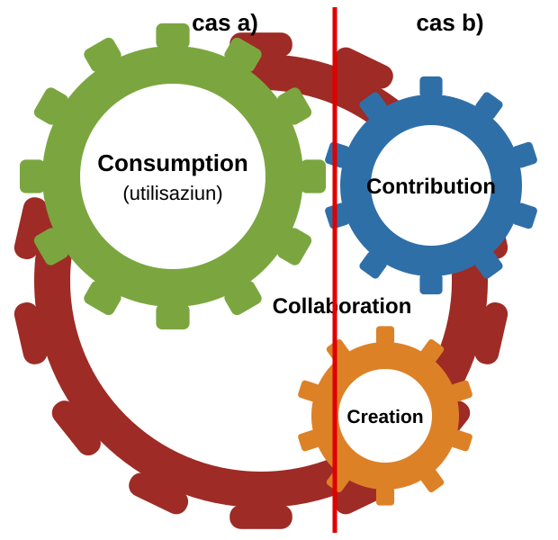

:lang: en
ifeval::["{lang}" == "en"]
= Em002-5 EMOTA and OSS Factsheet
:title-logo-line1: Federal Chancellery FCh
:title-logo-line2: Digital Transformation and ICT Steering DTI
endif::[]
ifeval::["{lang}" == "de"]
= Em002-5 Merkblatt EMBAG und OSS
:title-logo-line1: Bundeskanzlei BK
:title-logo-line2: Digitale Transformation und IKT-Lenkung DTI
endif::[]
ifeval::["{lang}" == "fr"]
= Em002-5 Aide-mémoire LMETA et OSS
:title-logo-line1: Chancellerie fédérale ChF
:title-logo-line2: Transformation numérique et gouvernance de l'informatique TNI
endif::[]
ifeval::["{lang}" == "it"]
= Em002-5 Promemoria LMeCA e OSS
:title-logo-line1: Cancelleria federale CaF
:title-logo-line2: Trasformazione digitale e governance delle TIC TDT
endif::[]
ifeval::["{lang}" == "rm"]
= Em002-5 Fegl d'infurmaziun EMBAG ed OSS
:title-logo-line1: Chanzlia federala ChF
:title-logo-line2: Transfurmaziun digitala e direcziun da las TIC TDT
endif::[]
:govpress-style: report
:govpress-front-block: report
:classification:
:title-logo: logo-ch-black.svg
:title-logo-base: black
:title-logo-line3:
:title-page:
:pdf-theme: basic
:toc:
:sectnums:
:toclevels: 3
:sectnumlevels: 3
:experimental:
:revnumber: 2.0
:revdate: 14.09.2026
:url-repo: https://github.com/swiss/opensource-guidelines/tree/main

ifeval::["{lang}" == "en"]
[IMPORTANT]
====
This document is an evolving draft and part of the guidelines and tools designed to support the Federal Administration in publishing open source code. For more information, see the main https://github.com/swiss/opensource-guidelines/tree/main[README].
====

'''

== Information sheet: Application of OSS Article 9 EMOTA

The new https://www.fedlex.admin.ch/eli/cc/2023/682/en#art_9[Federal Act on the Use of Electronic Means to Carry Out Official Tasks (EMOTA)] came into force on 1 January 2024. It stipulates that federal authorities must publish the source code of software they develop or commission. Exceptions are made where third-party rights or security-relevant reasons preclude or restrict publication.

This document provides guidance for [.underline]#project managers# or other [.underline]#persons responsible for the procurement of software#.

== Introductory questions:

Does the federal authority procure or use standard software without customisation?
If yes, see a)

or

Does a software application or component have to be developed specifically for the federal government (customised software = make)?
If yes, see b)

=== a) Procurement and use of standard software

Where the Confederation purchases software without customisation, Article 9 EMOTA does not apply. Every federal authority is free to decide whether to procure and use open source or other software.
Assistance with the procurement of software can be found on the website of the https://www.beschaffung.admin.ch/bpl/de/home/fachstellen/kompetenzzentrum-beschaffungswesen-bund-kbb.html[Federal Office for Buildings and Logistics (FOBL)] and the https://perimap.admin.ch/goto_perimap_file_46835_download.html[Information sheet on software procurement and Art. 9 EMOTA] from the CCPP. If necessary, link:em002-7.pdf[Em002-7 Strategic Aspects of Procurement and OSS] can also be consulted.

=== b) Creation or further development of software

If a federal authority develops software itself or through third parties, OSS Article 9 EMOTA must be applied. This also includes software that is further developed as part of a contribution in existing OSS projects. Publication of source code can only be avoided in relation to third-party rights or for security-relevant reasons. Please complete the link:em002-2-1-checklist-oss-preliminary-assessment.pdf[Em002-2.1 OSS Preliminary Assessment Checklist].

NOTE: This checklist also serves as a justification for why software [.underline]#does not# have to be published. It should therefore be consulted as early as possible in the project. The guide link:em002-2.pdf[Em002-2] describes the entire process.

Further questions to be clarified are:

=== Under which open source licence is it published?

The fundamental question of whether the software is published under a [.underline]#copyleft# licence (in which case AGPL V3 is a good choice, for example) or [.underline]#permissively# (in which case under an MIT licence, for example) must be answered. With regard to licence selection, the link:em002-3.pdf[Em002-3 OSS Licensing Guidelines] provides detailed information. Please complete the link:em002-2-2-checklist-oss-analysis-and-preparation.pdf[Em002-2.2 OSS Analysis and Preparation Checklist].

NOTE: Ideally, this should be completed by the (technical) project manager or IT architect.

=== Where and how should the software and associated artefacts be published?

Please complete the link:em002-2-3-checklist-oss-release-and-publication.pdf[Em002-2.3 OSS Release and Publication Checklist]

NOTE: This is a collective record of where and how software is published. It may be necessary to involve other organisations.

=== Should an OSS community be established?

link:em002-4.pdf[Em002-4 OSS Community Guidelines] describe the advantages and tasks involved in setting up an OSS community on the basis of a concept.

[.underline]#If yes#: Fill in the link:em002-4-1-checklist-oss-community.pdf[Em002-4.1 OSS Community Checklist] which provides information about the desired type and platform for the community.

NOTE: The project team has a great deal of leeway here as to whether and what type of community should be created. It may be necessary to involve other units.

Answer these questions and check regularly (approx. once a year) whether there have been any significant changes.

Each federal authority (e.g. office, administrative unit) that develops or commissions software is independently responsible for the entire publication process.

== Overview of tools and resources

include::partials/document-map.en.adoc[]

The tools and resources are available on the Federal Chancellery website
under https://www.bk.admin.ch/bk/en/home/digitale-transformation-ikt-lenkung/bundesarchitektur/open_source_software/hilfsmittel_oss.html[OSS tools]. They are also https://github.com/swiss/opensource-guidelines/tree/main/docs[published on GitHub] where you can give feedback directly. The OSS Catalogue (opensource.admin.ch) provides an overview of software published by the federal authorities. For enquiries please contact: mailto:opensource@bk.admin.ch[opensource@bk.admin.ch].

== Target groups of the various OSS tools

The OSS tools and resources are aimed at different target groups. The following table provides a recommendation as to which documents are relevant for each target group.

// The only block title on a table in the document set, and it stays. 4d1056c
// avoided them because auto-numbering would have renumbered the tables whose
// numbers Em002-7's prose cites; Em002-5 has one table, no hand-written number
// and no prose in any of the five languages that cites one. The block title is
// a real <caption> -- the table's accessible name -- and open-govpress supplies
// both the number and the localised word for "Table", so unlike the captions in
// Em002-2, Em002-3 and Em002-7 there is nothing here to keep in step by hand.
.OSS tools and resources by target group
[options="header",cols="3,1,1,1,1,1,1,1,1,1"]
|===
|Document \ Target group |Management |IT management (a) |ISBO / DSBO (a) |Application Manager |Project Management |Legal Services |Procurement |Development |Communications

|Em002 Strategic Guidelines
a|X

3,4,5
a|*X* +
2-5 +
Annex B, C
a|X +
2-5 +
Annex B, C
|
a|(X)

5 +
Annex B
|
|
|
|(X)

|Em002-1 Practical Guidelines
|X
|*X*
|*X*
|*X*
|X
|
|
|
|

|Em002-2 Instructions for Publishing OSS
|
a|(X)

1,3,5
a|X

1,3 5
a|(X)

1,3,5
a|*(X)* +
3,5
|
|
a|X

1-5
|

|Em002-2.1 OSS Preliminary Assessment Checklist
|
a|*(X)*

(c)
a|*X*

(b), (c)
a|X

(b)
a|X

(b)
|
|
|
|

|Em002-2.2 OSS Analysis and Preparation Checklist
|
|
a|*X*

*(c)*
a|*X*

*(c)*
a|*X*

*(c)*
|
|
a|X

(b)
|

|Em002-2.3 OSS Release and Publication Checklist
|
|
a|*X*

(c)
a|*X*

(c)
|
|
|
a|X

(b)
a|X

(d)

|Em002-3 OSS Licensing Guidelines
|
|*(X)*
|*(X)*
|
|
|*X*
a|(X)

8
|(X)
|

|Em002-4 OSS Community Guidelines
a|(X)

3
a|X

3,5
a|X

4,5
|*X*
|
|
|
|(X)
|X

|Em002-4.1 OSS Community Checklist
|
a|*(X)*

(c)
a|*(X)*

(c)
a|(X)

(d)
a|X

(b)
a|(X)

(d)
|
|
a|(X)

(d)

|Em002-5 OSS Tools information sheet (e)
|X
|X
|X
|X
|X
|X
|X
|X
|X

|Em002-6 FAQ about OSS (e)
|(X)
|(X)
|(X)
|X
|
|X
|(X)
|(X)
|(X)

|Em002-7 Strategic Aspects of Procurement and OSS
|
|*(X)*
|*(X)*
|
|(X)
|X
|X
|
|

|CCPP information sheet
|X
|*X*
|*X*
|X
|(X)
|X
|X
|
|

|FOBL Guidelines
|
|
|
|*(X)*
|*(X)*
|
|X
|
|

|FOBL Checklist for blanket exception
|
|*(X)*
|
|(X)
|(X)
|
|X
|
|
|===

Glossary:

* X -- Target group, (X) -- If interested/needed, at least management summary
* (a) person responsible for Art. 9 EMOTA in the OU. Can be IT management or delegated
* (b) fill in
* (c) authorise
* (d) to consult
* (e) Primarily for information and reference
* Bold = Proposal of the responsible body in an OU (may be regulated differently)
* Numbers and capital letters: relevant sections and annexes. If none are specified, the entire document is relevant.
* Responsibility for the documents: FCh/DTI (yellow), CCPP and FOBL (blue)
endif::[]

ifeval::["{lang}" == "de"]
[IMPORTANT]
====
Dieses Dokument ist ein laufend weiterentwickelter Entwurf und Teil der Hilfsmittel, welche die Bundesverwaltung bei der Veröffentlichung von Open-Source-Code unterstützen. Weitere Informationen finden Sie im https://github.com/swiss/opensource-guidelines/tree/main[README].
====

'''

== Merkblatt: Anwendung von OSS Artikel 9 EMBAG

Das neue https://www.fedlex.admin.ch/eli/cc/2023/682/de#art_9[Bundesgesetz über den Einsatz elektronischer Mittel zur Erfüllung von Behördenaufgaben (EMBAG)] ist am 1. Januar 2024 in Kraft getreten. Es verpflichtet die Bundesbehörden, den Quellcode von Software offenzulegen, die sie entwickeln oder entwickeln lassen. Ausnahmen bestehen, wenn Rechte Dritter oder sicherheitsrelevante Gründe die Veröffentlichung ausschliessen oder einschränken.

Dieses Dokument richtet sich an [.underline]#Projektleiterinnen und Projektleiter# sowie an weitere [.underline]#für die Beschaffung von Software verantwortliche Personen#.

== Einleitende Fragen:

Beschafft oder nutzt die Bundesbehörde Standardsoftware ohne Anpassungen?
Wenn ja, siehe a)

oder

Muss eine Softwareanwendung oder -komponente eigens für den Bund entwickelt werden (Individualsoftware = make)?
Wenn ja, siehe b)

=== a) Beschaffung und Nutzung von Standardsoftware

Kauft der Bund Software ohne Anpassungen, so ist Artikel 9 EMBAG nicht anwendbar. Jede Bundesbehörde entscheidet frei, ob sie Open-Source-Software oder andere Software beschafft und einsetzt.
Unterstützung bei der Beschaffung von Software bietet die Website des https://www.beschaffung.admin.ch/bpl/de/home/fachstellen/kompetenzzentrum-beschaffungswesen-bund-kbb.html[Bundesamts für Bauten und Logistik (BBL)] sowie das https://perimap.admin.ch/goto_perimap_file_46835_download.html[Merkblatt zur Softwarebeschaffung und Art. 9 EMBAG] der KBB. Bei Bedarf kann zusätzlich link:em002-7.pdf[Em002-7 Strategische Aspekte der Beschaffung und OSS] beigezogen werden.

=== b) Erstellung oder Weiterentwicklung von Software

Entwickelt eine Bundesbehörde Software selbst oder durch Dritte, so ist OSS Artikel 9 EMBAG anzuwenden. Dazu zählt auch Software, die im Rahmen eines Beitrags an bestehende OSS-Projekte weiterentwickelt wird. Auf die Veröffentlichung des Quellcodes kann nur mit Blick auf Rechte Dritter oder aus sicherheitsrelevanten Gründen verzichtet werden. Bitte füllen Sie die link:em002-2-1-checklist-oss-preliminary-assessment.pdf[Em002-2.1 Checkliste OSS-Vorabklärung] aus.

NOTE: Diese Checkliste dient auch als Begründung dafür, weshalb Software [.underline]#nicht# veröffentlicht werden muss. Sie sollte deshalb möglichst früh im Projekt beigezogen werden. Die Anleitung link:em002-2.pdf[Em002-2] beschreibt den gesamten Prozess.

Weitere zu klärende Fragen sind:

=== Unter welcher Open-Source-Lizenz wird veröffentlicht?

Zu beantworten ist die Grundsatzfrage, ob die Software unter einer [.underline]#Copyleft#-Lizenz (dann ist beispielsweise die AGPL V3 eine gute Wahl) oder [.underline]#permissiv# (dann beispielsweise unter einer MIT-Lizenz) veröffentlicht wird. Zur Lizenzwahl gibt der link:em002-3.pdf[Em002-3 Leitfaden OSS-Lizenzierung] ausführlich Auskunft. Bitte füllen Sie die link:em002-2-2-checklist-oss-analysis-and-preparation.pdf[Em002-2.2 Checkliste OSS-Analyse und -Vorbereitung] aus.

NOTE: Idealerweise wird dies durch die (technische) Projektleitung oder die IT-Architektin bzw. den IT-Architekten ausgefüllt.

=== Wo und wie sollen die Software und die zugehörigen Artefakte veröffentlicht werden?

Bitte füllen Sie die link:em002-2-3-checklist-oss-release-and-publication.pdf[Em002-2.3 Checkliste OSS-Freigabe und -Veröffentlichung] aus.

NOTE: Es handelt sich um eine gesamthafte Erfassung, wo und wie Software veröffentlicht wird. Unter Umständen sind weitere Organisationen einzubeziehen.

=== Soll eine OSS-Community aufgebaut werden?

Der link:em002-4.pdf[Em002-4 Leitfaden OSS-Community] beschreibt die Vorteile und die Aufgaben beim Aufbau einer OSS-Community auf der Grundlage eines Konzepts.

[.underline]#Wenn ja#: Füllen Sie die link:em002-4-1-checklist-oss-community.pdf[Em002-4.1 Checkliste OSS-Community] aus, die Auskunft über die gewünschte Art und Plattform der Community gibt.

NOTE: Das Projektteam hat hier grossen Spielraum, ob und welche Art von Community aufgebaut werden soll. Unter Umständen sind weitere Stellen einzubeziehen.

Beantworten Sie diese Fragen und prüfen Sie regelmässig (rund einmal jährlich), ob sich wesentliche Änderungen ergeben haben.

Jede Bundesbehörde (z. B. Amt, Verwaltungseinheit), die Software entwickelt oder entwickeln lässt, ist eigenständig für den gesamten Veröffentlichungsprozess verantwortlich.

== Übersicht über die Hilfsmittel

include::partials/document-map.de.adoc[]

Die Hilfsmittel stehen auf der Website der Bundeskanzlei
unter https://www.bk.admin.ch/bk/de/home/digitale-transformation-ikt-lenkung/bundesarchitektur/open_source_software/hilfsmittel_oss.html[OSS-Hilfsmittel] zur Verfügung. Sie sind zudem https://github.com/swiss/opensource-guidelines/tree/main/docs[auf GitHub veröffentlicht], wo Sie direkt Rückmeldungen geben können. Der OSS-Katalog (opensource.admin.ch) gibt einen Überblick über die von den Bundesbehörden veröffentlichte Software. Für Anfragen wenden Sie sich an: mailto:opensource@bk.admin.ch[opensource@bk.admin.ch].

== Zielgruppen der verschiedenen OSS-Hilfsmittel

Die OSS-Hilfsmittel richten sich an unterschiedliche Zielgruppen. Die folgende Tabelle enthält eine Empfehlung, welche Dokumente für welche Zielgruppe relevant sind.

// Siehe den englischen Block für die Begründung dieses Blocktitels.
.OSS-Hilfsmittel nach Zielgruppe
[options="header",cols="3,1,1,1,1,1,1,1,1,1"]
|===
|Dokument \ Zielgruppe |Geschäftsleitung |IT-Leitung (a) |ISBO / DSBO (a) |Application Manager |Projektleitung |Rechtsdienst |Beschaffung |Entwicklung |Kommunikation

|Em002 Strategische Leitlinien
a|X

3,4,5
a|*X* +
2-5 +
Anhang B, C
a|X +
2-5 +
Anhang B, C
|
a|(X)

5 +
Anhang B
|
|
|
|(X)

|Em002-1 Praxisleitfaden
|X
|*X*
|*X*
|*X*
|X
|
|
|
|

|Em002-2 Anleitung zur Veröffentlichung von OSS
|
a|(X)

1,3,5
a|X

1,3 5
a|(X)

1,3,5
a|*(X)* +
3,5
|
|
a|X

1-5
|

|Em002-2.1 Checkliste OSS-Vorabklärung
|
a|*(X)*

(c)
a|*X*

(b), (c)
a|X

(b)
a|X

(b)
|
|
|
|

|Em002-2.2 Checkliste OSS-Analyse und -Vorbereitung
|
|
a|*X*

*(c)*
a|*X*

*(c)*
a|*X*

*(c)*
|
|
a|X

(b)
|

|Em002-2.3 Checkliste OSS-Freigabe und -Veröffentlichung
|
|
a|*X*

(c)
a|*X*

(c)
|
|
|
a|X

(b)
a|X

(d)

|Em002-3 Leitfaden OSS-Lizenzierung
|
|*(X)*
|*(X)*
|
|
|*X*
a|(X)

8
|(X)
|

|Em002-4 Leitfaden OSS-Community
a|(X)

3
a|X

3,5
a|X

4,5
|*X*
|
|
|
|(X)
|X

|Em002-4.1 Checkliste OSS-Community
|
a|*(X)*

(c)
a|*(X)*

(c)
a|(X)

(d)
a|X

(b)
a|(X)

(d)
|
|
a|(X)

(d)

|Em002-5 Merkblatt OSS-Hilfsmittel (e)
|X
|X
|X
|X
|X
|X
|X
|X
|X

|Em002-6 FAQ zu OSS (e)
|(X)
|(X)
|(X)
|X
|
|X
|(X)
|(X)
|(X)

|Em002-7 Strategische Aspekte der Beschaffung und OSS
|
|*(X)*
|*(X)*
|
|(X)
|X
|X
|
|

|Merkblatt KBB
|X
|*X*
|*X*
|X
|(X)
|X
|X
|
|

|Weisung BBL
|
|
|
|*(X)*
|*(X)*
|
|X
|
|

|Checkliste BBL für Pauschalausnahme
|
|*(X)*
|
|(X)
|(X)
|
|X
|
|
|===

Legende:

* X -- Zielgruppe, (X) -- bei Interesse/Bedarf, mindestens Management Summary
* (a) für Art. 9 EMBAG verantwortliche Person in der OE. Kann die IT-Leitung sein oder delegiert werden
* (b) ausfüllen
* (c) genehmigen
* (d) konsultieren
* (e) primär zur Information und als Nachschlagewerk
* Fett = Vorschlag der verantwortlichen Stelle in einer OE (kann anders geregelt werden)
* Zahlen und Grossbuchstaben: massgebende Kapitel und Anhänge. Sind keine angegeben, ist das gesamte Dokument relevant.
* Verantwortung für die Dokumente: BK/DTI (gelb), KBB und BBL (blau)
endif::[]

ifeval::["{lang}" == "fr"]
[IMPORTANT]
====
Le présent document est un projet en cours d'élaboration et fait partie des outils destinés à soutenir l'administration fédérale dans la publication de code open source. Pour de plus amples informations, voir le https://github.com/swiss/opensource-guidelines/tree/main[README] principal.
====

'''

== Aide-mémoire : application de l'OSS article 9 LMETA

La nouvelle https://www.fedlex.admin.ch/eli/cc/2023/682/fr#art_9[loi fédérale sur l'utilisation des moyens électroniques pour l'exécution des tâches des autorités (LMETA)] est entrée en vigueur le 1^er^ janvier 2024. Elle oblige les autorités fédérales à publier le code source des logiciels qu'elles développent ou font développer. Des exceptions sont prévues lorsque des droits de tiers ou des motifs relevant de la sécurité excluent ou restreignent la publication.

Le présent document s'adresse aux [.underline]#cheffes et chefs de projet# ainsi qu'aux autres [.underline]#personnes responsables de l'acquisition de logiciels#.

== Questions préliminaires :

L'autorité fédérale acquiert-elle ou utilise-t-elle un logiciel standard sans adaptation ?
Si oui, voir a)

ou

Une application ou un composant logiciel doit-il être développé spécifiquement pour la Confédération (logiciel sur mesure = make) ?
Si oui, voir b)

=== a) Acquisition et utilisation de logiciels standard

Lorsque la Confédération achète un logiciel sans adaptation, l'article 9 LMETA ne s'applique pas. Chaque autorité fédérale est libre de décider si elle acquiert et utilise un logiciel open source ou un autre logiciel.
Une aide à l'acquisition de logiciels est disponible sur le site de l'https://www.beschaffung.admin.ch/bpl/de/home/fachstellen/kompetenzzentrum-beschaffungswesen-bund-kbb.html[Office fédéral des constructions et de la logistique (OFCL)] ainsi que dans l'https://perimap.admin.ch/goto_perimap_file_46835_download.html[aide-mémoire sur l'acquisition de logiciels et l'art. 9 LMETA] du CCMP. Au besoin, le document link:em002-7.pdf[Em002-7 Aspects stratégiques des achats et OSS] peut également être consulté.

=== b) Création ou développement de logiciels

Lorsqu'une autorité fédérale développe un logiciel elle-même ou par l'intermédiaire de tiers, l'OSS article 9 LMETA doit être appliqué. Cela vaut également pour les logiciels développés dans le cadre d'une contribution à des projets OSS existants. Il n'est possible de renoncer à la publication du code source qu'en raison de droits de tiers ou pour des motifs relevant de la sécurité. Veuillez remplir la link:em002-2-1-checklist-oss-preliminary-assessment.pdf[liste de contrôle Em002-2.1 Évaluation préalable OSS].

NOTE: Cette liste de contrôle sert également à justifier pourquoi un logiciel [.underline]#ne doit pas# être publié. Il convient donc de la consulter le plus tôt possible dans le projet. Le guide link:em002-2.pdf[Em002-2] décrit l'ensemble du processus.

Les autres questions à clarifier sont les suivantes :

=== Sous quelle licence open source la publication a-t-elle lieu ?

Il faut répondre à la question de principe de savoir si le logiciel est publié sous une licence [.underline]#copyleft# (l'AGPL V3 est alors un bon choix, par exemple) ou de manière [.underline]#permissive# (par exemple sous licence MIT). Le link:em002-3.pdf[Em002-3 Guide de licences OSS] fournit des informations détaillées sur le choix de la licence. Veuillez remplir la link:em002-2-2-checklist-oss-analysis-and-preparation.pdf[liste de contrôle Em002-2.2 Analyse et préparation OSS].

NOTE: Idéalement, cette liste est remplie par la direction (technique) du projet ou par l'architecte informatique.

=== Où et comment le logiciel et les artefacts associés doivent-ils être publiés ?

Veuillez remplir la link:em002-2-3-checklist-oss-release-and-publication.pdf[liste de contrôle Em002-2.3 Validation et publication OSS].

NOTE: Il s'agit d'un relevé global indiquant où et comment un logiciel est publié. Il peut être nécessaire d'associer d'autres organisations.

=== Faut-il constituer une communauté OSS ?

Le link:em002-4.pdf[Em002-4 Guide des communautés OSS] décrit les avantages et les tâches liés à la constitution d'une communauté OSS sur la base d'un concept.

[.underline]#Si oui# : remplissez la link:em002-4-1-checklist-oss-community.pdf[liste de contrôle Em002-4.1 Communauté OSS], qui renseigne sur le type et la plateforme souhaités pour la communauté.

NOTE: L'équipe de projet dispose ici d'une grande marge de manœuvre quant à la question de savoir si une communauté doit être constituée et de quel type. Il peut être nécessaire d'associer d'autres services.

Répondez à ces questions et vérifiez régulièrement (environ une fois par an) si des changements importants sont intervenus.

Chaque autorité fédérale (p. ex. office, unité administrative) qui développe ou fait développer un logiciel est responsable de manière autonome de l'ensemble du processus de publication.

== Vue d'ensemble des outils et ressources

include::partials/document-map.fr.adoc[]

Les outils et ressources sont disponibles sur le site de la Chancellerie fédérale
sous https://www.bk.admin.ch/bk/fr/home/digitale-transformation-ikt-lenkung/bundesarchitektur/open_source_software/hilfsmittel_oss.html[outils OSS]. Ils sont également https://github.com/swiss/opensource-guidelines/tree/main/docs[publiés sur GitHub], où vous pouvez donner directement votre avis. Le catalogue OSS (opensource.admin.ch) donne une vue d'ensemble des logiciels publiés par les autorités fédérales. Pour toute question, veuillez vous adresser à : mailto:opensource@bk.admin.ch[opensource@bk.admin.ch].

== Groupes cibles des différents outils OSS

Les outils et ressources OSS s'adressent à différents groupes cibles. Le tableau suivant recommande quels documents sont pertinents pour quel groupe cible.

// Voir le bloc anglais pour la justification de ce titre de bloc.
.Outils et ressources OSS par groupe cible
[options="header",cols="3,1,1,1,1,1,1,1,1,1"]
|===
|Document \ Groupe cible |Direction |Direction informatique (a) |ISBO / DSBO (a) |Application Manager |Direction de projet |Service juridique |Achats |Développement |Communication

|Em002 Lignes directrices stratégiques
a|X

3,4,5
a|*X* +
2-5 +
Annexes B, C
a|X +
2-5 +
Annexes B, C
|
a|(X)

5 +
Annexe B
|
|
|
|(X)

|Em002-1 Guide pratique
|X
|*X*
|*X*
|*X*
|X
|
|
|
|

|Em002-2 Instructions pour la publication d'OSS
|
a|(X)

1,3,5
a|X

1,3 5
a|(X)

1,3,5
a|*(X)* +
3,5
|
|
a|X

1-5
|

|Em002-2.1 Liste de contrôle Évaluation préalable OSS
|
a|*(X)*

(c)
a|*X*

(b), (c)
a|X

(b)
a|X

(b)
|
|
|
|

|Em002-2.2 Liste de contrôle Analyse et préparation OSS
|
|
a|*X*

*(c)*
a|*X*

*(c)*
a|*X*

*(c)*
|
|
a|X

(b)
|

|Em002-2.3 Liste de contrôle Validation et publication OSS
|
|
a|*X*

(c)
a|*X*

(c)
|
|
|
a|X

(b)
a|X

(d)

|Em002-3 Guide de licences OSS
|
|*(X)*
|*(X)*
|
|
|*X*
a|(X)

8
|(X)
|

|Em002-4 Guide des communautés OSS
a|(X)

3
a|X

3,5
a|X

4,5
|*X*
|
|
|
|(X)
|X

|Em002-4.1 Liste de contrôle Communauté OSS
|
a|*(X)*

(c)
a|*(X)*

(c)
a|(X)

(d)
a|X

(b)
a|(X)

(d)
|
|
a|(X)

(d)

|Em002-5 Aide-mémoire Outils OSS (e)
|X
|X
|X
|X
|X
|X
|X
|X
|X

|Em002-6 FAQ sur l'OSS (e)
|(X)
|(X)
|(X)
|X
|
|X
|(X)
|(X)
|(X)

|Em002-7 Aspects stratégiques des achats et OSS
|
|*(X)*
|*(X)*
|
|(X)
|X
|X
|
|

|Aide-mémoire CCMP
|X
|*X*
|*X*
|X
|(X)
|X
|X
|
|

|Directives OFCL
|
|
|
|*(X)*
|*(X)*
|
|X
|
|

|Liste de contrôle OFCL pour exception forfaitaire
|
|*(X)*
|
|(X)
|(X)
|
|X
|
|
|===

Légende :

* X -- groupe cible, (X) -- en cas d'intérêt ou de besoin, au moins le résumé à l'intention de la direction
* (a) personne responsable de l'art. 9 LMETA au sein de l'UO. Il peut s'agir de la direction informatique ou d'une personne déléguée
* (b) à remplir
* (c) à approuver
* (d) à consulter
* (e) principalement à titre d'information et de référence
* Gras = proposition de l'unité responsable au sein d'une UO (peut être réglé différemment)
* Chiffres et lettres majuscules : chapitres et annexes déterminants. Si rien n'est indiqué, l'ensemble du document est pertinent.
* Responsabilité des documents : ChF/TNI (jaune), CCMP et OFCL (bleu)
endif::[]

ifeval::["{lang}" == "it"]
[IMPORTANT]
====
Il presente documento è una bozza in continua evoluzione e fa parte degli strumenti destinati a sostenere l'Amministrazione federale nella pubblicazione di codice open source. Per maggiori informazioni si veda il https://github.com/swiss/opensource-guidelines/tree/main[README] principale.
====

'''

== Promemoria: applicazione dell'OSS articolo 9 LMeCA

La nuova https://www.fedlex.admin.ch/eli/cc/2023/682/it#art_9[legge federale sull'impiego di mezzi elettronici per l'adempimento dei compiti delle autorità (LMeCA)] è entrata in vigore il 1° gennaio 2024. Essa obbliga le autorità federali a pubblicare il codice sorgente del software che sviluppano o fanno sviluppare. Sono previste eccezioni se diritti di terzi o motivi rilevanti per la sicurezza escludono o limitano la pubblicazione.

Il presente documento si rivolge ai [.underline]#capiprogetto# e alle altre [.underline]#persone responsabili dell'acquisto di software#.

== Domande introduttive:

L'autorità federale acquista o utilizza software standard senza adattamenti?
In caso affermativo, vedi a)

oppure

Un'applicazione o un componente software deve essere sviluppato appositamente per la Confederazione (software su misura = make)?
In caso affermativo, vedi b)

=== a) Acquisto e utilizzo di software standard

Se la Confederazione acquista software senza adattamenti, l'articolo 9 LMeCA non si applica. Ogni autorità federale decide liberamente se acquistare e utilizzare software open source o altro software.
Un supporto per l'acquisto di software è disponibile sul sito dell'https://www.beschaffung.admin.ch/bpl/de/home/fachstellen/kompetenzzentrum-beschaffungswesen-bund-kbb.html[Ufficio federale delle costruzioni e della logistica (UFCL)] e nel https://perimap.admin.ch/goto_perimap_file_46835_download.html[promemoria sull'acquisto di software e l'art. 9 LMeCA] del CCAP. Se necessario, può essere consultato anche il documento link:em002-7.pdf[Em002-7 Aspetti strategici degli acquisti e OSS].

=== b) Creazione o ulteriore sviluppo di software

Se un'autorità federale sviluppa software autonomamente o tramite terzi, si applica l'OSS articolo 9 LMeCA. Ciò vale anche per il software ulteriormente sviluppato nell'ambito di un contributo a progetti OSS esistenti. Si può rinunciare alla pubblicazione del codice sorgente soltanto in relazione a diritti di terzi o per motivi rilevanti per la sicurezza. Vi preghiamo di compilare la link:em002-2-1-checklist-oss-preliminary-assessment.pdf[lista di controllo Em002-2.1 Valutazione preliminare OSS].

NOTE: Questa lista di controllo serve anche a motivare perché un software [.underline]#non debba# essere pubblicato. È quindi opportuno consultarla il prima possibile nel progetto. La guida link:em002-2.pdf[Em002-2] descrive l'intero processo.

Ulteriori questioni da chiarire sono:

=== Sotto quale licenza open source avviene la pubblicazione?

Occorre rispondere alla domanda di fondo se il software venga pubblicato sotto una licenza [.underline]#copyleft# (in tal caso l'AGPL V3 è per esempio una buona scelta) oppure in modo [.underline]#permissivo# (per esempio sotto licenza MIT). Per la scelta della licenza, la link:em002-3.pdf[Em002-3 Guida alle licenze OSS] fornisce informazioni dettagliate. Vi preghiamo di compilare la link:em002-2-2-checklist-oss-analysis-and-preparation.pdf[lista di controllo Em002-2.2 Analisi e preparazione OSS].

NOTE: Idealmente la compilazione spetta alla direzione (tecnica) del progetto o all'architetto informatico.

=== Dove e come devono essere pubblicati il software e i relativi artefatti?

Vi preghiamo di compilare la link:em002-2-3-checklist-oss-release-and-publication.pdf[lista di controllo Em002-2.3 Rilascio e pubblicazione OSS].

NOTE: Si tratta di una rilevazione complessiva di dove e come il software viene pubblicato. Può essere necessario coinvolgere altre organizzazioni.

=== Occorre costituire una community OSS?

La link:em002-4.pdf[Em002-4 Guida alle community OSS] descrive i vantaggi e i compiti legati alla costituzione di una community OSS sulla base di un concetto.

[.underline]#In caso affermativo#: compilate la link:em002-4-1-checklist-oss-community.pdf[lista di controllo Em002-4.1 Community OSS], che fornisce indicazioni sul tipo e sulla piattaforma desiderati per la community.

NOTE: Il team di progetto dispone qui di ampio margine di manovra riguardo alla costituzione e al tipo di community. Può essere necessario coinvolgere altri servizi.

Rispondete a queste domande e verificate regolarmente (circa una volta all'anno) se sono intervenuti cambiamenti sostanziali.

Ogni autorità federale (p. es. ufficio, unità amministrativa) che sviluppa o fa sviluppare software è responsabile in modo autonomo dell'intero processo di pubblicazione.

== Panoramica degli strumenti e delle risorse

include::partials/document-map.it.adoc[]

Gli strumenti e le risorse sono disponibili sul sito della Cancelleria federale
alla pagina https://www.bk.admin.ch/bk/it/home/digitale-transformation-ikt-lenkung/bundesarchitektur/open_source_software/hilfsmittel_oss.html[strumenti OSS]. Sono inoltre https://github.com/swiss/opensource-guidelines/tree/main/docs[pubblicati su GitHub], dove potete fornire direttamente un riscontro. Il catalogo OSS (opensource.admin.ch) offre una panoramica del software pubblicato dalle autorità federali. Per domande rivolgetevi a: mailto:opensource@bk.admin.ch[opensource@bk.admin.ch].

== Gruppi target dei diversi strumenti OSS

Gli strumenti e le risorse OSS si rivolgono a gruppi target diversi. La tabella seguente raccomanda quali documenti sono rilevanti per quale gruppo target.

// Cfr. il blocco inglese per la motivazione di questo titolo di blocco.
.Strumenti e risorse OSS per gruppo target
[options="header",cols="3,1,1,1,1,1,1,1,1,1"]
|===
|Documento \ Gruppo target |Direzione |Direzione informatica (a) |ISBO / DSBO (a) |Application Manager |Direzione di progetto |Servizio giuridico |Acquisti |Sviluppo |Comunicazione

|Em002 Linee guida strategiche
a|X

3,4,5
a|*X* +
2-5 +
Allegati B, C
a|X +
2-5 +
Allegati B, C
|
a|(X)

5 +
Allegato B
|
|
|
|(X)

|Em002-1 Guida pratica
|X
|*X*
|*X*
|*X*
|X
|
|
|
|

|Em002-2 Istruzioni per la pubblicazione di OSS
|
a|(X)

1,3,5
a|X

1,3 5
a|(X)

1,3,5
a|*(X)* +
3,5
|
|
a|X

1-5
|

|Em002-2.1 Lista di controllo Valutazione preliminare OSS
|
a|*(X)*

(c)
a|*X*

(b), (c)
a|X

(b)
a|X

(b)
|
|
|
|

|Em002-2.2 Lista di controllo Analisi e preparazione OSS
|
|
a|*X*

*(c)*
a|*X*

*(c)*
a|*X*

*(c)*
|
|
a|X

(b)
|

|Em002-2.3 Lista di controllo Rilascio e pubblicazione OSS
|
|
a|*X*

(c)
a|*X*

(c)
|
|
|
a|X

(b)
a|X

(d)

|Em002-3 Guida alle licenze OSS
|
|*(X)*
|*(X)*
|
|
|*X*
a|(X)

8
|(X)
|

|Em002-4 Guida alle community OSS
a|(X)

3
a|X

3,5
a|X

4,5
|*X*
|
|
|
|(X)
|X

|Em002-4.1 Lista di controllo Community OSS
|
a|*(X)*

(c)
a|*(X)*

(c)
a|(X)

(d)
a|X

(b)
a|(X)

(d)
|
|
a|(X)

(d)

|Em002-5 Promemoria Strumenti OSS (e)
|X
|X
|X
|X
|X
|X
|X
|X
|X

|Em002-6 FAQ sull'OSS (e)
|(X)
|(X)
|(X)
|X
|
|X
|(X)
|(X)
|(X)

|Em002-7 Aspetti strategici degli acquisti e OSS
|
|*(X)*
|*(X)*
|
|(X)
|X
|X
|
|

|Promemoria CCAP
|X
|*X*
|*X*
|X
|(X)
|X
|X
|
|

|Direttive UFCL
|
|
|
|*(X)*
|*(X)*
|
|X
|
|

|Lista di controllo UFCL per eccezione forfettaria
|
|*(X)*
|
|(X)
|(X)
|
|X
|
|
|===

Legenda:

* X -- gruppo target, (X) -- in caso di interesse/necessità, almeno il riassunto per la direzione
* (a) persona responsabile dell'art. 9 LMeCA nell'UO. Può essere la direzione informatica o una persona delegata
* (b) compilare
* (c) approvare
* (d) consultare
* (e) principalmente a scopo informativo e di consultazione
* Grassetto = proposta del servizio responsabile in un'UO (può essere disciplinato diversamente)
* Cifre e lettere maiuscole: capitoli e allegati determinanti. Se non ne sono indicati, è rilevante l'intero documento.
* Responsabilità dei documenti: CaF/TDI (giallo), CCAP e UFCL (blu)
endif::[]

ifeval::["{lang}" == "rm"]
[IMPORTANT]
====
Quest document è ina sbozza ch'è vegn sviluppada vinavant e fa part dals meds che sustegnan l'administraziun federala en la publicaziun da code open source. Ulteriuras infurmaziuns chattais Vus en il https://github.com/swiss/opensource-guidelines/tree/main[README] principal.
====

'''

== Fegl d'infurmaziun: applicaziun da l'OSS artitgel 9 EMBAG

La nova https://www.fedlex.admin.ch/eli/cc/2023/682/rm#art_9[lescha federala davart l'utilisaziun da meds electronics per ademplir incumbensas d'autoritads (EMBAG)] è entrada en vigur ils 1. da schaner 2024. Ella oblighescha las autoritads federalas da publitgar il code da funtauna dal software ch'ellas sviluppan u fan sviluppar. Excepziuns datti, sche dretgs da terzas persunas u motivs relevants per la segirezza excludan u restrenschan la publicaziun.

Quest document s'adressa a las [.underline]#manadras e als manaders da project# sco er a las autras [.underline]#persunas responsablas per l'acquist da software#.

== Dumondas introductivas:

Acquista u utilisescha l'autoritad federala in software standard senza adattaziuns?
Sche gea, vesair a)

u

Sto ina applicaziun u ina cumponenta da software vegnir sviluppada spezialmain per la Confederaziun (software individual = make)?
Sche gea, vesair b)

=== a) Acquist ed utilisaziun da software standard

Sche la Confederaziun cumpra software senza adattaziuns, n'è l'artitgel 9 EMBAG betg applitgabel. Mintga autoritad federala decida libramain, sch'ella acquista ed utilisescha software open source u auter software.
Sustegn per l'acquist da software chattais Vus sin la pagina d'internet da l'https://www.beschaffung.admin.ch/bpl/de/home/fachstellen/kompetenzzentrum-beschaffungswesen-bund-kbb.html[Uffizi federal per edifizis e logistica (UFCL)] sco er en il https://perimap.admin.ch/goto_perimap_file_46835_download.html[fegl d'infurmaziun davart l'acquist da software e l'art. 9 EMBAG] dal CCA. Sche necessari po vegnir consultà ultra da quai link:em002-7.pdf[Em002-7 Aspects strategics da l'acquist ed OSS].

=== b) Creaziun u svilup vinavant da software

Sche in'autoritad federala sviluppa software sezza u tras terzas persunas, sto vegnir applitgà l'OSS artitgel 9 EMBAG. Quai vala er per software che vegn sviluppà vinavant en il rom d'ina contribuziun a projects OSS existents. Sin la publicaziun dal code da funtauna po vegnir renunzià mo pervia da dretgs da terzas persunas u per motivs relevants per la segirezza. Empleni p.pl. la link:em002-2-1-checklist-oss-preliminary-assessment.pdf[glista da controlla Em002-2.1 Evaluaziun preliminara OSS].

NOTE: Questa glista da controlla serva er sco motivaziun, pertge ch'in software [.underline]#na sto betg# vegnir publitgà. Ella duess perquai vegnir consultada uschè baud sco pussaivel en il project. L'instrucziun link:em002-2.pdf[Em002-2] descriva l'entir process.

Ulteriuras dumondas da sclerir èn:

=== Sut tge licenza open source vegn publitgà?

I sto vegnir respundida la dumonda fundamentala, sche il software vegn publitgà sut ina licenza [.underline]#copyleft# (lura è per exempel l'AGPL V3 ina buna tscherna) u [.underline]#permissivamain# (lura per exempel sut ina licenza MIT). Concernent la tscherna da la licenza da la link:em002-3.pdf[Em002-3 Guida da licenzas OSS] infurmaziuns detagliadas. Empleni p.pl. la link:em002-2-2-checklist-oss-analysis-and-preparation.pdf[glista da controlla Em002-2.2 Analisa e preparaziun OSS].

NOTE: Idealmain vegn quai emplenì da la direcziun (tecnica) dal project u da l'architecta u l'architect d'informatica.

=== Nua e co duain il software ed ils artefacts appartenents vegnir publitgads?

Empleni p.pl. la link:em002-2-3-checklist-oss-release-and-publication.pdf[glista da controlla Em002-2.3 Relaschada e publicaziun OSS].

NOTE: I sa tracta d'ina registraziun cumplessiva, nua e co che software vegn publitgà. Eventualmain ston vegnir integradas ulteriuras organisaziuns.

=== Duai vegnir construida ina communitad OSS?

La link:em002-4.pdf[Em002-4 Guida da communitads OSS] descriva ils avantatgs e las incumbensas cun construir ina communitad OSS sin basa d'in concept.

[.underline]#Sche gea#: Empleni la link:em002-4-1-checklist-oss-community.pdf[glista da controlla Em002-4.1 Communitad OSS], che dat infurmaziuns davart il gener e la plattafurma giavischada da la communitad.

NOTE: Il team dal project ha qua ina gronda libertad, sche e tge gener da communitad che duai vegnir construida. Eventualmain ston vegnir integrads ulteriurs posts.

Respundai questas dumondas e controllai regularmain (var ina giada l'onn), sche i dat midadas essenzialas.

Mintga autoritad federala (p.ex. uffizi, unitad administrativa) che sviluppa u fa sviluppar software è responsabla independentamain per l'entir process da publicaziun.

== Survista dals meds e da las resursas

include::partials/document-map.rm.adoc[]

Ils meds e las resursas stattan a disposiziun sin la pagina d'internet da la Chanzlia federala
sut https://www.bk.admin.ch/bk/de/home/digitale-transformation-ikt-lenkung/bundesarchitektur/open_source_software/hilfsmittel_oss.html[meds OSS]. Els èn ultra da quai https://github.com/swiss/opensource-guidelines/tree/main/docs[publitgads sin GitHub], nua che Vus pudais dar directamain in resun. Il catalog OSS (opensource.admin.ch) dat ina survista dal software publitgà da las autoritads federalas. Per dumondas As drizzai a: mailto:opensource@bk.admin.ch[opensource@bk.admin.ch].

== Gruppas da destinaziun dals differents meds OSS

Ils meds e las resursas OSS s'adressan a differentas gruppas da destinaziun. La tabella suandanta cuntegna ina recumandaziun, tge documents che èn relevants per tge gruppa da destinaziun.

// Vesair il bloc englais per la motivaziun da quest titel da bloc.
.Meds e resursas OSS tenor gruppa da destinaziun
[options="header",cols="3,1,1,1,1,1,1,1,1,1"]
|===
|Document \ Gruppa da destinaziun |Direcziun |Direcziun d'informatica (a) |ISBO / DSBO (a) |Application Manager |Direcziun da project |Servetsch giuridic |Acquist |Svilup |Communicaziun

|Em002 Directivas strategicas
a|X

3,4,5
a|*X* +
2-5 +
Agiunta B, C
a|X +
2-5 +
Agiunta B, C
|
a|(X)

5 +
Agiunta B
|
|
|
|(X)

|Em002-1 Guida pratica
|X
|*X*
|*X*
|*X*
|X
|
|
|
|

|Em002-2 Instrucziuns per publitgar OSS
|
a|(X)

1,3,5
a|X

1,3 5
a|(X)

1,3,5
a|*(X)* +
3,5
|
|
a|X

1-5
|

|Em002-2.1 Glista da controlla Evaluaziun preliminara OSS
|
a|*(X)*

(c)
a|*X*

(b), (c)
a|X

(b)
a|X

(b)
|
|
|
|

|Em002-2.2 Glista da controlla Analisa e preparaziun OSS
|
|
a|*X*

*(c)*
a|*X*

*(c)*
a|*X*

*(c)*
|
|
a|X

(b)
|

|Em002-2.3 Glista da controlla Relaschada e publicaziun OSS
|
|
a|*X*

(c)
a|*X*

(c)
|
|
|
a|X

(b)
a|X

(d)

|Em002-3 Guida da licenzas OSS
|
|*(X)*
|*(X)*
|
|
|*X*
a|(X)

8
|(X)
|

|Em002-4 Guida da communitads OSS
a|(X)

3
a|X

3,5
a|X

4,5
|*X*
|
|
|
|(X)
|X

|Em002-4.1 Glista da controlla Communitad OSS
|
a|*(X)*

(c)
a|*(X)*

(c)
a|(X)

(d)
a|X

(b)
a|(X)

(d)
|
|
a|(X)

(d)

|Em002-5 Fegl d'infurmaziun Meds OSS (e)
|X
|X
|X
|X
|X
|X
|X
|X
|X

|Em002-6 FAQ davart OSS (e)
|(X)
|(X)
|(X)
|X
|
|X
|(X)
|(X)
|(X)

|Em002-7 Aspects strategics da l'acquist ed OSS
|
|*(X)*
|*(X)*
|
|(X)
|X
|X
|
|

|Fegl d'infurmaziun CCA
|X
|*X*
|*X*
|X
|(X)
|X
|X
|
|

|Directivas UFCL
|
|
|
|*(X)*
|*(X)*
|
|X
|
|

|Glista da controlla UFCL per excepziun forfaitara
|
|*(X)*
|
|(X)
|(X)
|
|X
|
|
|===

Legenda:

* X -- gruppa da destinaziun, (X) -- en cas d'interess/basegn, almain il resumaziun per la direcziun
* (a) persuna responsabla per l'art. 9 EMBAG en l'UO. Po esser la direcziun d'informatica u vegnir delegada
* (b) emplenir
* (c) approvar
* (d) consultar
* (e) principalmain per l'infurmaziun e sco ovra da consultaziun
* Grass = proposta dal post responsabel en in'UO (po vegnir reglà autramain)
* Cifras e maiusclas: chapitels ed agiuntas relevants. Sche naginas n'èn inditgadas, è l'entir document relevant.
* Responsabladad per ils documents: ChF/TDT (mellen), CCA ed UFCL (blau)
endif::[]
