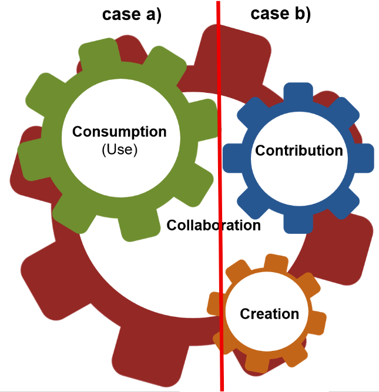
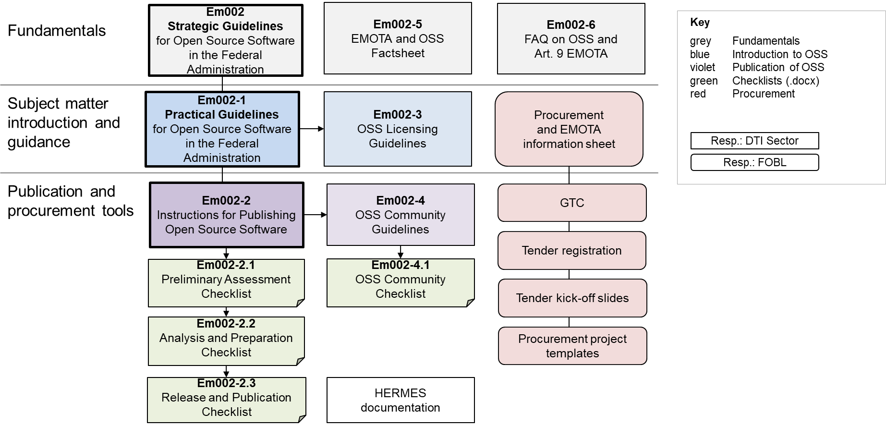

= Em002-5 EMOTA and OSS Factsheet
:lang: en
:govpress-style: report
:govpress-front-block: report
:classification:
:title-logo: logo-ch-black.svg
:title-logo-base: black
:title-logo-line1: Federal Chancellery FCh
:title-logo-line2: Office
:title-logo-line3:
:title-page:
:pdf-theme: basic
:toc:
:sectnums:
:toclevels: 3
:sectnumlevels: 3
:experimental:
:revnumber: 1.0
:revdate: 14.09.2026
:url-repo: https://github.com/swiss/opensource-guidelines/tree/main

[IMPORTANT]
====
This document is an evolving draft and part of the guidelines and tools designed to support the Federal Administration in publishing open source code. For more information, see the main https://github.com/swiss/opensource-guidelines/tree/main[README].
====

'''

== Information sheet: Application of OSS Article 9 EMOTA

The new https://www.fedlex.admin.ch/eli/cc/2023/682/en#art_9[Federal Act on the Use of Electronic Means to Carry Out Official Tasks (EMOTA)] came into force on 1 January 2024. It stipulates that federal authorities must publish the source code of software they develop or commission. Exceptions are made where third-party rights or security-relevant reasons preclude or restrict publication.

This document provides guidance for [.underline]#project managers# or other [.underline]#persons responsible for the procurement of software#.

== Introductory questions:

Does the federal authority procure or use standard software without customisation?
If yes, see a)

or

Does a software application or component have to be developed specifically for the federal government (customised software = make)?
If yes, see b)

=== a) Procurement and use of standard software

Where the Confederation purchases software without customisation, Article 9 EMOTA does not apply. Every federal authority is free to decide whether to procure and use open source or other software.
Assistance with the procurement of software can be found on the website of the https://www.beschaffung.admin.ch/bpl/de/home/fachstellen/kompetenzzentrum-beschaffungswesen-bund-kbb.html[Federal Office for Buildings and Logistics (FOBL)] and the https://perimap.admin.ch/goto_perimap_file_46835_download.html[Information sheet on software procurement and Art. 9 EMOTA] from the CCPP. If necessary, link:em002-7.pdf[Em002-7 Strategic Aspects of Procurement and OSS] can also be consulted.

=== b) Creation or further development of software

If a federal authority develops software itself or through third parties, OSS Article 9 EMOTA must be applied. This also includes software that is further developed as part of a contribution in existing OSS projects. Publication of source code can only be avoided in relation to third-party rights or for security-relevant reasons. Please complete the link:em002-2-1-checklist-oss-preliminary-assessment.pdf[Em002-2.1 OSS Preliminary Assessment Checklist].

NOTE: This checklist also serves as a justification for why software [.underline]#does not# have to be published. It should therefore be consulted as early as possible in the project. The guide link:em002-2.pdf[Em002-2] describes the entire process.

Further questions to be clarified are:

=== Under which open source licence is it published?

The fundamental question of whether the software is published under a [.underline]#copyleft# licence (in which case AGPL V3 is a good choice, for example) or [.underline]#permissively# (in which case under an MIT licence, for example) must be answered. With regard to licence selection, the link:em002-3.pdf[Em002-3 OSS Licensing Guidelines] provides detailed information. Please complete the link:em002-2-2-checklist-oss-analysis-and-preparation.pdf[Em002-2.2 OSS Analysis and Preparation Checklist].

NOTE: Ideally, this should be completed by the (technical) project manager or IT architect.

=== Where and how should the software and associated artefacts be published?

Please complete the link:em002-2-3-checklist-oss-release-and-publication.pdf[Em002-2.3 OSS Release and Publication Checklist]

NOTE: This is a collective record of where and how software is published. It may be necessary to involve other organisations.

=== Should an OSS community be established?

link:em002-4.pdf[Em002-4 OSS Community Guidelines] describe the advantages and tasks involved in setting up an OSS community on the basis of a concept.

[.underline]#If yes#: Fill in the link:em002-4-1-checklist-oss-community.pdf[Em002-4.1 OSS Community Checklist] which provides information about the desired type and platform for the community.

NOTE: The project team has a great deal of leeway here as to whether and what type of community should be created. It may be necessary to involve other units.

Answer these questions and check regularly (approx. once a year) whether there have been any significant changes.

Each federal authority (e.g. office, administrative unit) that develops or commissions software is independently responsible for the entire publication process.

== Overview of tools and resources

The tools and resources are available on the Federal Chancellery website
under https://www.bk.admin.ch/bk/en/home/digitale-transformation-ikt-lenkung/bundesarchitektur/open_source_software/hilfsmittel_oss.html[OSS tools]. They are also https://github.com/swiss/opensource-guidelines/tree/main/docs/en[published in English on GitHub] where you can give feedback directly. The OSS Catalogue (opensource.admin.ch) provides an overview of software published by the federal authorities. For enquiries please contact: mailto:opensource@bk.admin.ch[opensource@bk.admin.ch].

== Target groups of the various OSS tools

The OSS tools and resources are aimed at different target groups. The following table provides a recommendation as to which documents are relevant for each target group.

.OSS tools and resources by target group
[options="header",cols="3,1,1,1,1,1,1,1,1,1"]
|===
|Document \ Target group |Management |IT management (a) |ISBO / DSBO (a) |Application Manager |Project Management |Legal Services |Procurement |Development |Communications

|Em002 Strategic Guidelines
a|X

3,4,5
a|*X* +
2-5 +
Annex B, C
a|X +
2-5 +
Annex B, C
|
a|(X)

5 +
Annex B
|
|
|
|(X)

|Em002-1 Practical Guidelines
|X
|*X*
|*X*
|*X*
|X
|
|
|
|

|Em002-2 Instructions for Publishing OSS
|
a|(X)

1,3,5
a|X

1,3 5
a|(X)

1,3,5
a|*(X)* +
3,5
|
|
a|X

1-5
|

|Em002-2.1 OSS Preliminary Assessment Checklist
|
a|*(X)*

(c)
a|*X*

(b), (c)
a|X

(b)
a|X

(b)
|
|
|
|

|Em002-2.2 OSS Analysis and Preparation Checklist
|
|
a|*X*

*(c)*
a|*X*

*(c)*
a|*X*

*(c)*
|
|
a|X

(b)
|

|Em002-2.3 OSS Release and Publication Checklist
|
|
a|*X*

(c)
a|*X*

(c)
|
|
|
a|X

(b)
a|X

(d)

|Em002-3 OSS Licensing Guidelines
|
|*(X)*
|*(X)*
|
|
|*X*
a|(X)

8
|(X)
|

|Em002-4 OSS Community Guidelines
a|(X)

3
a|X

3,5
a|X

4,5
|*X*
|
|
|
|(X)
|X

|Em002-4.1 OSS Community Checklist
|
a|*(X)*

(c)
a|*(X)*

(c)
a|(X)

(d)
a|X

(b)
a|(X)

(d)
|
|
a|(X)

(d)

|Em002-5 OSS Tools information sheet (e)
|X
|X
|X
|X
|X
|X
|X
|X
|X

|Em002-6 FAQ about OSS (e)
|(X)
|(X)
|(X)
|X
|
|X
|(X)
|(X)
|(X)

|Em002-7 Strategic Aspects of Procurement and OSS
|
|*(X)*
|*(X)*
|
|(X)
|X
|X
|
|

|CCPP information sheet
|X
|*X*
|*X*
|X
|(X)
|X
|X
|
|

|FOBL Guidelines
|
|
|
|*(X)*
|*(X)*
|
|X
|
|

|FOBL Checklist for blanket exception
|
|*(X)*
|
|(X)
|(X)
|
|X
|
|
|===

Glossary:

* X -- Target group, (X) -- If interested/needed, at least management summary
* (a) person responsible for Art. 9 EMOTA in the OU. Can be IT management or delegated
* (b) fill in
* (c) authorise
* (d) to consult
* (e) Primarily for information and reference
* Bold = Proposal of the responsible body in an OU (may be regulated differently)
* Numbers and capital letters: relevant sections and annexes. If none are specified, the entire document is relevant.
* Responsibility for the documents: FCh/DTI (yellow), CCPP and FOBL (blue)
