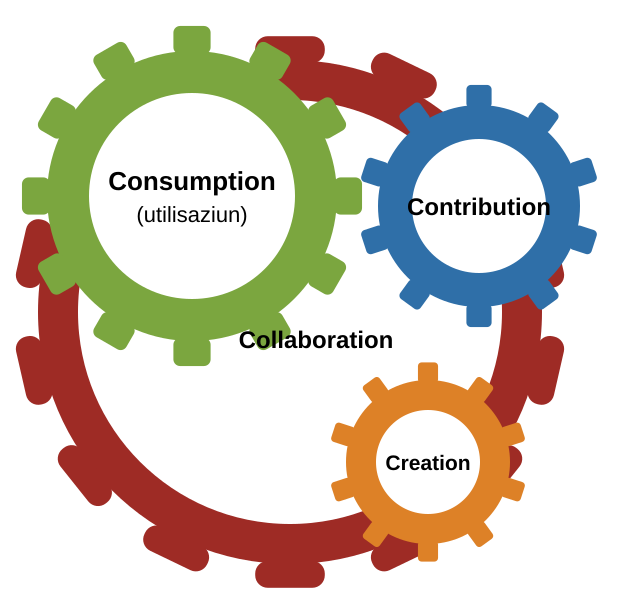

:lang: en
ifeval::["{lang}" == "en"]
= Em002-7 OSS Guideline: Applying Article 9 EMOTA
:title-logo-line1: Federal Chancellery FCh
:title-logo-line2: Digital Transformation and ICT Steering DTI
endif::[]
ifeval::["{lang}" == "de"]
= Em002-7 Leitfaden OSS: Anwendung von Artikel 9 EMBAG
:title-logo-line1: Bundeskanzlei BK
:title-logo-line2: Digitale Transformation und IKT-Lenkung DTI
endif::[]
ifeval::["{lang}" == "fr"]
= Em002-7 Guide OSS : application de l'article 9 LMETA
:title-logo-line1: Chancellerie fédérale ChF
:title-logo-line2: Transformation numérique et gouvernance de l'informatique TNI
endif::[]
ifeval::["{lang}" == "it"]
= Em002-7 Guida OSS: applicazione dell'articolo 9 LMeCA
:title-logo-line1: Cancelleria federale CaF
:title-logo-line2: Trasformazione digitale e governance delle TIC TDT
endif::[]
ifeval::["{lang}" == "rm"]
= Em002-7 Guida OSS: applicaziun da l'artitgel 9 EMBAG
:title-logo-line1: Chanzlia federala ChF
:title-logo-line2: Transfurmaziun digitala e direcziun da las TIC TDT
endif::[]
:govpress-style: report
// The Confederation logo in colour. open-govpress falls back to `black` for any
// value it does not recognise, `colour` being the one synonym it takes, so the
// spelling here is the whole of the choice.
:title-logo-base: color
// Deliberately empty: the document carries no classification mark. Omitting the
// line renders identically -- it is kept so the question is answered rather than
// left unasked.
:classification:
:revnumber: 2.0
:revdate: 14.09.2026
// The repository, written as `{url-repo}` throughout the body. open-govpress
// reads nothing here; this is its own documented idiom for an author-defined
// attribute that saves repetition (see the `showcase.adoc` it ships).
:url-repo: https://github.com/swiss/opensource-guidelines
// Contents and numbering for the *web* view of this source. open-govpress sets
// all four itself for `:govpress-style: report` (styles/common.adoc and
// styles/report.adoc), so they change nothing in the PDF -- GitHub and GitLab
// render this file with plain Asciidoctor, which does not, and without them the
// web view loses its contents list and its section numbers.
:toc:
:toclevels: 3
:sectnums:
:sectnumlevels: 3

ifeval::["{lang}" == "en"]
*Disclaimer:* This document is an evolving draft and part of the guidelines and tools designed to support the Federal Administration in publishing open source code. For more information, see the main {url-repo}/tree/main[README].

'''

== Main points at a glance

This document supplements the Em002 set of OSS tools with aspects concerning procurement. It builds on the _Information Sheet on Software Procurement and Art. 9 EMOTA_ published by the Federal Procurement Competence Centre (CCPP)footnote:[The Competence Centre for Federal Public Procurement (CCPP) advises procurement and requesting offices on matters relating to procurement law in accordance with Art. 37 OPPO. Central email address for enquiries: rechtsdienst.kbb@bbl.admin.ch] _[KBB-MB]_, and summarises the content of FOBLfootnote:[The Federal Office for Buildings and Logistics (FOBL) is the central procurement office of the Swiss Confederation (Arts 5--7 OPPO). It carries out procurement within its area of responsibility, consolidates where appropriate and may conclude framework agreements.] documents such as the _Open Source in Procurement Guidelines_ [BBL-WL], which are available on the intranet only.footnote:[https://intranet.bbl.admin.ch/bbl_kp/de/home/informatik/beschaffung-buerotechnik-informatik-des-bbl/werkzeugkasten.html] The document also addresses digital sovereignty as a procurement criterion.

The use of open source software can be divided into four aspects:

* Consumption: The use of pre-existing OSS
* Creation: The development of new OSS
* Contribution: Contributing in-house modifications to an existing OSS project
* Collaboration: The joint further development of OSS with third parties.

In all these situations, a public contracting authority must comply with the relevant procurement legislation.

*Consumption:*

* Procurement law applies when services are purchased on the market for payment (Art. 8 PPA).

In other words:

* The use of OSS that is available free of charge (without licence fees, support or maintenance contracts, etc.) does not generally constitute procurement.
* Value-added services purchased for the use of OSS (support, warranty, maintenance, and further development) must be procured in accordance with procurement law.
* When procuring software, it is generally permissible to specify OSS as a requirement, e.g. where the administrative unit (AU) expects to derive specific benefits, such as greater data sovereignty or simplified compliance with Art. 9 EMOTA in the event of foreseeable bespoke adaptations. However, the market must not be unduly restricted.

*Creation and contribution:*

* When developing software or software components, including with a view to subsequent contribution to an OSS project, Art. 9 EMOTA must always be taken into account. Where third-party services are purchased for this purpose, procurement law applies.
* When contributing to OSS projects, the AU passes on its own work to third parties; this process is therefore not subject to procurement law.
* The acceptance of third-party contributions to a federal OSS project is likewise unproblematic from a procurement law perspective, provided no payment is made.

*Collaboration:*

* Collaboration between various public contracting authorities on an OSS project gives rise to a broad range of legal requirements. From a procurement law perspective, those arrangements involving the provision of services for payment require careful examination.
* In an informal collaboration, each participating party may procure or provide development services independently and then make them available free of charge. Coordination services may likewise be provided or procured.
* In a formalised collaboration, e.g. through an association of public-sector actors, the central body may also be able to provide or procure development services, provided it is itself subject to procurement law.
* Joint procurement by contracting authorities from different countries is not, however, straightforwardly permissible.

For the sustainable use of open source software, it is important that OSS is not merely consumed, but that as many stakeholders as possible also contribute to the ecosystem. There are many ways to do this: from regular code contributions and creating documentation to funding developers, and much more.

== Objective and purpose

The Federal Act on the Use of Electronic Means to Carry Out Official Tasks (EMOTA)footnote:[https://www.fedlex.admin.ch/eli/cc/2023/682/de] requires that additional considerations be taken into account when procuring newly developed software and software development services.

To support compliance with Art. 9 EMOTA, DTI has developed tools and resources as part of link:em002.pdf[Em002 Strategic Guidelines for Open Source Software in the Federal Administration] and link:em002-1.pdf[Em002-1 Practical Guidelines for Open Source Software in the Federal Administration]

include::partials/document-map.en.adoc[]

Figure 1: Overview of OSS tools

The tools and resources are available on the Federal Chancellery website under https://www.bk.admin.ch/bk/en/home/digitale-transformation-ikt-lenkung/bundesarchitektur/open_source_software/hilfsmittel_oss.html[OSS tools].

This document goes beyond the core of Article 9 EMOTA and also sets out how open source should generally be handled in the context of procurement.

Section 3:: The importance of digital sovereignty in the context of open source and procurement
Section 4:: Relevant procurement use cases in connection with software and open source software
Section 5:: Creation: Tendering for software and services in connection with Art. 9 EMOTA
Section 6:: Consumption: Software procurement: equal treatment of open source software
Section 7:: Consumption: Procurement of additional services (support/maintenance/further development) for OSS
Section 8:: Collaboration: Procurement law aspects of collaborations for the creation, maintenance and support of OSS
Section 9:: Contribution: Contributing to OSS projects

== Digital sovereignty and procurement

=== Introduction to digital sovereignty and OSS

Through Art. 9 EMOTA, the Federal Administration is making an important contribution to digital sustainability and sovereignty by publishing its software as OSS.

Digital sovereignty is not an end in itself, but a prerequisite for an effective, democratic and future-oriented administration. It is a multi-faceted concept encompassing technological, organisational and political dimensions.

****
*Digital sovereignty means the state having the necessary control and capacity to act in the digital space in order to ensure that government tasks are fulfilled.*
****

When procuring software in particular, consideration should be given to the implications for the digital sovereignty of the Federal Administration.

In its *roles as user, operator and contracting authority* in the field of ICT and software, the Federal Administration can consciously fulfil its responsibilities in this area.

There are three strategic objectives in the area of software:

*Interchangeability*: [.underline]#As a user#, the public administration seeks to be able to choose freely and flexibly between providers, IT solutions and technologies. This requires the availability of capable and proven alternatives, and IT architectures, procurement channels and staffing that are designed to facilitate switching.

*Design capability*: [.underline]#As an IT operator#, the public administration has the ability to shape and co-design its IT systems. To this end, it has the necessary expertise and appropriate cooperative structures to understand and evaluate IT solutions and, where necessary, ensure their development, further development and operation.

*Influence*: [.underline]#As a contracting authority#, the public administration can articulate and enforce its requirements and needs vis-à-vis technology providers. This applies to product features (functions, operating options, availability, information security and data protection, etc.) as well as to contract design and licensing models.

*Open standards* and *open source software* best support these goals through *open source principles*.

OSS supports digital sovereignty in the following ways:

* IT security for public administration, critical infrastructure and security-sensitive applications can be assured [.underline]#at all times# through [.underline]#full access# to the source code.
* OSS enables public bodies to build, operate, control and adapt their own IT infrastructure without restrictive licence conditions.
* OSS provides full control over updates, features and security patches, in terms of both content and timing.
* OSS can prevent dependence on individual vendors or licensing models and supports interchangeability.
* OSS allows the entire software supply chain to be displayed and traced transparently.
* OSS can be customised and expanded -- well suited to the specific requirements of public authorities and educational institutions, though this requires in-depth knowledge on the part of an organisation's own employees.
* Investment in OSS also benefits local businesses and communities (local value creation), increasing the resilience of the Swiss economy.
* OSS is based on collaboration and open interfaces, facilitating interoperability between systems and promoting open standards -- even across national borders.
* OSS improves IT security and data security through transparency and adaptability.
* OSS software licensed under OSI licences guarantees clear legal conditions and continuity, along with the fundamental freedoms of OSS, protecting developers and users alike.

*Open standards:* To support software interchangeability, public procurement tenders should require compliance with open standards,footnote:[For example, open standards such as eCH, ODF; see also https://en.wikipedia.org/wiki/Open_standard[Open standard -- Wikipedia]] thereby minimising lock-in.
*Open interfaces:* Interfaces should likewise be disclosed to enable interoperability.

Federal authorities are generally required to comply with the eCH standards.footnote:[https://www.ech.ch/[www.ech.ch]]

The Bern University of Applied Sciences set out the relevant considerations in the study _Technological Perspectives of Digital Sovereignty_ [Stü2024], commissioned by the FDFA, using the 'sovereignty house' model, in which software is presented as a key pillar. In that model the layers beneath the roof -- collaboration, technology skills, the four pillars and regulation -- are the areas in which recommended measures promote digital sovereignty.

[mermaid,align="center",alt="Schematic representation of the aspects of digital sovereignty enabling the provision of innovative products and services"]
....
block-beta
  columns 4
  Roof["Innovative digital products and services from businesses and public authorities"]:4
  space:4
  Collab["Collaboration with research and civil society"]:4
  Skills["Technology skills (programming, data science, etc.)"]:4
  SW["Software"] Data["Data and digital content"] AI["Artificial intelligence"] Infra["ICT infrastructure (hardware)"]
  Reg["Regulation (laws, standards)"]:4
  Collab-- "enable" -->Roof
....

_Figure 2: Schematic representation of the aspects of digital sovereignty enabling the provision of innovative products and services [Stü2024]_

=== Measuring digital sovereignty

Aspects of digital sovereignty may be required in a public tender, but any such requirements must be objectively justified. There is no general preference for OSS.

*How, then, can the degree of digital sovereignty be measured for a given technology, product or service?*

This operationalisation must be made as objective and transparent as possible.

Various initiatives are attempting to do this. The OSBA, for example, has developed a **sovereignty index**footnote:[https://osb-alliance.de/featured/ein-index-fuer-digitale-souveraenitaet[An index for digital sovereignty | OSBA -- Open Source Business Alliance]] _[OSBA-VK]. Nextcloud_ has published a Digital Sovereignty Index (DSI),footnote:[https://dsi.nextcloud.com/[dsi.nextcloud.com]] which compares entire countries but can also provide useful criteria.
The European Union has published a Cloud Sovereignty Frameworkfootnote:[https://commission.europa.eu/document/download/09579818-64a6-4dd5-9577-446ab6219113_en?filename=Cloud-Sovereignty-Framework.pdf[commission.europa.eu/document/download/09579818-64a6-4dd5-9577-446ab6219113_en?filename=Cloud-Sovereignty-Framework.pdf]] for the cloud.
The _Centre for Digital Sovereignty ZenDiS_ is working on a sovereignty check designed to evaluate IT solutions and organisations against transparent sovereignty criteria.

The Federal Administration is also involved in developing a *digital sovereignty framework* that will, among other things, enable the degree of fulfilment to be determined across a range of perspectives.

Possible perspectives include:

A -- Technological control::
To what extent does the Federal Administration have control over the technologies used and their further development?

B -- Data sovereignty::
Who has access to, control over and decision-making power regarding the data -- particularly sensitive administrative data?

C -- Legal capacity to act::
To what extent can Switzerland and the Federal Administration influence the legal and political framework for digitalisation?

D -- Resilience::
How robust and crisis-proof are the Federal Administration's digital systems and processes in the face of disruptions, crises and dependencies?

E -- Economic control::
How can the Federal Administration exercise economic control and strategic sourcing to secure its digital sovereignty cost-efficiently, while minimising dependencies and risks in IT procurement?

For each of these perspectives, the degree of digital sovereignty can be determined against a scale to be defined:

0 -- Externally determined / non-sovereign::
No control over systems, data or infrastructure; no transparency, high dependencies; no exit or alternative options

1 -- Minimally controlled::
Initial insight into usage and dependencies; selective control mechanisms; operational, legal or technological gaps remain

2 -- Regulated and usable::
Systems reliable and partially controllable; legal and technical framework established; strategic dependencies still present

3 -- Self-directing and resilient::
Market position is used; exit strategies and multi-vendor concepts implemented; know-how built up; resilience and crisis scenarios prepared

4 -- Systemically sovereign::
Sovereignty across all relevant dimensions (legal, technological, cultural, strategic); active shaping of markets and standards; geopolitical effect possible

These two dimensions produce the following matrix:

[.landscape]
[cols="2,^1,^1,^1,^1,^1",options="header"]
|===
|Perspective
|0 +
Externally determined
|1 +
Minimally controlled
|2 +
Regulated and usable
|3 +
Self-directing and resilient
|4 +
Systemically sovereign

|A -- Technological control
a|
[%interactive]
* [ ] {empty}
a|
[%interactive]
* [ ] {empty}
a|
[%interactive]
* [ ] {empty}
a|
[%interactive]
* [ ] {empty}
a|
[%interactive]
* [ ] {empty}

|B -- Data sovereignty
a|
[%interactive]
* [ ] {empty}
a|
[%interactive]
* [ ] {empty}
a|
[%interactive]
* [ ] {empty}
a|
[%interactive]
* [ ] {empty}
a|
[%interactive]
* [ ] {empty}

|C -- Legal capacity to act
a|
[%interactive]
* [ ] {empty}
a|
[%interactive]
* [ ] {empty}
a|
[%interactive]
* [ ] {empty}
a|
[%interactive]
* [ ] {empty}
a|
[%interactive]
* [ ] {empty}

|D -- Resilience
a|
[%interactive]
* [ ] {empty}
a|
[%interactive]
* [ ] {empty}
a|
[%interactive]
* [ ] {empty}
a|
[%interactive]
* [ ] {empty}
a|
[%interactive]
* [ ] {empty}

|E -- Economic control
a|
[%interactive]
* [ ] {empty}
a|
[%interactive]
* [ ] {empty}
a|
[%interactive]
* [ ] {empty}
a|
[%interactive]
* [ ] {empty}
a|
[%interactive]
* [ ] {empty}
|===

_Matrix of digital sovereignty: perspectives against degree of sovereignty._

Specific criteria can be described for the individual intersections of the grid to make the classification as objective as possible.

Such a framework is currently being developed as part of Priority 4, 'Strengthening digital sovereignty', of the 'Digital Federal Administration Strategy'.footnote:[https://www.bk.admin.ch/bk/en/home/digitale-transformation-ikt-lenkung/digitale-bundesverwaltung.html[www.bk.admin.ch -- Digitale Bundesverwaltung]]

The Federal Council brought the umbrella directive Digital Sovereignty in the Federal Administrationfootnote:[W012 - Directives for Digital Sovereignty in the Federal Administration] into force on 1 January 2026. Projects must incorporate the various aspects into the definition of the procurement object and, where necessary, into a tender, on the basis of the specific sovereignty requirement -- for example from a risk perspective in the context of business continuity management.

== Use cases for software procurement

Information and communication technology (ICT) and software are not an end in themselves in the Federal Administration, but always serve to fulfil a legal mandate. Given advancing digitalisation and the Federal Administration's central role in Switzerland, information technology must be a core competence of the administration.

The following *factors* therefore have a direct bearing on procurement:

* *Digitalisation*: The digital strategyfootnote:[https://digital.swiss/en/] calls for the digitalisation of processes.
* *Process optimisation*: Processes within the Federal Administration and in its external relations can and should be optimised.
* *Digital sovereignty*: The importance of digital sovereignty is growing steadily; see _[Stü2024]_.
* The principle of *public money, public goods* and compliance with Art. 9 EMOTA.
* *Economic freedom*: Measures should not unnecessarily restrict economic freedom.
* General *security* considerations: The security of information processing systems is of increasing importance.
* Crisis and disaster management (*resilience*): Given the current global situation, the administration must consider how it can continue to provide the necessary working tools under critical circumstances.
* Strategic independence and *supply chain* considerations: These follow from digital sovereignty and resilience.
* Avoiding/minimising *vendor lock-in*: Dependencies are almost impossible to avoid in IT, but reliance on a single vendor should be reduced wherever possible.
* *Empowering* the Federal Administrationfootnote:[Not only among managers, project managers and ICT architects, but across all staff.] (including management) in ICT matters: Controlling, developing and operating information technology requires appropriate skills across the workforce.

This document distinguishes between *software types* as follows:

* *Commodity -- Specialised applications/Industry -- Specialised applications/Federal authority*:
** Standard application (commodity software) without special business logic.
** Specialised application: Specific requirement of the industry/all federal levels or specific requirement of the federal authority
* *Targeted -- strategic -- essential*:
** Targeted application
** Strategic application with significant importance for a federal authority or the Federal Administration as a whole
** Essential and business-critical -- must remain functional in all circumstances (e.g. air traffic control)

Applications may be used across one or more *fields of application*.

What matters here is the *standardisation* of applications by product within each area:

* No strategy
* Single-product strategy
* Multi-product strategy

In addition to product standardisation, which must be examined carefully, there is also standardisation for interoperability (data formats, API, business elements).footnote:[E.g. via eCH]
Standardisation _is permissible_ provided it is proportionate and does not unduly restrict competition (e.g. Art. 30 para. 3 PPA). It may reduce operating and maintenance costs and generate synergy effects, particularly where all federal levels are involved. On the other hand, it increases lock-in, dependency and, in some cases, security risks (cluster risk).

Total costs of ownership (TCO) -- covering operation, maintenance and further development -- should always be considered in procurement. Long-term cost implications must not be overlooked. Open source business models differ in certain respects from those of proprietary providers.

The following sections focus increasingly on open source, discussing the relevant procurement approach and how it should be implemented.

The choice between consumption, contribution, collaboration and creation is made _on a project-specific basis_ according to economic efficiency and the legal situation, with costs distributed as broadly as possible. From this perspective, the four Cs as defined in link:em002.pdf[Em002 OSS Strategic Guidelines], Section 3, are ranked in descending order of importance:

. Consumption
. Contribution
. Collaboration
. Creation

With simple *consumption*, costs are spread across a large number of other users, but the federal authority has no control over further development. Creation is the inverse: full control, but full cost.

With *contribution*, financial outlay is limited to the element developed, which is then handed over to another organisation for maintenance.

*Collaboration* is the most complex scenario, as arrangements can vary considerably. In the best-case scenario, costs are shared and the federal authority has sufficient influence to implement its requirements without compromise (see Section 8).

Ideally, *creation* accounts for the smallest share. Software may be developed in-house, through services, or via a contract for work.

Pure consumption will only be feasible for standard applications.

=== Software requires additional services such as maintenance, support and further development.

Although open source applications can be used free of charge, their strategic deployment across thousands of instances requires maintenance, support and, where necessary, further development.

Federal authorities have an interest in long-term support for deployed versions (see Section 3.2.3 in _[BITKOM2024]_).

Art. 9 EMOTA itself covers only the in-house development or further development of software and is not relevant to any other open source considerations -- digital sovereignty and other factors apply instead. However, restrictions under Art. 9 EMOTA on individual development components may have repercussions for the overall project where proprietary or additional developments are foreseeable. Collaboration can then be used to exploit synergy effects and, where possible, reduce costs across the Federal Administration as a whole.

=== Publication requirement for software procurement

Where requirements indicate a need to adapt software, or a potential need for later adaptation, Art. 9 EMOTA is relevant and publication is mandatory for those parts, unless one of the two exceptions applies. When procuring an open source solution, such publication would already be addressed through a contribution to the open source project. Even where procurement involves only the licensing of standard software or ICT procurement falling under an exemption, any additional developments must in principle be published, and this must be reflected in the procurement documents and draft contract.

*The publication requirement under Art. 9 EMOTA is therefore relevant to any procurement where in-house development or further development is likely* (see also _[KBB-MB]_).

== Creation: Tenders for software and services involving Article 9 EMOTA

This section addresses the implications of Art. 9 EMOTA for tenders for software and services that may involve the creation or modification of software.

It applies to both centralised and decentralised Federal Administration. Exceptions to this requirement are set out in the Digitalisation Ordinance _[DigiV]_.

=== Relevance of Article 9 EMOTA for software creation

A transaction falls within the scope of Art. 9 EMOTA if it falls within the relevant category of Table 1. The make-or-buy decision remains central to procurement. Analysis of the various use cases shows that, in principle Art. 9 EMOTA is relevant in all cases, except where pre-existing software is being procured (e.g. pure licences). Section II.4 of the _Open Source in Procurement Guidelines [BBL-WL]_ sets out the strategic approach, and Annex VII.A describes in detail what constitutes software. A detailed breakdown of the strategic decision is provided in Table 1.

[cols="3,2,4",options="header"]
|===
|Use case |Make or buy |Publication obligation under Art. 9 para. 1 EMOTA

|Developing software within the Federal Administration
|Make
|Yes, publication obligation

|Having software developed by third parties
|Buy as IT service contract
|Yes, publication obligation

|Procuring existing software
|Buy
a|Generally no, but check whether publication requirements apply to any parts being developed. Handling of third-party rights is particularly relevant (see link:em002-3.pdf[Em002-3 OSS Licensing Guidelines]).

|Acquiring software from other public bodies
|Make or buy
a|-- Within the Federal Administration: publication obligation for the transferring administrative unit.

-- Others: Examine on a case-by-case basis whether adaptations by the Federal Administration give rise to a publication obligation, at least for those parts.

|Procuring development resources
|Make
|Yes, publication obligation (contracts must allow for publication)

|Collaborating with other public bodies on software development
|Make
|Yes, publication obligation (contracts must allow for publication), particularly where there are substantial development contributions by or for the Confederation
|===

_Table 1: Classification of publication requirement and make-or-buy decision (based on a table by Rika Koch, BFH)_

NB: Art. 9 EMOTA must also be taken into account for existing software and SaaS where the software is to be further developed or adapted for the federal government. Even where the likelihood of this is low, it should be addressed in the procurement process.

Where clarification is needed, the recommended reference is link:em002-2.pdf[Em002-2 Instructions for Publishing Open Source Software]. The checklists should be *completed provisionally as early as possible* for potentially relevant projects. The _Checklist for Art. 9 EMOTA Blanket Exception [BBL-CL]_ may also be used for this purpose.

=== Preparing a procurement under Article 9 EMOTA

In addition to the usual preparatory steps, the following two documents should be consulted whenever a procurement involves software components:

* _Information sheet on software procurement and Art. 9 EMOTA [KBB-MB] and_
* _Open Source in Procurement Guidelines [BBL-WL]_.

Where Art. 9 EMOTA is clearly relevant, the administrative unit should have:

* provisionally completed the checklists link:em002-2-1-checklist-oss-preliminary-assessment.pdf[Em002-2.1 OSS Preliminary Assessment Checklist] through to link:em002-2-3-checklist-oss-release-and-publication.pdf[Em002-2.3 OSS Release and Publication Checklist];
* taken a basic decision on whether to use a copyleft or permissive licence;footnote:[A more detailed analysis can be carried out later using _Em002-3 OSS Licensing Guidelines_ if needed).]
* searched for possible open source alternatives (or potential base projects for contributions/collaboration) in accordance with link:em002-2.pdf[Em002-2 Instructions for Publishing Open Source Software], using the tools specified therein for market research/market analysis;footnote:[See also link:em002-1.pdf[Em002-1 Practical Guidelines for Open Source Software in the Federal Administration], Section 7.]
* clarified the structure of any relevant community (link:em002-4.pdf[Em002-4 OSS Community Guidelines] and link:em002-4-1-checklist-oss-community.pdf[Em002-4.1 OSS Community Checklist]).

Where an existing OSS project is to be used, supported or built upon through collaboration, Sections 5, 0, 8 and 9 of this document must be read.

=== Creation via existing service contracts

Where creation is handled via existing partner agreements, OSS publication must be ensured at the mini-tender stage, unless one of the two exceptions applies.

New service tenders should always include a requirement for publication in accordance with Art. 9 EMOTA (see _[BBL-WL] and_ _[KBB-MB])_.

=== Building a community

Building and maintaining a community maximises the benefits of open source software, but also involves considerable effort.

Where a community and collaboration make sense, this has implications for procurement from the outset. link:em002-4-1-checklist-oss-community.pdf[Em002-4.1 OSS Community] should therefore be completed on the basis of the link:em002-4.pdf[Em002-4 OSS Community Guidelines].

Where the federal authority is to take on a significant role in the community (e.g. a governance role) or where collaboration is planned (see Section 8), it may be necessary to procure additional services: community building, consolidation of requirements, management of further development.

=== Sample criteria and contract elements for IT procurement

The CCPP maintains a template of possible procurement criteria and a framework agreement chapter template for software-related tenders _[KBB-KV]_.

The CCPP has published two template documents on Perimap.admin.ch showing how the minimum requirements for a procurement-compliant acquisition under Art. 9 EMOTA can be met. [KBB-KV]

. https://perimap.admin.ch/goto_perimap_file_47064_download.html[Sample criteria -- Procurement EMOTA and Open Source]
. https://perimap.admin.ch/goto_perimap_file_47059_download.html[Sample contract texts -- Software development]

== Consumption: Software procurement: Equal treatment of open source software

This section addresses the procurement and use (consumption) of open source software, highlighting key strategic aspects.
Reference is also made to _[BBL-WL] and_ _[KBB-MB]_.

*There is currently no legally prescribed preference for open source software in procurement.*

When tendering for IT applications, all licence types and business models are considered. To meet the stated requirements, providers may offer software solutions based on unmodified open source, closed source or proprietary software, or on combinations of licence models and value-added services or subscriptions.

The following pointsfootnote:[The primary procurement reference documents are those published by the FOBL and CCPP on the relevant platforms.] should be taken into account by federal authorities:

* Regardless of its solution and licensing model, the service provider must specify in its tender *which licence conditions the service procurer must comply with when using the service*.
* The service provider is *free to choose the solution* with which it intends to meet the advertised requirements and the form of remuneration it wishes to receive (licence, maintenance or subscription fees), provided this is technically feasible and economically reasonable.
* The full *lifecycle* should be taken into account in the specifications and pricing.

This enables the Federal Administration to assert its interests regarding intellectual property, warranty and liability -- independently of the software or licence model -- at the level of the applicable general terms and conditions, and to enshrine these in the contract.

Where *software adaptations* are made on behalf of or in fulfilment of a contract with the federal authority, Art. 9 EMOTA applies.
As a precaution, publication approval should be requested in the tender, since experience shows that adaptations are usually required sooner or later, even if not foreseeable at the time of tendering.

Where the service procurer procures *value-added services* from a provider in addition to the software, OSS suppliers often offer a subscription model that provides a local contact with warranty and liability commitments, alongside the direct relationship with the intellectual property holders of the OSS components (who are often based abroad and sometimes unknown).

=== OSS as a strategic procurement criterion

Where a federal authority wishes to procure open source software for strategic reasons, several scenarios are possible:

* Functional invitation to tender without OSS-specific criteria.
As this involves no restrictions, no special justification is required.
* Functional invitation to tender with eligibility criterion, technical criteria and award criteria requiring open source, full access to source code, or demonstrable experience in open source publication.

*Any preference for open source is permissible under procurement law where it allows the specific needs of the awarding office to be (better) met*.footnote:[See [BBL-WL\], [BBL-CL\], [KBB-MB\], [KBB-KV\]]

A further reason for favouring OSS -- beyond digital sovereignty -- is that where the administration requires significant software adaptations, these must be published under Art. 9 EMOTA.
Publication is most straightforward when the entire product has always been open source, and adaptations can in some cases be made directly within the product. Otherwise, an exception must be defined and, where necessary, parts of the code must be isolated and still released.

=== The use of OSS without payment is not subject to procurement law.

OSS can often be downloaded and used directly. Procurement law applies only where services are obtained from third parties in return for payment (including non-monetary consideration).

Downloading and using OSS free of charge does not in itself constitute procurement.

It is also possible to procure the necessary services for downloaded OSS at a later stage, provided this is not done abusively.footnote:[Analogy: A commune may use its own timber and commission construction of a maintenance depot using that timber -- it is not required to procure the timber itself.]

Maintenance, support and further development services for the product are then tendered separately in accordance with procurement law.

There are already examples of OSS being used free of charge on the Federal Administration's standard workstations and therefore not procured.footnote:[Examples of OSS with standardisation potential: Gimp, FileZilla, VLC Media Player and 7-zip as Shell 2 products (according to [A029\]), which can be used because installation is free of charge. In 2024, BIT designated Red Hat OpenShift as a strategic product for certain application areas on the basis of its unique technical features. OpenShift is currently the strategic platform for containers and operating systems.]

=== Coordinating requirements with other stakeholders

A specialised application always requires a requirement owner (usually a federal office). It generally makes sense for the body with the need to harmonise its requirements with those of other government agencies --- either internally or through collaboration (see Section 8) --- to the extent that an available market product or a collaborative development is conducive to development and rollout.

Where many stakeholders have the same or similar requirements, it may be worth meeting those needs on a common basis. This applies to all forms of software.

Two aspects should be noted: where adaptations are subsequently made by a federal authority at the request of third parties, Art. 9 EMOTA applies again -- though this is unproblematic where open source software is used.

With OSS, requirements may need to be aligned more actively by the federal authority, since there may be no driving force such as a commercial vendor seeking to steer and develop its own product.

=== Considering other potential public actors in procurement

The ZenDiSfootnote:[https://www.zendis.de/en[https://www.zendis.de/] ZenDiS's stated mission is to enable the administration to break free from critical dependencies on individual technology providers.] example shows that it can be both feasible and worthwhile to issue a tender covering all federal levels simultaneously.

*Fair competition must always be maintained.* When issuing tenders, consideration should always be given to whether the solution might usefully be procured for other bodies as well.

Where this is the case, those potential additional clients should be contacted and their needs reflected in the tender documents, particularly the requirements. A degree of flexibility in the requirements is important in such cases.

Example: eOperations Switzerland Ltd (http://www.eoperations.ch[www.eoperations.ch]) can be used for such collaborations. eOperations consolidates requirements from various agencies and conducts procurement itself, without necessarily using the product itself. This may also be a useful model for OSS procurement.

== Consumption: Procurement of support and maintenance for OSS

Public administration can use open source software in various ways, from simple download and installation through to formal procurement (see Section 6.2).

Where OSS is deployed in critical areas, consistently high standards of security,footnote:[See also link:em002-6.pdf[Em002-6 FAQ-OSS], Section 5.3] maintenance and further development are required. In regular software procurement, this is usually covered by the tender. The requirements apply to both the software itself and to the relevant libraries and frameworks used. Support and maintenance warrant particular attention, since further development is often covered under the same contract and in any case constitutes creation and therefore falls within the scope of Art. 9 EMOTA.

These labour-intensive services almost always exceed the threshold value under the Public Procurement Act (PPA) when calculated over the application lifecycle. Where they are purchased from third parties, procurement law must be complied with. Exceptions may apply, such as in-state procurement from another public contracting authority,footnote:[Art. 10 para. 3 let. b PPA.] or in exceptional cases direct procurement of specialist services.footnote:[Art. 21 para. 2 let. c PPA.]

The following table sets out the case distinctions for the procurement of services such as support.

[cols="1,1,1,2"]
|===
2+h|Background 2+h|Results

h|Lifecycle costs +
→ WTO threshold?footnote:[Internal costs may be excluded. Full life cycle must be considered.]
h|In-state?footnote:[In-state procurement is not subject to tendering: state sponsorship required, no market participation. Applies only within the Swiss public sector.]
h|WTO tender required?footnote:[Federal procurement guidelines always apply where any payment is made.]
h|Comments

|No
|No
|No footnote:[Software with support generally exceeds the PPA threshold; 'no' will only apply in rare cases (e.g. financing a single feature for an existing OSS project).]
.2+|Rarely a complete software package with support -- mostly minor support and individual features.

|No
|Yes
|No

|Yes
|No
|Yes
|Only the volume to third parties is relevant.

|Yes
|Yes
|No
|The tender was issued by the other public body.
|===

_Table 2: Case distinction -- procurement of support_

=== Support and maintenance are always part of software

Support and maintenance are essential for the sustainable operation of software in a public authority environment. In a world of zero-day exploits,footnote:[A zero-day exploit refers to the exploitation of a security vulnerability for which no patch is yet available from the component developer.] rapid and professional patch deployment is critical. This 'infrastructure' must be funded -- particularly since the administration has higher requirements than a private consumer.

*The question is therefore not IF support and maintenance will be required, but HOW they are to be provided.*

The federal authority must determine what level of support, maintenance, warranty and liability it requires based on its quality of service requirements.

It is important that any service provider for maintenance and support can demonstrate sufficient experience with the product or the relevant open source community -- only then will it be able to fulfil these tasks effectively (see also _[KBB-MB]_, II.5).footnote:[The service contract may also need to cover the potential transfer of knowledge to a successor organisation.]

Support and maintenance must also be funded at the product level. Where no one contributes (the free-riderfootnote:[https://en.wikipedia.org/wiki/Free-rider_problem] problem), the project's future is jeopardised, and with it its use within the Federal Administration. Given its scale, the Federal Administration can reasonably be expected to contribute to the costs of software it deploys strategically.

=== Organisations that can provide support

The quality of support has a direct impact on end-user satisfaction and productivity. A structured support system with fast response times and genuine technical expertise ensures that users and administrators receive effective solutions to their issues, saving the contracting authority's working time and promoting acceptance of the software solution.

To meet contractually agreed response times under service level agreements (SLAs), the provider must have qualified staff with the necessary expertise.

Possible sources of support include:

*In-house*:

* Federal offices
* Service providers

*In-state*:

* Other public contracting authorities in Switzerland
* Services procured by other public contracting authorities in Switzerland

*Third parties*:

* Procured service

=== Further development for specific features

Where a federal authority requires only a limited number of specific enhancements to a piece of open source software, this can be done using internal resources or procured services.

Such further developments should aim to be offered back to and integrated into the original project. This not only benefits the project ecosystem but ensures the enhancements are maintained within the project going forward. Without this, each new release of the original project may require the bespoke development to be updated manually (see also Section 8).

=== Subscription

Many companies and projects in the open source environment offer free support within certain limits, provided voluntarily by any user, mainly through open channels such as forums and public ticket systems. This free offering is not designed for professional users with specific SLA requirements.

For professional users such as federal authorities, OSS subscriptions that include warranty, maintenance and support are often available.

Some providers also offer special 'enterprise versions' that no longer meet the OSI's open source criteria.

Examples of subscriptions: OpenShift from Red Hat, openDesk from ZenDiS

=== Certifications in the open source sector and OpenChain

As with proprietary software, various certifications exist in the open source sector. It may be worthwhile for the administration to check for potentially relevant certifications in the area covered by the tender before issuing it.

*OpenChain* is an ISO standard addressing open source development and licence compatibility (see below).

Where relevant certifications exist and are pertinent to the service, they should be taken into account in the assessment of providers. It is important that the certification itself is considered meaningful, and that providers can demonstrate they are able to deliver the service even without certification.

Given the complexity involved, requiring certifications as an eligibility criterion is inadvisable. As an award criterion -- with the possibility of demonstrating compliance with certification content through references -- they may be appropriate depending on the OSS product, provided it is permissible to use references to demonstrate that certification criteria are being met.footnote:[NB: Requiring a certification that is excessive or ill-suited to the subject of the tender will inevitably produce less competitive bids.]

Self-certification under OpenChain may at best serve as a substitute where no other certification exists. References addressing the relevant criteria can also stand in for missing certifications.

*Certification of partner companies*

Some open source developers and projectsfootnote:[such as Nextcloud or Univention] certify partner companies with which they collaborate. Such certifications can demonstrate an existing relationship between the provider and the software developer. Note that many OSS projects do not offer such certifications. Proven collaboration in reference projects is an equally valid -- and less restrictive -- indicator of the desired quality.

*Certification of employees*

Some open source manufacturers or communitiesfootnote:[such as LibreOffice or RedHat] certify individuals with specialist expertise in the relevant software. Where a service provider employs certified staff, this can demonstrate expertise in upstream publication of adaptations and patches, and in providing high-quality third-level support -- particularly where several staff members work with the product. This also depends on the structure of the OSS project's ecosystem.

As an alternative to certifications, demonstrable project experience in references relating to the procurement subject can also serve as a differentiating criterion.

*OpenChain standard*

The OpenChain standard represents both best practice in licence compatibility and a certification of interest to procuring authorities.

ISO/IEC 5230 'OpenChain' focuses on software supply chains, streamlined procurement and licence compliance. The OpenChain standard can be awarded by an accredited certification body or obtained through self-certification. This certification is suitable for demonstrating in general terms that a provider has already dealt extensively with open source licence requirements and the specifics of the open source ecosystem.
Since the creation of a Software Bill of Materials (SBOM) is part of the standard, this certification also evidences a supplier's commitment to supply chain security through support of foundational components.

=== Further options for procuring maintenance, support or further development services

It makes sense to handle further development services under the same contract as support and maintenance, since the distinction is not always straightforward and is often not practical in the context of open source software. Further developments funded by a federal authority fall within the scope of Art. 9 EMOTA.

The following options are currently availablefootnote:[Other, more niche options may also exist.] for procuring support, maintenance and/or further development services for OSS:

* In-house, with competence building: Deploy own development resources
* Procurement: According to volume and in compliance with the PPA. This may also be done via service contracts already put out to tender. To ensure that strategic partners can provide experienced core developers for OSS projects central to the Federal Administration, it may be worth permitting subcontracting or requiring the relevant expertise in certain tenders.
* Cooperation agreements with third parties for maintenance, support or further development: unproblematic as long as each party bears its own costs.
* Federal participation in organisations: unproblematic as long as each party bears its own costs.

== Collaboration: Procurement law aspects of collaborative creation, maintenance and support of OSS

The costs of open source software decrease when it is developed collaboratively, whether informally or through a structured arrangement. link:em002-4.pdf[Em002-4 OSS Community Guidelines] sets out the relevant approaches.

Collaboration with other public contracting authorities or third parties is unproblematic under procurement law as long as each party bears its own costs. Difficulties arise where the collaboration does not result in OSS, since the Federal Administration is bound by Art. 9 EMOTA.

Such cooperation is permitted under Art. 4 EMOTA.

The question of how to handle overheads or a centralised structure must be addressed: the structure needs sufficient funding to sustain the project through difficult periods. An alternative is a single managing partner (e.g. if one participant is large enough to take on the coordination role). Where the federal authority assumes this role, the relevant services must be provided in-house or tendered in the normal way if third parties are to be engaged.

At the contractual level, the following applies to collaborations:

* Where no money changes hands and no formal obligations are required, a Memorandum of Understanding at the level of the federal office or Federal Chancellery is possible.
* The establishment of a joint structure -- such as an association or public-law corporation -- is possible in principle but must be assessed on a case-by-case basis. Where the joint structure is itself to procure services from third parties, the application of procurement law must be regulated.

Membership may in some cases be exercised through other organisations such as eOperations or eCH.

*Cooperation with foreign countries*

Cooperation with foreign authorities is unproblematic as long as no money changes hands and no obligations of any kind are entered into.

Cooperation agreements at the appropriate level are possible in principle but must be assessed case by case.
International treaties should be avoided given the high hurdles involved, though they would in principle also be possible.

Two special casesfootnote:[https://www.eda.admin.ch/deza/en/home/partnerschaften/auftraege-beitraege/auftraege/anforderungen/rechtlich.html] exist where collaboration would already be covered:

* Contracts awarded under an international agreement for the joint implementation of a project by signatory states.
* Contracts awarded in accordance with the special procedures or conditions of an international organisation.

== Contribution: Contributing to OSS projects

Most of the characteristics and legal considerations relating to contributions are covered in link:em002-4.pdf[Em002-4 OSS Community Guidelines].

From a procurement law perspective, contributions are generally unproblematic, since the services are provided to develop code for a project that is either of direct relevance to the authority or has already been addressed from a procurement law standpoint.

*Contributions from third parties to OSS projects run by federal authorities are also unproblematic under procurement law, as long as no money changes hands.*

Note: Since the federal authority is obliged to publish software it develops, it must also ensure that it remains published. If an OSS project is taken down by its operators, the federal authority may in the worst case need to republish it independently. In practice, the source code typically remains available (e.g. as an archive), the project continues as a fork, or the project -- and with it the source code -- has simply become irrelevant.

== Annex A: References:

A significant portion of the references are _already mentioned in Em002 Strategic Guidelines for Open Source Software in the Federal Administration_.

include::partials/references.en.adoc[tags=ref-em002-7]

== Annex B: Glossary

This glossary covers specific terms related to procurement topics.

The general glossary for the Em002 document set can be found in Em002-6 OSS-FAQ.

Further terms can be found in the terminology database TERMDAT https://www.bk.admin.ch/bk/en/home/dokumentation/languages/termdat.html[terminology database of the Federal Administration].

include::partials/glossary.en.adoc[tags=gloss-em002-7]
endif::[]

ifeval::["{lang}" == "de"]
*Haftungsausschluss:* Dieses Dokument ist ein laufend weiterentwickelter Entwurf und Teil der Hilfsmittel, welche die Bundesverwaltung bei der Veröffentlichung von Open-Source-Code unterstützen. Weitere Informationen finden Sie im {url-repo}/tree/main[README].

'''

== Das Wichtigste auf einen Blick

Dieses Dokument ergänzt den Hilfsmittelsatz OSS Em002 um Aspekte der Beschaffung. Es baut auf dem vom Kompetenzzentrum Beschaffungswesen Bund (KBB)footnote:[Das Kompetenzzentrum Beschaffungswesen Bund (KBB) berät die Beschaffungs- und Bedarfsstellen in beschaffungsrechtlichen Fragen nach Art. 37 VöB. Zentrale E-Mail-Adresse für Anfragen: rechtsdienst.kbb@bbl.admin.ch] veröffentlichten _Merkblatt zur Softwarebeschaffung und Art. 9 EMBAG_ _[KBB-MB]_ auf und fasst die Inhalte von BBL-Dokumentenfootnote:[Das Bundesamt für Bauten und Logistik (BBL) ist die zentrale Beschaffungsstelle des Bundes (Art. 5–7 VöB). Es beschafft in seinem Zuständigkeitsbereich, bündelt wo sinnvoll und kann Rahmenverträge abschliessen.] wie der _Wegleitung Open Source in der Beschaffung_ [BBL-WL] zusammen, die nur im Intranet verfügbar sind.footnote:[https://intranet.bbl.admin.ch/bbl_kp/de/home/informatik/beschaffung-buerotechnik-informatik-des-bbl/werkzeugkasten.html] Das Dokument behandelt zudem die digitale Souveränität als Beschaffungskriterium.

Der Einsatz von Open-Source-Software lässt sich in vier Aspekte gliedern:

* Consumption: die Nutzung bereits bestehender OSS
* Creation: die Entwicklung neuer OSS
* Contribution: das Einbringen eigener Anpassungen in ein bestehendes OSS-Projekt
* Collaboration: die gemeinsame Weiterentwicklung von OSS mit Dritten.

In all diesen Situationen muss eine öffentliche Auftraggeberin das einschlägige Beschaffungsrecht einhalten.

*Consumption:*

* Das Beschaffungsrecht gilt, wenn Leistungen gegen Entgelt auf dem Markt eingekauft werden (Art. 8 BöB).

Mit anderen Worten:

* Die Nutzung von OSS, die kostenlos verfügbar ist (ohne Lizenzgebühren, Support- oder Wartungsverträge usw.), stellt in der Regel keine Beschaffung dar.
* Mehrwertleistungen, die für die Nutzung von OSS eingekauft werden (Support, Gewährleistung, Wartung und Weiterentwicklung), sind nach Beschaffungsrecht zu beschaffen.
* Bei der Beschaffung von Software ist es grundsätzlich zulässig, OSS als Anforderung vorzugeben, z. B. wenn die Verwaltungseinheit (VE) daraus konkrete Vorteile erwartet, etwa grössere Datensouveränität oder eine einfachere Einhaltung von Art. 9 EMBAG bei absehbaren individuellen Anpassungen. Der Markt darf dabei jedoch nicht unzulässig eingeschränkt werden.

*Creation und Contribution:*

* Bei der Entwicklung von Software oder Softwarekomponenten, auch im Hinblick auf einen späteren Beitrag zu einem OSS-Projekt, ist Art. 9 EMBAG stets zu berücksichtigen. Werden dafür Leistungen Dritter eingekauft, so gilt das Beschaffungsrecht.
* Bei Beiträgen an OSS-Projekte gibt die VE eigene Arbeit an Dritte weiter; dieser Vorgang untersteht daher nicht dem Beschaffungsrecht.
* Die Annahme von Beiträgen Dritter an ein OSS-Projekt des Bundes ist beschaffungsrechtlich ebenfalls unproblematisch, sofern keine Zahlung erfolgt.

*Collaboration:*

* Die Zusammenarbeit verschiedener öffentlicher Auftraggeberinnen an einem OSS-Projekt wirft eine Vielzahl rechtlicher Anforderungen auf. Beschaffungsrechtlich bedürfen jene Konstellationen einer sorgfältigen Prüfung, bei denen Leistungen gegen Entgelt erbracht werden.
* Bei einer informellen Zusammenarbeit kann jede beteiligte Partei Entwicklungsleistungen eigenständig beschaffen oder erbringen und anschliessend unentgeltlich zur Verfügung stellen. Ebenso können Koordinationsleistungen erbracht oder beschafft werden.
* Bei einer formalisierten Zusammenarbeit, z. B. über einen Verein öffentlicher Akteure, kann auch die zentrale Stelle Entwicklungsleistungen erbringen oder beschaffen, sofern sie selbst dem Beschaffungsrecht untersteht.
* Eine gemeinsame Beschaffung durch Auftraggeberinnen aus verschiedenen Ländern ist hingegen nicht ohne Weiteres zulässig.

Für den nachhaltigen Einsatz von Open-Source-Software ist es wichtig, dass OSS nicht nur konsumiert wird, sondern dass möglichst viele Beteiligte auch zum Ökosystem beitragen. Dafür gibt es viele Wege: von regelmässigen Codebeiträgen über das Erstellen von Dokumentation bis zur Finanzierung von Entwicklerinnen und Entwicklern und vieles mehr.

== Ziel und Zweck

Das Bundesgesetz über den Einsatz elektronischer Mittel zur Erfüllung von Behördenaufgaben (EMBAG)footnote:[https://www.fedlex.admin.ch/eli/cc/2023/682/de] verlangt, dass bei der Beschaffung neu entwickelter Software und von Softwareentwicklungsleistungen zusätzliche Überlegungen berücksichtigt werden.

Zur Unterstützung der Einhaltung von Art. 9 EMBAG hat DTI im Rahmen von link:em002.pdf[Em002 Strategische Leitlinien für Open-Source-Software in der Bundesverwaltung] und link:em002-1.pdf[Em002-1 Praxisleitfaden für Open-Source-Software in der Bundesverwaltung] Hilfsmittel erarbeitet.

include::partials/document-map.de.adoc[]

Abbildung 1: Übersicht über die OSS-Hilfsmittel

Die Hilfsmittel stehen auf der Website der Bundeskanzlei unter https://www.bk.admin.ch/bk/de/home/digitale-transformation-ikt-lenkung/bundesarchitektur/open_source_software/hilfsmittel_oss.html[OSS-Hilfsmittel] zur Verfügung.

Dieses Dokument geht über den Kern von Artikel 9 EMBAG hinaus und legt zudem dar, wie mit Open Source im Beschaffungskontext allgemein umzugehen ist.

Kapitel 3:: Die Bedeutung der digitalen Souveränität im Kontext von Open Source und Beschaffung
Kapitel 4:: Relevante Beschaffungsanwendungsfälle im Zusammenhang mit Software und Open-Source-Software
Kapitel 5:: Creation: Ausschreibung von Software und Leistungen im Zusammenhang mit Art. 9 EMBAG
Kapitel 6:: Consumption: Softwarebeschaffung: Gleichbehandlung von Open-Source-Software
Kapitel 7:: Consumption: Beschaffung zusätzlicher Leistungen (Support/Wartung/Weiterentwicklung) für OSS
Kapitel 8:: Collaboration: Beschaffungsrechtliche Aspekte von Zusammenarbeiten für die Erstellung, Wartung und den Support von OSS
Kapitel 9:: Contribution: Beiträge an OSS-Projekte

== Digitale Souveränität und Beschaffung

=== Einführung in digitale Souveränität und OSS

Mit Art. 9 EMBAG leistet die Bundesverwaltung durch die Veröffentlichung ihrer Software als OSS einen wichtigen Beitrag zur digitalen Nachhaltigkeit und Souveränität.

Digitale Souveränität ist kein Selbstzweck, sondern eine Voraussetzung für eine wirksame, demokratische und zukunftsorientierte Verwaltung. Sie ist ein vielschichtiges Konzept mit technologischen, organisatorischen und politischen Dimensionen.

****
*Digitale Souveränität bedeutet, dass der Staat über die nötige Kontrolle und Handlungsfähigkeit im digitalen Raum verfügt, um die Erfüllung staatlicher Aufgaben sicherzustellen.*
****

Insbesondere bei der Beschaffung von Software sind die Auswirkungen auf die digitale Souveränität der Bundesverwaltung zu berücksichtigen.

In ihren *Rollen als Nutzerin, Betreiberin und Auftraggeberin* im Bereich IKT und Software kann die Bundesverwaltung ihre diesbezügliche Verantwortung bewusst wahrnehmen.

Im Bereich Software bestehen drei strategische Ziele:

*Austauschbarkeit*: [.underline]#Als Nutzerin# strebt die öffentliche Verwaltung an, frei und flexibel zwischen Anbietern, IT-Lösungen und Technologien wählen zu können. Dies setzt die Verfügbarkeit leistungsfähiger und bewährter Alternativen sowie IT-Architekturen, Beschaffungswege und eine Personalausstattung voraus, die einen Wechsel erleichtern.

*Gestaltungsfähigkeit*: [.underline]#Als IT-Betreiberin# verfügt die öffentliche Verwaltung über die Fähigkeit, ihre IT-Systeme zu gestalten und mitzugestalten. Dazu verfügt sie über das nötige Fachwissen und geeignete kooperative Strukturen, um IT-Lösungen zu verstehen und zu bewerten und nötigenfalls deren Entwicklung, Weiterentwicklung und Betrieb sicherzustellen.

*Einfluss*: [.underline]#Als Auftraggeberin# kann die öffentliche Verwaltung ihre Anforderungen und Bedürfnisse gegenüber Technologieanbietern formulieren und durchsetzen. Dies gilt für Produktmerkmale (Funktionen, Betriebsoptionen, Verfügbarkeit, Informationssicherheit und Datenschutz usw.) ebenso wie für Vertragsgestaltung und Lizenzmodelle.

*Offene Standards* und *Open-Source-Software* unterstützen diese Ziele durch *Open-Source-Prinzipien* am besten.

OSS unterstützt die digitale Souveränität wie folgt:

* Die IT-Sicherheit für die öffentliche Verwaltung, kritische Infrastrukturen und sicherheitsrelevante Anwendungen lässt sich [.underline]#jederzeit# durch [.underline]#vollen Zugriff# auf den Quellcode gewährleisten.
* OSS ermöglicht es öffentlichen Stellen, ihre eigene IT-Infrastruktur ohne einschränkende Lizenzbedingungen aufzubauen, zu betreiben, zu kontrollieren und anzupassen.
* OSS bietet volle Kontrolle über Updates, Funktionen und Sicherheitspatches, sowohl inhaltlich als auch zeitlich.
* OSS kann die Abhängigkeit von einzelnen Anbietern oder Lizenzmodellen verhindern und unterstützt die Austauschbarkeit.
* OSS erlaubt es, die gesamte Software-Lieferkette transparent darzustellen und nachzuvollziehen.
* OSS lässt sich anpassen und erweitern – gut geeignet für die spezifischen Anforderungen von Behörden und Bildungseinrichtungen, wobei dies vertiefte Kenntnisse der eigenen Mitarbeitenden voraussetzt.
* Investitionen in OSS kommen auch lokalen Unternehmen und Communities zugute (lokale Wertschöpfung) und erhöhen die Resilienz der Schweizer Wirtschaft.
* OSS beruht auf Zusammenarbeit und offenen Schnittstellen, erleichtert die Interoperabilität zwischen Systemen und fördert offene Standards – auch über Landesgrenzen hinweg.
* OSS verbessert die IT- und Datensicherheit durch Transparenz und Anpassbarkeit.
* Unter OSI-Lizenzen lizenzierte OSS garantiert klare rechtliche Bedingungen und Kontinuität sowie die grundlegenden Freiheiten von OSS und schützt Entwickelnde wie Nutzende gleichermassen.

*Offene Standards:* Zur Unterstützung der Austauschbarkeit von Software sollten öffentliche Ausschreibungen die Einhaltung offener Standardsfootnote:[Beispielsweise offene Standards wie eCH, ODF; siehe auch https://de.wikipedia.org/wiki/Offener_Standard[Offener Standard – Wikipedia]] verlangen und damit Lock-in minimieren.
*Offene Schnittstellen:* Schnittstellen sollten ebenfalls offengelegt werden, um Interoperabilität zu ermöglichen.

Bundesbehörden sind grundsätzlich verpflichtet, die eCH-Standards einzuhalten.footnote:[https://www.ech.ch/[www.ech.ch]]

Die Berner Fachhochschule hat die massgebenden Überlegungen in der im Auftrag des EDA erstellten Studie _Technologische Perspektiven der digitalen Souveränität_ [Stü2024] anhand des Modells «Souveränitätshaus» dargelegt, in dem Software als tragende Säule dargestellt wird. In diesem Modell sind die Schichten unterhalb des Dachs – Zusammenarbeit, Technologie-Skills, die vier Säulen und Regulierungen – die Bereiche, in denen empfohlene Massnahmen die digitale Souveränität fördern.

[mermaid,align="center",alt="Schematische Darstellung der Aspekte digitaler Souveränität, welche die Bereitstellung innovativer Produkte und Dienstleistungen ermöglichen"]
....
block-beta
  columns 4
  Roof["Innovative digitale Produkte und Dienstleistungen von Unternehmen und Behörden"]:4
  space:4
  Collab["Zusammenarbeit mit Forschung und Zivilgesellschaft"]:4
  Skills["Technologie-Skills (Programmieren, Data Science usw.)"]:4
  SW["Software"] Data["Daten und digitale Inhalte"] AI["Künstliche Intelligenz"] Infra["ICT-Infrastruktur (Hardware)"]
  Reg["Regulierungen (Gesetze, Standards)"]:4
  Collab-- "ermöglichen" -->Roof
....

_Abbildung 2: Schematische Darstellung der Aspekte digitaler Souveränität, welche die Bereitstellung innovativer Produkte und Dienstleistungen ermöglichen [Stü2024]_

=== Digitale Souveränität messen

Aspekte der digitalen Souveränität können in einer öffentlichen Ausschreibung verlangt werden, doch müssen solche Anforderungen sachlich begründet sein. Eine generelle Bevorzugung von OSS besteht nicht.

*Wie lässt sich der Grad der digitalen Souveränität für eine bestimmte Technologie, ein Produkt oder eine Dienstleistung messen?*

Diese Operationalisierung ist so objektiv und transparent wie möglich vorzunehmen.

Verschiedene Initiativen versuchen dies. Die OSBA hat beispielsweise einen **Souveränitätsindex**footnote:[https://osb-alliance.de/featured/ein-index-fuer-digitale-souveraenitaet[Ein Index für digitale Souveränität | OSBA – Open Source Business Alliance]] _[OSBA-VK]_ entwickelt. _Nextcloud_ hat einen Digital Sovereignty Index (DSI)footnote:[https://dsi.nextcloud.com/[dsi.nextcloud.com]] veröffentlicht, der ganze Länder vergleicht, aber auch nützliche Kriterien liefern kann.
Die Europäische Union hat für die Cloud ein Cloud Sovereignty Frameworkfootnote:[https://commission.europa.eu/document/download/09579818-64a6-4dd5-9577-446ab6219113_en?filename=Cloud-Sovereignty-Framework.pdf[commission.europa.eu/document/download/09579818-64a6-4dd5-9577-446ab6219113_en?filename=Cloud-Sovereignty-Framework.pdf]] veröffentlicht.
Das _Zentrum für Digitale Souveränität ZenDiS_ arbeitet an einem Souveränitätscheck, mit dem IT-Lösungen und Organisationen anhand transparenter Souveränitätskriterien bewertet werden sollen.

Die Bundesverwaltung ist ebenfalls an der Entwicklung eines *Frameworks für digitale Souveränität* beteiligt, mit dem unter anderem der Erfüllungsgrad über verschiedene Perspektiven hinweg bestimmt werden kann.

Mögliche Perspektiven sind:

A -- Technologische Kontrolle::
Inwieweit hat die Bundesverwaltung Kontrolle über die eingesetzten Technologien und deren Weiterentwicklung?

B -- Datensouveränität::
Wer hat Zugriff auf die Daten, Kontrolle darüber und Entscheidungsbefugnis – insbesondere bei sensiblen Verwaltungsdaten?

C -- Rechtliche Handlungsfähigkeit::
Inwieweit können die Schweiz und die Bundesverwaltung die rechtlichen und politischen Rahmenbedingungen der Digitalisierung beeinflussen?

D -- Resilienz::
Wie robust und krisenfest sind die digitalen Systeme und Prozesse der Bundesverwaltung gegenüber Störungen, Krisen und Abhängigkeiten?

E -- Wirtschaftliche Kontrolle::
Wie kann die Bundesverwaltung wirtschaftliche Kontrolle und strategisches Sourcing ausüben, um ihre digitale Souveränität kosteneffizient zu sichern und dabei Abhängigkeiten und Risiken in der IT-Beschaffung zu minimieren?

Für jede dieser Perspektiven lässt sich der Grad der digitalen Souveränität anhand einer noch zu definierenden Skala bestimmen:

0 -- Fremdbestimmt / nicht souverän::
Keine Kontrolle über Systeme, Daten oder Infrastruktur; keine Transparenz, hohe Abhängigkeiten; keine Exit- oder Alternativoptionen

1 -- Minimal kontrolliert::
Erste Einsichten in Nutzung und Abhängigkeiten; punktuelle Kontrollmechanismen; operative, rechtliche oder technologische Lücken bestehen

2 -- Geregelt nutzungsfähig::
Systeme verlässlich und teilweise steuerbar; rechtlicher und technischer Rahmen etabliert; strategische Abhängigkeiten bestehen weiterhin

3 -- Selbststeuernd und resilient::
Marktposition wird genutzt; Exit-Strategien und Multivendor-Konzepte implementiert; Know-how aufgebaut; Resilienz und Krisenszenarien vorbereitet

4 -- Systemisch souverän::
Souveränität in allen relevanten Dimensionen (rechtlich, technologisch, kulturell, strategisch); aktive Markt- und Standardgestaltung; geopolitische Wirkung möglich

Diese beiden Dimensionen ergeben die folgende Matrix:

[.landscape]
[cols="2,^1,^1,^1,^1,^1",options="header"]
|===
|Perspektive
|0 +
Fremdbestimmt
|1 +
Minimal kontrolliert
|2 +
Geregelt nutzungsfähig
|3 +
Selbststeuernd und resilient
|4 +
Systemisch souverän

|A -- Technologische Kontrolle
a|
[%interactive]
* [ ] {empty}
a|
[%interactive]
* [ ] {empty}
a|
[%interactive]
* [ ] {empty}
a|
[%interactive]
* [ ] {empty}
a|
[%interactive]
* [ ] {empty}

|B -- Datensouveränität
a|
[%interactive]
* [ ] {empty}
a|
[%interactive]
* [ ] {empty}
a|
[%interactive]
* [ ] {empty}
a|
[%interactive]
* [ ] {empty}
a|
[%interactive]
* [ ] {empty}

|C -- Rechtliche Handlungsfähigkeit
a|
[%interactive]
* [ ] {empty}
a|
[%interactive]
* [ ] {empty}
a|
[%interactive]
* [ ] {empty}
a|
[%interactive]
* [ ] {empty}
a|
[%interactive]
* [ ] {empty}

|D -- Resilienz
a|
[%interactive]
* [ ] {empty}
a|
[%interactive]
* [ ] {empty}
a|
[%interactive]
* [ ] {empty}
a|
[%interactive]
* [ ] {empty}
a|
[%interactive]
* [ ] {empty}

|E -- Wirtschaftliche Kontrolle
a|
[%interactive]
* [ ] {empty}
a|
[%interactive]
* [ ] {empty}
a|
[%interactive]
* [ ] {empty}
a|
[%interactive]
* [ ] {empty}
a|
[%interactive]
* [ ] {empty}
|===

_Matrix digitale Souveränität: Perspektiven gegenüber dem Grad der Souveränität._

Zu den einzelnen Schnittfeldern des Rasters können konkrete Kriterien beschrieben werden, um die Einstufung möglichst objektiv zu gestalten.

Ein solches Framework wird derzeit im Rahmen des Schwerpunkts 4 «Digitale Souveränität stärken» der «Strategie Digitale Bundesverwaltung» entwickelt.footnote:[https://www.bk.admin.ch/bk/de/home/digitale-transformation-ikt-lenkung/digitale-bundesverwaltung.html[www.bk.admin.ch – Digitale Bundesverwaltung]]

Der Bundesrat hat die Dachweisung Digitale Souveränität in der Bundesverwaltungfootnote:[W012 – Weisungen für die digitale Souveränität in der Bundesverwaltung] auf den 1. Januar 2026 in Kraft gesetzt. Projekte müssen die verschiedenen Aspekte auf der Grundlage des konkreten Souveränitätsbedarfs in die Definition des Beschaffungsgegenstands und nötigenfalls in eine Ausschreibung einbeziehen – beispielsweise aus Risikosicht im Rahmen des Business Continuity Managements.

== Anwendungsfälle der Softwarebeschaffung

Informations- und Kommunikationstechnologie (IKT) und Software sind in der Bundesverwaltung kein Selbstzweck, sondern dienen stets der Erfüllung eines gesetzlichen Auftrags. Angesichts der fortschreitenden Digitalisierung und der zentralen Rolle der Bundesverwaltung in der Schweiz muss die Informationstechnologie eine Kernkompetenz der Verwaltung sein.

Die folgenden *Faktoren* wirken sich daher unmittelbar auf die Beschaffung aus:

* *Digitalisierung*: Die Digitalstrategiefootnote:[https://digital.swiss/de/] verlangt die Digitalisierung von Prozessen.
* *Prozessoptimierung*: Prozesse innerhalb der Bundesverwaltung und in ihren Aussenbeziehungen können und sollen optimiert werden.
* *Digitale Souveränität*: Die Bedeutung der digitalen Souveränität nimmt stetig zu; siehe _[Stü2024]_.
* Der Grundsatz *public money, public goods* und die Einhaltung von Art. 9 EMBAG.
* *Wirtschaftsfreiheit*: Massnahmen sollen die Wirtschaftsfreiheit nicht unnötig einschränken.
* Allgemeine *Sicherheitsüberlegungen*: Die Sicherheit informationsverarbeitender Systeme gewinnt zunehmend an Bedeutung.
* Krisen- und Katastrophenbewältigung (*Resilienz*): Angesichts der aktuellen weltweiten Lage muss die Verwaltung prüfen, wie sie die nötigen Arbeitsmittel auch unter kritischen Umständen weiterhin bereitstellen kann.
* Strategische Unabhängigkeit und Überlegungen zur *Lieferkette*: Diese ergeben sich aus digitaler Souveränität und Resilienz.
* Vermeidung bzw. Minimierung von *Vendor-Lock-in*: Abhängigkeiten lassen sich in der IT kaum vermeiden, doch sollte die Abhängigkeit von einem einzigen Anbieter wo immer möglich reduziert werden.
* *Befähigung* der Bundesverwaltungfootnote:[Nicht nur bei Führungskräften, Projektleitenden und IKT-Architektinnen und -Architekten, sondern bei allen Mitarbeitenden.] (einschliesslich der Geschäftsleitung) in IKT-Fragen: Die Steuerung, Entwicklung und der Betrieb von Informationstechnologie erfordern entsprechende Kompetenzen in der gesamten Belegschaft.

Dieses Dokument unterscheidet folgende *Softwaretypen*:

* *Commodity – Fachanwendungen/Branche – Fachanwendungen/Bundesbehörde*:
** Standardanwendung (Commodity-Software) ohne besondere Geschäftslogik.
** Fachanwendung: spezifischer Bedarf der Branche/aller föderalen Ebenen oder spezifischer Bedarf der Bundesbehörde
* *Gezielt – strategisch – essenziell*:
** Gezielte Anwendung
** Strategische Anwendung mit erheblicher Bedeutung für eine Bundesbehörde oder die Bundesverwaltung insgesamt
** Essenziell und geschäftskritisch – muss unter allen Umständen funktionsfähig bleiben (z. B. Flugsicherung)

Anwendungen können in einem oder mehreren *Anwendungsbereichen* eingesetzt werden.

Massgebend ist hier die *Standardisierung* der Anwendungen nach Produkt innerhalb jedes Bereichs:

* Keine Strategie
* Ein-Produkt-Strategie
* Mehr-Produkt-Strategie

Neben der Produktstandardisierung, die sorgfältig zu prüfen ist, gibt es auch die Standardisierung zur Interoperabilität (Datenformate, API, Geschäftselemente).footnote:[z. B. über eCH]
Standardisierung _ist zulässig_, sofern sie verhältnismässig ist und den Wettbewerb nicht unzulässig einschränkt (z. B. Art. 30 Abs. 3 BöB). Sie kann Betriebs- und Wartungskosten senken und Synergieeffekte erzeugen, insbesondere wenn alle föderalen Ebenen beteiligt sind. Andererseits erhöht sie Lock-in, Abhängigkeit und teilweise Sicherheitsrisiken (Klumpenrisiko).

Die Gesamtbetriebskosten (TCO) – einschliesslich Betrieb, Wartung und Weiterentwicklung – sollten bei der Beschaffung stets berücksichtigt werden. Langfristige Kostenfolgen dürfen nicht übersehen werden. Open-Source-Geschäftsmodelle unterscheiden sich in gewisser Hinsicht von jenen proprietärer Anbieter.

Die folgenden Kapitel konzentrieren sich zunehmend auf Open Source und behandeln das massgebende Beschaffungsvorgehen sowie dessen Umsetzung.

Die Wahl zwischen Consumption, Contribution, Collaboration und Creation erfolgt _projektspezifisch_ nach Wirtschaftlichkeit und Rechtslage, wobei die Kosten möglichst breit verteilt werden. Aus dieser Sicht sind die vier C gemäss link:em002.pdf[Em002 Strategische Leitlinien OSS], Kapitel 3, in absteigender Bedeutung geordnet:

. Consumption
. Contribution
. Collaboration
. Creation

Bei einfacher *Consumption* verteilen sich die Kosten auf eine grosse Zahl anderer Nutzender, doch hat die Bundesbehörde keine Kontrolle über die Weiterentwicklung. Creation ist das Gegenteil: volle Kontrolle, aber volle Kosten.

Bei der *Contribution* beschränkt sich der finanzielle Aufwand auf das entwickelte Element, das anschliessend einer anderen Organisation zur Pflege übergeben wird.

*Collaboration* ist das komplexeste Szenario, da die Ausgestaltung stark variieren kann. Im besten Fall werden die Kosten geteilt und die Bundesbehörde hat genügend Einfluss, um ihre Anforderungen ohne Kompromisse umzusetzen (siehe Kapitel 8).

Idealerweise entfällt auf *Creation* der kleinste Anteil. Software kann intern, über Dienstleistungen oder über einen Werkvertrag entwickelt werden.

Reine Consumption wird nur bei Standardanwendungen möglich sein.

=== Software erfordert zusätzliche Leistungen wie Wartung, Support und Weiterentwicklung.

Open-Source-Anwendungen können zwar kostenlos genutzt werden, doch ihr strategischer Einsatz über Tausende von Instanzen hinweg erfordert Wartung, Support und nötigenfalls Weiterentwicklung.

Bundesbehörden haben ein Interesse an langfristigem Support für eingesetzte Versionen (siehe Kapitel 3.2.3 in _[BITKOM2024]_).

Art. 9 EMBAG selbst erfasst nur die interne Entwicklung oder Weiterentwicklung von Software und ist für andere Open-Source-Überlegungen nicht massgebend – hier gelten stattdessen digitale Souveränität und weitere Faktoren. Einschränkungen nach Art. 9 EMBAG bei einzelnen Entwicklungskomponenten können jedoch Rückwirkungen auf das Gesamtprojekt haben, wenn proprietäre oder zusätzliche Entwicklungen absehbar sind. Mit Collaboration lassen sich dann Synergieeffekte nutzen und die Kosten für die Bundesverwaltung insgesamt nach Möglichkeit senken.

=== Veröffentlichungspflicht bei der Softwarebeschaffung

Wenn die Anforderungen auf einen Anpassungsbedarf an der Software oder einen möglichen späteren Anpassungsbedarf hindeuten, ist Art. 9 EMBAG einschlägig und die Veröffentlichung für diese Teile obligatorisch, sofern nicht eine der beiden Ausnahmen greift. Bei der Beschaffung einer Open-Source-Lösung wäre eine solche Veröffentlichung bereits über einen Beitrag an das Open-Source-Projekt abgedeckt. Auch wenn die Beschaffung nur die Lizenzierung von Standardsoftware oder eine unter eine Ausnahme fallende IKT-Beschaffung betrifft, sind zusätzliche Entwicklungen grundsätzlich zu veröffentlichen; dies ist in den Beschaffungsunterlagen und im Vertragsentwurf abzubilden.

*Die Veröffentlichungspflicht nach Art. 9 EMBAG ist daher für jede Beschaffung relevant, bei der eine Eigen- oder Weiterentwicklung wahrscheinlich ist* (siehe auch _[KBB-MB]_).

== Creation: Ausschreibungen für Software und Leistungen mit Bezug zu Artikel 9 EMBAG

Dieses Kapitel behandelt die Auswirkungen von Art. 9 EMBAG auf Ausschreibungen für Software und Leistungen, die die Erstellung oder Änderung von Software umfassen können.

Es gilt für die zentrale wie für die dezentrale Bundesverwaltung. Ausnahmen von dieser Pflicht sind in der Digitalisierungsverordnung _[DigiV]_ festgelegt.

=== Relevanz von Artikel 9 EMBAG für die Softwareerstellung

Ein Vorgang fällt in den Anwendungsbereich von Art. 9 EMBAG, wenn er unter die massgebende Kategorie von Tabelle 1 fällt. Der Make-or-Buy-Entscheid bleibt für die Beschaffung zentral. Die Analyse der verschiedenen Anwendungsfälle zeigt, dass grundsätzlich Art. 9 EMBAG in allen Fällen relevant ist, ausser wenn bereits bestehende Software beschafft wird (z. B. reine Lizenzen). Kapitel II.4 der _Wegleitung Open Source in der Beschaffung [BBL-WL]_ legt das strategische Vorgehen dar, und Anhang VII.A beschreibt im Detail, was als Software gilt. Eine detaillierte Aufschlüsselung des strategischen Entscheids findet sich in Tabelle 1.

[cols="3,2,4",options="header"]
|===
|Anwendungsfall |Make or Buy |Veröffentlichungspflicht nach Art. 9 Abs. 1 EMBAG

|Entwicklung von Software innerhalb der Bundesverwaltung
|Make
|Ja, Veröffentlichungspflicht

|Software durch Dritte entwickeln lassen
|Buy als IT-Dienstleistungsvertrag
|Ja, Veröffentlichungspflicht

|Beschaffung bestehender Software
|Buy
a|Grundsätzlich nein, aber prüfen, ob für zu entwickelnde Teile Veröffentlichungspflichten bestehen. Besonders relevant ist der Umgang mit Rechten Dritter (siehe link:em002-3.pdf[Em002-3 Leitfaden OSS-Lizenzierung]).

|Übernahme von Software anderer öffentlicher Stellen
|Make oder Buy
a|– Innerhalb der Bundesverwaltung: Veröffentlichungspflicht der abgebenden Verwaltungseinheit.

– Andere: im Einzelfall prüfen, ob Anpassungen durch die Bundesverwaltung eine Veröffentlichungspflicht begründen, zumindest für diese Teile.

|Beschaffung von Entwicklungsressourcen
|Make
|Ja, Veröffentlichungspflicht (Verträge müssen die Veröffentlichung zulassen)

|Zusammenarbeit mit anderen öffentlichen Stellen bei der Softwareentwicklung
|Make
|Ja, Veröffentlichungspflicht (Verträge müssen die Veröffentlichung zulassen), insbesondere bei wesentlichen Entwicklungsbeiträgen durch oder für den Bund
|===

_Tabelle 1: Einordnung von Veröffentlichungspflicht und Make-or-Buy-Entscheid (in Anlehnung an eine Tabelle von Rika Koch, BFH)_

Hinweis: Art. 9 EMBAG ist auch bei bestehender Software und SaaS zu berücksichtigen, wenn die Software für den Bund weiterentwickelt oder angepasst werden soll. Auch wenn die Wahrscheinlichkeit gering ist, sollte dies im Beschaffungsprozess behandelt werden.

Wo Klärungsbedarf besteht, wird link:em002-2.pdf[Em002-2 Anleitung zur Veröffentlichung von Open-Source-Software] als Referenz empfohlen. Die Checklisten sollten für potenziell relevante Projekte *möglichst früh provisorisch ausgefüllt* werden. Auch die _Checkliste Integral-Ausnahme Art. 9 EMBAG [BBL-CL]_ kann hierfür verwendet werden.

=== Vorbereitung einer Beschaffung nach Artikel 9 EMBAG

Zusätzlich zu den üblichen Vorbereitungsschritten sind die folgenden beiden Dokumente stets beizuziehen, wenn eine Beschaffung Softwarekomponenten umfasst:

* _Merkblatt zur Softwarebeschaffung und Art. 9 EMBAG [KBB-MB] und_
* _Wegleitung Open Source in der Beschaffung [BBL-WL]_.

Wo Art. 9 EMBAG klar einschlägig ist, sollte die Verwaltungseinheit:

* die Checklisten link:em002-2-1-checklist-oss-preliminary-assessment.pdf[Em002-2.1 Checkliste OSS-Vorabklärung] bis link:em002-2-3-checklist-oss-release-and-publication.pdf[Em002-2.3 Checkliste OSS-Freigabe und -Veröffentlichung] provisorisch ausgefüllt haben;
* einen Grundsatzentscheid getroffen haben, ob eine Copyleft- oder eine permissive Lizenz verwendet wird;footnote:[Eine vertiefte Analyse kann bei Bedarf später anhand von _Em002-3 Leitfaden OSS-Lizenzierung_ erfolgen.]
* nach möglichen Open-Source-Alternativen (oder potenziellen Basisprojekten für Contributions/Collaboration) gemäss link:em002-2.pdf[Em002-2 Anleitung zur Veröffentlichung von Open-Source-Software] gesucht haben, unter Verwendung der dort genannten Werkzeuge für Marktrecherche/Marktanalyse;footnote:[Siehe auch link:em002-1.pdf[Em002-1 Praxisleitfaden für Open-Source-Software in der Bundesverwaltung], Kapitel 7.]
* die Struktur einer allfälligen Community geklärt haben (link:em002-4.pdf[Em002-4 Leitfaden OSS-Community] und link:em002-4-1-checklist-oss-community.pdf[Em002-4.1 Checkliste OSS-Community]).

Soll ein bestehendes OSS-Projekt genutzt, unterstützt oder im Rahmen einer Collaboration darauf aufgebaut werden, so sind die Kapitel 5, 6, 8 und 9 dieses Dokuments zu lesen.

=== Creation über bestehende Dienstleistungsverträge

Erfolgt die Creation über bestehende Partnerverträge, so ist die OSS-Veröffentlichung spätestens beim Mini-Tender sicherzustellen, sofern nicht eine der beiden Ausnahmen greift.

Neue Dienstleistungsausschreibungen sollten stets eine Anforderung zur Veröffentlichung nach Art. 9 EMBAG enthalten (siehe _[BBL-WL] und_ _[KBB-MB])_.

=== Aufbau einer Community

Der Aufbau und die Pflege einer Community maximieren den Nutzen von Open-Source-Software, sind aber auch mit erheblichem Aufwand verbunden.

Wo eine Community und eine Collaboration sinnvoll sind, hat dies von Anfang an Auswirkungen auf die Beschaffung. Die link:em002-4-1-checklist-oss-community.pdf[Em002-4.1 Checkliste OSS-Community] sollte daher anhand des link:em002-4.pdf[Em002-4 Leitfadens OSS-Community] ausgefüllt werden.

Soll die Bundesbehörde eine bedeutende Rolle in der Community übernehmen (z. B. eine Governance-Rolle) oder ist eine Zusammenarbeit geplant (siehe Kapitel 8), so kann die Beschaffung zusätzlicher Leistungen nötig sein: Community-Aufbau, Konsolidierung von Anforderungen, Steuerung der Weiterentwicklung.

=== Musterkriterien und Vertragselemente für die IT-Beschaffung

Das KBB führt eine Vorlage möglicher Beschaffungskriterien sowie eine Vorlage für ein Rahmenvertragskapitel für softwarebezogene Ausschreibungen _[KBB-KV]_.

Das KBB hat auf Perimap.admin.ch zwei Mustervorlagen veröffentlicht, die zeigen, wie die Mindestanforderungen für eine beschaffungskonforme Vergabe nach Art. 9 EMBAG erfüllt werden können. [KBB-KV]

. https://perimap.admin.ch/goto_perimap_file_47064_download.html[Musterkriterien – Beschaffung EMBAG und Open Source]
. https://perimap.admin.ch/goto_perimap_file_47059_download.html[Mustervertragstexte – Softwareentwicklung]

== Consumption: Softwarebeschaffung: Gleichbehandlung von Open-Source-Software

Dieses Kapitel behandelt die Beschaffung und Nutzung (Consumption) von Open-Source-Software und hebt zentrale strategische Aspekte hervor.
Verwiesen wird zudem auf _[BBL-WL] und_ _[KBB-MB]_.

*Derzeit besteht keine gesetzlich vorgeschriebene Bevorzugung von Open-Source-Software in der Beschaffung.*

Bei Ausschreibungen für IT-Anwendungen werden alle Lizenztypen und Geschäftsmodelle berücksichtigt. Zur Erfüllung der gestellten Anforderungen können Anbieter Softwarelösungen auf Basis unveränderter Open-Source-, Closed-Source- oder proprietärer Software oder auf Basis von Kombinationen aus Lizenzmodellen und Mehrwertleistungen bzw. Subskriptionen anbieten.

Die folgenden Punktefootnote:[Massgebende Referenzdokumente für die Beschaffung sind jene, die vom BBL und vom KBB auf den entsprechenden Plattformen veröffentlicht werden.] sind von den Bundesbehörden zu berücksichtigen:

* Unabhängig von Lösung und Lizenzmodell muss der Leistungserbringer in seinem Angebot angeben, *welche Lizenzbedingungen der Leistungsbezüger bei der Nutzung der Leistung einzuhalten hat*.
* Der Leistungserbringer ist *frei in der Wahl der Lösung*, mit der er die ausgeschriebenen Anforderungen erfüllen will, sowie in der Form der Vergütung, die er erhalten möchte (Lizenz-, Wartungs- oder Subskriptionsgebühren), sofern dies technisch machbar und wirtschaftlich vertretbar ist.
* Der gesamte *Lebenszyklus* ist in den Spezifikationen und der Preisgestaltung zu berücksichtigen.

Dies ermöglicht es der Bundesverwaltung, ihre Interessen in Bezug auf geistiges Eigentum, Gewährleistung und Haftung – unabhängig von Software- oder Lizenzmodell – auf Ebene der anwendbaren allgemeinen Geschäftsbedingungen geltend zu machen und vertraglich zu verankern.

Werden *Softwareanpassungen* im Auftrag oder in Erfüllung eines Vertrags mit der Bundesbehörde vorgenommen, so gilt Art. 9 EMBAG.
Vorsorglich sollte die Veröffentlichungserlaubnis bereits in der Ausschreibung verlangt werden, da erfahrungsgemäss früher oder später Anpassungen nötig werden, auch wenn sie zum Zeitpunkt der Ausschreibung nicht absehbar sind.

Bezieht der Leistungsbezüger neben der Software *Mehrwertleistungen* von einem Anbieter, so bieten OSS-Lieferanten häufig ein Subskriptionsmodell an, das eine lokale Ansprechstelle mit Gewährleistungs- und Haftungszusagen bietet, zusätzlich zur direkten Beziehung zu den Inhabern der Immaterialgüterrechte an den OSS-Komponenten (die oft im Ausland ansässig und teilweise unbekannt sind).

=== OSS als strategisches Beschaffungskriterium

Will eine Bundesbehörde aus strategischen Gründen Open-Source-Software beschaffen, so sind mehrere Szenarien möglich:

* Funktionale Ausschreibung ohne OSS-spezifische Kriterien.
Da dies keine Einschränkungen mit sich bringt, ist keine besondere Begründung erforderlich.
* Funktionale Ausschreibung mit Eignungskriterium, technischen Kriterien und Zuschlagskriterien, die Open Source, vollen Zugriff auf den Quellcode oder nachweisbare Erfahrung mit Open-Source-Veröffentlichungen verlangen.

*Eine Bevorzugung von Open Source ist beschaffungsrechtlich zulässig, wenn sich damit die konkreten Bedürfnisse der vergebenden Stelle (besser) erfüllen lassen*.footnote:[Siehe [BBL-WL\], [BBL-CL\], [KBB-MB\], [KBB-KV\]]

Ein weiterer Grund für die Bevorzugung von OSS – über die digitale Souveränität hinaus – ist, dass bei erheblichen Softwareanpassungen durch die Verwaltung diese nach Art. 9 EMBAG veröffentlicht werden müssen.
Eine Veröffentlichung ist am einfachsten, wenn das gesamte Produkt von jeher Open Source war und Anpassungen teilweise direkt im Produkt vorgenommen werden können. Andernfalls ist eine Ausnahme zu definieren und sind nötigenfalls Codeteile zu isolieren und dennoch freizugeben.

=== Die unentgeltliche Nutzung von OSS untersteht nicht dem Beschaffungsrecht.

OSS kann oft direkt heruntergeladen und genutzt werden. Das Beschaffungsrecht gilt nur, wenn Leistungen von Dritten gegen Entgelt (einschliesslich nicht geldwerter Gegenleistungen) bezogen werden.

Das kostenlose Herunterladen und Nutzen von OSS stellt für sich genommen keine Beschaffung dar.

Es ist auch möglich, die nötigen Leistungen für heruntergeladene OSS zu einem späteren Zeitpunkt zu beschaffen, sofern dies nicht missbräuchlich geschieht.footnote:[Analogie: Eine Gemeinde kann eigenes Holz verwenden und den Bau eines Werkhofs mit diesem Holz in Auftrag geben – sie muss das Holz nicht selbst beschaffen.]

Wartungs-, Support- und Weiterentwicklungsleistungen für das Produkt werden anschliessend separat nach Beschaffungsrecht ausgeschrieben.

Es gibt bereits Beispiele für OSS, die auf den Standardarbeitsplätzen der Bundesverwaltung kostenlos genutzt und daher nicht beschafft wird.footnote:[Beispiele für OSS mit Standardisierungspotenzial: Gimp, FileZilla, VLC Media Player und 7-zip als Shell-2-Produkte (gemäss [A029\]), die genutzt werden können, weil die Installation kostenlos ist. 2024 hat das BIT Red Hat OpenShift aufgrund seiner einzigartigen technischen Eigenschaften für bestimmte Anwendungsbereiche als strategisches Produkt bezeichnet. OpenShift ist derzeit die strategische Plattform für Container und Betriebssysteme.]

=== Abstimmung der Anforderungen mit anderen Beteiligten

Eine Fachanwendung erfordert stets eine Bedarfsträgerin (in der Regel ein Bundesamt). In der Regel ist es sinnvoll, dass die bedarfstragende Stelle ihre Anforderungen mit jenen anderer Verwaltungsstellen abstimmt – intern oder im Rahmen einer Collaboration (siehe Kapitel 8) –, soweit ein verfügbares Marktprodukt oder eine gemeinsame Entwicklung der Entwicklung und Einführung förderlich ist.

Haben viele Beteiligte die gleichen oder ähnliche Anforderungen, so kann es sich lohnen, diese Bedürfnisse gemeinsam abzudecken. Dies gilt für alle Formen von Software.

Zwei Aspekte sind zu beachten: Werden anschliessend durch eine Bundesbehörde auf Wunsch Dritter Anpassungen vorgenommen, so gilt wiederum Art. 9 EMBAG – dies ist jedoch unproblematisch, wenn Open-Source-Software eingesetzt wird.

Bei OSS müssen die Anforderungen unter Umständen aktiver durch die Bundesbehörde abgestimmt werden, da eine treibende Kraft wie ein kommerzieller Anbieter, der sein eigenes Produkt steuern und weiterentwickeln will, fehlen kann.

=== Berücksichtigung weiterer möglicher öffentlicher Akteure bei der Beschaffung

Das Beispiel ZenDiSfootnote:[https://www.zendis.de/en[https://www.zendis.de/] ZenDiS hat sich zum Ziel gesetzt, die Verwaltung aus kritischen Abhängigkeiten von einzelnen Technologieanbietern zu lösen.] zeigt, dass es machbar und lohnenswert sein kann, eine Ausschreibung gleichzeitig über alle föderalen Ebenen hinweg durchzuführen.

*Ein fairer Wettbewerb ist stets zu wahren.* Bei Ausschreibungen ist stets zu prüfen, ob die Lösung sinnvollerweise auch für andere Stellen beschafft werden könnte.

Ist dies der Fall, so sind diese potenziellen zusätzlichen Auftraggeberinnen zu kontaktieren und ihre Bedürfnisse in den Ausschreibungsunterlagen, insbesondere den Anforderungen, abzubilden. Eine gewisse Flexibilität bei den Anforderungen ist in solchen Fällen wichtig.

Beispiel: eOperations Schweiz AG (http://www.eoperations.ch[www.eoperations.ch]) kann für solche Zusammenarbeiten genutzt werden. eOperations konsolidiert Anforderungen verschiedener Stellen und führt die Beschaffung selbst durch, ohne das Produkt zwingend selbst zu nutzen. Dies kann auch für die OSS-Beschaffung ein nützliches Modell sein.

== Consumption: Beschaffung von Support und Wartung für OSS

Die öffentliche Verwaltung kann Open-Source-Software auf verschiedene Weise nutzen, vom einfachen Herunterladen und Installieren bis zur förmlichen Beschaffung (siehe Kapitel 6.2).

Wird OSS in kritischen Bereichen eingesetzt, so sind durchgehend hohe Standards bei Sicherheit,footnote:[Siehe auch link:em002-6.pdf[Em002-6 FAQ-OSS], Kapitel 5.3] Wartung und Weiterentwicklung erforderlich. Bei der regulären Softwarebeschaffung wird dies üblicherweise durch die Ausschreibung abgedeckt. Die Anforderungen gelten sowohl für die Software selbst als auch für die verwendeten Bibliotheken und Frameworks. Support und Wartung verdienen besondere Aufmerksamkeit, da die Weiterentwicklung oft im selben Vertrag abgedeckt ist und ohnehin Creation darstellt und damit in den Anwendungsbereich von Art. 9 EMBAG fällt.

Diese arbeitsintensiven Leistungen überschreiten über den Anwendungslebenszyklus gerechnet fast immer den Schwellenwert nach dem Bundesgesetz über das öffentliche Beschaffungswesen (BöB). Werden sie von Dritten bezogen, so ist das Beschaffungsrecht einzuhalten. Ausnahmen können gelten, etwa die staatsinterne Beschaffung bei einer anderen öffentlichen Auftraggeberin,footnote:[Art. 10 Abs. 3 Bst. b BöB.] oder in Ausnahmefällen die freihändige Beschaffung von Spezialleistungen.footnote:[Art. 21 Abs. 2 Bst. c BöB.]

Die folgende Tabelle zeigt die Fallunterscheidungen für die Beschaffung von Leistungen wie Support.

[cols="1,1,1,2"]
|===
2+h|Ausgangslage 2+h|Ergebnisse

h|Lebenszykluskosten +
→ WTO-Schwellenwert?footnote:[Interne Kosten können ausgeklammert werden. Der gesamte Lebenszyklus ist zu berücksichtigen.]
h|Staatsintern?footnote:[Staatsinterne Beschaffung ist nicht ausschreibungspflichtig: staatliche Trägerschaft erforderlich, keine Marktteilnahme. Gilt nur innerhalb des schweizerischen öffentlichen Sektors.]
h|WTO-Ausschreibung erforderlich?footnote:[Die Beschaffungsrichtlinien des Bundes gelten stets, sobald eine Zahlung erfolgt.]
h|Bemerkungen

|Nein
|Nein
|Nein footnote:[Software mit Support überschreitet in der Regel den BöB-Schwellenwert; «nein» trifft nur in seltenen Fällen zu (z. B. Finanzierung einer einzelnen Funktion für ein bestehendes OSS-Projekt).]
.2+|Selten ein vollständiges Softwarepaket mit Support – meist geringer Support und einzelne Funktionen.

|Nein
|Ja
|Nein

|Ja
|Nein
|Ja
|Nur das Volumen gegenüber Dritten ist massgebend.

|Ja
|Ja
|Nein
|Die Ausschreibung wurde von der anderen öffentlichen Stelle durchgeführt.
|===

_Tabelle 2: Fallunterscheidung – Beschaffung von Support_

=== Support und Wartung sind immer Teil von Software

Support und Wartung sind für den nachhaltigen Betrieb von Software im Behördenumfeld unerlässlich. In einer Welt von Zero-Day-Exploitsfootnote:[Ein Zero-Day-Exploit bezeichnet die Ausnutzung einer Sicherheitslücke, für die noch kein Patch des Komponentenentwicklers verfügbar ist.] ist ein rasches und professionelles Einspielen von Patches entscheidend. Diese «Infrastruktur» muss finanziert werden – zumal die Verwaltung höhere Anforderungen hat als private Konsumentinnen und Konsumenten.

*Die Frage ist daher nicht, OB Support und Wartung erforderlich sind, sondern WIE sie erbracht werden.*

Die Bundesbehörde muss anhand ihrer Anforderungen an die Dienstleistungsqualität festlegen, welches Mass an Support, Wartung, Gewährleistung und Haftung sie benötigt.

Wichtig ist, dass ein Leistungserbringer für Wartung und Support ausreichende Erfahrung mit dem Produkt oder der betreffenden Open-Source-Community nachweisen kann – nur dann wird er diese Aufgaben wirksam erfüllen können (siehe auch _[KBB-MB]_, II.5).footnote:[Der Dienstleistungsvertrag muss allenfalls auch den möglichen Wissenstransfer an eine Nachfolgeorganisation abdecken.]

Support und Wartung müssen auch auf Produktebene finanziert werden. Trägt niemand bei (das Trittbrettfahrerproblemfootnote:[https://de.wikipedia.org/wiki/Trittbrettfahrerproblem]), so ist die Zukunft des Projekts gefährdet und damit auch dessen Einsatz in der Bundesverwaltung. Angesichts ihrer Grösse kann von der Bundesverwaltung vernünftigerweise erwartet werden, dass sie sich an den Kosten von Software beteiligt, die sie strategisch einsetzt.

=== Organisationen, die Support leisten können

Die Qualität des Supports wirkt sich unmittelbar auf die Zufriedenheit und Produktivität der Endnutzenden aus. Ein strukturiertes Supportsystem mit raschen Reaktionszeiten und echter technischer Fachkompetenz stellt sicher, dass Nutzende und Administratorinnen und Administratoren wirksame Lösungen für ihre Anliegen erhalten, was Arbeitszeit der Auftraggeberin spart und die Akzeptanz der Softwarelösung fördert.

Um die vertraglich vereinbarten Reaktionszeiten aus Service Level Agreements (SLA) einzuhalten, muss der Anbieter über qualifiziertes Personal mit dem nötigen Fachwissen verfügen.

Mögliche Supportquellen sind:

*Intern*:

* Bundesämter
* Leistungserbringer

*Staatsintern*:

* Andere öffentliche Auftraggeberinnen in der Schweiz
* Von anderen öffentlichen Auftraggeberinnen in der Schweiz beschaffte Leistungen

*Dritte*:

* Beschaffte Leistung

=== Weiterentwicklung für bestimmte Funktionen

Benötigt eine Bundesbehörde nur eine begrenzte Zahl spezifischer Erweiterungen an einer Open-Source-Software, so kann dies mit internen Ressourcen oder beschafften Leistungen erfolgen.

Solche Weiterentwicklungen sollten darauf ausgerichtet sein, dem ursprünglichen Projekt angeboten und darin integriert zu werden. Dies kommt nicht nur dem Ökosystem des Projekts zugute, sondern stellt sicher, dass die Erweiterungen künftig im Projekt gepflegt werden. Andernfalls kann jede neue Version des ursprünglichen Projekts eine manuelle Nachführung der Individualentwicklung erfordern (siehe auch Kapitel 8).

=== Subskription

Viele Unternehmen und Projekte im Open-Source-Umfeld bieten innerhalb bestimmter Grenzen kostenlosen Support an, der freiwillig von beliebigen Nutzenden geleistet wird, hauptsächlich über offene Kanäle wie Foren und öffentliche Ticketsysteme. Dieses kostenlose Angebot ist nicht auf professionelle Nutzende mit spezifischen SLA-Anforderungen ausgerichtet.

Für professionelle Nutzende wie Bundesbehörden sind häufig OSS-Subskriptionen erhältlich, die Gewährleistung, Wartung und Support umfassen.

Manche Anbieter bieten zudem spezielle «Enterprise-Versionen» an, die die Open-Source-Kriterien der OSI nicht mehr erfüllen.

Beispiele für Subskriptionen: OpenShift von Red Hat, openDesk von ZenDiS

=== Zertifizierungen im Open-Source-Bereich und OpenChain

Wie bei proprietärer Software bestehen auch im Open-Source-Bereich verschiedene Zertifizierungen. Für die Verwaltung kann es sich lohnen, vor einer Ausschreibung zu prüfen, ob im betreffenden Bereich relevante Zertifizierungen existieren.

*OpenChain* ist eine ISO-Norm zu Open-Source-Entwicklung und Lizenzkompatibilität (siehe unten).

Bestehen einschlägige Zertifizierungen und sind sie für die Leistung massgebend, so sind sie bei der Beurteilung der Anbieter zu berücksichtigen. Wichtig ist, dass die Zertifizierung selbst als aussagekräftig gilt und dass Anbieter nachweisen können, dass sie die Leistung auch ohne Zertifizierung erbringen können.

Angesichts der damit verbundenen Komplexität ist es nicht ratsam, Zertifizierungen als Eignungskriterium zu verlangen. Als Zuschlagskriterium – mit der Möglichkeit, die Einhaltung der Zertifizierungsinhalte über Referenzen nachzuweisen – können sie je nach OSS-Produkt angemessen sein, sofern es zulässig ist, Referenzen zum Nachweis der Erfüllung von Zertifizierungskriterien zu verwenden.footnote:[Hinweis: Wird eine Zertifizierung verlangt, die überzogen oder für den Ausschreibungsgegenstand ungeeignet ist, so führt dies unweigerlich zu weniger wettbewerbsfähigen Angeboten.]

Eine Selbstzertifizierung nach OpenChain kann allenfalls als Ersatz dienen, wenn keine andere Zertifizierung besteht. Referenzen, die die massgebenden Kriterien abdecken, können fehlende Zertifizierungen ebenfalls ersetzen.

*Zertifizierung von Partnerunternehmen*

Manche Open-Source-Entwickelnde und -Projektefootnote:[etwa Nextcloud oder Univention] zertifizieren Partnerunternehmen, mit denen sie zusammenarbeiten. Solche Zertifizierungen können eine bestehende Beziehung zwischen Anbieter und Softwareentwicklung belegen. Zu beachten ist, dass viele OSS-Projekte solche Zertifizierungen nicht anbieten. Eine nachgewiesene Zusammenarbeit in Referenzprojekten ist ein ebenso gültiger – und weniger einschränkender – Indikator für die gewünschte Qualität.

*Zertifizierung von Mitarbeitenden*

Manche Open-Source-Hersteller oder -Communitiesfootnote:[etwa LibreOffice oder RedHat] zertifizieren Einzelpersonen mit Fachwissen zur betreffenden Software. Beschäftigt ein Leistungserbringer zertifiziertes Personal, so kann dies Fachwissen bei der Upstream-Veröffentlichung von Anpassungen und Patches sowie bei der Erbringung hochwertigen Third-Level-Supports belegen – insbesondere wenn mehrere Mitarbeitende mit dem Produkt arbeiten. Dies hängt auch von der Struktur des Ökosystems des OSS-Projekts ab.

Als Alternative zu Zertifizierungen kann auch nachweisbare Projekterfahrung in Referenzen zum Beschaffungsgegenstand als Unterscheidungskriterium dienen.

*OpenChain-Standard*

Der OpenChain-Standard stellt sowohl eine Best Practice für Lizenzkompatibilität als auch eine für beschaffende Stellen interessante Zertifizierung dar.

ISO/IEC 5230 «OpenChain» konzentriert sich auf Software-Lieferketten, eine schlanke Beschaffung und Lizenz-Compliance. Der OpenChain-Standard kann von einer akkreditierten Zertifizierungsstelle verliehen oder über eine Selbstzertifizierung erlangt werden. Diese Zertifizierung eignet sich, um allgemein zu belegen, dass sich ein Anbieter bereits eingehend mit den Anforderungen von Open-Source-Lizenzen und den Besonderheiten des Open-Source-Ökosystems befasst hat.
Da die Erstellung einer Software Bill of Materials (SBOM) Teil des Standards ist, belegt diese Zertifizierung auch das Engagement eines Lieferanten für die Sicherheit der Lieferkette durch Unterstützung grundlegender Komponenten.

=== Weitere Möglichkeiten zur Beschaffung von Wartungs-, Support- oder Weiterentwicklungsleistungen

Es ist sinnvoll, Weiterentwicklungsleistungen im selben Vertrag wie Support und Wartung zu behandeln, da die Abgrenzung nicht immer eindeutig und im Kontext von Open-Source-Software oft nicht praktikabel ist. Von einer Bundesbehörde finanzierte Weiterentwicklungen fallen in den Anwendungsbereich von Art. 9 EMBAG.

Derzeit bestehen die folgenden Möglichkeitenfootnote:[Weitere, eher nischenhafte Möglichkeiten können ebenfalls bestehen.] zur Beschaffung von Support-, Wartungs- und/oder Weiterentwicklungsleistungen für OSS:

* Intern, mit Kompetenzaufbau: Einsatz eigener Entwicklungsressourcen
* Beschaffung: nach Volumen und unter Einhaltung des BöB. Dies kann auch über bereits ausgeschriebene Dienstleistungsverträge erfolgen. Damit strategische Partner erfahrene Kernentwickelnde für OSS-Projekte bereitstellen können, die für die Bundesverwaltung zentral sind, kann es sinnvoll sein, Unterbeauftragungen zuzulassen oder das entsprechende Fachwissen in bestimmten Ausschreibungen zu verlangen.
* Kooperationsvereinbarungen mit Dritten für Wartung, Support oder Weiterentwicklung: unproblematisch, solange jede Partei ihre eigenen Kosten trägt.
* Beteiligung des Bundes an Organisationen: unproblematisch, solange jede Partei ihre eigenen Kosten trägt.

== Collaboration: Beschaffungsrechtliche Aspekte der gemeinsamen Erstellung, Wartung und Unterstützung von OSS

Die Kosten von Open-Source-Software sinken, wenn sie gemeinsam entwickelt wird, sei es informell oder in einer strukturierten Form. Der link:em002-4.pdf[Em002-4 Leitfaden OSS-Community] legt die massgebenden Vorgehensweisen dar.

Die Zusammenarbeit mit anderen öffentlichen Auftraggeberinnen oder Dritten ist beschaffungsrechtlich unproblematisch, solange jede Partei ihre eigenen Kosten trägt. Schwierigkeiten entstehen, wenn aus der Zusammenarbeit keine OSS resultiert, da die Bundesverwaltung an Art. 9 EMBAG gebunden ist.

Eine solche Zusammenarbeit ist nach Art. 4 EMBAG zulässig.

Zu klären ist die Frage, wie mit Gemeinkosten oder einer zentralen Struktur umzugehen ist: Die Struktur benötigt eine ausreichende Finanzierung, um das Projekt auch durch schwierige Zeiten zu tragen. Eine Alternative ist eine einzige führende Partnerin (z. B. wenn eine beteiligte Stelle gross genug ist, um die Koordinationsrolle zu übernehmen). Übernimmt die Bundesbehörde diese Rolle, so sind die entsprechenden Leistungen intern zu erbringen oder auf dem üblichen Weg auszuschreiben, wenn Dritte beigezogen werden sollen.

Auf Vertragsebene gilt für Zusammenarbeiten Folgendes:

* Fliesst kein Geld und sind keine förmlichen Verpflichtungen erforderlich, so ist ein Memorandum of Understanding auf Ebene des Bundesamts oder der Bundeskanzlei möglich.
* Die Schaffung einer gemeinsamen Struktur – etwa eines Vereins oder einer öffentlich-rechtlichen Körperschaft – ist grundsätzlich möglich, muss aber im Einzelfall beurteilt werden. Soll die gemeinsame Struktur selbst Leistungen von Dritten beschaffen, so ist die Anwendung des Beschaffungsrechts zu regeln.

Die Mitgliedschaft kann in bestimmten Fällen über andere Organisationen wie eOperations oder eCH wahrgenommen werden.

*Zusammenarbeit mit dem Ausland*

Die Zusammenarbeit mit ausländischen Behörden ist unproblematisch, solange kein Geld fliesst und keinerlei Verpflichtungen eingegangen werden.

Kooperationsvereinbarungen auf geeigneter Ebene sind grundsätzlich möglich, müssen aber im Einzelfall beurteilt werden.
Von völkerrechtlichen Verträgen ist angesichts der hohen Hürden abzusehen, auch wenn sie grundsätzlich ebenfalls möglich wären.

Es bestehen zwei Sonderfälle,footnote:[https://www.eda.admin.ch/deza/de/home/partnerschaften/auftraege-beitraege/auftraege/anforderungen/rechtlich.html] in denen eine Zusammenarbeit bereits abgedeckt wäre:

* Aufträge, die im Rahmen einer internationalen Vereinbarung zur gemeinsamen Durchführung eines Projekts durch Signatarstaaten vergeben werden.
* Aufträge, die nach den besonderen Verfahren oder Bedingungen einer internationalen Organisation vergeben werden.

== Contribution: Beiträge an OSS-Projekte

Die meisten Merkmale und rechtlichen Überlegungen zu Beiträgen werden im link:em002-4.pdf[Em002-4 Leitfaden OSS-Community] behandelt.

Beschaffungsrechtlich sind Beiträge grundsätzlich unproblematisch, da die Leistungen zur Entwicklung von Code für ein Projekt erbracht werden, das entweder für die Behörde unmittelbar relevant ist oder beschaffungsrechtlich bereits behandelt wurde.

*Beiträge Dritter an OSS-Projekte von Bundesbehörden sind beschaffungsrechtlich ebenfalls unproblematisch, solange kein Geld fliesst.*

Hinweis: Da die Bundesbehörde verpflichtet ist, von ihr entwickelte Software zu veröffentlichen, muss sie auch sicherstellen, dass diese veröffentlicht bleibt. Wird ein OSS-Projekt von seinen Betreibenden abgeschaltet, so muss die Bundesbehörde es im schlimmsten Fall eigenständig erneut veröffentlichen. In der Praxis bleibt der Quellcode typischerweise verfügbar (z. B. als Archiv), das Projekt wird als Fork weitergeführt, oder das Projekt – und damit der Quellcode – ist schlicht nicht mehr relevant.

== Anhang A: Referenzen:

Ein erheblicher Teil der Referenzen ist _bereits in Em002 Strategische Leitlinien für Open-Source-Software in der Bundesverwaltung aufgeführt_.

include::partials/references.de.adoc[tags=ref-em002-7]

== Anhang B: Glossar

Dieses Glossar behandelt spezifische Begriffe zu Beschaffungsthemen.

Das allgemeine Glossar zum Dokumentensatz Em002 findet sich in Em002-6 OSS-FAQ.

Weitere Begriffe finden sich in der https://www.bk.admin.ch/bk/de/home/dokumentation/sprachen/termdat.html[Terminologiedatenbank TERMDAT der Bundesverwaltung].

include::partials/glossary.de.adoc[tags=gloss-em002-7]
endif::[]

ifeval::["{lang}" == "fr"]
*Clause de non-responsabilité :* Le présent document est un projet en cours d'élaboration et fait partie des outils destinés à soutenir l'administration fédérale dans la publication de code open source. Pour de plus amples informations, voir le {url-repo}/tree/main[README] principal.

'''

== L'essentiel en bref

Le présent document complète le jeu d'outils OSS Em002 par des aspects relatifs aux acquisitions. Il s'appuie sur l'_aide-mémoire sur l'acquisition de logiciels et l'art. 9 LMETA_ publié par le Centre de compétence des marchés publics de la Confédération (CCMP)footnote:[Le Centre de compétence des marchés publics de la Confédération (CCMP) conseille les services d'achat et les services demandeurs sur les questions de droit des marchés publics conformément à l'art. 37 OMP. Adresse électronique centrale pour les demandes : rechtsdienst.kbb@bbl.admin.ch] _[KBB-MB]_ et résume le contenu de documents de l'OFCLfootnote:[L'Office fédéral des constructions et de la logistique (OFCL) est le service central d'achat de la Confédération suisse (art. 5 à 7 OMP). Il procède aux acquisitions dans son domaine de compétence, les regroupe lorsque cela est judicieux et peut conclure des contrats-cadres.] tels que les _directives Open Source dans les acquisitions_ [BBL-WL], qui ne sont disponibles que sur l'intranet.footnote:[https://intranet.bbl.admin.ch/bbl_kp/de/home/informatik/beschaffung-buerotechnik-informatik-des-bbl/werkzeugkasten.html] Le document traite en outre de la souveraineté numérique en tant que critère d'acquisition.

L'utilisation de logiciels open source peut être divisée en quatre aspects :

* Consumption : l'utilisation d'OSS préexistants
* Creation : le développement de nouveaux OSS
* Contribution : l'apport de modifications propres à un projet OSS existant
* Collaboration : le développement conjoint d'OSS avec des tiers.

Dans toutes ces situations, un adjudicateur public doit respecter la législation applicable en matière de marchés publics.

*Consumption :*

* Le droit des marchés publics s'applique lorsque des prestations sont achetées sur le marché contre rémunération (art. 8 LMP).

En d'autres termes :

* L'utilisation d'OSS disponibles gratuitement (sans redevances de licence, contrats de support ou de maintenance, etc.) ne constitue généralement pas une acquisition.
* Les prestations à valeur ajoutée achetées pour l'utilisation d'OSS (support, garantie, maintenance et développement ultérieur) doivent être acquises conformément au droit des marchés publics.
* Lors de l'acquisition de logiciels, il est en principe admissible d'exiger des OSS, p. ex. lorsque l'unité administrative (UA) en attend des avantages concrets, tels qu'une plus grande souveraineté des données ou un respect simplifié de l'art. 9 LMETA en cas d'adaptations sur mesure prévisibles. Le marché ne doit toutefois pas être indûment restreint.

*Creation et contribution :*

* Lors du développement de logiciels ou de composants logiciels, y compris en vue d'une contribution ultérieure à un projet OSS, l'art. 9 LMETA doit toujours être pris en compte. Lorsque des prestations de tiers sont achetées à cette fin, le droit des marchés publics s'applique.
* Lors de contributions à des projets OSS, l'UA transmet son propre travail à des tiers ; ce processus n'est donc pas soumis au droit des marchés publics.
* L'acceptation de contributions de tiers à un projet OSS de la Confédération est également sans problème du point de vue du droit des marchés publics, pour autant qu'aucun paiement ne soit effectué.

*Collaboration :*

* La collaboration entre différents adjudicateurs publics sur un projet OSS soulève un large éventail d'exigences juridiques. Du point de vue du droit des marchés publics, les configurations impliquant la fourniture de prestations contre rémunération requièrent un examen attentif.
* Dans une collaboration informelle, chaque partie participante peut acquérir ou fournir des prestations de développement de manière autonome, puis les mettre à disposition gratuitement. Des prestations de coordination peuvent également être fournies ou acquises.
* Dans une collaboration formalisée, p. ex. par le biais d'une association d'acteurs publics, l'organe central peut aussi fournir ou acquérir des prestations de développement, pour autant qu'il soit lui-même soumis au droit des marchés publics.
* Une acquisition commune par des adjudicateurs de différents pays n'est en revanche pas admissible sans autre.

Pour une utilisation durable des logiciels open source, il est important que les OSS ne soient pas seulement consommés, mais qu'un maximum de parties prenantes contribuent aussi à l'écosystème. Il existe de nombreuses manières de le faire : contributions régulières de code, création de documentation, financement de développeurs, et bien d'autres encore.

== But et objet

La loi fédérale sur l'utilisation des moyens électroniques pour l'exécution des tâches des autorités (LMETA)footnote:[https://www.fedlex.admin.ch/eli/cc/2023/682/fr] exige que des considérations supplémentaires soient prises en compte lors de l'acquisition de logiciels nouvellement développés et de prestations de développement logiciel.

Pour soutenir le respect de l'art. 9 LMETA, le secteur TNI a élaboré des outils et des ressources dans le cadre des link:em002.pdf[Em002 Lignes directrices stratégiques pour les logiciels open source dans l'administration fédérale] et du link:em002-1.pdf[Em002-1 Guide pratique pour les logiciels open source dans l'administration fédérale]

include::partials/document-map.fr.adoc[]

Figure 1 : Vue d'ensemble des outils OSS

Les outils et ressources sont disponibles sur le site de la Chancellerie fédérale sous https://www.bk.admin.ch/bk/fr/home/digitale-transformation-ikt-lenkung/bundesarchitektur/open_source_software/hilfsmittel_oss.html[outils OSS].

Le présent document va au-delà du cœur de l'article 9 LMETA et expose également comment l'open source doit être traité de manière générale dans le contexte des acquisitions.

Chapitre 3:: L'importance de la souveraineté numérique dans le contexte de l'open source et des acquisitions
Chapitre 4:: Cas d'application pertinents en matière d'acquisition en lien avec les logiciels et les logiciels open source
Chapitre 5:: Creation : appels d'offres pour des logiciels et des prestations en lien avec l'art. 9 LMETA
Chapitre 6:: Consumption : acquisition de logiciels : égalité de traitement des logiciels open source
Chapitre 7:: Consumption : acquisition de prestations supplémentaires (support/maintenance/développement) pour les OSS
Chapitre 8:: Collaboration : aspects de droit des marchés publics des collaborations pour la création, la maintenance et le support d'OSS
Chapitre 9:: Contribution : contributions à des projets OSS

== Souveraineté numérique et acquisitions

=== Introduction à la souveraineté numérique et à l'OSS

Par l'art. 9 LMETA, l'administration fédérale apporte une contribution importante à la durabilité et à la souveraineté numériques en publiant ses logiciels en OSS.

La souveraineté numérique n'est pas une fin en soi, mais une condition préalable à une administration efficace, démocratique et tournée vers l'avenir. Il s'agit d'un concept à multiples facettes comportant des dimensions technologiques, organisationnelles et politiques.

****
*La souveraineté numérique signifie que l'État dispose du contrôle et de la capacité d'action nécessaires dans l'espace numérique afin de garantir l'accomplissement des tâches publiques.*
****

Lors de l'acquisition de logiciels en particulier, il convient de tenir compte des implications pour la souveraineté numérique de l'administration fédérale.

Dans ses *rôles d'utilisatrice, d'exploitante et d'adjudicatrice* dans le domaine des TIC et des logiciels, l'administration fédérale peut assumer consciemment ses responsabilités en la matière.

Trois objectifs stratégiques existent dans le domaine des logiciels :

*Interchangeabilité* : [.underline]#en tant qu'utilisatrice#, l'administration publique cherche à pouvoir choisir librement et avec souplesse entre fournisseurs, solutions informatiques et technologies. Cela suppose la disponibilité d'alternatives performantes et éprouvées, ainsi que des architectures informatiques, des filières d'acquisition et des effectifs conçus pour faciliter le changement.

*Capacité de conception* : [.underline]#en tant qu'exploitante informatique#, l'administration publique a la capacité de façonner et de co-concevoir ses systèmes informatiques. À cette fin, elle dispose des compétences nécessaires et de structures coopératives appropriées pour comprendre et évaluer les solutions informatiques et, si nécessaire, assurer leur développement, leur développement ultérieur et leur exploitation.

*Influence* : [.underline]#en tant qu'adjudicatrice#, l'administration publique peut formuler et faire valoir ses exigences et ses besoins auprès des fournisseurs de technologies. Cela vaut pour les caractéristiques des produits (fonctions, options d'exploitation, disponibilité, sécurité de l'information et protection des données, etc.) comme pour la rédaction des contrats et les modèles de licence.

Les *standards ouverts* et les *logiciels open source* soutiennent au mieux ces objectifs grâce aux *principes de l'open source*.

Les OSS soutiennent la souveraineté numérique de la manière suivante :

* La sécurité informatique pour l'administration publique, les infrastructures critiques et les applications sensibles peut être assurée [.underline]#à tout moment# grâce à un [.underline]#accès complet# au code source.
* Les OSS permettent aux organismes publics de construire, d'exploiter, de contrôler et d'adapter leur propre infrastructure informatique sans conditions de licence restrictives.
* Les OSS offrent un contrôle complet des mises à jour, des fonctionnalités et des correctifs de sécurité, tant sur le fond que sur le calendrier.
* Les OSS peuvent empêcher la dépendance envers des fournisseurs ou des modèles de licence particuliers et soutiennent l'interchangeabilité.
* Les OSS permettent de représenter et de retracer de manière transparente l'ensemble de la chaîne d'approvisionnement logicielle.
* Les OSS peuvent être adaptés et étendus — bien adaptés aux exigences spécifiques des autorités publiques et des institutions de formation, ce qui suppose toutefois des connaissances approfondies de la part des collaborateurs de l'organisation.
* Les investissements dans les OSS profitent aussi aux entreprises et aux communautés locales (création de valeur locale) et accroissent la résilience de l'économie suisse.
* Les OSS reposent sur la collaboration et des interfaces ouvertes, facilitent l'interopérabilité entre systèmes et favorisent les standards ouverts — également au-delà des frontières nationales.
* Les OSS améliorent la sécurité informatique et la sécurité des données grâce à la transparence et à l'adaptabilité.
* Les logiciels OSS sous licences OSI garantissent des conditions juridiques claires et une continuité, ainsi que les libertés fondamentales de l'OSS, protégeant développeurs et utilisateurs à parts égales.

*Standards ouverts :* afin de soutenir l'interchangeabilité des logiciels, les appels d'offres publics devraient exiger le respect de standards ouverts,footnote:[Par exemple des standards ouverts tels qu'eCH, ODF ; voir aussi https://fr.wikipedia.org/wiki/Norme_ouverte[Norme ouverte — Wikipédia]] réduisant ainsi au minimum le lock-in.
*Interfaces ouvertes :* les interfaces devraient également être divulguées afin de permettre l'interopérabilité.

Les autorités fédérales sont en principe tenues de respecter les normes eCH.footnote:[https://www.ech.ch/[www.ech.ch]]

La Haute école spécialisée bernoise a exposé les considérations déterminantes dans l'étude _Perspectives technologiques de la souveraineté numérique_ [Stü2024], réalisée sur mandat du DFAE, au moyen du modèle de la « maison de la souveraineté », dans lequel le logiciel est présenté comme un pilier essentiel. Dans ce modèle, les couches situées sous le toit — collaboration, compétences technologiques, les quatre piliers et réglementation — sont les domaines dans lesquels les mesures recommandées favorisent la souveraineté numérique.

[mermaid,align="center",alt="Représentation schématique des aspects de la souveraineté numérique permettant la fourniture de produits et services innovants"]
....
block-beta
  columns 4
  Roof["Produits et services numériques innovants des entreprises et des autorités"]:4
  space:4
  Collab["Collaboration avec la recherche et la société civile"]:4
  Skills["Compétences technologiques (programmation, science des données, etc.)"]:4
  SW["Logiciels"] Data["Données et contenus numériques"] AI["Intelligence artificielle"] Infra["Infrastructure TIC (matériel)"]
  Reg["Réglementation (lois, normes)"]:4
  Collab-- "permettent" -->Roof
....

_Figure 2 : Représentation schématique des aspects de la souveraineté numérique permettant la fourniture de produits et services innovants [Stü2024]_

=== Mesurer la souveraineté numérique

Des aspects de souveraineté numérique peuvent être exigés dans un appel d'offres public, mais de telles exigences doivent être objectivement justifiées. Il n'existe pas de préférence générale pour les OSS.

*Comment mesurer alors le degré de souveraineté numérique pour une technologie, un produit ou un service donné ?*

Cette opérationnalisation doit être aussi objective et transparente que possible.

Diverses initiatives s'y emploient. L'OSBA a par exemple développé un **indice de souveraineté**footnote:[https://osb-alliance.de/featured/ein-index-fuer-digitale-souveraenitaet[Un indice de souveraineté numérique | OSBA — Open Source Business Alliance]] _[OSBA-VK]_. _Nextcloud_ a publié un Digital Sovereignty Index (DSI),footnote:[https://dsi.nextcloud.com/[dsi.nextcloud.com]] qui compare des pays entiers mais peut aussi fournir des critères utiles.
L'Union européenne a publié un Cloud Sovereignty Frameworkfootnote:[https://commission.europa.eu/document/download/09579818-64a6-4dd5-9577-446ab6219113_en?filename=Cloud-Sovereignty-Framework.pdf[commission.europa.eu/document/download/09579818-64a6-4dd5-9577-446ab6219113_en?filename=Cloud-Sovereignty-Framework.pdf]] pour le cloud.
Le _Centre pour la souveraineté numérique ZenDiS_ travaille à un contrôle de souveraineté destiné à évaluer les solutions informatiques et les organisations au regard de critères de souveraineté transparents.

L'administration fédérale participe également à l'élaboration d'un *cadre de souveraineté numérique* qui permettra notamment de déterminer le degré de réalisation selon différentes perspectives.

Les perspectives possibles sont :

A -- Contrôle technologique::
Dans quelle mesure l'administration fédérale contrôle-t-elle les technologies utilisées et leur développement ultérieur ?

B -- Souveraineté des données::
Qui a accès aux données, en a le contrôle et le pouvoir de décision — en particulier pour les données administratives sensibles ?

C -- Capacité juridique d'action::
Dans quelle mesure la Suisse et l'administration fédérale peuvent-elles influencer le cadre juridique et politique de la numérisation ?

D -- Résilience::
Quelle est la robustesse et la résistance aux crises des systèmes et processus numériques de l'administration fédérale face aux perturbations, aux crises et aux dépendances ?

E -- Contrôle économique::
Comment l'administration fédérale peut-elle exercer un contrôle économique et un sourcing stratégique afin d'assurer sa souveraineté numérique de manière économiquement efficace, tout en minimisant les dépendances et les risques dans les acquisitions informatiques ?

Pour chacune de ces perspectives, le degré de souveraineté numérique peut être déterminé au moyen d'une échelle à définir :

0 -- Hétéronome / non souverain::
Aucun contrôle sur les systèmes, les données ou l'infrastructure ; aucune transparence, fortes dépendances ; aucune option de sortie ou de remplacement

1 -- Contrôle minimal::
Premières informations sur l'utilisation et les dépendances ; mécanismes de contrôle ponctuels ; des lacunes opérationnelles, juridiques ou technologiques subsistent

2 -- Utilisable de manière réglementée::
Systèmes fiables et partiellement pilotables ; cadre juridique et technique établi ; des dépendances stratégiques subsistent

3 -- Autonome et résilient::
La position sur le marché est exploitée ; stratégies de sortie et concepts multifournisseurs mis en œuvre ; savoir-faire développé ; résilience et scénarios de crise préparés

4 -- Souverain sur le plan systémique::
Souveraineté dans toutes les dimensions pertinentes (juridique, technologique, culturelle, stratégique) ; façonnage actif du marché et des normes ; effet géopolitique possible

Ces deux dimensions produisent la matrice suivante :

[.landscape]
[cols="2,^1,^1,^1,^1,^1",options="header"]
|===
|Perspective
|0 +
Hétéronome
|1 +
Contrôle minimal
|2 +
Utilisable de manière réglementée
|3 +
Autonome et résilient
|4 +
Souverain sur le plan systémique

|A -- Contrôle technologique
a|
[%interactive]
* [ ] {empty}
a|
[%interactive]
* [ ] {empty}
a|
[%interactive]
* [ ] {empty}
a|
[%interactive]
* [ ] {empty}
a|
[%interactive]
* [ ] {empty}

|B -- Souveraineté des données
a|
[%interactive]
* [ ] {empty}
a|
[%interactive]
* [ ] {empty}
a|
[%interactive]
* [ ] {empty}
a|
[%interactive]
* [ ] {empty}
a|
[%interactive]
* [ ] {empty}

|C -- Capacité juridique d'action
a|
[%interactive]
* [ ] {empty}
a|
[%interactive]
* [ ] {empty}
a|
[%interactive]
* [ ] {empty}
a|
[%interactive]
* [ ] {empty}
a|
[%interactive]
* [ ] {empty}

|D -- Résilience
a|
[%interactive]
* [ ] {empty}
a|
[%interactive]
* [ ] {empty}
a|
[%interactive]
* [ ] {empty}
a|
[%interactive]
* [ ] {empty}
a|
[%interactive]
* [ ] {empty}

|E -- Contrôle économique
a|
[%interactive]
* [ ] {empty}
a|
[%interactive]
* [ ] {empty}
a|
[%interactive]
* [ ] {empty}
a|
[%interactive]
* [ ] {empty}
a|
[%interactive]
* [ ] {empty}
|===

_Matrice Souveraineté numérique : perspectives et degré de souveraineté._

Des critères concrets peuvent être décrits pour les différentes intersections de la grille afin de rendre le classement aussi objectif que possible.

Un tel cadre est actuellement élaboré dans le cadre de la priorité 4, « Renforcer la souveraineté numérique », de la « Stratégie Administration fédérale numérique ».footnote:[https://www.bk.admin.ch/bk/fr/home/digitale-transformation-ikt-lenkung/digitale-bundesverwaltung.html[www.bk.admin.ch — Administration fédérale numérique]]

Le Conseil fédéral a mis en vigueur au 1er janvier 2026 la directive faîtière Souveraineté numérique au sein de l'administration fédérale.footnote:[W012 - Directives pour la souveraineté numérique au sein de l'administration fédérale] Les projets doivent intégrer les différents aspects dans la définition de l'objet de l'acquisition et, si nécessaire, dans un appel d'offres, sur la base du besoin concret de souveraineté — par exemple sous l'angle des risques dans le cadre de la gestion de la continuité des activités.

== Cas d'application pour l'acquisition de logiciels

Les technologies de l'information et de la communication (TIC) et les logiciels ne sont pas une fin en soi au sein de l'administration fédérale, mais servent toujours à accomplir un mandat légal. Compte tenu de la numérisation croissante et du rôle central de l'administration fédérale en Suisse, l'informatique doit être une compétence clé de l'administration.

Les *facteurs* suivants ont donc une incidence directe sur les acquisitions :

* *Numérisation* : la stratégie numériquefootnote:[https://digital.swiss/fr/] appelle à la numérisation des processus.
* *Optimisation des processus* : les processus au sein de l'administration fédérale et dans ses relations extérieures peuvent et doivent être optimisés.
* *Souveraineté numérique* : l'importance de la souveraineté numérique ne cesse de croître ; voir _[Stü2024]_.
* Le principe *public money, public goods* et le respect de l'art. 9 LMETA.
* *Liberté économique* : les mesures ne doivent pas restreindre inutilement la liberté économique.
* Considérations générales de *sécurité* : la sécurité des systèmes de traitement de l'information revêt une importance croissante.
* Gestion des crises et des catastrophes (*résilience*) : compte tenu de la situation mondiale actuelle, l'administration doit examiner comment elle peut continuer à fournir les outils de travail nécessaires dans des circonstances critiques.
* Indépendance stratégique et considérations relatives à la *chaîne d'approvisionnement* : elles découlent de la souveraineté numérique et de la résilience.
* Éviter ou réduire au minimum le *vendor lock-in* : les dépendances sont quasiment inévitables en informatique, mais la dépendance envers un fournisseur unique devrait être réduite partout où cela est possible.
* *Renforcement des compétences* de l'administration fédéralefootnote:[Non seulement chez les cadres, les cheffes et chefs de projet et les architectes TIC, mais dans l'ensemble du personnel.] (y compris la direction) en matière de TIC : piloter, développer et exploiter les technologies de l'information exige des compétences appropriées dans l'ensemble du personnel.

Le présent document distingue les *types de logiciels* suivants :

* *Commodity — applications spécialisées/branche — applications spécialisées/autorité fédérale* :
** Application standard (logiciel commodity) sans logique métier particulière.
** Application spécialisée : besoin spécifique de la branche/de tous les niveaux fédéraux ou besoin spécifique de l'autorité fédérale
* *Ciblé — stratégique — essentiel* :
** Application ciblée
** Application stratégique revêtant une importance considérable pour une autorité fédérale ou pour l'ensemble de l'administration fédérale
** Essentielle et critique pour l'activité — doit rester fonctionnelle en toutes circonstances (p. ex. contrôle aérien)

Les applications peuvent être utilisées dans un ou plusieurs *domaines d'application*.

Ce qui importe ici est la *standardisation* des applications par produit au sein de chaque domaine :

* Aucune stratégie
* Stratégie mono-produit
* Stratégie multi-produits

Outre la standardisation des produits, qui doit être examinée avec soin, il existe aussi une standardisation aux fins d'interopérabilité (formats de données, API, éléments métier).footnote:[P. ex. via eCH]
La standardisation _est admissible_ pour autant qu'elle soit proportionnée et ne restreigne pas indûment la concurrence (p. ex. art. 30, al. 3, LMP). Elle peut réduire les coûts d'exploitation et de maintenance et générer des effets de synergie, en particulier lorsque tous les niveaux fédéraux sont impliqués. En revanche, elle accroît le lock-in, la dépendance et, dans certains cas, les risques de sécurité (risque de concentration).

Le coût total de possession (TCO) — couvrant l'exploitation, la maintenance et le développement ultérieur — devrait toujours être pris en compte lors des acquisitions. Les conséquences financières à long terme ne doivent pas être négligées. Les modèles d'affaires open source diffèrent à certains égards de ceux des fournisseurs propriétaires.

Les chapitres suivants se concentrent de plus en plus sur l'open source et traitent de l'approche d'acquisition pertinente et de sa mise en œuvre.

Le choix entre consumption, contribution, collaboration et creation est effectué _au cas par cas selon le projet_, en fonction de l'efficacité économique et de la situation juridique, les coûts étant répartis aussi largement que possible. Dans cette optique, les quatre C tels que définis dans les link:em002.pdf[Em002 Lignes directrices stratégiques OSS], chapitre 3, sont classés par ordre d'importance décroissante :

. Consumption
. Contribution
. Collaboration
. Creation

Avec la simple *consumption*, les coûts se répartissent sur un grand nombre d'autres utilisateurs, mais l'autorité fédérale n'a aucun contrôle sur le développement ultérieur. La creation est l'inverse : contrôle total, mais coût total.

Avec la *contribution*, l'engagement financier se limite à l'élément développé, qui est ensuite remis à une autre organisation pour la maintenance.

La *collaboration* est le scénario le plus complexe, car les arrangements peuvent varier considérablement. Dans le meilleur des cas, les coûts sont partagés et l'autorité fédérale dispose d'une influence suffisante pour mettre en œuvre ses exigences sans compromis (voir chapitre 8).

Idéalement, la *creation* représente la part la plus faible. Un logiciel peut être développé en interne, par des prestations de services ou par un contrat d'entreprise.

La consumption pure ne sera réalisable que pour les applications standard.

=== Un logiciel requiert des prestations supplémentaires telles que maintenance, support et développement ultérieur.

Bien que les applications open source puissent être utilisées gratuitement, leur déploiement stratégique sur des milliers d'instances requiert maintenance, support et, si nécessaire, développement ultérieur.

Les autorités fédérales ont un intérêt à un support à long terme des versions déployées (voir chapitre 3.2.3 dans _[BITKOM2024]_).

L'art. 9 LMETA lui-même ne couvre que le développement ou le développement ultérieur de logiciels en interne et n'est pas déterminant pour d'autres considérations relatives à l'open source — la souveraineté numérique et d'autres facteurs s'appliquent alors. Des restrictions au titre de l'art. 9 LMETA sur des composants de développement isolés peuvent toutefois avoir des répercussions sur l'ensemble du projet lorsque des développements propriétaires ou supplémentaires sont prévisibles. La collaboration peut alors être utilisée pour exploiter des effets de synergie et, si possible, réduire les coûts pour l'ensemble de l'administration fédérale.

=== Obligation de publication lors de l'acquisition de logiciels

Lorsque les exigences indiquent un besoin d'adaptation du logiciel, ou un besoin d'adaptation ultérieur potentiel, l'art. 9 LMETA est pertinent et la publication est obligatoire pour ces parties, à moins que l'une des deux exceptions ne s'applique. Lors de l'acquisition d'une solution open source, une telle publication serait déjà couverte par une contribution au projet open source. Même lorsque l'acquisition ne porte que sur la licence d'un logiciel standard ou sur une acquisition TIC relevant d'une exception, les développements supplémentaires doivent en principe être publiés, ce qui doit se refléter dans les documents d'acquisition et le projet de contrat.

*L'obligation de publication prévue à l'art. 9 LMETA est donc pertinente pour toute acquisition dans laquelle un développement propre ou un développement ultérieur est probable* (voir aussi _[KBB-MB]_).

== Creation : appels d'offres pour des logiciels et des prestations relevant de l'article 9 LMETA

Ce chapitre traite des implications de l'art. 9 LMETA pour les appels d'offres portant sur des logiciels et des prestations pouvant impliquer la création ou la modification de logiciels.

Il s'applique tant à l'administration fédérale centrale que décentralisée. Les exceptions à cette obligation sont fixées dans l'ordonnance sur la numérisation _[DigiV]_.

=== Pertinence de l'article 9 LMETA pour la création de logiciels

Une opération entre dans le champ d'application de l'art. 9 LMETA si elle relève de la catégorie déterminante du tableau 1. La décision « make or buy » reste centrale pour les acquisitions. L'analyse des différents cas d'application montre qu'en principe l'art. 9 LMETA est pertinent dans tous les cas, sauf lorsqu'un logiciel préexistant est acquis (p. ex. licences pures). Le chapitre II.4 des _directives Open Source dans les acquisitions [BBL-WL]_ expose l'approche stratégique, et l'annexe VII.A décrit en détail ce qui constitue un logiciel. Une ventilation détaillée de la décision stratégique figure au tableau 1.

[cols="3,2,4",options="header"]
|===
|Cas d'application |Make or buy |Obligation de publication selon l'art. 9, al. 1, LMETA

|Développer un logiciel au sein de l'administration fédérale
|Make
|Oui, obligation de publication

|Faire développer un logiciel par des tiers
|Buy, sous forme de contrat de prestations informatiques
|Oui, obligation de publication

|Acquérir un logiciel existant
|Buy
a|En principe non, mais vérifier si des obligations de publication s'appliquent aux parties développées. Le traitement des droits de tiers est particulièrement pertinent (voir link:em002-3.pdf[Em002-3 Guide de licences OSS]).

|Reprendre un logiciel d'autres organismes publics
|Make ou buy
a|— Au sein de l'administration fédérale : obligation de publication pour l'unité administrative cédante.

— Autres : examiner au cas par cas si les adaptations effectuées par l'administration fédérale créent une obligation de publication, au moins pour ces parties.

|Acquérir des ressources de développement
|Make
|Oui, obligation de publication (les contrats doivent permettre la publication)

|Collaborer avec d'autres organismes publics au développement de logiciels
|Make
|Oui, obligation de publication (les contrats doivent permettre la publication), en particulier en cas de contributions de développement substantielles par ou pour la Confédération
|===

_Tableau 1 : Classification de l'obligation de publication et de la décision « make or buy » (d'après un tableau de Rika Koch, BFH)_

Remarque : l'art. 9 LMETA doit aussi être pris en compte pour les logiciels existants et les SaaS lorsque le logiciel doit être développé ou adapté pour la Confédération. Même lorsque la probabilité en est faible, cela devrait être traité dans le processus d'acquisition.

Lorsqu'une clarification est nécessaire, la référence recommandée est link:em002-2.pdf[Em002-2 Instructions pour la publication de logiciels open source]. Les listes de contrôle devraient être *remplies provisoirement le plus tôt possible* pour les projets potentiellement concernés. La _liste de contrôle pour l'exception forfaitaire selon l'art. 9 LMETA [BBL-CL]_ peut également être utilisée à cette fin.

=== Préparer une acquisition au sens de l'article 9 LMETA

Outre les étapes préparatoires habituelles, les deux documents suivants devraient être consultés chaque fois qu'une acquisition comporte des composants logiciels :

* _aide-mémoire sur l'acquisition de logiciels et l'art. 9 LMETA [KBB-MB] et_
* _directives Open Source dans les acquisitions [BBL-WL]_.

Lorsque l'art. 9 LMETA est clairement pertinent, l'unité administrative devrait avoir :

* rempli provisoirement les listes de contrôle link:em002-2-1-checklist-oss-preliminary-assessment.pdf[Em002-2.1 Évaluation préalable OSS] à link:em002-2-3-checklist-oss-release-and-publication.pdf[Em002-2.3 Validation et publication OSS] ;
* pris une décision de principe sur l'utilisation d'une licence copyleft ou permissive ;footnote:[Une analyse plus détaillée peut être effectuée ultérieurement au moyen du _Em002-3 Guide de licences OSS_ si nécessaire.]
* recherché d'éventuelles alternatives open source (ou des projets de base potentiels pour des contributions ou une collaboration) conformément à link:em002-2.pdf[Em002-2 Instructions pour la publication de logiciels open source], au moyen des outils qui y sont indiqués pour la recherche et l'analyse de marché ;footnote:[Voir aussi link:em002-1.pdf[Em002-1 Guide pratique pour les logiciels open source dans l'administration fédérale], chapitre 7.]
* clarifié la structure d'une éventuelle communauté (link:em002-4.pdf[Em002-4 Guide des communautés OSS] et link:em002-4-1-checklist-oss-community.pdf[Em002-4.1 Liste de contrôle Communauté OSS]).

Lorsqu'un projet OSS existant doit être utilisé, soutenu ou servir de base à une collaboration, les chapitres 5, 6, 8 et 9 du présent document doivent être lus.

=== Creation via des contrats de prestations existants

Lorsque la creation passe par des contrats de partenariat existants, la publication OSS doit être assurée au stade du mini-appel d'offres, à moins que l'une des deux exceptions ne s'applique.

Les nouveaux appels d'offres de prestations devraient toujours comporter une exigence de publication conformément à l'art. 9 LMETA (voir _[BBL-WL] et_ _[KBB-MB])_.

=== Constituer une communauté

Constituer et entretenir une communauté maximise les bénéfices des logiciels open source, mais représente aussi une charge considérable.

Lorsqu'une communauté et une collaboration sont judicieuses, cela a des implications pour l'acquisition dès le départ. La link:em002-4-1-checklist-oss-community.pdf[liste de contrôle Em002-4.1 Communauté OSS] devrait donc être remplie sur la base du link:em002-4.pdf[Em002-4 Guide des communautés OSS].

Lorsque l'autorité fédérale doit assumer un rôle important dans la communauté (p. ex. un rôle de gouvernance) ou lorsqu'une collaboration est prévue (voir chapitre 8), il peut être nécessaire d'acquérir des prestations supplémentaires : constitution de la communauté, consolidation des exigences, pilotage du développement ultérieur.

=== Critères types et éléments contractuels pour les acquisitions informatiques

Le CCMP tient à jour un modèle de critères d'acquisition possibles ainsi qu'un modèle de chapitre de contrat-cadre pour les appels d'offres portant sur des logiciels _[KBB-KV]_.

Le CCMP a publié deux documents types sur Perimap.admin.ch montrant comment les exigences minimales d'une adjudication conforme au droit des marchés publics au sens de l'art. 9 LMETA peuvent être satisfaites. [KBB-KV]

. https://perimap.admin.ch/goto_perimap_file_47064_download.html[Critères types — Acquisition LMETA et open source]
. https://perimap.admin.ch/goto_perimap_file_47059_download.html[Textes contractuels types — Développement logiciel]

== Consumption : acquisition de logiciels : égalité de traitement des logiciels open source

Ce chapitre traite de l'acquisition et de l'utilisation (consumption) de logiciels open source et met en évidence les principaux aspects stratégiques.
Il est également renvoyé à _[BBL-WL] et_ _[KBB-MB]_.

*Il n'existe actuellement aucune préférence légalement prescrite pour les logiciels open source dans les acquisitions.*

Lors d'appels d'offres portant sur des applications informatiques, tous les types de licence et modèles d'affaires sont pris en compte. Pour satisfaire aux exigences formulées, les fournisseurs peuvent proposer des solutions logicielles fondées sur des logiciels open source non modifiés, propriétaires ou closed source, ou sur des combinaisons de modèles de licence et de prestations à valeur ajoutée ou d'abonnements.

Les points suivantsfootnote:[Les documents de référence déterminants en matière d'acquisition sont ceux publiés par l'OFCL et le CCMP sur les plateformes correspondantes.] devraient être pris en compte par les autorités fédérales :

* Indépendamment de sa solution et de son modèle de licence, le prestataire doit indiquer dans son offre *quelles conditions de licence le service acquéreur doit respecter lors de l'utilisation de la prestation*.
* Le prestataire est *libre de choisir la solution* avec laquelle il entend satisfaire aux exigences mises au concours ainsi que la forme de rémunération qu'il souhaite percevoir (redevances de licence, de maintenance ou d'abonnement), pour autant que cela soit techniquement réalisable et économiquement raisonnable.
* L'ensemble du *cycle de vie* devrait être pris en compte dans les spécifications et la tarification.

Cela permet à l'administration fédérale de faire valoir ses intérêts en matière de propriété intellectuelle, de garantie et de responsabilité — indépendamment du logiciel ou du modèle de licence — au niveau des conditions générales applicables et de les ancrer dans le contrat.

Lorsque des *adaptations logicielles* sont effectuées sur mandat ou en exécution d'un contrat avec l'autorité fédérale, l'art. 9 LMETA s'applique.
Par précaution, l'autorisation de publication devrait être demandée dès l'appel d'offres, l'expérience montrant que des adaptations s'avèrent tôt ou tard nécessaires, même si elles ne sont pas prévisibles au moment de l'appel d'offres.

Lorsque le service acquéreur acquiert auprès d'un fournisseur des *prestations à valeur ajoutée* en plus du logiciel, les fournisseurs OSS proposent souvent un modèle d'abonnement offrant un interlocuteur local assorti d'engagements de garantie et de responsabilité, en sus de la relation directe avec les titulaires des droits de propriété intellectuelle sur les composants OSS (souvent établis à l'étranger et parfois inconnus).

=== L'OSS comme critère stratégique d'acquisition

Lorsqu'une autorité fédérale souhaite acquérir un logiciel open source pour des raisons stratégiques, plusieurs scénarios sont possibles :

* Appel d'offres fonctionnel sans critères spécifiques à l'OSS.
Comme cela n'implique aucune restriction, aucune justification particulière n'est nécessaire.
* Appel d'offres fonctionnel assorti d'un critère d'aptitude, de critères techniques et de critères d'adjudication exigeant l'open source, un accès complet au code source ou une expérience démontrable en matière de publication open source.

*Toute préférence pour l'open source est admissible au regard du droit des marchés publics lorsqu'elle permet de (mieux) répondre aux besoins concrets du service adjudicateur*.footnote:[Voir [BBL-WL\], [BBL-CL\], [KBB-MB\], [KBB-KV\]]

Une autre raison de privilégier l'OSS — au-delà de la souveraineté numérique — tient au fait que lorsque l'administration requiert des adaptations logicielles importantes, celles-ci doivent être publiées en vertu de l'art. 9 LMETA.
La publication est la plus simple lorsque l'ensemble du produit a toujours été open source et que les adaptations peuvent dans certains cas être effectuées directement dans le produit. À défaut, une exception doit être définie et, si nécessaire, des parties du code doivent être isolées puis publiées malgré tout.

=== L'utilisation gratuite d'OSS n'est pas soumise au droit des marchés publics.

Les OSS peuvent souvent être téléchargés et utilisés directement. Le droit des marchés publics ne s'applique que lorsque des prestations sont obtenues de tiers contre rémunération (y compris des contreparties non monétaires).

Le téléchargement et l'utilisation gratuits d'OSS ne constituent pas en soi une acquisition.

Il est aussi possible d'acquérir ultérieurement les prestations nécessaires pour des OSS téléchargés, pour autant que cela ne se fasse pas de manière abusive.footnote:[Analogie : une commune peut utiliser son propre bois et commander la construction d'un dépôt d'entretien avec ce bois — elle n'est pas tenue d'acquérir elle-même le bois.]

Les prestations de maintenance, de support et de développement ultérieur du produit font ensuite l'objet d'un appel d'offres distinct conformément au droit des marchés publics.

Il existe déjà des exemples d'OSS utilisés gratuitement sur les postes de travail standard de l'administration fédérale et donc non acquis.footnote:[Exemples d'OSS à potentiel de standardisation : Gimp, FileZilla, VLC Media Player et 7-zip en tant que produits Shell 2 (selon [A029\]), qui peuvent être utilisés parce que l'installation est gratuite. En 2024, l'OFIT a désigné Red Hat OpenShift comme produit stratégique pour certains domaines d'application en raison de ses caractéristiques techniques uniques. OpenShift est actuellement la plateforme stratégique pour les conteneurs et les systèmes d'exploitation.]

=== Coordonner les exigences avec d'autres parties prenantes

Une application spécialisée requiert toujours un porteur de besoin (généralement un office fédéral). Il est en règle générale judicieux que l'entité ayant le besoin harmonise ses exigences avec celles d'autres services publics — soit en interne, soit dans le cadre d'une collaboration (voir chapitre 8) — dans la mesure où un produit disponible sur le marché ou un développement conjoint favorise le développement et le déploiement.

Lorsque de nombreuses parties prenantes ont des exigences identiques ou similaires, il peut valoir la peine de répondre à ces besoins sur une base commune. Cela vaut pour toutes les formes de logiciels.

Deux aspects sont à relever : lorsque des adaptations sont ensuite effectuées par une autorité fédérale à la demande de tiers, l'art. 9 LMETA s'applique à nouveau — ce qui ne pose toutefois pas de problème lorsqu'un logiciel open source est utilisé.

Avec les OSS, les exigences doivent parfois être harmonisées plus activement par l'autorité fédérale, car il peut n'y avoir aucune force motrice telle qu'un fournisseur commercial cherchant à piloter et à développer son propre produit.

=== Prendre en compte d'autres acteurs publics potentiels lors de l'acquisition

L'exemple de ZenDiSfootnote:[https://www.zendis.de/en[https://www.zendis.de/] ZenDiS s'est donné pour mission de permettre à l'administration de se libérer de dépendances critiques envers des fournisseurs de technologies isolés.] montre qu'il peut être à la fois réalisable et payant de lancer un appel d'offres couvrant simultanément tous les niveaux fédéraux.

*Une concurrence équitable doit toujours être préservée.* Lors du lancement d'appels d'offres, il convient toujours d'examiner si la solution pourrait utilement être acquise également pour d'autres entités.

Si tel est le cas, ces clients supplémentaires potentiels devraient être contactés et leurs besoins reflétés dans les documents d'appel d'offres, en particulier dans les exigences. Une certaine souplesse dans les exigences est importante dans de tels cas.

Exemple : eOperations Suisse SA (http://www.eoperations.ch[www.eoperations.ch]) peut être utilisée pour de telles collaborations. eOperations consolide les exigences de différents services et procède elle-même à l'acquisition, sans nécessairement utiliser le produit elle-même. Cela peut aussi constituer un modèle utile pour l'acquisition d'OSS.

== Consumption : acquisition de support et de maintenance pour les OSS

L'administration publique peut utiliser des logiciels open source de diverses manières, du simple téléchargement et installation jusqu'à une acquisition formelle (voir chapitre 6.2).

Lorsque des OSS sont déployés dans des domaines critiques, des standards élevés et constants de sécurité,footnote:[Voir aussi link:em002-6.pdf[Em002-6 FAQ-OSS], chapitre 5.3] de maintenance et de développement ultérieur sont requis. Dans une acquisition de logiciel ordinaire, cela est généralement couvert par l'appel d'offres. Les exigences s'appliquent tant au logiciel lui-même qu'aux bibliothèques et frameworks utilisés. Le support et la maintenance méritent une attention particulière, le développement ultérieur étant souvent couvert par le même contrat et constituant de toute façon de la creation, relevant ainsi du champ d'application de l'art. 9 LMETA.

Ces prestations à forte intensité de main-d'œuvre dépassent presque toujours la valeur seuil de la loi fédérale sur les marchés publics (LMP) lorsqu'elles sont calculées sur l'ensemble du cycle de vie de l'application. Lorsqu'elles sont achetées auprès de tiers, le droit des marchés publics doit être respecté. Des exceptions peuvent s'appliquer, par exemple l'acquisition intra-étatique auprès d'un autre adjudicateur public,footnote:[Art. 10, al. 3, let. b, LMP.] ou, dans des cas exceptionnels, l'acquisition de gré à gré de prestations spécialisées.footnote:[Art. 21, al. 2, let. c, LMP.]

Le tableau suivant présente les distinctions de cas pour l'acquisition de prestations telles que le support.

[cols="1,1,1,2"]
|===
2+h|Situation initiale 2+h|Résultats

h|Coûts du cycle de vie +
→ valeur seuil OMC ?footnote:[Les coûts internes peuvent être exclus. L'ensemble du cycle de vie doit être pris en compte.]
h|Intra-étatique ?footnote:[L'acquisition intra-étatique n'est pas soumise à appel d'offres : portage étatique requis, pas de participation au marché. Ne s'applique qu'au sein du secteur public suisse.]
h|Appel d'offres OMC requis ?footnote:[Les directives fédérales en matière d'acquisition s'appliquent toujours dès qu'un paiement est effectué.]
h|Remarques

|Non
|Non
|Non footnote:[Un logiciel avec support dépasse généralement la valeur seuil LMP ; « non » ne s'appliquera que dans de rares cas (p. ex. financement d'une seule fonctionnalité pour un projet OSS existant).]
.2+|Rarement un progiciel complet avec support — le plus souvent un support mineur et des fonctionnalités isolées.

|Non
|Oui
|Non

|Oui
|Non
|Oui
|Seul le volume destiné à des tiers est déterminant.

|Oui
|Oui
|Non
|L'appel d'offres a été lancé par l'autre organisme public.
|===

_Tableau 2 : Distinction de cas — acquisition de support_

=== Le support et la maintenance font toujours partie du logiciel

Le support et la maintenance sont essentiels à l'exploitation durable d'un logiciel dans un environnement administratif. Dans un monde d'exploits zero-day,footnote:[Un exploit zero-day désigne l'exploitation d'une faille de sécurité pour laquelle aucun correctif n'est encore disponible auprès du développeur du composant.] le déploiement rapide et professionnel des correctifs est déterminant. Cette « infrastructure » doit être financée — d'autant que l'administration a des exigences plus élevées qu'un consommateur privé.

*La question n'est donc pas SI le support et la maintenance seront nécessaires, mais COMMENT ils seront assurés.*

L'autorité fédérale doit déterminer le niveau de support, de maintenance, de garantie et de responsabilité dont elle a besoin en fonction de ses exigences de qualité de service.

Il est important que tout prestataire chargé de la maintenance et du support puisse démontrer une expérience suffisante du produit ou de la communauté open source concernée — ce n'est qu'alors qu'il sera en mesure de remplir efficacement ces tâches (voir aussi _[KBB-MB]_, II.5).footnote:[Le contrat de prestations devra peut-être aussi couvrir le transfert éventuel de connaissances à une organisation successeure.]

Le support et la maintenance doivent aussi être financés au niveau du produit. Lorsque personne ne contribue (le problème du passager clandestinfootnote:[https://fr.wikipedia.org/wiki/Passager_clandestin_(%C3%A9conomie)]), l'avenir du projet est compromis, et avec lui son utilisation au sein de l'administration fédérale. Compte tenu de sa taille, on peut raisonnablement attendre de l'administration fédérale qu'elle contribue aux coûts des logiciels qu'elle déploie de manière stratégique.

=== Organisations pouvant fournir un support

La qualité du support a une incidence directe sur la satisfaction et la productivité des utilisateurs finaux. Un système de support structuré, offrant des temps de réponse rapides et une véritable expertise technique, garantit que les utilisateurs et les administrateurs obtiennent des solutions efficaces à leurs problèmes, ce qui économise du temps de travail à l'adjudicateur et favorise l'acceptation de la solution logicielle.

Pour respecter les temps de réponse convenus contractuellement dans les service level agreements (SLA), le fournisseur doit disposer de personnel qualifié possédant les compétences nécessaires.

Les sources de support possibles sont :

*En interne* :

* Offices fédéraux
* Prestataires

*Intra-étatique* :

* Autres adjudicateurs publics en Suisse
* Prestations acquises par d'autres adjudicateurs publics en Suisse

*Tiers* :

* Prestation acquise

=== Développement ultérieur pour des fonctionnalités spécifiques

Lorsqu'une autorité fédérale n'a besoin que d'un nombre limité d'améliorations spécifiques d'un logiciel open source, cela peut être réalisé avec des ressources internes ou des prestations acquises.

De tels développements ultérieurs devraient viser à être proposés au projet d'origine et à y être intégrés. Cela profite non seulement à l'écosystème du projet, mais garantit que les améliorations continueront d'être maintenues au sein du projet. À défaut, chaque nouvelle version du projet d'origine peut exiger une mise à jour manuelle du développement sur mesure (voir aussi chapitre 8).

=== Abonnement

De nombreuses entreprises et projets du milieu open source offrent un support gratuit dans certaines limites, fourni volontairement par n'importe quel utilisateur, principalement via des canaux ouverts tels que des forums et des systèmes de tickets publics. Cette offre gratuite n'est pas conçue pour des utilisateurs professionnels ayant des exigences SLA spécifiques.

Pour les utilisateurs professionnels tels que les autorités fédérales, des abonnements OSS incluant garantie, maintenance et support sont souvent disponibles.

Certains fournisseurs proposent aussi des « versions entreprise » spéciales qui ne répondent plus aux critères open source de l'OSI.

Exemples d'abonnements : OpenShift de Red Hat, openDesk de ZenDiS

=== Certifications dans le domaine de l'open source et OpenChain

Comme pour les logiciels propriétaires, diverses certifications existent dans le domaine de l'open source. Il peut être utile pour l'administration de vérifier, avant de lancer un appel d'offres, l'existence de certifications potentiellement pertinentes dans le domaine concerné.

*OpenChain* est une norme ISO portant sur le développement open source et la compatibilité des licences (voir ci-dessous).

Lorsque des certifications pertinentes existent et sont déterminantes pour la prestation, elles devraient être prises en compte dans l'évaluation des fournisseurs. Il importe que la certification elle-même soit jugée significative et que les fournisseurs puissent démontrer qu'ils sont en mesure de fournir la prestation même sans certification.

Compte tenu de la complexité en jeu, exiger des certifications comme critère d'aptitude n'est pas recommandé. Comme critère d'adjudication — avec la possibilité de démontrer par des références le respect du contenu de la certification — elles peuvent être appropriées selon le produit OSS, pour autant qu'il soit admissible d'utiliser des références pour prouver que les critères de certification sont satisfaits.footnote:[Remarque : exiger une certification excessive ou mal adaptée à l'objet de l'appel d'offres produira inévitablement des offres moins compétitives.]

Une autocertification OpenChain peut tout au plus servir de substitut lorsqu'aucune autre certification n'existe. Des références couvrant les critères déterminants peuvent également remplacer des certifications manquantes.

*Certification des entreprises partenaires*

Certains développeurs et projets open sourcefootnote:[tels que Nextcloud ou Univention] certifient les entreprises partenaires avec lesquelles ils collaborent. De telles certifications peuvent attester d'une relation existante entre le fournisseur et le développeur du logiciel. Il convient de noter que de nombreux projets OSS ne proposent pas de telles certifications. Une collaboration avérée dans des projets de référence est un indicateur tout aussi valable — et moins restrictif — de la qualité recherchée.

*Certification des collaborateurs*

Certains fabricants ou communautés open sourcefootnote:[tels que LibreOffice ou RedHat] certifient des personnes disposant d'une expertise spécialisée dans le logiciel concerné. Lorsqu'un prestataire emploie du personnel certifié, cela peut démontrer une expertise dans la publication upstream d'adaptations et de correctifs ainsi que dans la fourniture d'un support de troisième niveau de qualité — en particulier lorsque plusieurs collaborateurs travaillent avec le produit. Cela dépend aussi de la structure de l'écosystème du projet OSS.

En guise d'alternative aux certifications, une expérience de projet démontrable dans des références relatives à l'objet de l'acquisition peut également servir de critère de différenciation.

*Standard OpenChain*

Le standard OpenChain représente à la fois une bonne pratique en matière de compatibilité des licences et une certification intéressante pour les services adjudicateurs.

La norme ISO/IEC 5230 « OpenChain » se concentre sur les chaînes d'approvisionnement logicielles, la simplification des acquisitions et la conformité des licences. Le standard OpenChain peut être attribué par un organisme de certification accrédité ou obtenu par autocertification. Cette certification convient pour démontrer de manière générale qu'un fournisseur s'est déjà penché en profondeur sur les exigences des licences open source et sur les spécificités de l'écosystème open source.
L'établissement d'une Software Bill of Materials (SBOM) faisant partie du standard, cette certification atteste également de l'engagement d'un fournisseur en faveur de la sécurité de la chaîne d'approvisionnement par le soutien de composants fondamentaux.

=== Autres possibilités d'acquérir des prestations de maintenance, de support ou de développement

Il est judicieux de traiter les prestations de développement ultérieur dans le même contrat que le support et la maintenance, la distinction n'étant pas toujours évidente et souvent peu praticable dans le contexte des logiciels open source. Les développements ultérieurs financés par une autorité fédérale relèvent du champ d'application de l'art. 9 LMETA.

Les possibilités suivantes sont actuellement disponiblesfootnote:[D'autres possibilités, plus marginales, peuvent également exister.] pour acquérir des prestations de support, de maintenance et/ou de développement ultérieur pour les OSS :

* En interne, avec renforcement des compétences : recourir à ses propres ressources de développement
* Acquisition : selon le volume et dans le respect de la LMP. Cela peut aussi se faire via des contrats de prestations déjà mis au concours. Afin que des partenaires stratégiques puissent fournir des développeurs principaux expérimentés pour des projets OSS centraux pour l'administration fédérale, il peut être utile d'autoriser la sous-traitance ou d'exiger l'expertise correspondante dans certains appels d'offres.
* Accords de coopération avec des tiers pour la maintenance, le support ou le développement ultérieur : sans problème tant que chaque partie supporte ses propres coûts.
* Participation de la Confédération à des organisations : sans problème tant que chaque partie supporte ses propres coûts.

== Collaboration : aspects de droit des marchés publics de la création, de la maintenance et du support conjoints d'OSS

Les coûts des logiciels open source diminuent lorsqu'ils sont développés en commun, que ce soit de manière informelle ou dans un cadre structuré. Le link:em002-4.pdf[Em002-4 Guide des communautés OSS] expose les approches pertinentes.

La collaboration avec d'autres adjudicateurs publics ou avec des tiers ne pose pas de problème au regard du droit des marchés publics tant que chaque partie supporte ses propres coûts. Des difficultés apparaissent lorsque la collaboration n'aboutit pas à un OSS, l'administration fédérale étant liée par l'art. 9 LMETA.

Une telle coopération est admise par l'art. 4 LMETA.

La question du traitement des frais généraux ou d'une structure centralisée doit être réglée : la structure a besoin d'un financement suffisant pour porter le projet à travers les périodes difficiles. Une alternative consiste en un partenaire gestionnaire unique (p. ex. si un participant est suffisamment grand pour assumer le rôle de coordination). Lorsque l'autorité fédérale assume ce rôle, les prestations correspondantes doivent être fournies en interne ou mises au concours de la manière habituelle si des tiers doivent être mandatés.

Au niveau contractuel, ce qui suit s'applique aux collaborations :

* Lorsqu'aucun argent ne circule et qu'aucune obligation formelle n'est requise, un Memorandum of Understanding au niveau de l'office fédéral ou de la Chancellerie fédérale est possible.
* La création d'une structure commune — telle qu'une association ou une corporation de droit public — est possible en principe mais doit être évaluée au cas par cas. Lorsque la structure commune doit elle-même acquérir des prestations auprès de tiers, l'application du droit des marchés publics doit être réglée.

L'adhésion peut dans certains cas être exercée par l'intermédiaire d'autres organisations telles qu'eOperations ou eCH.

*Coopération avec l'étranger*

La coopération avec des autorités étrangères ne pose pas de problème tant qu'aucun argent ne circule et qu'aucune obligation d'aucune sorte n'est contractée.

Des accords de coopération au niveau approprié sont possibles en principe mais doivent être évalués au cas par cas.
Les traités internationaux devraient être évités compte tenu des obstacles élevés qu'ils impliquent, bien qu'ils soient en principe également possibles.

Il existe deux cas particuliersfootnote:[https://www.eda.admin.ch/deza/fr/home/partnerschaften/auftraege-beitraege/auftraege/anforderungen/rechtlich.html] dans lesquels la collaboration serait déjà couverte :

* Les marchés adjugés en vertu d'un accord international en vue de la réalisation conjointe d'un projet par des États signataires.
* Les marchés adjugés conformément aux procédures ou conditions particulières d'une organisation internationale.

== Contribution : contributions à des projets OSS

La plupart des caractéristiques et considérations juridiques relatives aux contributions sont traitées dans le link:em002-4.pdf[Em002-4 Guide des communautés OSS].

Du point de vue du droit des marchés publics, les contributions ne posent généralement pas de problème, les prestations étant fournies pour développer du code destiné à un projet qui est soit directement pertinent pour l'autorité, soit déjà traité sous l'angle du droit des marchés publics.

*Les contributions de tiers à des projets OSS menés par des autorités fédérales ne posent pas non plus de problème au regard du droit des marchés publics, tant qu'aucun argent ne circule.*

Remarque : l'autorité fédérale étant tenue de publier les logiciels qu'elle développe, elle doit aussi veiller à ce qu'ils restent publiés. Si un projet OSS est retiré par ses exploitants, l'autorité fédérale devra dans le pire des cas le republier de manière autonome. Dans la pratique, le code source reste typiquement disponible (p. ex. sous forme d'archive), le projet se poursuit sous forme de fork, ou le projet — et avec lui le code source — est simplement devenu sans objet.

== Annexe A : Références :

Une part importante des références est _déjà mentionnée dans les Em002 Lignes directrices stratégiques pour les logiciels open source dans l'administration fédérale_.

include::partials/references.fr.adoc[tags=ref-em002-7]

== Annexe B : Glossaire

Ce glossaire couvre les termes spécifiques liés aux thèmes des acquisitions.

Le glossaire général du jeu de documents Em002 figure dans Em002-6 FAQ-OSS.

D'autres termes figurent dans la https://www.bk.admin.ch/bk/fr/home/dokumentation/sprachen/termdat.html[banque de données terminologiques TERMDAT de l'administration fédérale].

include::partials/glossary.fr.adoc[tags=gloss-em002-7]
endif::[]

ifeval::["{lang}" == "it"]
*Avvertenza:* Il presente documento è una bozza in continua evoluzione e fa parte degli strumenti destinati a sostenere l'Amministrazione federale nella pubblicazione di codice open source. Per maggiori informazioni si veda il {url-repo}/tree/main[README] principale.

'''

== L'essenziale in breve

Il presente documento completa la serie di strumenti OSS Em002 con aspetti relativi agli acquisti. Si fonda sul _promemoria sull'acquisto di software e l'art. 9 LMeCA_ pubblicato dal Centro di competenza per gli acquisti pubblici della Confederazione (CCAP)footnote:[Il Centro di competenza per gli acquisti pubblici della Confederazione (CCAP) consiglia i servizi d'acquisto e i servizi richiedenti sulle questioni di diritto degli acquisti pubblici conformemente all'art. 37 OAPub. Indirizzo e-mail centrale per le richieste: rechtsdienst.kbb@bbl.admin.ch] _[KBB-MB]_ e riassume il contenuto di documenti dell'UFCLfootnote:[L'Ufficio federale delle costruzioni e della logistica (UFCL) è il servizio centrale d'acquisto della Confederazione Svizzera (art. 5–7 OAPub). Effettua acquisti nel proprio ambito di competenza, li aggrega ove opportuno e può concludere contratti quadro.] quali le _direttive Open Source negli acquisti_ [BBL-WL], disponibili soltanto sull'intranet.footnote:[https://intranet.bbl.admin.ch/bbl_kp/de/home/informatik/beschaffung-buerotechnik-informatik-des-bbl/werkzeugkasten.html] Il documento tratta inoltre la sovranità digitale quale criterio d'acquisto.

L'impiego di software open source può essere suddiviso in quattro aspetti:

* Consumption: l'utilizzo di OSS preesistenti
* Creation: lo sviluppo di nuovi OSS
* Contribution: l'apporto di adattamenti propri a un progetto OSS esistente
* Collaboration: l'ulteriore sviluppo congiunto di OSS con terzi.

In tutte queste situazioni un committente pubblico deve rispettare la legislazione applicabile in materia di acquisti pubblici.

*Consumption:*

* Il diritto degli acquisti pubblici si applica quando prestazioni sono acquistate sul mercato dietro rimunerazione (art. 8 LAPub).

In altre parole:

* L'utilizzo di OSS disponibili gratuitamente (senza tasse di licenza, contratti di supporto o manutenzione ecc.) non costituisce di regola un acquisto.
* Le prestazioni a valore aggiunto acquistate per l'utilizzo di OSS (supporto, garanzia, manutenzione e sviluppo ulteriore) devono essere acquistate conformemente al diritto degli acquisti pubblici.
* Nell'acquisto di software è in linea di principio ammissibile richiedere OSS, p. es. quando l'unità amministrativa (UA) se ne attende vantaggi concreti, come una maggiore sovranità dei dati o un rispetto semplificato dell'art. 9 LMeCA in presenza di adattamenti su misura prevedibili. Il mercato non deve però essere indebitamente ristretto.

*Creation e contribution:*

* Nello sviluppo di software o componenti software, anche in vista di un successivo contributo a un progetto OSS, l'art. 9 LMeCA va sempre considerato. Se a tal fine sono acquistate prestazioni di terzi, si applica il diritto degli acquisti pubblici.
* Nei contributi a progetti OSS l'UA trasmette il proprio lavoro a terzi; tale processo non sottostà quindi al diritto degli acquisti pubblici.
* L'accettazione di contributi di terzi a un progetto OSS della Confederazione è parimenti priva di problemi sotto il profilo del diritto degli acquisti pubblici, purché non venga effettuato alcun pagamento.

*Collaboration:*

* La collaborazione tra diversi committenti pubblici a un progetto OSS solleva un'ampia gamma di requisiti giuridici. Sotto il profilo del diritto degli acquisti pubblici, le configurazioni che comportano la fornitura di prestazioni dietro rimunerazione richiedono un esame accurato.
* In una collaborazione informale ciascuna parte partecipante può acquistare o fornire autonomamente prestazioni di sviluppo e metterle poi a disposizione gratuitamente. Possono parimenti essere fornite o acquistate prestazioni di coordinamento.
* In una collaborazione formalizzata, p. es. mediante un'associazione di attori pubblici, anche l'organo centrale può fornire o acquistare prestazioni di sviluppo, purché sia esso stesso soggetto al diritto degli acquisti pubblici.
* Un acquisto congiunto da parte di committenti di Paesi diversi non è invece ammissibile senza altro.

Per un impiego sostenibile del software open source è importante che gli OSS non siano soltanto consumati, ma che il maggior numero possibile di parti interessate contribuisca anche all'ecosistema. Vi sono molti modi per farlo: dai contributi regolari di codice alla creazione di documentazione, fino al finanziamento di sviluppatori e molto altro.

== Scopo e obiettivo

La legge federale sull'impiego di mezzi elettronici per l'adempimento dei compiti delle autorità (LMeCA)footnote:[https://www.fedlex.admin.ch/eli/cc/2023/682/it] esige che nell'acquisto di software di nuovo sviluppo e di prestazioni di sviluppo software siano considerati aspetti supplementari.

Per sostenere il rispetto dell'art. 9 LMeCA, il settore TDT ha elaborato strumenti e risorse nell'ambito delle link:em002.pdf[Em002 Linee guida strategiche per il software open source nell'Amministrazione federale] e della link:em002-1.pdf[Em002-1 Guida pratica per il software open source nell'Amministrazione federale]

include::partials/document-map.it.adoc[]

Figura 1: Panoramica degli strumenti OSS

Gli strumenti e le risorse sono disponibili sul sito della Cancelleria federale alla pagina https://www.bk.admin.ch/bk/it/home/digitale-transformation-ikt-lenkung/bundesarchitektur/open_source_software/hilfsmittel_oss.html[strumenti OSS].

Il presente documento va oltre il nucleo dell'articolo 9 LMeCA ed espone inoltre come trattare in generale l'open source nel contesto degli acquisti.

Capitolo 3:: L'importanza della sovranità digitale nel contesto dell'open source e degli acquisti
Capitolo 4:: Casi d'applicazione rilevanti in materia di acquisti in relazione al software e al software open source
Capitolo 5:: Creation: bandi per software e prestazioni in relazione all'art. 9 LMeCA
Capitolo 6:: Consumption: acquisto di software: parità di trattamento del software open source
Capitolo 7:: Consumption: acquisto di prestazioni supplementari (supporto/manutenzione/sviluppo) per l'OSS
Capitolo 8:: Collaboration: aspetti di diritto degli acquisti pubblici delle collaborazioni per la creazione, la manutenzione e il supporto di OSS
Capitolo 9:: Contribution: contributi a progetti OSS

== Sovranità digitale e acquisti

=== Introduzione alla sovranità digitale e all'OSS

Con l'art. 9 LMeCA l'Amministrazione federale fornisce, pubblicando il proprio software come OSS, un contributo importante alla sostenibilità e alla sovranità digitali.

La sovranità digitale non è fine a sé stessa, bensì un presupposto per un'amministrazione efficace, democratica e orientata al futuro. È un concetto sfaccettato con dimensioni tecnologiche, organizzative e politiche.

****
*Sovranità digitale significa che lo Stato dispone del controllo e della capacità d'azione necessari nello spazio digitale per garantire l'adempimento dei compiti pubblici.*
****

In particolare nell'acquisto di software occorre considerare le ripercussioni sulla sovranità digitale dell'Amministrazione federale.

Nei suoi *ruoli di utente, gestore e committente* nel settore delle TIC e del software, l'Amministrazione federale può assumere consapevolmente le proprie responsabilità in materia.

Nel settore del software vi sono tre obiettivi strategici:

*Intercambiabilità*: [.underline]#in quanto utente#, l'amministrazione pubblica mira a poter scegliere liberamente e con flessibilità tra fornitori, soluzioni informatiche e tecnologie. Ciò presuppone la disponibilità di alternative valide e collaudate nonché architetture informatiche, canali d'acquisto e dotazioni di personale concepiti per agevolare il cambiamento.

*Capacità di configurazione*: [.underline]#in quanto gestore informatico#, l'amministrazione pubblica ha la capacità di configurare e co-configurare i propri sistemi informatici. A tal fine dispone delle competenze necessarie e di strutture cooperative adeguate per comprendere e valutare le soluzioni informatiche e, se necessario, assicurarne lo sviluppo, l'ulteriore sviluppo e l'esercizio.

*Influenza*: [.underline]#in quanto committente#, l'amministrazione pubblica può formulare e far valere le proprie esigenze e i propri bisogni nei confronti dei fornitori di tecnologia. Ciò vale per le caratteristiche dei prodotti (funzioni, opzioni d'esercizio, disponibilità, sicurezza delle informazioni e protezione dei dati ecc.) così come per la redazione dei contratti e i modelli di licenza.

Gli *standard aperti* e il *software open source* sostengono al meglio questi obiettivi grazie ai *principi dell'open source*.

L'OSS sostiene la sovranità digitale nei modi seguenti:

* La sicurezza informatica per l'amministrazione pubblica, le infrastrutture critiche e le applicazioni sensibili può essere garantita [.underline]#in ogni momento# grazie all'[.underline]#accesso completo# al codice sorgente.
* L'OSS consente agli enti pubblici di costruire, esercire, controllare e adattare la propria infrastruttura informatica senza condizioni di licenza restrittive.
* L'OSS offre il controllo completo su aggiornamenti, funzionalità e patch di sicurezza, sia nei contenuti sia nei tempi.
* L'OSS può impedire la dipendenza da singoli fornitori o modelli di licenza e sostiene l'intercambiabilità.
* L'OSS consente di rappresentare e ricostruire in modo trasparente l'intera catena di fornitura del software.
* L'OSS può essere adattato ed esteso — ben adatto alle esigenze specifiche delle autorità pubbliche e degli istituti di formazione, il che presuppone tuttavia conoscenze approfondite dei propri collaboratori.
* Gli investimenti nell'OSS vanno anche a beneficio delle imprese e delle community locali (creazione di valore locale) e accrescono la resilienza dell'economia svizzera.
* L'OSS si basa sulla collaborazione e su interfacce aperte, agevola l'interoperabilità tra sistemi e promuove gli standard aperti — anche oltre i confini nazionali.
* L'OSS migliora la sicurezza informatica e la sicurezza dei dati grazie alla trasparenza e all'adattabilità.
* Il software OSS licenziato sotto licenze OSI garantisce condizioni giuridiche chiare e continuità, oltre alle libertà fondamentali dell'OSS, proteggendo in egual misura sviluppatori e utenti.

*Standard aperti:* per sostenere l'intercambiabilità del software, i bandi pubblici dovrebbero esigere il rispetto di standard aperti,footnote:[Per esempio standard aperti quali eCH, ODF; cfr. anche https://it.wikipedia.org/wiki/Standard_aperto[Standard aperto — Wikipedia]] riducendo così al minimo il lock-in.
*Interfacce aperte:* anche le interfacce dovrebbero essere divulgate per consentire l'interoperabilità.

Le autorità federali sono in linea di principio tenute a rispettare gli standard eCH.footnote:[https://www.ech.ch/[www.ech.ch]]

La Scuola universitaria professionale di Berna ha esposto le considerazioni determinanti nello studio _Prospettive tecnologiche della sovranità digitale_ [Stü2024], realizzato su mandato del DFAE, mediante il modello della «casa della sovranità», in cui il software è presentato quale pilastro portante. In questo modello, gli strati sottostanti al tetto — collaborazione, competenze tecnologiche, i quattro pilastri e regolamentazione — sono gli ambiti in cui le misure raccomandate promuovono la sovranità digitale.

[mermaid,align="center",alt="Rappresentazione schematica degli aspetti della sovranità digitale che consentono la fornitura di prodotti e servizi innovativi"]
....
block-beta
  columns 4
  Roof["Prodotti e servizi digitali innovativi di imprese e autorità"]:4
  space:4
  Collab["Collaborazione con la ricerca e la società civile"]:4
  Skills["Competenze tecnologiche (programmazione, data science ecc.)"]:4
  SW["Software"] Data["Dati e contenuti digitali"] AI["Intelligenza artificiale"] Infra["Infrastruttura TIC (hardware)"]
  Reg["Regolamentazione (leggi, standard)"]:4
  Collab-- "consentono" -->Roof
....

_Figura 2: Rappresentazione schematica degli aspetti della sovranità digitale che consentono la fornitura di prodotti e servizi innovativi [Stü2024]_

=== Misurare la sovranità digitale

Aspetti della sovranità digitale possono essere richiesti in un bando pubblico, ma tali requisiti devono essere oggettivamente motivati. Non sussiste una preferenza generale per l'OSS.

*Come si può dunque misurare il grado di sovranità digitale per una determinata tecnologia, un prodotto o un servizio?*

Questa operazionalizzazione va effettuata nel modo più oggettivo e trasparente possibile.

Diverse iniziative tentano di farlo. L'OSBA ha per esempio sviluppato un **indice di sovranità**footnote:[https://osb-alliance.de/featured/ein-index-fuer-digitale-souveraenitaet[Un indice per la sovranità digitale | OSBA — Open Source Business Alliance]] _[OSBA-VK]_. _Nextcloud_ ha pubblicato un Digital Sovereignty Index (DSI),footnote:[https://dsi.nextcloud.com/[dsi.nextcloud.com]] che confronta interi Paesi ma può fornire anche criteri utili.
L'Unione europea ha pubblicato per il cloud un Cloud Sovereignty Framework.footnote:[https://commission.europa.eu/document/download/09579818-64a6-4dd5-9577-446ab6219113_en?filename=Cloud-Sovereignty-Framework.pdf[commission.europa.eu/document/download/09579818-64a6-4dd5-9577-446ab6219113_en?filename=Cloud-Sovereignty-Framework.pdf]]
Il _Centro per la sovranità digitale ZenDiS_ sta lavorando a un controllo della sovranità volto a valutare soluzioni informatiche e organizzazioni sulla base di criteri di sovranità trasparenti.

Anche l'Amministrazione federale partecipa allo sviluppo di un *quadro di riferimento per la sovranità digitale* che consentirà tra l'altro di determinare il grado di adempimento secondo diverse prospettive.

Le prospettive possibili sono:

A -- Controllo tecnologico::
In che misura l'Amministrazione federale controlla le tecnologie impiegate e il loro ulteriore sviluppo?

B -- Sovranità dei dati::
Chi ha accesso ai dati, il controllo su di essi e il potere decisionale — in particolare per i dati amministrativi sensibili?

C -- Capacità giuridica d'azione::
In che misura la Svizzera e l'Amministrazione federale possono influenzare il quadro giuridico e politico della digitalizzazione?

D -- Resilienza::
Quanto sono robusti e resistenti alle crisi i sistemi e i processi digitali dell'Amministrazione federale di fronte a perturbazioni, crisi e dipendenze?

E -- Controllo economico::
Come può l'Amministrazione federale esercitare un controllo economico e un sourcing strategico per assicurare la propria sovranità digitale in modo efficiente sotto il profilo dei costi, riducendo al minimo dipendenze e rischi negli acquisti informatici?

Per ciascuna di queste prospettive il grado di sovranità digitale può essere determinato mediante una scala ancora da definire:

0 -- Eterodiretto / non sovrano::
Nessun controllo su sistemi, dati o infrastrutture; nessuna trasparenza, forti dipendenze; nessuna opzione di uscita o alternativa

1 -- Controllo minimo::
Prime conoscenze sull'utilizzo e sulle dipendenze; meccanismi di controllo puntuali; permangono lacune operative, giuridiche o tecnologiche

2 -- Utilizzabile in modo regolamentato::
Sistemi affidabili e parzialmente governabili; quadro giuridico e tecnico consolidato; permangono dipendenze strategiche

3 -- Autonomo e resiliente::
La posizione di mercato viene sfruttata; strategie di uscita e concetti multifornitore attuati; know-how sviluppato; resilienza e scenari di crisi preparati

4 -- Sistemicamente sovrano::
Sovranità in tutte le dimensioni rilevanti (giuridica, tecnologica, culturale, strategica); definizione attiva del mercato e degli standard; effetto geopolitico possibile

Queste due dimensioni producono la matrice seguente:

[.landscape]
[cols="2,^1,^1,^1,^1,^1",options="header"]
|===
|Prospettiva
|0 +
Eterodiretto
|1 +
Controllo minimo
|2 +
Utilizzabile in modo regolamentato
|3 +
Autonomo e resiliente
|4 +
Sistemicamente sovrano

|A -- Controllo tecnologico
a|
[%interactive]
* [ ] {empty}
a|
[%interactive]
* [ ] {empty}
a|
[%interactive]
* [ ] {empty}
a|
[%interactive]
* [ ] {empty}
a|
[%interactive]
* [ ] {empty}

|B -- Sovranità dei dati
a|
[%interactive]
* [ ] {empty}
a|
[%interactive]
* [ ] {empty}
a|
[%interactive]
* [ ] {empty}
a|
[%interactive]
* [ ] {empty}
a|
[%interactive]
* [ ] {empty}

|C -- Capacità giuridica d'azione
a|
[%interactive]
* [ ] {empty}
a|
[%interactive]
* [ ] {empty}
a|
[%interactive]
* [ ] {empty}
a|
[%interactive]
* [ ] {empty}
a|
[%interactive]
* [ ] {empty}

|D -- Resilienza
a|
[%interactive]
* [ ] {empty}
a|
[%interactive]
* [ ] {empty}
a|
[%interactive]
* [ ] {empty}
a|
[%interactive]
* [ ] {empty}
a|
[%interactive]
* [ ] {empty}

|E -- Controllo economico
a|
[%interactive]
* [ ] {empty}
a|
[%interactive]
* [ ] {empty}
a|
[%interactive]
* [ ] {empty}
a|
[%interactive]
* [ ] {empty}
a|
[%interactive]
* [ ] {empty}
|===

_Matrice Sovranità digitale: prospettive e grado di sovranità._

Per le singole intersezioni della griglia possono essere descritti criteri concreti per rendere la classificazione il più oggettiva possibile.

Un simile quadro di riferimento è attualmente in fase di elaborazione nell'ambito della priorità 4 «Rafforzare la sovranità digitale» della «Strategia Amministrazione federale digitale».footnote:[https://www.bk.admin.ch/bk/it/home/digitale-transformation-ikt-lenkung/digitale-bundesverwaltung.html[www.bk.admin.ch — Amministrazione federale digitale]]

Il Consiglio federale ha posto in vigore il 1° gennaio 2026 la direttiva quadro Sovranità digitale nell'Amministrazione federale.footnote:[W012 - Direttive per la sovranità digitale nell'Amministrazione federale] I progetti devono integrare i diversi aspetti nella definizione dell'oggetto dell'acquisto e, se necessario, in un bando, sulla base del concreto fabbisogno di sovranità — per esempio sotto il profilo dei rischi nell'ambito della gestione della continuità operativa.

== Casi d'applicazione per l'acquisto di software

Le tecnologie dell'informazione e della comunicazione (TIC) e il software non sono fine a sé stessi nell'Amministrazione federale, bensì servono sempre ad adempiere un mandato legale. Data la digitalizzazione crescente e il ruolo centrale dell'Amministrazione federale in Svizzera, l'informatica deve essere una competenza chiave dell'amministrazione.

I seguenti *fattori* incidono pertanto direttamente sugli acquisti:

* *Digitalizzazione*: la strategia digitalefootnote:[https://digital.swiss/it/] richiede la digitalizzazione dei processi.
* *Ottimizzazione dei processi*: i processi in seno all'Amministrazione federale e nelle sue relazioni esterne possono e devono essere ottimizzati.
* *Sovranità digitale*: l'importanza della sovranità digitale cresce costantemente; cfr. _[Stü2024]_.
* Il principio *public money, public goods* e il rispetto dell'art. 9 LMeCA.
* *Libertà economica*: le misure non devono limitare inutilmente la libertà economica.
* Considerazioni generali di *sicurezza*: la sicurezza dei sistemi di elaborazione delle informazioni assume crescente importanza.
* Gestione delle crisi e delle catastrofi (*resilienza*): vista l'attuale situazione mondiale, l'amministrazione deve esaminare come poter continuare a mettere a disposizione gli strumenti di lavoro necessari anche in circostanze critiche.
* Indipendenza strategica e considerazioni sulla *catena di fornitura*: derivano dalla sovranità digitale e dalla resilienza.
* Evitare o ridurre al minimo il *vendor lock-in*: in informatica le dipendenze sono pressoché inevitabili, ma la dipendenza da un unico fornitore andrebbe ridotta ovunque possibile.
* *Rafforzamento delle competenze* dell'Amministrazione federalefootnote:[Non soltanto tra i quadri, i capiprogetto e gli architetti TIC, ma in tutto il personale.] (compresa la direzione) in materia di TIC: pilotare, sviluppare ed esercire le tecnologie dell'informazione richiede competenze adeguate nell'intero organico.

Il presente documento distingue i seguenti *tipi di software*:

* *Commodity — applicazioni specialistiche/settore — applicazioni specialistiche/autorità federale*:
** Applicazione standard (software commodity) senza logica applicativa particolare.
** Applicazione specialistica: esigenza specifica del settore/di tutti i livelli federali oppure esigenza specifica dell'autorità federale
* *Mirato — strategico — essenziale*:
** Applicazione mirata
** Applicazione strategica di notevole importanza per un'autorità federale o per l'insieme dell'Amministrazione federale
** Essenziale e critica per l'attività — deve restare funzionante in ogni circostanza (p. es. controllo del traffico aereo)

Le applicazioni possono essere impiegate in uno o più *ambiti d'applicazione*.

Ciò che conta qui è la *standardizzazione* delle applicazioni per prodotto all'interno di ciascun ambito:

* Nessuna strategia
* Strategia monoprodotto
* Strategia multiprodotto

Oltre alla standardizzazione dei prodotti, che va esaminata con cura, esiste anche la standardizzazione ai fini dell'interoperabilità (formati di dati, API, elementi applicativi).footnote:[P. es. tramite eCH]
La standardizzazione _è ammissibile_ purché sia proporzionata e non limiti indebitamente la concorrenza (p. es. art. 30 cpv. 3 LAPub). Può ridurre i costi d'esercizio e di manutenzione e generare effetti di sinergia, in particolare quando sono coinvolti tutti i livelli federali. D'altro canto accresce il lock-in, la dipendenza e in alcuni casi i rischi per la sicurezza (rischio di concentrazione).

Il costo totale di proprietà (TCO) — comprendente esercizio, manutenzione e sviluppo ulteriore — andrebbe sempre considerato negli acquisti. Le conseguenze finanziarie a lungo termine non vanno trascurate. I modelli di business open source differiscono per certi aspetti da quelli dei fornitori proprietari.

I capitoli seguenti si concentrano in misura crescente sull'open source e trattano il relativo approccio d'acquisto e la sua attuazione.

La scelta tra consumption, contribution, collaboration e creation è effettuata _caso per caso secondo il progetto_, in funzione dell'efficienza economica e della situazione giuridica, ripartendo i costi il più ampiamente possibile. In quest'ottica le quattro C definite nelle link:em002.pdf[Em002 Linee guida strategiche OSS], capitolo 3, sono ordinate per importanza decrescente:

. Consumption
. Contribution
. Collaboration
. Creation

Con la semplice *consumption* i costi si ripartiscono su un gran numero di altri utenti, ma l'autorità federale non ha alcun controllo sullo sviluppo ulteriore. La creation è l'opposto: controllo totale, ma costo totale.

Con la *contribution* l'impegno finanziario si limita all'elemento sviluppato, che viene poi consegnato a un'altra organizzazione per la manutenzione.

La *collaboration* è lo scenario più complesso, poiché le configurazioni possono variare notevolmente. Nel migliore dei casi i costi sono condivisi e l'autorità federale dispone di influenza sufficiente per attuare le proprie esigenze senza compromessi (cfr. capitolo 8).

Idealmente alla *creation* spetta la quota minore. Il software può essere sviluppato internamente, tramite prestazioni di servizi o mediante un contratto d'appalto.

La pura consumption sarà praticabile soltanto per le applicazioni standard.

=== Il software richiede prestazioni supplementari quali manutenzione, supporto e sviluppo ulteriore.

Sebbene le applicazioni open source possano essere utilizzate gratuitamente, il loro impiego strategico su migliaia di istanze richiede manutenzione, supporto e, se necessario, sviluppo ulteriore.

Le autorità federali hanno interesse a un supporto a lungo termine delle versioni impiegate (cfr. capitolo 3.2.3 in _[BITKOM2024]_).

L'art. 9 LMeCA stesso riguarda soltanto lo sviluppo o l'ulteriore sviluppo interno di software e non è determinante per altre considerazioni relative all'open source — si applicano invece la sovranità digitale e altri fattori. Restrizioni ai sensi dell'art. 9 LMeCA su singoli componenti di sviluppo possono tuttavia ripercuotersi sull'intero progetto quando sono prevedibili sviluppi proprietari o supplementari. La collaboration può allora essere impiegata per sfruttare effetti di sinergia e, ove possibile, ridurre i costi per l'insieme dell'Amministrazione federale.

=== Obbligo di pubblicazione nell'acquisto di software

Quando le esigenze indicano un bisogno di adattamento del software o un possibile bisogno di adattamento successivo, l'art. 9 LMeCA è rilevante e la pubblicazione è obbligatoria per tali parti, salvo che si applichi una delle due eccezioni. Nell'acquisto di una soluzione open source tale pubblicazione sarebbe già coperta da un contributo al progetto open source. Anche quando l'acquisto riguarda soltanto la licenza di software standard o un acquisto TIC coperto da un'eccezione, gli sviluppi supplementari devono in linea di principio essere pubblicati, il che va rispecchiato nella documentazione d'acquisto e nella bozza di contratto.

*L'obbligo di pubblicazione secondo l'art. 9 LMeCA è pertanto rilevante per ogni acquisto in cui è probabile uno sviluppo proprio o un ulteriore sviluppo* (cfr. anche _[KBB-MB]_).

== Creation: bandi per software e prestazioni che rientrano nell'articolo 9 LMeCA

Il presente capitolo tratta le implicazioni dell'art. 9 LMeCA per i bandi relativi a software e prestazioni che possono comportare la creazione o la modifica di software.

Esso si applica sia all'Amministrazione federale centrale sia a quella decentralizzata. Le eccezioni a tale obbligo sono stabilite nell'ordinanza sulla digitalizzazione _[DigiV]_.

=== Rilevanza dell'articolo 9 LMeCA per la creazione di software

Un'operazione rientra nel campo d'applicazione dell'art. 9 LMeCA se ricade nella categoria determinante della tabella 1. La decisione «make or buy» resta centrale per gli acquisti. L'analisi dei diversi casi d'applicazione mostra che in linea di principio l'art. 9 LMeCA è rilevante in tutti i casi, salvo quando viene acquistato software preesistente (p. es. semplici licenze). Il capitolo II.4 delle _direttive Open Source negli acquisti [BBL-WL]_ espone l'approccio strategico e l'allegato VII.A descrive in dettaglio che cosa costituisca software. Una ripartizione dettagliata della decisione strategica figura nella tabella 1.

[cols="3,2,4",options="header"]
|===
|Caso d'applicazione |Make or buy |Obbligo di pubblicazione secondo l'art. 9 cpv. 1 LMeCA

|Sviluppare software in seno all'Amministrazione federale
|Make
|Sì, obbligo di pubblicazione

|Far sviluppare software da terzi
|Buy, quale contratto di prestazioni informatiche
|Sì, obbligo di pubblicazione

|Acquistare software esistente
|Buy
a|In linea di principio no, ma verificare se sussistono obblighi di pubblicazione per le parti sviluppate. Particolarmente rilevante è la gestione dei diritti di terzi (cfr. link:em002-3.pdf[Em002-3 Guida alle licenze OSS]).

|Riprendere software da altri enti pubblici
|Make o buy
a|— In seno all'Amministrazione federale: obbligo di pubblicazione per l'unità amministrativa cedente.

— Altri: esaminare caso per caso se gli adattamenti effettuati dall'Amministrazione federale generino un obbligo di pubblicazione, almeno per tali parti.

|Acquistare risorse di sviluppo
|Make
|Sì, obbligo di pubblicazione (i contratti devono consentire la pubblicazione)

|Collaborare con altri enti pubblici allo sviluppo di software
|Make
|Sì, obbligo di pubblicazione (i contratti devono consentire la pubblicazione), in particolare in presenza di contributi di sviluppo sostanziali da parte o a favore della Confederazione
|===

_Tabella 1: Classificazione dell'obbligo di pubblicazione e della decisione «make or buy» (sulla base di una tabella di Rika Koch, BFH)_

Nota: l'art. 9 LMeCA va considerato anche per il software esistente e per i SaaS quando il software deve essere ulteriormente sviluppato o adattato per la Confederazione. Anche se la probabilità è ridotta, ciò andrebbe trattato nel processo d'acquisto.

Ove occorra un chiarimento, il riferimento raccomandato è link:em002-2.pdf[Em002-2 Istruzioni per la pubblicazione di software open source]. Le liste di controllo andrebbero *compilate provvisoriamente il prima possibile* per i progetti potenzialmente interessati. Anche la _lista di controllo per l'eccezione forfettaria secondo l'art. 9 LMeCA [BBL-CL]_ può essere utilizzata a tal fine.

=== Preparare un acquisto ai sensi dell'articolo 9 LMeCA

Oltre alle consuete fasi preparatorie, i due documenti seguenti andrebbero consultati ogniqualvolta un acquisto comprenda componenti software:

* _promemoria sull'acquisto di software e l'art. 9 LMeCA [KBB-MB] e_
* _direttive Open Source negli acquisti [BBL-WL]_.

Quando l'art. 9 LMeCA è chiaramente rilevante, l'unità amministrativa dovrebbe avere:

* compilato provvisoriamente le liste di controllo link:em002-2-1-checklist-oss-preliminary-assessment.pdf[Em002-2.1 Valutazione preliminare OSS] fino a link:em002-2-3-checklist-oss-release-and-publication.pdf[Em002-2.3 Rilascio e pubblicazione OSS];
* preso una decisione di principio sull'utilizzo di una licenza copyleft o permissiva;footnote:[Se necessario, un'analisi più approfondita può essere svolta in seguito mediante la _Em002-3 Guida alle licenze OSS_.]
* cercato eventuali alternative open source (o potenziali progetti di base per contributi o collaborazioni) conformemente a link:em002-2.pdf[Em002-2 Istruzioni per la pubblicazione di software open source], utilizzando gli strumenti ivi indicati per la ricerca e l'analisi di mercato;footnote:[Cfr. anche link:em002-1.pdf[Em002-1 Guida pratica per il software open source nell'Amministrazione federale], capitolo 7.]
* chiarito la struttura di un'eventuale community (link:em002-4.pdf[Em002-4 Guida alle community OSS] e link:em002-4-1-checklist-oss-community.pdf[Em002-4.1 Lista di controllo Community OSS]).

Se un progetto OSS esistente deve essere utilizzato, sostenuto o posto a base di una collaborazione, vanno letti i capitoli 5, 6, 8 e 9 del presente documento.

=== Creation mediante contratti di prestazioni esistenti

Quando la creation avviene mediante contratti di partenariato esistenti, la pubblicazione OSS va assicurata al più tardi in sede di mini-bando, salvo che si applichi una delle due eccezioni.

I nuovi bandi di prestazioni dovrebbero sempre includere un requisito di pubblicazione conformemente all'art. 9 LMeCA (cfr. _[BBL-WL] e_ _[KBB-MB])_.

=== Costituire una community

Costituire e curare una community massimizza i benefici del software open source, ma comporta anche un onere considerevole.

Quando una community e una collaborazione sono opportune, ciò ha implicazioni per l'acquisto sin dall'inizio. La link:em002-4-1-checklist-oss-community.pdf[lista di controllo Em002-4.1 Community OSS] andrebbe pertanto compilata sulla base della link:em002-4.pdf[Em002-4 Guida alle community OSS].

Se l'autorità federale deve assumere un ruolo importante nella community (p. es. un ruolo di governance) o se è prevista una collaborazione (cfr. capitolo 8), può essere necessario acquistare prestazioni supplementari: costituzione della community, consolidamento delle esigenze, gestione dello sviluppo ulteriore.

=== Criteri tipo ed elementi contrattuali per gli acquisti informatici

Il CCAP tiene un modello di possibili criteri d'acquisto nonché un modello di capitolo di contratto quadro per i bandi relativi al software _[KBB-KV]_.

Il CCAP ha pubblicato su Perimap.admin.ch due documenti tipo che mostrano come possano essere soddisfatti i requisiti minimi per un'aggiudicazione conforme al diritto degli acquisti pubblici ai sensi dell'art. 9 LMeCA. [KBB-KV]

. https://perimap.admin.ch/goto_perimap_file_47064_download.html[Criteri tipo — Acquisto LMeCA e open source]
. https://perimap.admin.ch/goto_perimap_file_47059_download.html[Testi contrattuali tipo — Sviluppo software]

== Consumption: acquisto di software: parità di trattamento del software open source

Il presente capitolo tratta l'acquisto e l'utilizzo (consumption) di software open source e mette in evidenza i principali aspetti strategici.
Si rinvia inoltre a _[BBL-WL] e_ _[KBB-MB]_.

*Attualmente non esiste alcuna preferenza legalmente prescritta per il software open source negli acquisti.*

Nei bandi relativi ad applicazioni informatiche sono considerati tutti i tipi di licenza e i modelli di business. Per soddisfare le esigenze formulate, i fornitori possono proporre soluzioni software basate su software open source non modificato, closed source o proprietario, oppure su combinazioni di modelli di licenza e prestazioni a valore aggiunto o abbonamenti.

I punti seguentifootnote:[I documenti di riferimento determinanti per gli acquisti sono quelli pubblicati dall'UFCL e dal CCAP sulle rispettive piattaforme.] andrebbero considerati dalle autorità federali:

* Indipendentemente dalla soluzione e dal modello di licenza, il fornitore di prestazioni deve indicare nella propria offerta *quali condizioni di licenza il servizio acquirente deve rispettare nell'utilizzo della prestazione*.
* Il fornitore di prestazioni è *libero di scegliere la soluzione* con cui intende soddisfare le esigenze messe a concorso nonché la forma di rimunerazione che desidera ricevere (tasse di licenza, di manutenzione o di abbonamento), purché ciò sia tecnicamente realizzabile ed economicamente ragionevole.
* L'intero *ciclo di vita* andrebbe considerato nelle specifiche e nella determinazione dei prezzi.

Ciò consente all'Amministrazione federale di far valere i propri interessi in materia di proprietà intellettuale, garanzia e responsabilità — indipendentemente dal software o dal modello di licenza — a livello delle condizioni generali applicabili e di ancorarli nel contratto.

Quando *adattamenti software* sono effettuati su mandato o in esecuzione di un contratto con l'autorità federale, si applica l'art. 9 LMeCA.
In via precauzionale l'autorizzazione alla pubblicazione andrebbe richiesta già nel bando, poiché l'esperienza mostra che prima o poi si rendono necessari adattamenti, anche se non prevedibili al momento del bando.

Quando il servizio acquirente acquista da un fornitore *prestazioni a valore aggiunto* in aggiunta al software, i fornitori OSS propongono spesso un modello di abbonamento che offre un interlocutore locale con impegni di garanzia e responsabilità, oltre al rapporto diretto con i titolari dei diritti di proprietà intellettuale sui componenti OSS (spesso con sede all'estero e talvolta ignoti).

=== L'OSS quale criterio strategico d'acquisto

Quando un'autorità federale intende acquistare software open source per ragioni strategiche, sono possibili diversi scenari:

* Bando funzionale senza criteri specifici per l'OSS.
Poiché ciò non comporta restrizioni, non è necessaria alcuna motivazione particolare.
* Bando funzionale con criterio di idoneità, criteri tecnici e criteri di aggiudicazione che esigono open source, accesso completo al codice sorgente o esperienza dimostrabile nella pubblicazione open source.

*Una preferenza per l'open source è ammissibile sotto il profilo del diritto degli acquisti pubblici quando consente di soddisfare (meglio) le esigenze concrete del servizio aggiudicatore*.footnote:[Cfr. [BBL-WL\], [BBL-CL\], [KBB-MB\], [KBB-KV\]]

Un'ulteriore ragione per privilegiare l'OSS — oltre alla sovranità digitale — è che, quando l'amministrazione richiede adattamenti software rilevanti, questi devono essere pubblicati ai sensi dell'art. 9 LMeCA.
La pubblicazione è più semplice quando l'intero prodotto è sempre stato open source e gli adattamenti possono in taluni casi essere effettuati direttamente nel prodotto. Altrimenti va definita un'eccezione e, se necessario, parti del codice vanno isolate e comunque pubblicate.

=== L'utilizzo gratuito di OSS non sottostà al diritto degli acquisti pubblici.

L'OSS può spesso essere scaricato e utilizzato direttamente. Il diritto degli acquisti pubblici si applica soltanto quando prestazioni sono ottenute da terzi dietro rimunerazione (comprese controprestazioni non pecuniarie).

Lo scaricamento e l'utilizzo gratuiti di OSS non costituiscono di per sé un acquisto.

È inoltre possibile acquistare in un secondo tempo le prestazioni necessarie per OSS scaricati, purché ciò non avvenga in modo abusivo.footnote:[Analogia: un Comune può utilizzare il proprio legname e commissionare la costruzione di un deposito di manutenzione con tale legname — non è tenuto ad acquistare esso stesso il legname.]

Le prestazioni di manutenzione, supporto e sviluppo ulteriore del prodotto sono poi messe a concorso separatamente conformemente al diritto degli acquisti pubblici.

Esistono già esempi di OSS utilizzati gratuitamente sulle postazioni di lavoro standard dell'Amministrazione federale e quindi non acquistati.footnote:[Esempi di OSS con potenziale di standardizzazione: Gimp, FileZilla, VLC Media Player e 7-zip quali prodotti Shell 2 (secondo [A029\]), utilizzabili perché l'installazione è gratuita. Nel 2024 l'UFIT ha designato Red Hat OpenShift quale prodotto strategico per determinati ambiti d'applicazione in ragione delle sue caratteristiche tecniche uniche. OpenShift è attualmente la piattaforma strategica per container e sistemi operativi.]

=== Coordinare le esigenze con altre parti interessate

Un'applicazione specialistica richiede sempre un titolare del fabbisogno (di regola un ufficio federale). Di regola è opportuno che l'ente con il fabbisogno armonizzi le proprie esigenze con quelle di altri servizi pubblici — internamente o nell'ambito di una collaborazione (cfr. capitolo 8) — nella misura in cui un prodotto disponibile sul mercato o uno sviluppo congiunto favorisca lo sviluppo e l'introduzione.

Quando molte parti interessate hanno esigenze uguali o analoghe, può valere la pena soddisfare tali bisogni su base comune. Ciò vale per tutte le forme di software.

Vanno rilevati due aspetti: quando in seguito un'autorità federale effettua adattamenti su richiesta di terzi, si applica nuovamente l'art. 9 LMeCA — il che tuttavia non pone problemi se viene impiegato software open source.

Con l'OSS le esigenze devono talvolta essere armonizzate in modo più attivo dall'autorità federale, poiché può mancare una forza trainante come un fornitore commerciale che intenda pilotare e sviluppare il proprio prodotto.

=== Considerare altri possibili attori pubblici nell'acquisto

L'esempio di ZenDiSfootnote:[https://www.zendis.de/en[https://www.zendis.de/] ZenDiS si è posta l'obiettivo di liberare l'amministrazione da dipendenze critiche da singoli fornitori di tecnologia.] mostra che può essere sia praticabile sia conveniente indire un bando che copra simultaneamente tutti i livelli federali.

*Una concorrenza equa va sempre preservata.* Nell'indire bandi occorre sempre esaminare se la soluzione potrebbe utilmente essere acquistata anche per altri enti.

In tal caso questi potenziali committenti supplementari andrebbero contattati e le loro esigenze rispecchiate nella documentazione di gara, in particolare nei requisiti. Una certa flessibilità nei requisiti è importante in simili casi.

Esempio: eOperations Svizzera SA (http://www.eoperations.ch[www.eoperations.ch]) può essere utilizzata per tali collaborazioni. eOperations consolida le esigenze di diversi servizi ed effettua essa stessa l'acquisto, senza necessariamente utilizzare il prodotto. Ciò può costituire un modello utile anche per l'acquisto di OSS.

== Consumption: acquisto di supporto e manutenzione per l'OSS

L'amministrazione pubblica può utilizzare il software open source in vari modi, dal semplice scaricamento e installazione fino all'acquisto formale (cfr. capitolo 6.2).

Quando l'OSS è impiegato in ambiti critici, sono necessari standard costantemente elevati di sicurezza,footnote:[Cfr. anche link:em002-6.pdf[Em002-6 FAQ-OSS], capitolo 5.3] manutenzione e sviluppo ulteriore. Nell'acquisto ordinario di software ciò è di regola coperto dal bando. I requisiti valgono sia per il software stesso sia per le librerie e i framework utilizzati. Supporto e manutenzione meritano particolare attenzione, poiché lo sviluppo ulteriore è spesso coperto dal medesimo contratto e costituisce in ogni caso creation, rientrando così nel campo d'applicazione dell'art. 9 LMeCA.

Queste prestazioni ad alta intensità di lavoro superano quasi sempre il valore soglia della legge federale sugli appalti pubblici (LAPub) se calcolate sull'intero ciclo di vita dell'applicazione. Se sono acquistate da terzi, va rispettato il diritto degli acquisti pubblici. Possono applicarsi eccezioni, quali l'acquisto intrastatale presso un altro committente pubblico,footnote:[Art. 10 cpv. 3 lett. b LAPub.] oppure, in casi eccezionali, l'acquisto per incarico diretto di prestazioni specialistiche.footnote:[Art. 21 cpv. 2 lett. c LAPub.]

La tabella seguente presenta le distinzioni di caso per l'acquisto di prestazioni quali il supporto.

[cols="1,1,1,2"]
|===
2+h|Situazione iniziale 2+h|Risultati

h|Costi del ciclo di vita +
→ valore soglia OMC?footnote:[I costi interni possono essere esclusi. Va considerato l'intero ciclo di vita.]
h|Intrastatale?footnote:[L'acquisto intrastatale non è soggetto a bando: è richiesto un ente responsabile statale, senza partecipazione al mercato. Si applica soltanto all'interno del settore pubblico svizzero.]
h|Bando OMC necessario?footnote:[Le direttive federali in materia di acquisti si applicano sempre non appena viene effettuato un pagamento.]
h|Osservazioni

|No
|No
|No footnote:[Il software con supporto supera di regola il valore soglia LAPub; «no» si applicherà soltanto in rari casi (p. es. finanziamento di una singola funzionalità per un progetto OSS esistente).]
.2+|Raramente un pacchetto software completo con supporto — per lo più supporto ridotto e singole funzionalità.

|No
|Sì
|No

|Sì
|No
|Sì
|È determinante soltanto il volume destinato a terzi.

|Sì
|Sì
|No
|Il bando è stato indetto dall'altro ente pubblico.
|===

_Tabella 2: Distinzione di caso — acquisto di supporto_

=== Supporto e manutenzione fanno sempre parte del software

Supporto e manutenzione sono essenziali per l'esercizio sostenibile del software in un contesto amministrativo. In un mondo di exploit zero-day,footnote:[Un exploit zero-day designa lo sfruttamento di una falla di sicurezza per la quale non è ancora disponibile alcuna patch dello sviluppatore del componente.] l'applicazione rapida e professionale delle patch è determinante. Questa «infrastruttura» va finanziata — tanto più che l'amministrazione ha esigenze superiori a quelle di un consumatore privato.

*La domanda non è dunque SE supporto e manutenzione saranno necessari, bensì COME saranno assicurati.*

L'autorità federale deve stabilire quale livello di supporto, manutenzione, garanzia e responsabilità le occorre in base alle proprie esigenze di qualità del servizio.

È importante che ogni fornitore di prestazioni incaricato della manutenzione e del supporto possa dimostrare un'esperienza sufficiente con il prodotto o con la relativa community open source — soltanto allora sarà in grado di adempiere efficacemente tali compiti (cfr. anche _[KBB-MB]_, II.5).footnote:[Il contratto di prestazioni dovrà eventualmente coprire anche il possibile trasferimento di conoscenze a un'organizzazione successiva.]

Supporto e manutenzione vanno finanziati anche a livello di prodotto. Se nessuno contribuisce (il problema del free ridingfootnote:[https://it.wikipedia.org/wiki/Free_riding]), il futuro del progetto è compromesso e con esso il suo impiego in seno all'Amministrazione federale. Date le sue dimensioni, ci si può ragionevolmente attendere che l'Amministrazione federale contribuisca ai costi del software che impiega strategicamente.

=== Organizzazioni che possono fornire supporto

La qualità del supporto incide direttamente sulla soddisfazione e sulla produttività degli utenti finali. Un sistema di supporto strutturato, con tempi di risposta rapidi e reale competenza tecnica, garantisce che utenti e amministratori ottengano soluzioni efficaci ai loro problemi, risparmiando tempo di lavoro al committente e favorendo l'accettazione della soluzione software.

Per rispettare i tempi di risposta convenuti contrattualmente nei service level agreement (SLA), il fornitore deve disporre di personale qualificato con le competenze necessarie.

Le possibili fonti di supporto sono:

*Interne*:

* Uffici federali
* Fornitori di prestazioni

*Intrastatali*:

* Altri committenti pubblici in Svizzera
* Prestazioni acquistate da altri committenti pubblici in Svizzera

*Terzi*:

* Prestazione acquistata

=== Sviluppo ulteriore per funzionalità specifiche

Quando un'autorità federale necessita soltanto di un numero limitato di miglioramenti specifici di un software open source, ciò può avvenire con risorse interne o prestazioni acquistate.

Tali sviluppi ulteriori dovrebbero mirare a essere proposti al progetto originario e a esservi integrati. Ciò non soltanto giova all'ecosistema del progetto, ma assicura che i miglioramenti continuino a essere mantenuti all'interno del progetto. In caso contrario ogni nuova versione del progetto originario può richiedere un aggiornamento manuale dello sviluppo su misura (cfr. anche capitolo 8).

=== Abbonamento

Molte imprese e progetti dell'ambiente open source offrono supporto gratuito entro certi limiti, fornito volontariamente da qualsiasi utente, principalmente attraverso canali aperti quali forum e sistemi di ticket pubblici. Questa offerta gratuita non è concepita per utenti professionali con esigenze SLA specifiche.

Per utenti professionali quali le autorità federali sono spesso disponibili abbonamenti OSS che comprendono garanzia, manutenzione e supporto.

Alcuni fornitori propongono anche speciali «versioni enterprise» che non soddisfano più i criteri open source dell'OSI.

Esempi di abbonamenti: OpenShift di Red Hat, openDesk di ZenDiS

=== Certificazioni nel settore open source e OpenChain

Come per il software proprietario, anche nel settore open source esistono diverse certificazioni. Per l'amministrazione può valere la pena verificare, prima di indire un bando, l'esistenza di certificazioni potenzialmente rilevanti nell'ambito interessato.

*OpenChain* è una norma ISO relativa allo sviluppo open source e alla compatibilità delle licenze (cfr. sotto).

Se esistono certificazioni pertinenti e determinanti per la prestazione, esse andrebbero considerate nella valutazione dei fornitori. È importante che la certificazione stessa sia ritenuta significativa e che i fornitori possano dimostrare di essere in grado di fornire la prestazione anche senza certificazione.

Data la complessità in gioco, non è consigliabile esigere certificazioni quale criterio di idoneità. Quale criterio di aggiudicazione — con la possibilità di dimostrare mediante referenze il rispetto dei contenuti della certificazione — esse possono essere adeguate a seconda del prodotto OSS, purché sia ammissibile utilizzare referenze per provare il soddisfacimento dei criteri di certificazione.footnote:[Nota: esigere una certificazione eccessiva o poco adatta all'oggetto del bando produrrà inevitabilmente offerte meno competitive.]

Un'autocertificazione OpenChain può tutt'al più fungere da sostituto quando non esiste alcun'altra certificazione. Anche referenze che coprono i criteri determinanti possono sostituire certificazioni mancanti.

*Certificazione delle imprese partner*

Alcuni sviluppatori e progetti open sourcefootnote:[quali Nextcloud o Univention] certificano le imprese partner con cui collaborano. Tali certificazioni possono attestare una relazione esistente tra il fornitore e lo sviluppatore del software. Va notato che molti progetti OSS non offrono simili certificazioni. Una collaborazione comprovata in progetti di riferimento è un indicatore altrettanto valido — e meno restrittivo — della qualità ricercata.

*Certificazione dei collaboratori*

Alcuni fabbricanti o community open sourcefootnote:[quali LibreOffice o RedHat] certificano singole persone con competenze specialistiche nel software in questione. Se un fornitore di prestazioni impiega personale certificato, ciò può attestare competenze nella pubblicazione upstream di adattamenti e patch nonché nella fornitura di un supporto di terzo livello di qualità — in particolare quando più collaboratori lavorano con il prodotto. Ciò dipende anche dalla struttura dell'ecosistema del progetto OSS.

In alternativa alle certificazioni, anche un'esperienza progettuale dimostrabile in referenze relative all'oggetto dell'acquisto può fungere da criterio distintivo.

*Standard OpenChain*

Lo standard OpenChain rappresenta sia una best practice in materia di compatibilità delle licenze sia una certificazione interessante per i servizi aggiudicatori.

La norma ISO/IEC 5230 «OpenChain» si concentra sulle catene di fornitura del software, sulla semplificazione degli acquisti e sulla conformità delle licenze. Lo standard OpenChain può essere attribuito da un organismo di certificazione accreditato oppure ottenuto mediante autocertificazione. Questa certificazione è idonea a dimostrare in termini generali che un fornitore si è già occupato approfonditamente dei requisiti delle licenze open source e delle specificità dell'ecosistema open source.
Poiché l'allestimento di una Software Bill of Materials (SBOM) fa parte dello standard, questa certificazione attesta anche l'impegno di un fornitore a favore della sicurezza della catena di fornitura mediante il sostegno di componenti fondamentali.

=== Ulteriori possibilità di acquistare prestazioni di manutenzione, supporto o sviluppo

È opportuno trattare le prestazioni di sviluppo ulteriore nel medesimo contratto del supporto e della manutenzione, poiché la distinzione non è sempre netta e spesso non è praticabile nel contesto del software open source. Gli sviluppi ulteriori finanziati da un'autorità federale rientrano nel campo d'applicazione dell'art. 9 LMeCA.

Attualmente sono disponibili le seguenti possibilitàfootnote:[Possono esistere anche altre possibilità, più di nicchia.] per acquistare prestazioni di supporto, manutenzione e/o sviluppo ulteriore per l'OSS:

* Internamente, con sviluppo delle competenze: impiegare risorse di sviluppo proprie
* Acquisto: secondo il volume e nel rispetto della LAPub. Ciò può avvenire anche mediante contratti di prestazioni già messi a concorso. Affinché partner strategici possano mettere a disposizione sviluppatori principali esperti per progetti OSS centrali per l'Amministrazione federale, può essere opportuno ammettere il subappalto o esigere le relative competenze in determinati bandi.
* Accordi di cooperazione con terzi per manutenzione, supporto o sviluppo ulteriore: privi di problemi purché ciascuna parte sostenga i propri costi.
* Partecipazione della Confederazione a organizzazioni: priva di problemi purché ciascuna parte sostenga i propri costi.

== Collaboration: aspetti di diritto degli acquisti pubblici della creazione, manutenzione e supporto congiunti di OSS

I costi del software open source diminuiscono quando esso è sviluppato congiuntamente, sia in modo informale sia in una forma strutturata. La link:em002-4.pdf[Em002-4 Guida alle community OSS] espone i relativi approcci.

La collaborazione con altri committenti pubblici o con terzi non pone problemi sotto il profilo del diritto degli acquisti pubblici purché ciascuna parte sostenga i propri costi. Sorgono difficoltà quando dalla collaborazione non risulta un OSS, poiché l'Amministrazione federale è vincolata all'art. 9 LMeCA.

Tale cooperazione è ammessa dall'art. 4 LMeCA.

Va chiarita la questione del trattamento delle spese generali o di una struttura centralizzata: la struttura necessita di un finanziamento sufficiente per sostenere il progetto anche nei periodi difficili. Un'alternativa è un unico partner gestore (p. es. se un partecipante è sufficientemente grande da assumere il ruolo di coordinamento). Se l'autorità federale assume tale ruolo, le relative prestazioni devono essere fornite internamente o messe a concorso nel modo consueto qualora debbano essere coinvolti terzi.

A livello contrattuale, alle collaborazioni si applica quanto segue:

* Quando non circola denaro e non sono richiesti obblighi formali, è possibile un Memorandum of Understanding a livello di ufficio federale o di Cancelleria federale.
* La creazione di una struttura comune — quale un'associazione o una corporazione di diritto pubblico — è in linea di principio possibile ma va valutata caso per caso. Se la struttura comune deve a sua volta acquistare prestazioni da terzi, occorre disciplinare l'applicazione del diritto degli acquisti pubblici.

L'adesione può in taluni casi essere esercitata mediante altre organizzazioni quali eOperations o eCH.

*Cooperazione con l'estero*

La cooperazione con autorità estere non pone problemi purché non circoli denaro e non venga assunto alcun obbligo di sorta.

Accordi di cooperazione al livello appropriato sono in linea di principio possibili ma vanno valutati caso per caso.
I trattati internazionali andrebbero evitati dati gli elevati ostacoli che comportano, sebbene siano in linea di principio anch'essi possibili.

Esistono due casi particolarifootnote:[https://www.eda.admin.ch/deza/it/home/partnerschaften/auftraege-beitraege/auftraege/anforderungen/rechtlich.html] in cui la collaborazione sarebbe già coperta:

* Le commesse aggiudicate in virtù di un accordo internazionale per la realizzazione congiunta di un progetto da parte di Stati firmatari.
* Le commesse aggiudicate conformemente alle procedure o condizioni particolari di un'organizzazione internazionale.

== Contribution: contributi a progetti OSS

La maggior parte delle caratteristiche e delle considerazioni giuridiche relative ai contributi è trattata nella link:em002-4.pdf[Em002-4 Guida alle community OSS].

Sotto il profilo del diritto degli acquisti pubblici i contributi non pongono di regola problemi, poiché le prestazioni sono fornite per sviluppare codice destinato a un progetto che è o direttamente rilevante per l'autorità o già trattato sotto il profilo del diritto degli acquisti pubblici.

*Anche i contributi di terzi a progetti OSS gestiti da autorità federali non pongono problemi sotto il profilo del diritto degli acquisti pubblici, purché non circoli denaro.*

Nota: poiché l'autorità federale è tenuta a pubblicare il software che sviluppa, essa deve anche assicurare che esso resti pubblicato. Se un progetto OSS viene ritirato dai suoi gestori, nel peggiore dei casi l'autorità federale dovrà ripubblicarlo autonomamente. Nella pratica il codice sorgente resta tipicamente disponibile (p. es. come archivio), il progetto prosegue come fork, oppure il progetto — e con esso il codice sorgente — è semplicemente divenuto irrilevante.

== Allegato A: Riferimenti:

Una parte considerevole dei riferimenti è _già menzionata nelle Em002 Linee guida strategiche per il software open source nell'Amministrazione federale_.

include::partials/references.it.adoc[tags=ref-em002-7]

== Allegato B: Glossario

Il presente glossario tratta termini specifici relativi ai temi degli acquisti.

Il glossario generale della serie di documenti Em002 figura in Em002-6 FAQ-OSS.

Ulteriori termini figurano nella https://www.bk.admin.ch/bk/it/home/dokumentation/sprachen/termdat.html[banca dati terminologica TERMDAT dell'Amministrazione federale].

include::partials/glossary.it.adoc[tags=gloss-em002-7]
endif::[]

ifeval::["{lang}" == "rm"]
*Exclusiun da responsabladad:* Quest document è ina sbozza ch'è vegn sviluppada vinavant e fa part dals meds che sustegnan l'administraziun federala en la publicaziun da code open source. Ulteriuras infurmaziuns chattais Vus en il {url-repo}/tree/main[README].

'''

== L'essenzial en curt

Quest document cumplettescha la seria da meds OSS Em002 cun aspects da l'acquist. El sa basa sin il _fegl d'infurmaziun davart l'acquist da software e l'art. 9 EMBAG_ publitgà dal Center da cumpetenza per l'acquist public da la Confederaziun (CCA)footnote:[Il Center da cumpetenza per l'acquist public da la Confederaziun (CCA) cusseglia ils posts d'acquist e da basegn en dumondas dal dretg d'acquist tenor l'art. 37 OAPub. Adressa d'e-mail centrala per dumondas: rechtsdienst.kbb@bbl.admin.ch] _[KBB-MB]_ e resumescha ils cuntegns da documents da l'UFCLfootnote:[L'Uffizi federal per edifizis e logistica (UFCL) è il post d'acquist central da la Confederaziun svizra (art. 5–7 OAPub). El acquista en ses sectur da cumpetenza, radunescha nua ch'igl è sensa e po concluder contracts da rom.] sco la _directiva Open Source en l'acquist_ [BBL-WL], che èn disponibels mo en l'intranet.footnote:[https://intranet.bbl.admin.ch/bbl_kp/de/home/informatik/beschaffung-buerotechnik-informatik-des-bbl/werkzeugkasten.html] Il document tracta ultra da quai la suveranitad digitala sco criteri d'acquist.

L'utilisaziun da software open source sa lascha repartir en quatter aspects:

* Consumption: l'utilisaziun da OSS gia existent
* Creation: il svilup da nov OSS
* Contribution: l'integraziun d'agens adattaments en in project OSS existent
* Collaboration: il svilup vinavant cuminaivel da OSS cun terzas persunas.

En tuttas questas situaziuns sto ina incumbensadra publica observar il dretg d'acquist applitgabel.

*Consumption:*

* Il dretg d'acquist vala, sche prestaziuns vegnan cumpradas sin il martgà cunter pajament (art. 8 LAPub).

Cun autras pleds:

* L'utilisaziun da OSS ch'è disponibel gratuitamain (senza taxas da licenza, contracts da support u da mantenziun etc.) na represchenta per ordinari nagin acquist.
* Prestaziuns cun plivalur che vegnan cumpradas per l'utilisaziun da OSS (support, garanzia, mantenziun e svilup vinavant) ston vegnir acquistadas tenor il dretg d'acquist.
* Tar l'acquist da software è fundamentalmain permess d'exiger OSS, p.ex. sche l'unitad administrativa (UA) spetga da quai avantatgs concrets, sco ina pli gronda suveranitad da las datas u ina observaziun pli simpla da l'art. 9 EMBAG tar adattaments individuals previsibels. Il martgà na dastga dentant betg vegnir restrenschì nunlubidamain.

*Creation e contribution:*

* Tar il svilup da software u da cumponentas da software, era en vista ad ina contribuziun posteriura ad in project OSS, sto l'art. 9 EMBAG adina vegnir resguardà. Sche prestaziuns da terzas persunas vegnan cumpradas per quai, vala il dretg d'acquist.
* Tar contribuziuns a projects OSS dat l'UA vinavant agen lavur a terzas persunas; quest process na suttastat perquai betg al dretg d'acquist.
* L'acceptaziun da contribuziuns da terzas persunas ad in project OSS da la Confederaziun è era senza problems dal puntg da vista dal dretg d'acquist, uschenavant che nagin pajament na vegn fatg.

*Collaboration:*

* La collavuraziun da differentas incumbensadras publicas ad in project OSS chaschuna ina gronda varietad da pretensiuns giuridicas. Dal puntg da vista dal dretg d'acquist basegnan quellas constellaziuns in'examinaziun accurata, nua che prestaziuns vegnan furnidas cunter pajament.
* Tar ina collavuraziun informala po mintga partida participanta acquistar u furnir prestaziuns da svilup independentamain e las metter suenter a disposiziun gratuitamain. Era prestaziuns da coordinaziun pon vegnir furnidas u acquistadas.
* Tar ina collavuraziun formalisada, p.ex. via in'associaziun d'acturs publics, po era il post central furnir u acquistar prestaziuns da svilup, uschenavant ch'el suttastat sez al dretg d'acquist.
* In acquist cuminaivel tras incumbensadras da differents pajais n'è percunter betg permess senza ulteriur.

Per l'utilisaziun persistenta da software open source è impurtant che l'OSS na vegnia betg mo consumà, mabain che uschè blers participants sco pussaivel contribueschian era a l'ecosistem. Per quai datti blers vias: da contribuziuns regularas da code sur la creaziun da documentaziun fin a la finanziaziun da sviluppadras e sviluppaders e bler auter.

== Finamira ed intent

La lescha federala davart l'utilisaziun da meds electronics per ademplir incumbensas d'autoritads (EMBAG)footnote:[https://www.fedlex.admin.ch/eli/cc/2023/682/rm] pretenda che reflexiuns supplementaras vegnian resguardadas tar l'acquist da software sviluppà da nov e da prestaziuns da svilup da software.

Per sustegnair l'observaziun da l'art. 9 EMBAG ha il sectur TDT elavurà meds e resursas en il rom da link:em002.pdf[Em002 Directivas strategicas per software open source en l'administraziun federala] e da link:em002-1.pdf[Em002-1 Guida pratica per software open source en l'administraziun federala]

include::partials/document-map.rm.adoc[]

Illustraziun 1: Survista dals meds OSS

Ils meds e las resursas stattan a disposiziun sin la pagina d'internet da la Chanzlia federala sut https://www.bk.admin.ch/bk/de/home/digitale-transformation-ikt-lenkung/bundesarchitektur/open_source_software/hilfsmittel_oss.html[meds OSS].

Quest document va ultra dal center da l'artitgel 9 EMBAG ed exponta ultra da quai, co ch'i sto vegnir tractà en general cun l'open source en il context da l'acquist.

Chapitel 3:: L'impurtanza da la suveranitad digitala en il context da l'open source e da l'acquist
Chapitel 4:: Cas d'applicaziun relevants da l'acquist en connex cun software e software open source
Chapitel 5:: Creation: concurs per software e prestaziuns en connex cun l'art. 9 EMBAG
Chapitel 6:: Consumption: acquist da software: tractanda eguala dal software open source
Chapitel 7:: Consumption: acquist da prestaziuns supplementaras (support/mantenziun/svilup vinavant) per l'OSS
Chapitel 8:: Collaboration: aspects dal dretg d'acquist da collavuraziuns per la creaziun, la mantenziun ed il support da l'OSS
Chapitel 9:: Contribution: contribuziuns a projects OSS

== Suveranitad digitala ed acquist

=== Introducziun en la suveranitad digitala e l'OSS

Cun l'art. 9 EMBAG dat l'administraziun federala, cun publitgar ses software sco OSS, ina contribuziun impurtanta a la persistenza ed a la suveranitad digitalas.

La suveranitad digitala n'è betg in intent per sasez, mabain ina premissa per in'administraziun effizienta, democratica ed orientada al futur. Ella è in concept cun bleras fatschas cun dimensiuns tecnologicas, organisatoricas e politicas.

****
*Suveranitad digitala munta che il stadi dispona da la controlla e da la capacitad d'agir necessarias en il spazi digital per garantir l'adempliment da las incumbensas statalas.*
****

En spezial tar l'acquist da software ston vegnir resguardads ils effects sin la suveranitad digitala da l'administraziun federala.

En ses *rols sco utilisadra, manadra ed incumbensadra* en il sectur da las TIC e dal software po l'administraziun federala prender conscientamain sia responsabladad en quest sectur.

En il sectur dal software existan trais finamiras strategicas:

*Substituibilitad*: [.underline]#Sco utilisadra# aspira l'administraziun publica da pudair tscherner libramain e flexibelmain tranter purschiders, soluziuns informaticas e tecnologias. Quai premetta la disponibladad d'alternativas effizientas e cumprovadas sco er architecturas informaticas, vias d'acquist ed ina dotaziun da persunal ch'èn concepidas per facilitar ina midada.

*Capacitad da configuraziun*: [.underline]#Sco manadra d'informatica# dispona l'administraziun publica da la capacitad da configurar e da co-configurar ses sistems informatics. Per quai dispona ella da la savida necessaria e da structuras cooperativas adattadas per chapir e valitar soluziuns informaticas e per garantir sche necessari lur svilup, lur svilup vinavant e lur manaschi.

*Influenza*: [.underline]#Sco incumbensadra# po l'administraziun publica formular ed imponer sias pretensiuns e ses basegns vers ils purschiders da tecnologia. Quai vala per las caracteristicas dals products (funcziuns, opziuns da manaschi, disponibladad, segirezza da las infurmaziuns e protecziun da datas etc.) sco er per la redacziun dals contracts ed ils models da licenza.

*Standards averts* e *software open source* sustegnan quellas finamiras il meglier cun *princips open source*.

L'OSS sustegna la suveranitad digitala uschia:

* La segirezza informatica per l'administraziun publica, las infrastructuras criticas e las applicaziuns relevantas per la segirezza sa lascha garantir [.underline]#da tut temp# tras l'[.underline]#access cumplet# al code da funtauna.
* L'OSS pussibilitescha a posts publics da construir, da manar, da controllar e d'adattar lur atgna infrastructura informatica senza cundiziuns da licenza restrictivas.
* L'OSS porscha la controlla cumpletta davart actualisaziuns, funcziuns e patchs da segirezza, tant dal puntg da vista dal cuntegn sco er dal temp.
* L'OSS po impedir la dependenza da singuls purschiders u models da licenza e sustegna la substituibilitad.
* L'OSS permetta da represchentar e da suandar transparentamain l'entira chadaina da furniziun dal software.
* L'OSS sa lascha adattar ed extender – bain adattà a las pretensiuns specificas d'autoritads ed instituziuns da furmaziun, quai che premetta dentant enconuschientschas profundas dals agens collaboraturs.
* Investiziuns en l'OSS van era a bun da interpresas e communitads localas (creaziun da valur locala) ed augmentan la resilienza da l'economia svizra.
* L'OSS sa basa sin la collavuraziun e sin interfatschas avertas, facilitescha l'interoperabilitad tranter sistems e promova standards averts – era sur ils cunfins naziunals ora.
* L'OSS meglierescha la segirezza informatica e la segirezza da las datas tras la transparenza e l'adattabladad.
* Software OSS licenzià sut licenzas OSI garantescha cundiziuns giuridicas cleras e continuitad sco er las libertads fundamentalas da l'OSS e protegia tant las sviluppadras ed ils sviluppaders sco era las utilisadras ed ils utilisaders.

*Standards averts:* Per sustegnair la substituibilitad dal software duessan concurs publics pretender l'observaziun da standards averts,footnote:[Per exempel standards averts sco eCH, ODF; vesair era https://de.wikipedia.org/wiki/Offener_Standard[Standard avert – Wikipedia]] e uschia minimar il lock-in.
*Interfatschas avertas:* Era las interfatschas duessan vegnir publitgadas per pussibilitar l'interoperabilitad.

Las autoritads federalas èn fundamentalmain obligadas d'observar ils standards eCH.footnote:[https://www.ech.ch/[www.ech.ch]]

La Scola auta spezialisada bernaisa ha exponì las reflexiuns relevantas en il studi _Perspectivas tecnologicas da la suveranitad digitala_ [Stü2024], elavurà per incumbensa dal DFAE, cun agid dal model «chasa da la suveranitad», en il qual il software vegn preschentà sco pitgun purtant. En quest model èn ils strats sut il tetg – collavuraziun, cumpetenzas tecnologicas, ils quatter pitguns e regulaziuns – ils secturs, en ils quals las mesiras recumandadas promovan la suveranitad digitala.

[mermaid,align="center",alt="Represchentaziun schematica dals aspects da la suveranitad digitala che pussibiliteschan la purschida da products e servetschs innovativs"]
....
block-beta
  columns 4
  Roof["Products e servetschs digitals innovativs da interpresas ed autoritads"]:4
  space:4
  Collab["Collavuraziun cun la perscrutaziun e la societad civila"]:4
  Skills["Cumpetenzas tecnologicas (programmaziun, data science etc.)"]:4
  SW["Software"] Data["Datas e cuntegns digitals"] AI["Intelligenza artifiziala"] Infra["Infrastructura TIC (hardware)"]
  Reg["Regulaziuns (leschas, standards)"]:4
  Collab-- "pussibiliteschan" -->Roof
....

_Illustraziun 2: Represchentaziun schematica dals aspects da la suveranitad digitala che pussibiliteschan la purschida da products e servetschs innovativs [Stü2024]_

=== Mesirar la suveranitad digitala

Aspects da la suveranitad digitala pon vegnir pretendids en in concurs public, ma talas pretensiuns ston esser motivadas objectivamain. Ina preferenza generala per l'OSS n'exista betg.

*Co sa lascha pia mesirar il grad da suveranitad digitala per ina tscherta tecnologia, in product u in servetsch?*

Questa operaziunalisaziun sto vegnir fatga uschè objectivamain e transparentamain sco pussaivel.

Differentas iniziativas empruvan quai. L'OSBA ha per exempel sviluppà in **index da suveranitad**footnote:[https://osb-alliance.de/featured/ein-index-fuer-digitale-souveraenitaet[In index per la suveranitad digitala | OSBA – Open Source Business Alliance]] _[OSBA-VK]_. _Nextcloud_ ha publitgà in Digital Sovereignty Index (DSI)footnote:[https://dsi.nextcloud.com/[dsi.nextcloud.com]] che cumparegliescha entirs pajais, ma po era furnir criteris utils.
L'Uniun europeica ha publitgà per il cloud in Cloud Sovereignty Framework.footnote:[https://commission.europa.eu/document/download/09579818-64a6-4dd5-9577-446ab6219113_en?filename=Cloud-Sovereignty-Framework.pdf[commission.europa.eu/document/download/09579818-64a6-4dd5-9577-446ab6219113_en?filename=Cloud-Sovereignty-Framework.pdf]]
Il _Center per la suveranitad digitala ZenDiS_ lavura ad ina controlla da suveranitad cun la quala soluziuns informaticas ed organisaziuns duain vegnir valitadas sin la basa da criteris da suveranitad transparents.

Era l'administraziun federala è participada al svilup d'in *framework per la suveranitad digitala* cun il qual il grad d'adempliment po vegnir determinà tranter auter sur differentas perspectivas.

Perspectivas pussaivlas èn:

A -- Controlla tecnologica::
Quant lunsch ha l'administraziun federala la controlla davart las tecnologias duvradas e lur svilup vinavant?

B -- Suveranitad da las datas::
Tgi ha access a las datas, la controlla davart ellas ed il pudair da decider – en spezial tar datas administrativas sensiblas?

C -- Capacitad giuridica d'agir::
Quant lunsch pon la Svizra e l'administraziun federala influenzar las cundiziuns basicas giuridicas e politicas da la digitalisaziun?

D -- Resilienza::
Quant robusts e resistents en cas da crisa èn ils sistems ed ils process digitals da l'administraziun federala envers disturbis, crisas e dependenzas?

E -- Controlla economica::
Co po l'administraziun federala exercitar ina controlla economica ed in sourcing strategic per garantir sia suveranitad digitala en moda effizienta areguard ils custs e per minimar a medem temp dependenzas e ristgs en l'acquist informatic?

Per mintgina da questas perspectivas sa lascha determinar il grad da suveranitad digitala cun agid d'ina scala anc da definir:

0 -- Determinà da terzs / betg suveran::
Nagina controlla davart sistems, datas u infrastructura; nagina transparenza, grondas dependenzas; naginas opziuns d'exit u alternativas

1 -- Controllà minimalmain::
Emprimas enconuschientschas davart l'utilisaziun e las dependenzas; mecanissems da controlla puntuals; lacunas operativas, giuridicas u tecnologicas persistan

2 -- Utilisabel en moda reglamentada::
Sistems fidaivels e per part controllabels; rom giuridic e tecnic stabilì; dependenzas strategicas persistan

3 -- Autoregulà e resilient::
La posiziun sin il martgà vegn duvrada; strategias d'exit e concepts multifurnitur implementads; know-how construì; resilienza e scenaris da crisa preparads

4 -- Suveran sistemicamain::
Suveranitad en tut las dimensiuns relevantas (giuridica, tecnologica, culturala, strategica); format activ dal martgà e dals standards; effect geopolitic pussaivel

Questas duas dimensiuns dattan la suandanta matrix:

[.landscape]
[cols="2,^1,^1,^1,^1,^1",options="header"]
|===
|Perspectiva
|0 +
Determinà da terzs
|1 +
Controllà minimalmain
|2 +
Utilisabel en moda reglamentada
|3 +
Autoregulà e resilient
|4 +
Suveran sistemicamain

|A -- Controlla tecnologica
a|
[%interactive]
* [ ] {empty}
a|
[%interactive]
* [ ] {empty}
a|
[%interactive]
* [ ] {empty}
a|
[%interactive]
* [ ] {empty}
a|
[%interactive]
* [ ] {empty}

|B -- Suveranitad da las datas
a|
[%interactive]
* [ ] {empty}
a|
[%interactive]
* [ ] {empty}
a|
[%interactive]
* [ ] {empty}
a|
[%interactive]
* [ ] {empty}
a|
[%interactive]
* [ ] {empty}

|C -- Capacitad giuridica d'agir
a|
[%interactive]
* [ ] {empty}
a|
[%interactive]
* [ ] {empty}
a|
[%interactive]
* [ ] {empty}
a|
[%interactive]
* [ ] {empty}
a|
[%interactive]
* [ ] {empty}

|D -- Resilienza
a|
[%interactive]
* [ ] {empty}
a|
[%interactive]
* [ ] {empty}
a|
[%interactive]
* [ ] {empty}
a|
[%interactive]
* [ ] {empty}
a|
[%interactive]
* [ ] {empty}

|E -- Controlla economica
a|
[%interactive]
* [ ] {empty}
a|
[%interactive]
* [ ] {empty}
a|
[%interactive]
* [ ] {empty}
a|
[%interactive]
* [ ] {empty}
a|
[%interactive]
* [ ] {empty}
|===

_Matrix suveranitad digitala: perspectivas ed il grad da suveranitad._

Per ils singuls champs da cruschada da la grilla pon vegnir descrits criteris concrets per render la classificaziun uschè objectiva sco pussaivel.

In tal framework vegn actualmain sviluppà en il rom da l'accent 4 «Rinforzar la suveranitad digitala» da la «Strategia Administraziun federala digitala».footnote:[https://www.bk.admin.ch/bk/de/home/digitale-transformation-ikt-lenkung/digitale-bundesverwaltung.html[www.bk.admin.ch – Administraziun federala digitala]]

Il Cussegl federal ha mess en vigur la directiva da tetg Suveranitad digitala en l'administraziun federalafootnote:[W012 - Directivas per la suveranitad digitala en l'administraziun federala] sin il 1. da schaner 2026. Projects ston integrar ils differents aspects en la definiziun da l'object d'acquist e sche necessari en in concurs, sin la basa dal basegn concret da suveranitad – per exempel dal puntg da vista dal ristg en il rom dal business continuity management.

== Cas d'applicaziun per l'acquist da software

La tecnologia d'infurmaziun e da communicaziun (TIC) ed il software n'èn en l'administraziun federala nagin intent per sasez, mabain servan adina a l'adempliment d'in mandat legal. Vista la digitalisaziun che progredescha ed il rol central da l'administraziun federala en Svizra sto la tecnologia d'infurmaziun esser ina cumpetenza centrala da l'administraziun.

Ils suandants *facturs* ageschan perquai directamain sin l'acquist:

* *Digitalisaziun*: La strategia digitalafootnote:[https://digital.swiss/rm/] pretenda la digitalisaziun dals process.
* *Optimaziun dals process*: Process entaifer l'administraziun federala ed en sias relaziuns externas pon e duain vegnir optimads.
* *Suveranitad digitala*: L'impurtanza da la suveranitad digitala crescha cuntinuadamain; vesair _[Stü2024]_.
* Il princip *public money, public goods* e l'observaziun da l'art. 9 EMBAG.
* *Libertad economica*: Mesiras na duain betg restrenscher nunnecessariamain la libertad economica.
* Reflexiuns generalas da *segirezza*: La segirezza dals sistems che elavuran infurmaziuns survegn adina dapli impurtanza.
* Gestiun da crisas e da catastrofas (*resilienza*): Vista la situaziun mundiala actuala sto l'administraziun examinar, co ch'ella po metter a disposiziun vinavant ils meds da lavur necessaris era en circumstanzas criticas.
* Independenza strategica e reflexiuns davart la *chadaina da furniziun*: Quellas resultan da la suveranitad digitala e da la resilienza.
* Evitar/minimar il *vendor lock-in*: Dependenzas sa laschan bunamain betg evitar en l'informatica, ma la dependenza d'in sulet purschider duess vegnir reducida nua ch'igl è pussaivel.
* *Abilitaziun* da l'administraziun federalafootnote:[Betg mo tar las persunas da direcziun, las manadras ed ils manaders da project e las architectas ed ils architects TIC, mabain tar tut ils collaboraturs.] (inclusiv la direcziun) en dumondas TIC: La direcziun, il svilup ed il manaschi da la tecnologia d'infurmaziun pretendan cumpetenzas adequatas en l'entira schientscha da lavur.

Quest document distingua ils suandants *tips da software*:

* *Commodity – applicaziuns spezialisadas/branscha – applicaziuns spezialisadas/autoritad federala*:
** Applicaziun standard (software commodity) senza logica da fatschenta speziala.
** Applicaziun spezialisada: basegn specific da la branscha/da tut ils nivels federals u basegn specific da l'autoritad federala
* *Mirà – strategic – essenzial*:
** Applicaziun mirada
** Applicaziun strategica cun ina impurtanza considerabla per in'autoritad federala u per l'administraziun federala entira
** Essenziala e critica per la fatschenta – sto restar funcziunanta en mintga circumstanza (p.ex. controlla dal traffic aviatic)

Applicaziuns pon vegnir duvradas en in u en plirs *secturs d'applicaziun*.

Determinanta è qua la *standardisaziun* da las applicaziuns tenor product entaifer mintga sectur:

* Nagina strategia
* Strategia d'in product
* Strategia da plirs products

Ultra da la standardisaziun dals products, che sto vegnir examinada accuratamain, datti era la standardisaziun per l'interoperabilitad (formats da datas, API, elements da fatschenta).footnote:[P.ex. via eCH]
La standardisaziun _è permessa_, uschenavant ch'ella è proporziunada e na restrenscha betg nunlubidamain la concurrenza (p.ex. art. 30 al. 3 LAPub). Ella po reducir ils custs da manaschi e da mantenziun e generar effects da sinergia, en spezial sche tut ils nivels federals èn participads. Da l'autra vart augmenta ella il lock-in, la dependenza ed en part ils ristgs da segirezza (ristg da cluster).

Ils custs totals da possess (TCO) – inclusiv manaschi, mantenziun e svilup vinavant – duessan adina vegnir resguardads tar l'acquist. Consequenzas da custs a lunga vista na dastgan betg vegnir surtratgas. Models da fatschenta open source sa distinguan en tscherta moda da quels da purschiders proprietars.

Ils chapitels suandants sa concentreschan adina dapli sin l'open source e tractan il proceder d'acquist relevant e sia realisaziun.

La tscherna tranter consumption, contribution, collaboration e creation vegn fatga _specificamain per mintga project_ tenor la rentabilitad e la situaziun giuridica, cun repartir ils custs uschè amplamain sco pussaivel. Da questa vista èn ils quatter C tenor link:em002.pdf[Em002 Directivas strategicas OSS], chapitel 3, ordinads en impurtanza decreschenta:

. Consumption
. Contribution
. Collaboration
. Creation

Tar la simpla *consumption* sa repartan ils custs sin in grond dumber d'auters utilisaders, ma l'autoritad federala n'ha nagina controlla davart il svilup vinavant. La creation è il cuntrari: controlla cumpletta, ma custs cumplets.

Tar la *contribution* sa limitescha la despaisa finanziala a l'element sviluppà, che vegn suenter surdà ad in'autra organisaziun per la tgira.

La *collaboration* è il scenari il pli cumplex, perquai che la concepziun po variar fitg. En il meglier cas vegnan ils custs dividids e l'autoritad federala ha avunda influenza per realisar sias pretensiuns senza cumpromiss (vesair chapitel 8).

Idealmain croda sin la *creation* la part la pli pitschna. Software po vegnir sviluppà internamain, via prestaziuns u via in contract d'ovra.

Pura consumption vegn ad esser pussaivla mo tar applicaziuns standard.

=== Software pretenda prestaziuns supplementaras sco mantenziun, support e svilup vinavant.

Schebain che applicaziuns open source pon vegnir utilisadas gratuitamain, pretenda lur utilisaziun strategica sur millis d'instanzas mantenziun, support e sche necessari svilup vinavant.

Autoritads federalas han in interess ad in support a lunga vista per las versiuns duvradas (vesair chapitel 3.2.3 en _[BITKOM2024]_).

L'art. 9 EMBAG sez cuvra mo il svilup u il svilup vinavant intern da software e n'è betg determinant per autras reflexiuns davart l'open source – qua valan enstagl la suveranitad digitala ed ulteriurs facturs. Restricziuns tenor l'art. 9 EMBAG tar singulas cumponentas da svilup pon dentant avair consequenzas per l'entir project, sche svilups proprietars u supplementars èn previsibels. Cun la collaboration sa laschan lura utilisar effects da sinergia e reducir sche pussaivel ils custs per l'administraziun federala en general.

=== Obligaziun da publicaziun tar l'acquist da software

Sche las pretensiuns inditgeschan in basegn d'adattaziun dal software u in basegn d'adattaziun posteriur pussaivel, è l'art. 9 EMBAG relevant e la publicaziun è obligatorica per quellas parts, uschenavant che nagina da las duas excepziuns na vala. Tar l'acquist d'ina soluziun open source fiss ina tala publicaziun gia cuverta tras ina contribuziun al project open source. Era sche l'acquist pertutga mo la licenziaziun da software standard u in acquist TIC che croda sut in'excepziun, ston svilups supplementars fundamentalmain vegnir publitgads; quai sto vegnir reflectà en ils documents d'acquist ed en la sbozza da contract.

*L'obligaziun da publicaziun tenor l'art. 9 EMBAG è perquai relevanta per mintga acquist, tar il qual in svilup agen u in svilup vinavant è probabel* (vesair era _[KBB-MB]_).

== Creation: concurs per software e prestaziuns cun connex a l'artitgel 9 EMBAG

Quest chapitel tracta las consequenzas da l'art. 9 EMBAG per concurs per software e prestaziuns che pon cumpigliar la creaziun u la midada da software.

El vala tant per l'administraziun federala centrala sco er per quella decentralisada. Excepziuns da questa obligaziun èn fixadas en l'ordinaziun davart la digitalisaziun _[DigiV]_.

=== Relevanza da l'artitgel 9 EMBAG per la creaziun da software

In vorgang croda en il champ d'applicaziun da l'art. 9 EMBAG, sch'el croda sut la categoria relevanta da la tabella 1. La decisiun make-or-buy resta centrala per l'acquist. L'analisa dals differents cas d'applicaziun mussa che fundamentalmain l'art. 9 EMBAG è relevant en tut ils cas, ordaifer sche software gia existent vegn acquistà (p.ex. puras licenzas). Il chapitel II.4 da la _directiva Open Source en l'acquist [BBL-WL]_ exponta il proceder strategic, e l'agiunta VII.A descriva en detagl, tge che vala sco software. Ina repartiziun detagliada da la decisiun strategica sa chatta en la tabella 1.

[cols="3,2,4",options="header"]
|===
|Cas d'applicaziun |Make or buy |Obligaziun da publicaziun tenor l'art. 9 al. 1 EMBAG

|Sviluppar software entaifer l'administraziun federala
|Make
|Gea, obligaziun da publicaziun

|Far sviluppar software tras terzas persunas
|Buy sco contract da prestaziuns informaticas

|Gea, obligaziun da publicaziun

|Acquistar software existent
|Buy
a|Fundamentalmain na, ma examinar, sch'i existan obligaziuns da publicaziun per parts da sviluppar. Spezialmain relevant è il tractament dals dretgs da terzas persunas (vesair link:em002-3.pdf[Em002-3 Guida da licenzas OSS]).

|Surpigliar software dad auters posts publics
|Make u buy
a|– Entaifer l'administraziun federala: obligaziun da publicaziun da l'unitad administrativa che dat vinavant.

– Auters: examinar en il cas singul, sch'adattaments tras l'administraziun federala chaschunan in'obligaziun da publicaziun, almain per quellas parts.

|Acquistar resursas da svilup
|Make
|Gea, obligaziun da publicaziun (ils contracts ston permetter la publicaziun)

|Collavurar cun auters posts publics tar il svilup da software
|Make
|Gea, obligaziun da publicaziun (ils contracts ston permetter la publicaziun), en spezial tar contribuziuns da svilup essenzialas tras u per la Confederaziun
|===

_Tabella 1: Classificaziun da l'obligaziun da publicaziun e da la decisiun make-or-buy (en adherenza ad ina tabella da Rika Koch, BFH)_

Indicaziun: L'art. 9 EMBAG sto era vegnir resguardà tar software existent e SaaS, sche il software duai vegnir sviluppà vinavant u adattà per la Confederaziun. Era sche la probabladad è pitschna, duess quai vegnir tractà en il process d'acquist.

Nua ch'i dat basegn da sclerida, vegn recumandà link:em002-2.pdf[Em002-2 Instrucziuns per publitgar software open source] sco referenza. Las glistas da controlla duessan vegnir *emplenidas provisoricamain uschè baud sco pussaivel* per projects potenzialmain relevants. Era la _glista da controlla excepziun integrala art. 9 EMBAG [BBL-CL]_ po vegnir duvrada per quai.

=== Preparar in acquist tenor l'artitgel 9 EMBAG

Supplementarmain als pass da preparaziun usitads duessan ils suandants dus documents adina vegnir consultads, sch'in acquist cumpiglia cumponentas da software:

* _fegl d'infurmaziun davart l'acquist da software e l'art. 9 EMBAG [KBB-MB] e_
* _directiva Open Source en l'acquist [BBL-WL]_.

Nua che l'art. 9 EMBAG è cleramain relevant, duess l'unitad administrativa avair:

* emplenì provisoricamain las glistas da controlla link:em002-2-1-checklist-oss-preliminary-assessment.pdf[Em002-2.1 Evaluaziun preliminara OSS] fin link:em002-2-3-checklist-oss-release-and-publication.pdf[Em002-2.3 Relaschada e publicaziun OSS];
* prendì ina decisiun fundamentala, sch'ina licenza copyleft u permissiva vegn duvrada;footnote:[In'analisa pli profunda po vegnir fatga pli tard sche necessari cun agid da _Em002-3 Guida da licenzas OSS_.]
* tschertgà eventualas alternativas open source (u projects da basa potenzials per contributions/collaboration) tenor link:em002-2.pdf[Em002-2 Instrucziuns per publitgar software open source], cun utilisar ils utensilis inditgads là per la retschertga e l'analisa dal martgà;footnote:[Vesair era link:em002-1.pdf[Em002-1 Guida pratica per software open source en l'administraziun federala], chapitel 7.]
* scleri la structura d'ina eventuala communitad (link:em002-4.pdf[Em002-4 Guida da communitads OSS] e link:em002-4-1-checklist-oss-community.pdf[Em002-4.1 Glista da controlla Communitad OSS]).

Sch'in project OSS existent duai vegnir duvrà, sustegnì u duai servir sco basa per ina collaboration, ston vegnir legids ils chapitels 5, 6, 8 e 9 da quest document.

=== Creation via contracts da prestaziuns existents

Sche la creation ha lieu via contracts da partenariat existents, sto la publicaziun OSS vegnir garantida il pli tard tar il mini-concurs, uschenavant che nagina da las duas excepziuns na vala.

Novs concurs da prestaziuns duessan adina cuntegnair ina pretensiun da publicaziun tenor l'art. 9 EMBAG (vesair _[BBL-WL] e_ _[KBB-MB])_.

=== Construir ina communitad

Construir e tgirar ina communitad maximescha il profit dal software open source, ma è era collià cun ina lavur considerabla.

Nua ch'ina communitad ed ina collaboration èn sensadas, ha quai consequenzas per l'acquist dal cumenzament. La link:em002-4-1-checklist-oss-community.pdf[glista da controlla Em002-4.1 Communitad OSS] duess perquai vegnir emplenida sin la basa da la link:em002-4.pdf[Em002-4 Guida da communitads OSS].

Sche l'autoritad federala duai surpigliar in rol impurtant en la communitad (p.ex. in rol da governanza) u sch'ina collavuraziun è planisada (vesair chapitel 8), po l'acquist da prestaziuns supplementaras esser necessari: construcziun da la communitad, consolidaziun da las pretensiuns, direcziun dal svilup vinavant.

=== Criteris models ed elements contractuals per l'acquist informatic

Il CCA maina in model da criteris d'acquist pussaivels sco er in model per in chapitel da contract da rom per concurs cun connex a software _[KBB-KV]_.

Il CCA ha publitgà sin Perimap.admin.ch dus models che mussan, co che las pretensiuns minimalas per ina attribuziun conforma al dretg d'acquist tenor l'art. 9 EMBAG pon vegnir ademplidas. [KBB-KV]

. https://perimap.admin.ch/goto_perimap_file_47064_download.html[Criteris models – Acquist EMBAG ed open source]
. https://perimap.admin.ch/goto_perimap_file_47059_download.html[Texts da contract models – Svilup da software]

== Consumption: acquist da software: tractanda eguala dal software open source

Quest chapitel tracta l'acquist e l'utilisaziun (consumption) da software open source e relevescha ils aspects strategics centrals.
I vegn ultra da quai renvià a _[BBL-WL] e_ _[KBB-MB]_.

*Actualmain n'exista nagina preferenza prescritta da la lescha per software open source en l'acquist.*

Tar concurs per applicaziuns informaticas vegnan resguardads tut ils tips da licenza ed ils models da fatschenta. Per ademplir las pretensiuns fixadas pon ils purschiders purscher soluziuns da software sin la basa da software open source nunmidà, closed source u proprietar, u sin la basa da cumbinaziuns da models da licenza e prestaziuns cun plivalur resp. abunaments.

Ils suandants punctsfootnote:[Ils documents da referenza determinants per l'acquist èn quels publitgads da l'UFCL e dal CCA sin las plattafurmas correspundentas.] ston vegnir resguardads da las autoritads federalas:

* Independentamain da la soluziun e dal model da licenza sto il purschider da prestaziuns inditgar en sia offerta, *tge cundiziuns da licenza che il recepient da prestaziuns sto observar tar l'utilisaziun da la prestaziun*.
* Il purschider da prestaziuns è *liber en la tscherna da la soluziun* cun la quala el vul ademplir las pretensiuns messas a concurs, sco era en la furma da la recumpensa ch'el vul survegnir (taxas da licenza, da mantenziun u d'abunament), uschenavant che quai è tecnicamain realisabel ed economicamain raschunaivel.
* L'entir *ciclus da vita* duess vegnir resguardà en las specificaziuns ed en la fixaziun dals pretschs.

Quai pussibilitescha a l'administraziun federala da far valair ses interess areguard la proprietad intellectuala, la garanzia e la responsabladad – independentamain dal model da software u da licenza – sin il nivel da las cundiziuns generalas applitgablas e da las ancorar en il contract.

Sche *adattaments dal software* vegnan fatgs per incumbensa u en adempliment d'in contract cun l'autoritad federala, vala l'art. 9 EMBAG.
Per precauziun duess il permiss da publicaziun vegnir pretendì gia en il concurs, perquai che l'experientscha mussa che adattaments daventan pli baud u pli tard necessaris, era sch'els n'èn betg previsibels al mument dal concurs.

Sche il recepient da prestaziuns obtegna *prestaziuns cun plivalur* d'in purschider ultra dal software, porschan furniturs OSS savens in model d'abunament che porscha in post da contact local cun garanzias da garanzia e da responsabladad, supplementarmain a la relaziun directa cun ils possessurs dals dretgs immaterials sin las cumponentas OSS (che han savens lur sedia a l'exteriur e ch'èn en part nunenconuschents).

=== L'OSS sco criteri strategic d'acquist

Sch'ina autoritad federala vul acquistar software open source per motivs strategics, èn plirs scenaris pussaivels:

* Concurs funcziunal senza criteris specifics per l'OSS.
Perquai che quai na porta naginas restricziuns, n'è necessaria nagina motivaziun speziala.
* Concurs funcziunal cun criteri d'aptitude, criteris tecnics e criteris d'attribuziun che pretendan open source, access cumplet al code da funtauna u experientscha cumprovabla cun publicaziuns open source.

*Ina preferenza per l'open source è permessa dal puntg da vista dal dretg d'acquist, sche cun quai sa laschan ademplir (meglier) ils basegns concrets dal post che attribuescha*.footnote:[Vesair [BBL-WL\], [BBL-CL\], [KBB-MB\], [KBB-KV\]]

In ulteriur motiv per preferir l'OSS – ultra da la suveranitad digitala – è che tar adattaments considerabels dal software tras l'administraziun ston quels vegnir publitgads tenor l'art. 9 EMBAG.
Ina publicaziun è il pli simpel, sche l'entir product è adina stà open source e sch'adattaments pon en part vegnir fatgs directamain en il product. Uschiglio sto vegnir definida in'excepziun e ston sche necessari parts dal code vegnir isoladas e tuttina relaschadas.

=== L'utilisaziun gratuita da l'OSS na suttastat betg al dretg d'acquist.

L'OSS po savens vegnir telechargià ed utilisà directamain. Il dretg d'acquist vala mo, sche prestaziuns vegnan obtegnidas da terzas persunas cunter pajament (inclusiv cuntraprestaziuns betg pecuniaras).

Il telechargiar e l'utilisar gratuit da l'OSS na represchentan per sasez nagin acquist.

Igl è era pussaivel d'acquistar pli tard las prestaziuns necessarias per OSS telechargià, uschenavant che quai na capita betg abusivamain.footnote:[Analogia: Ina vischnanca po utilisar agen lain e dar en incumbensa la construcziun d'in atgnadi cun quest lain – ella na sto betg acquistar sezza il lain.]

Prestaziuns da mantenziun, da support e da svilup vinavant per il product vegnan lura messas a concurs separadamain tenor il dretg d'acquist.

I dat gia exempels d'OSS che vegn duvrà gratuitamain sin las plazzas da lavur standard da l'administraziun federala e che na vegn perquai betg acquistà.footnote:[Exempels d'OSS cun potenzial da standardisaziun: Gimp, FileZilla, VLC Media Player e 7-zip sco products Shell 2 (tenor [A029\]) che pon vegnir duvrads, perquai che l'installaziun è gratuita. Il 2024 ha l'UFIT designà Red Hat OpenShift sco product strategic per tscherts secturs d'applicaziun pervia da sias caracteristicas tecnicas unicas. OpenShift è actualmain la plattafurma strategica per containers e sistems da manaschi.]

=== Accordar las pretensiuns cun auters participants

Ina applicaziun spezialisada pretenda adina ina purtadra dal basegn (per ordinari in uffizi federal). Per ordinari è sensa che il post cun il basegn accordia sias pretensiuns cun quellas dad auters posts administrativs – internamain u en il rom d'ina collaboration (vesair chapitel 8) – uschenavant ch'in product dal martgà disponibel u in svilup cuminaivel è profitabel per il svilup e l'introducziun.

Sche blers participants han las medemas u sumegliantas pretensiuns, po valair la paina da cuvrir quests basegns sin ina basa cuminaivla. Quai vala per tuttas furmas da software.

Dus aspects èn da resguardar: Sche adattaments vegnan fatgs pli tard d'ina autoritad federala sin giavisch da terzas persunas, vala puspè l'art. 9 EMBAG – quai è dentant senza problems, sche software open source vegn duvrà.

Tar l'OSS ston las pretensiuns eventualmain vegnir accordadas pli activamain da l'autoritad federala, perquai ch'ina forza motrica sco in purschider commerzial che vul manar e sviluppar ses agen product po mancar.

=== Resguardar ulteriurs acturs publics pussaivels tar l'acquist

L'exempel ZenDiSfootnote:[https://www.zendis.de/en[https://www.zendis.de/] ZenDiS s'ha mess la finamira da liberar l'administraziun da dependenzas criticas da singuls purschiders da tecnologia.] mussa ch'i po esser tant realisabel sco era profitabel da far in concurs a medem temp sur tut ils nivels federals.

*Ina concurrenza gista sto adina vegnir mantegnida.* Tar concurs sto adina vegnir examinà, sche la soluziun pudess vegnir acquistada sensadamain era per auters posts.

Sche quai è il cas, ston quests auters clients potenzials vegnir contactads e ston lur basegns vegnir reflectads en ils documents dal concurs, en spezial en las pretensiuns. Ina tscherta flexibilitad en las pretensiuns è impurtanta en tals cas.

Exempel: eOperations Svizra SA (http://www.eoperations.ch[www.eoperations.ch]) po vegnir duvrada per talas collavuraziuns. eOperations consolidescha las pretensiuns da differents posts ed exequescha sezza l'acquist, senza duvrar necessariamain il product sezza. Quai po era esser in model util per l'acquist da l'OSS.

== Consumption: acquist da support e da mantenziun per l'OSS

L'administraziun publica po utilisar software open source en differentas modas, dal simpel telechargiar ed installar fin a l'acquist formal (vesair chapitel 6.2).

Sche l'OSS vegn duvrà en secturs critics, èn necessaris standards cuntinuadamain auts da segirezza,footnote:[Vesair era link:em002-6.pdf[Em002-6 FAQ-OSS], chapitel 5.3] da mantenziun e da svilup vinavant. Tar l'acquist regular da software vegn quai usitadamain cuvert dal concurs. Las pretensiuns valan tant per il software sez sco er per las bibliotecas ed ils frameworks utilisads. Il support e la mantenziun merita ina attenziun speziala, perquai che il svilup vinavant è savens cuvert dal medem contract e represchenta tuttina creation e croda uschia en il champ d'applicaziun da l'art. 9 EMBAG.

Questas prestaziuns intensivas en lavur surpassan bunamain adina, quintadas sur l'entir ciclus da vita da l'applicaziun, il valur da sava tenor la lescha federala davart l'acquist public (LAPub). Sch'ellas vegnan obtegnidas da terzas persunas, sto vegnir observà il dretg d'acquist. Excepziuns pon valair, sco l'acquist entaifer il stadi tar in'autra incumbensadra publica,footnote:[Art. 10 al. 3 lit. b LAPub.] u en cas excepziunals l'acquist liber da prestaziuns spezialas.footnote:[Art. 21 al. 2 lit. c LAPub.]

La tabella suandanta mussa las distincziuns dals cas per l'acquist da prestaziuns sco il support.

[cols="1,1,1,2"]
|===
2+h|Situaziun da partenza 2+h|Resultats

h|Custs dal ciclus da vita +
→ valur da sava OMC?footnote:[Custs interns pon vegnir exclus. L'entir ciclus da vita sto vegnir resguardà.]
h|Entaifer il stadi?footnote:[L'acquist entaifer il stadi n'è betg suttamess al concurs: purtadras statalas èn necessarias, nagina participaziun al martgà. Vala mo entaifer il sectur public svizzer.]
h|Concurs OMC necessari?footnote:[Las directivas d'acquist da la Confederaziun valan adina, uschespert ch'in pajament vegn fatg.]
h|Remartgas

|Na
|Na
|Na footnote:[Software cun support surpassa per ordinari il valur da sava LAPub; «na» vala mo en cas rars (p.ex. finanziaziun d'ina suletta funcziun per in project OSS existent).]
.2+|Darar in pachet da software cumplet cun support – per ordinari in pitschen support e singulas funcziuns.

|Na
|Gea
|Na

|Gea
|Na
|Gea
|Mo il volum vers terzas persunas è determinant.

|Gea
|Gea
|Na
|Il concurs è vegnì fatg da l'auter post public.
|===

_Tabella 2: Distincziun dals cas – acquist da support_

=== Support e mantenziun fan adina part dal software

Support e mantenziun èn indispensabels per il manaschi persistent da software en il rom d'autoritads. En in mund da zero-day-exploitsfootnote:[In zero-day-exploit designescha l'exploataziun d'ina largia da segirezza, per la quala i n'è anc disponibel nagin patch dal sviluppader da la cumponenta.] è in installar svelt e professiunal da patchs decisiv. Questa «infrastructura» sto vegnir finanziada – tant pli che l'administraziun ha pretensiuns pli autas ch'in consument privat.

*La dumonda n'è perquai betg, SCHE support e mantenziun èn necessaris, mabain CO ch'els vegnan furnids.*

L'autoritad federala sto determinar sin la basa da sias pretensiuns a la qualitad da la prestaziun, tge dimensiun da support, mantenziun, garanzia e responsabladad ch'ella dovra.

Impurtant è ch'in purschider da prestaziuns per la mantenziun ed il support possia cumprovar ina experientscha suffizienta cun il product u cun la communitad open source pertutgada – mo lura vegn el ad esser abel da ademplir effizientamain questas incumbensas (vesair era _[KBB-MB]_, II.5).footnote:[Il contract da prestaziuns sto eventualmain era cuvrir il transferiment pussaivel da savida ad ina organisaziun successura.]

Support e mantenziun ston era vegnir finanziads sin il nivel dal product. Sche nagin na contribuescha (il problem dal free ridingfootnote:[https://de.wikipedia.org/wiki/Trittbrettfahrerproblem]), è il futur dal project en privel ed uschia era ses diever en l'administraziun federala. Vista sia grondezza po vegnir spetgà raschunaivlamain da l'administraziun federala ch'ella sa participeschia als custs dal software ch'ella duvra strategicamain.

=== Organisaziuns che pon furnir support

La qualitad dal support ha in effect direct sin la cuntentientscha e la productivitad dals utilisaders finals. In sistem da support structurà cun temps da reacziun sperts e cun ina vaira cumpetenza tecnica garantescha che ils utilisaders e las administraturas ed ils administraturs survegnian soluziuns effizientas per lur problems, quai che spargna temp da lavur a l'incumbensadra e promova l'acceptanza da la soluziun da software.

Per observar ils temps da reacziun convegnids contractualmain en ils service level agreements (SLA), sto il purschider disponer da persunal qualifitgà cun la savida necessaria.

Funtaunas da support pussaivlas èn:

*Intern*:

* Uffizis federals
* Purschiders da prestaziuns

*Entaifer il stadi*:

* Autras incumbensadras publicas en Svizra
* Prestaziuns acquistadas dad autras incumbensadras publicas en Svizra

*Terzas persunas*:

* Prestaziun acquistada

=== Svilup vinavant per funcziuns specificas

Sch'ina autoritad federala dovra mo in dumber limità d'extensiuns specificas ad in software open source, po quai capitar cun resursas internas u cun prestaziuns acquistadas.

Tals svilups vinavant duessan esser orientads a vegnir purschids al project original ed integrads en quel. Quai va betg mo a bun a l'ecosistem dal project, mabain garantescha che las extensiuns vegnian tgiradas vinavant en il project. Uschiglio po mintga nova versiun dal project original pretender ina actualisaziun manuala dal svilup individual (vesair era chapitel 8).

=== Abunament

Bleras interpresas e projects en il rom da l'open source porschan entaifer tschertas limitas in support gratuit che vegn furnì voluntarmain da tut ils utilisaders, principalmain via chanals averts sco forums e sistems da tickets publics. Questa purschida gratuita n'è betg concepida per utilisaders professiunals cun pretensiuns SLA specificas.

Per utilisaders professiunals sco autoritads federalas èn savens disponibels abunaments OSS che cumpiglian garanzia, mantenziun e support.

Tscherts purschiders porschan ultra da quai spezialas «versiuns enterprise» che n'ademplan betg pli ils criteris open source da l'OSI.

Exempels d'abunaments: OpenShift da Red Hat, openDesk da ZenDiS

=== Certificaziuns en il sectur open source ed OpenChain

Sco tar software proprietar existan era en il sectur open source differentas certificaziuns. Per l'administraziun po valair la paina d'examinar avant in concurs, sch'i existan certificaziuns relevantas en il sectur pertutgà.

*OpenChain* è ina norma ISO davart il svilup open source e la cumpatibilitad da las licenzas (vesair sutvart).

Sch'i existan certificaziuns relevantas e sch'ellas èn determinantas per la prestaziun, ston ellas vegnir resguardadas en la giudicaziun dals purschiders. Impurtant è che la certificaziun sezza vala sco expressiva e ch'ils purschiders possian cumprovar ch'els èn abels da furnir la prestaziun era senza certificaziun.

Vista la cumplexitad colliada cun quai n'è betg recumandabel da pretender certificaziuns sco criteri d'aptitude. Sco criteri d'attribuziun – cun la pussaivladad da cumprovar l'observaziun dals cuntegns da la certificaziun cun referenzas – pon ellas esser adequatas tut tenor il product OSS, uschenavant ch'igl è permess da duvrar referenzas per cumprovar l'adempliment dals criteris da certificaziun.footnote:[Indicaziun: Sch'ina certificaziun vegn pretendida ch'è exageradas u inadattada per l'object dal concurs, maina quai inevitablamain ad offertas main concurrenzialas.]

Ina autocertificaziun tenor OpenChain po al pli servir sco substitut, sche nagina autra certificaziun n'exista. Referenzas che cuvran ils criteris determinants pon era remplazzar certificaziuns mancantas.

*Certificaziun d'interpresas partenarias*

Tscherts sviluppaders e projects open sourcefootnote:[sco Nextcloud u Univention] certifitgeschan interpresas partenarias cun las qualas els collavuran. Talas certificaziuns pon cumprovar ina relaziun existenta tranter il purschider ed il sviluppader dal software. Da resguardar è che blers projects OSS na porschan betg talas certificaziuns. Ina collavuraziun cumprovada en projects da referenza è in indicatur medemamain valid – e main restrictiv – per la qualitad giavischada.

*Certificaziun da collaboraturs*

Tscherts fabricants u communitads open sourcefootnote:[sco LibreOffice u RedHat] certifitgeschan persunas singulas cun savida speziala davart il software pertutgà. Sch'in purschider da prestaziuns occupa persunal certifitgà, po quai cumprovar savida tar la publicaziun upstream d'adattaments e da patchs sco er tar la furnitura d'in support da terz nivel da buna qualitad – en spezial sche plirs collaboraturs lavuran cun il product. Quai dependa era da la structura da l'ecosistem dal project OSS.

Sco alternativa a certificaziuns po era ina experientscha da project cumprovabla en referenzas davart l'object d'acquist servir sco criteri da distincziun.

*Standard OpenChain*

Il standard OpenChain represchenta tant ina best practice per la cumpatibilitad da las licenzas sco era ina certificaziun interessanta per ils posts che acquistan.

La norma ISO/IEC 5230 «OpenChain» sa concentrescha sin las chadainas da furniziun da software, sin in acquist sveltì e sin la conformitad da las licenzas. Il standard OpenChain po vegnir attribuì d'in post da certificaziun accredità u vegnir obtegnì cun ina autocertificaziun. Questa certificaziun è adattada per cumprovar en general ch'in purschider s'ha gia occupà a fund cun las pretensiuns da las licenzas open source e cun las particularitads da l'ecosistem open source.
Perquai che l'elavuraziun d'ina Software Bill of Materials (SBOM) fa part dal standard, cumprova questa certificaziun era l'engaschament d'in furnitur per la segirezza da la chadaina da furniziun tras il sustegn da cumponentas fundamentalas.

=== Ulteriuras pussaivladads per acquistar prestaziuns da mantenziun, support u svilup vinavant

Igl è sensa da tractar las prestaziuns da svilup vinavant en il medem contract sco il support e la mantenziun, perquai che la delimitaziun n'è betg adina clera ed è savens betg practicabla en il context dal software open source. Svilups vinavant finanziads d'ina autoritad federala crodan en il champ d'applicaziun da l'art. 9 EMBAG.

Actualmain existan las suandantas pussaivladasfootnote:[Ulteriuras pussaivladads, pli nischadas, pon era exister.] per acquistar prestaziuns da support, da mantenziun e/u da svilup vinavant per l'OSS:

* Intern, cun construcziun da cumpetenza: duvrar atgnas resursas da svilup
* Acquist: tenor il volum e cun observar la LAPub. Quai po era capitar via contracts da prestaziuns gia mess a concurs. Per che partenaris strategics possian metter a disposiziun sviluppaders centrals experimentads per projects OSS ch'èn centrals per l'administraziun federala, po esser sensa da permetter incumbensas en sutincumbensa u da pretender la savida correspundenta en tscherts concurs.
* Cunvegnas da cooperaziun cun terzas persunas per mantenziun, support u svilup vinavant: senza problems, uschè ditg che mintga partida porta ses agens custs.
* Participaziun da la Confederaziun ad organisaziuns: senza problems, uschè ditg che mintga partida porta ses agens custs.

== Collaboration: aspects dal dretg d'acquist da la creaziun, mantenziun e dal support cuminaivels da l'OSS

Ils custs dal software open source sa reduceschan, sch'el vegn sviluppà cuminaivlamain, saja quai informalmain u en ina furma structurada. La link:em002-4.pdf[Em002-4 Guida da communitads OSS] exponta ils proceders relevants.

La collavuraziun cun autras incumbensadras publicas u cun terzas persunas è senza problems dal puntg da vista dal dretg d'acquist, uschè ditg che mintga partida porta ses agens custs. Difficultads nascha, sche da la collavuraziun na resulta nagin OSS, perquai che l'administraziun federala è liada a l'art. 9 EMBAG.

Ina tala cooperaziun è permessa tenor l'art. 4 EMBAG.

Da sclerir è la dumonda, co ch'i sto vegnir tractà cun custs generals u cun ina structura centrala: La structura dovra ina finanziaziun suffizienta per purtar il project era tras temps difficils. Ina alternativa è ina suletta partenaria manadra (p.ex. sch'in post participà è avunda grond per surpigliar il rol da coordinaziun). Sche l'autoritad federala surpiglia quest rol, ston las prestaziuns correspundentas vegnir furnidas internamain u vegnir messas a concurs sin la via usitada, sche terzas persunas duain vegnir integradas.

Sin il nivel contractual vala per collavuraziuns quai che suonda:

* Sche nagin daner na flueschia e sche naginas obligaziuns formalas n'èn necessarias, è in Memorandum of Understanding sin il nivel da l'uffizi federal u da la Chanzlia federala pussaivel.
* La creaziun d'ina structura cuminaivla – sco in'associaziun u ina corporaziun da dretg public – è fundamentalmain pussaivla, ma sto vegnir giuditgada en il cas singul. Sche la structura cuminaivla duai sezza acquistar prestaziuns da terzas persunas, sto vegnir reglada l'applicaziun dal dretg d'acquist.

La commembranza po en tscherts cas vegnir exercitada via autras organisaziuns sco eOperations u eCH.

*Collavuraziun cun l'exteriur*

La collavuraziun cun autoritads a l'exteriur è senza problems, uschè ditg che nagin daner na flueschia e che naginas obligaziuns da tge gener ch'i saja na vegnan surpigliadas.

Cunvegnas da cooperaziun sin il nivel adattà èn fundamentalmain pussaivlas, ma ston vegnir giuditgadas en il cas singul.
Da contracts internaziunals è d'evitar vista las autas savas, schebain ch'els fissan fundamentalmain era pussaivels.

I existan dus cas spezialsfootnote:[https://www.eda.admin.ch/deza/de/home/partnerschaften/auftraege-beitraege/auftraege/anforderungen/rechtlich.html] en ils quals ina collavuraziun fiss gia cuverta:

* Incumbensas attribuidas en il rom d'ina cunvegna internaziunala per la realisaziun cuminaivla d'in project tras stadis signatars.
* Incumbensas attribuidas tenor las proceduras u cundiziuns spezialas d'ina organisaziun internaziunala.

== Contribution: contribuziuns a projects OSS

La gronda part da las caracteristicas e da las reflexiuns giuridicas davart las contribuziuns vegnan tractadas en la link:em002-4.pdf[Em002-4 Guida da communitads OSS].

Dal puntg da vista dal dretg d'acquist èn las contribuziuns fundamentalmain senza problems, perquai che las prestaziuns vegnan furnidas per sviluppar code per in project ch'è u directamain relevant per l'autoritad u ch'è gia vegnì tractà dal puntg da vista dal dretg d'acquist.

*Contribuziuns da terzas persunas a projects OSS d'autoritads federalas èn era senza problems dal puntg da vista dal dretg d'acquist, uschè ditg che nagin daner na flueschia.*

Indicaziun: Perquai che l'autoritad federala è obligada da publitgar il software ch'ella sviluppa, sto ella era garantir ch'el restia publitgà. Sch'in project OSS vegn stizzà da ses manaders, sto l'autoritad federala en il pes cas il publitgar danovamain independentamain. En la pratica resta il code da funtauna tipicamain disponibel (p.ex. sco archiv), il project vegn manà vinavant sco fork, u il project – ed uschia il code da funtauna – n'è simplamain betg pli relevant.

== Agiunta A: Referenzas:

Ina part considerabla da las referenzas è _gia inditgada en Em002 Directivas strategicas per software open source en l'administraziun federala_.

include::partials/references.rm.adoc[tags=ref-em002-7]

== Agiunta B: Glossari

Quest glossari tracta terms specifics davart temas d'acquist.

Il glossari general per la seria da documents Em002 sa chatta en Em002-6 OSS-FAQ.

Ulteriurs terms sa chattan en la https://www.bk.admin.ch/bk/de/home/dokumentation/sprachen/termdat.html[banca da datas terminologica TERMDAT da l'administraziun federala].

include::partials/glossary.rm.adoc[tags=gloss-em002-7]
endif::[]
